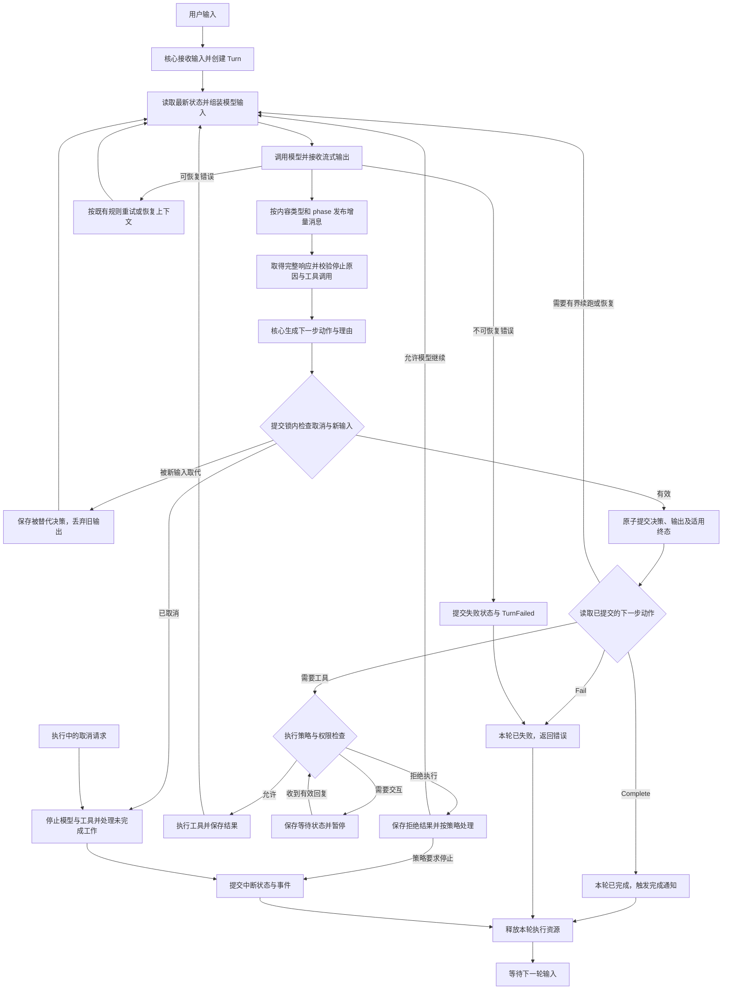
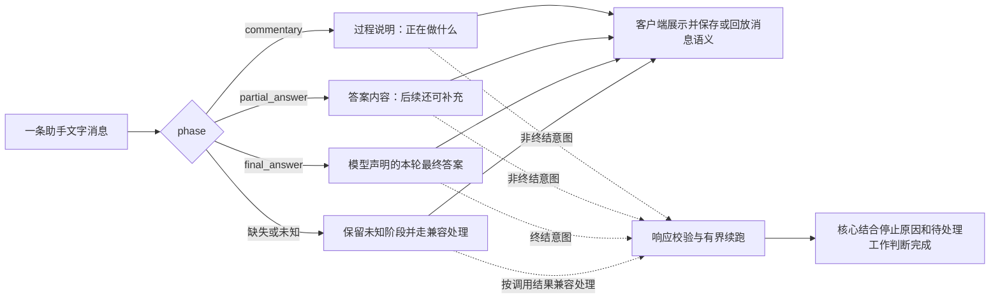

# Agent 核心循环调整

后续 Agent 核心 loop 的设计与调整统一在本文维护。消息用途、模型调用结果、Turn 执行状态按各自作用域建模；核心执行器决定下一步，状态所有者提交结果，客户端消费已提交的事实。

状态：核心 loop、共享协议和轨迹展示已实现，验证结果见下文。本文位于根目录是本次明确要求；新增实现、测试与协议仍放在各自所属模块。更新时间：2026-10-07。

## 三种信息各自回答什么

| 信息 | 回答的问题 | 用途 |
| --- | --- | --- |
| 一条消息的 `phase` | 这段助手文字是什么用途？ | 区分进度说明、阶段性答案、最终答案，供展示、回放和答案提取使用。 |
| 一次调用的 `stop_reason` | 本次模型生成为什么停止？ | 判断工具调用、正常结束、输出截断、拒绝等情况，作为执行决策的输入。 |
| 整轮的 Turn 状态与事件 | 当前这一轮执行实际处于什么状态？ | 核心确认完成、失败、中断或等待交互；各客户端消费同一状态。 |

`phase` 和 `stop_reason` 是不同维度。最终答案的标签不代替执行完成事件，一次模型生成结束也不必然意味着整轮执行结束。

`phase` 不是执行状态机：一次调用可以有多条不同用途的消息，一轮也可以有多次调用。三个已知标签不要求依次出现，也不要求每轮全部出现。

## 契约边界

| 作用域 | 应保存的信息 | 所有者与边界 |
| --- | --- | --- |
| 消息 | 身份、内容、内容类型、可选 `phase` | Provider 适配保留来源语义，共享协议定义统一契约；流式输出、保存结果与回放沿用同一消息身份。 |
| 模型调用 | 有序输出、停止原因、用量和调用身份 | API 解析保留响应事实，model-provider 负责调用配置和接入生命周期；不得因有工具调用就覆盖输出截断等事实。 |
| Turn | 当前状态、待处理工作、当前输入版本及恢复进度 | `TurnExecutor` 作执行决策，`ThreadController` 是业务状态的唯一提交入口。客户端不另外维护完成判断。 |

沿既有边界扩展契约，不因新增 `phase` 单独拆出一个业务状态所有者。模型返回的标签与核心执行状态也不建立互相覆盖的副本。

消息粒度是本次设计的前提。若把一次响应内的进度和最终答案拼为一个字符串，再加一个总 `phase`，前面的用途会丢失。应先保留消息边界，再把阶段放到所属消息上；同一消息内的正文块可按 Provider 契约组织。

阶段未知时先按未知展示，不能通过关键词推断。若 Provider 在后续事件中才返回阶段，同一消息应支持补齐元数据，最终保存的消息快照为准。重连与回放读取已保存的阶段，不能重新猜测。需要传回模型的原阶段信息，应在对应 Provider 编码时保留；Provider 没有该字段时不强行发送。

思考、正文和明确的进度更新属于内容语义；生成到一半、已保存、截断属于输出完整性。`partial_answer` 表示阶段性答案，不表示网络传输未完成或达到 token 限制。

## 当前主循环

以下是已接入核心的控制流程。每次模型调用使用最新的已保存状态；保存失败不能进入下一步执行或宣布成功。

取消适用于模型调用、工具执行、重试及等待交互等阶段。工具的业务失败可以作为结果交给模型；无法提交状态等执行故障应进入失败处理。等待交互不是完成，恢复时必须校验请求是否仍有效。

流式内容是可见的临时更新；消息保存是持久事实。响应有效时，决策、最终消息及适用的完成或失败事件在 Save 中原子提交；后面的 Complete / Fail 分支处理通知与返回结果，不能再次提交终态。

## 消息阶段如何使用

| 阶段 | 示例 | 约束 |
| --- | --- | --- |
| `commentary` | “找到了问题，正在修改。” | 后面可以继续输出或调用工具，不能据此宣布完成。 |
| `partial_answer` | “第一个问题是配置错误，第二个还在检查。” | 是答案的一部分，但不表示本轮结束。 |
| `final_answer` | “已修复，验证通过。” | 表达模型的结束意图；核心仍需检查并提交最终状态。 |
| 缺失或未知 | Provider 没有阶段字段。 | 不能自动当作 `final_answer`，也不能无限续跑；兼容决策要有明确依据。 |

思考内容与面向用户的进度说明要分别建模。不能把所有 `thinking` 内容直接归为 `commentary`，也不能只靠文字内容猜测阶段。若 Provider 提供明确的进度更新机制，应在其适配边界保留该语义。

客户端可以按阶段组织展示和复制答案，但完成通知依赖 Turn 的终态。桌面、Web 与 TUI 对同一轮执行使用相同的完成语义。

## 执行决策

规则按顺序处理。`phase` 参与响应的一致性校验；继续、等待与结束的决定归核心。以下规则针对模型驱动的 Turn，不改变 shell 等现有执行类型的完成契约。

| 响应与当前状态 | 核心行为 |
| --- | --- |
| 已取消，或当前输入已被新输入取代 | 先处理取消或新输入，不让旧响应提交当前轮完成。提交时仍原子检查输入版本，避免校验之后发生竞态。 |
| 调用失败、截断或工具参数未完整返回 | 保留可用的部分内容并标明完整性；进入既有恢复或失败处理，不执行未确认有效的新工具调用。 |
| 完整有效响应含工具调用 | 先提交调用，再走权限和工具调度，保存结果后继续。文字即使带 `final_answer`，也不跳过工具或宣布完成；保留标签并记录语义不一致供诊断。 |
| 停止原因为工具调用，但没有有效工具调用 | 作为响应不一致处理，不能凭空执行工具或按正常结束处理。 |
| 正常生成结束，无工具，最后一条有意义的助手消息为 `final_answer` | 检查当前轮必须处理的工作和交互是否已结清，允许后原子提交消息与完成事件。 |
| 正常生成结束，无工具，阶段缺失或未知 | 按兼容规则允许正常结束；保持未知标签，不伪造模型曾声明最终答案。 |
| 正常生成结束，无工具，最后一条消息明确为 `commentary` 或 `partial_answer` | 模型表达了非终结意图，但没有给出下一步。允许一次受控续跑，要求给出工具调用或最终答复；重复停滞则保留内容并报告未完成，不能无限循环。 |
| 模型明确拒绝且返回有效拒绝内容 | 将拒绝作为本轮答复处理，不按网络故障重试；本轮正常结束不代表用户目标已实现。 |
| 正常生成结束但没有有效答复 | 使用既有空响应恢复规则，不因“停止了”就宣布正常完成。 |
| 停止原因未知或响应事实相互矛盾 | 保留原始诊断信息，进入明确的恢复或失败分支，不凭正文存在推断成功。 |

当前每个 Turn 最多允许一次因显式非终结消息触发的额外调用。计数由已提交的 Continue 决策恢复，等待、工具执行、上下文恢复和重新进入循环都不重置；下一次调用加入要求工具或最终答复的必要提示。重复停滞提交 Fail / ContinuationLimit，并保留已收到的正文。缺失阶段本身不是异常，也不是自动重试的理由。

允许完成的条件包括：调用结果可用于正常结束、没有有效工具调用或必须结清的交互与工作、响应仍对应当前输入、最终消息和状态提交成功。不等待与本轮完成无关的后台工作，也不靠答案中是否出现“已完成”来判定。

`TurnCompleted` 只表示本轮执行正常结束。用户目标是否实现、验证是否通过，是答复和工作结果中的另一个判断；不能由消息标签自动证明。

## 当前实现与修改入口

以下是 2026-10-07 实现后的状态，后续修改时需同步更新。

| 所属职责 | 入口 | 当前情况 |
| --- | --- | --- |
| 共享模型响应契约 | [invocation.rs](crates/protocol/src/model/invocation.rs) | `ResponseItem::Message(AssistantMessage)` 保存消息身份、正文和可选 phase；流式消息生命周期与旧 TextDelta 并存，StopReason 独立保留。 |
| 模型输入消息 | [message.rs](crates/protocol/src/model/message.rs) | `Message.phase` 可省略；历史阶段回传到支持该字段的 Responses 端点。未知值保持原字符串语义。 |
| Provider 接入 | [model-provider/src](crates/model-provider/src) | 负责将不同模型的响应映射到共享模型契约；需要同时检查解析器及外部依赖中的转换位置。 |
| Responses 解析与编码 | [responses.rs](crates/ash-api/src/endpoint/responses.rs)、[events.rs](crates/ash-api/src/endpoint/responses/events.rs) | 保留正文消息的身份、顺序和阶段；阶段可在完成事件补齐。检查 ID / index 冲突，截断状态不会被工具调用覆盖。 |
| Anthropic 解析与编码 | [anthropic.rs](crates/ash-api/src/endpoint/anthropic.rs) | 正文、思考和工具分别转换，按实际 stop_reason 映射；不猜测 phase。Chat Completions 同样保留实际 finish_reason。 |
| 执行决策与循环 | [executor.rs](crates/core/src/turn/executor.rs) | 结合停止原因、工具请求与最后一条有意义消息的阶段选择动作；一次受控续跑有持久上限。Responses 消息分别流式发布与保存。 |
| 业务状态提交 | [execution.rs](crates/core/src/thread_controller/execution.rs) | 在写锁下检查取消与新输入，原子提交决策、消息、工具请求及适用的完成或失败终态；拒绝有未结清工具或交互的完成。 |
| 客户端事件契约 | [event.rs](crates/protocol/src/thread/event.rs) | 新增 ModelResponseEvaluated 持久事件；模型决策与既有 Turn 终态事件分别保存，客户端不据 phase 自行宣布完成。 |
| 真实执行链验证 | [executor_tests.rs](crates/core/src/turn/executor_tests.rs) | 沿既有执行入口覆盖 phase、工具、停止原因、流式身份和持久回放；新增用例在 loop_decision_tests.rs。 |

## 后续修改遵循的顺序

1. 确定共享语义与兼容规则：保留消息粒度、缺失字段的处理，以及停止原因和工具调用矛盾时如何处理。
2. 在所属协议中扩展完整响应、流式事件与保存的消息；沿现有生成链路更新 schema 和客户端类型。
3. 在 Provider 边界保留阶段、停止原因与内容类型，避免把思考、进度与正文混在一起。
4. 调整核心 loop 的继续、等待、恢复、失败与完成分支；状态更新仍交给 `ThreadController`。
5. 同步客户端展示、消息回放、答案复制及完成通知，验证 Web、Electron 和 TUI 的共享语义。

共享字段与决策类型已在协议 owner 定义，存储 schema 升为 24；旧消息缺失 phase 保持可读。后续改变续跑预算或兼容规则时，同步本节、持久事件和真实调用链测试。已有恢复、取消、审批和新输入处理继续沿原职责维护。

## 从轨迹查看这些判断

打开“执行 Trace”，每条助手正文显示已知阶段；“循环决策”显示动作、理由、停止原因和有序阶段。
选择事件查看 `sourceThreadSequence`、`toolCallCount` 和完整决策。关闭详细记录时，这些持久事件仍可读取。
“仅显示错误”包含 Fail 决策，筛选可使用中文显示文案或协议字段。

| 动作 | 含义 | 典型理由 |
| --- | --- | --- |
| ExecuteTools | 已提交工具请求，交给既有策略与调度器 | ToolRequests；阶段同时为 final_answer 时仍先执行工具 |
| Continue | 保存非终结正文，使用更新后的上下文再调用一次 | NonterminalMessage |
| Complete | 已原子提交消息与 TurnCompleted | FinalAnswer、CompatibleCompletion、Refusal |
| Fail | 已保存可用正文并提交 TurnFailed | ContinuationLimit、TruncatedOutput、InvalidToolRequest、UnknownStopReason |
| Superseded | 新输入使响应过期，旧正文和工具不进入当前历史 | NewInput |

启用详细记录后，响应证据保存消息 ID、正文、phase 与停止原因；取消或失败的部分输出也保存
已收到的消息身份和阶段。部分诊断正文有大小和消息数上限，省略会标明，诊断不参与运行时恢复。

## 必须覆盖的行为

| 场景 | 预期 |
| --- | --- |
| 进度消息之后请求工具 | 展示进度，执行工具并继续；不提前发出完成事件。 |
| 阶段性答案之后仍有工作 | 保留已有答案并继续；回放不把它升级为最终答案。 |
| 最终答案且无待处理工作 | 保存有效输出并提交一次完成事件，再触发完成通知。 |
| 最终答案标签与工具请求并存 | 按明确的矛盾处理规则执行，不能直接宣布成功。 |
| 达到输出限制或未知停止原因 | 进入明确的恢复或停止处理，不能只因已有文字而算作成功。 |
| Provider 没有阶段信息 | 保持可用的兼容行为，不伪造最终答案标签，不无限重试。 |
| 用户取消、工具失败、等待交互后恢复 | 状态、结果和资源生命周期一致，不丢失已保存消息，不重复完成。 |
| 新输入取代正在生成的响应 | 旧响应不提交为当前轮结果，下一次调用读取最新状态。 |
| 流式输出、最终响应与历史回放 | 消息身份、内容和阶段一致，避免重复显示或重复保存。 |
| 一次调用含多条不同阶段的消息 | 各条消息的身份、顺序和阶段保留，不能合并为一个总阶段。 |
| 阶段在后续事件中补齐 | 更新同一消息的元数据，保存与重放保留最终信息。 |
| 显式非终结阶段连续返回却无后续动作 | 有界续跑后报告未完成，暂停与恢复不会重置限制。 |
| 正常调用结果包含拒绝内容 | 本轮可正常结束，但不宣称用户目标实现。 |
| 最终消息或状态提交失败 | 不发出持久的完成事件或完成通知，恢复时不重复执行已提交的工具。 |

## 本次验证

2026-10-07 已完成以下检查。网络凭据相关的 live 测试与手动离线基准仍按原设置忽略。

| 范围 | 验证与结果 |
| --- | --- |
| 核心真实执行链 | `just test ash-core --lib --quiet`：303 通过，2 个离线基准忽略。覆盖三种阶段、缺失与未知阶段、工具优先、截断与未知停止原因、有界续跑、流式身份、晚到阶段、新输入及取消提交竞态。 |
| 共享契约、保存与回放 | protocol、history、thread-transcript、rollout-trace、app-server-protocol 的 library 测试通过；旧消息缺失阶段、阶段增量、部分诊断输出与生成协议均有覆盖。 |
| Provider 与响应解析 | ash-api 的 library 和 Provider、请求头、WebSocket、音频测试通过；model-provider、guardian-v2、guardian-context、exec 的 library 测试通过。 |
| Rust 客户端集成 | App Server 与 TUI 编译通过；受影响核心、协议、Provider、存储、轨迹与客户端通过 `just rust-warnings` 的全部 target 检查。 |
| TUI 回放与订阅 | `just test-tui-unit thread::transcript`：86 通过；`just test-tui-unit thread::subscription`：16 通过。 |
| 生成协议与前端类型 | `just generate-protocol`、`pnpm typecheck:protocol`、`pnpm typecheck:renderer` 通过；中文无缺失条目。 |
| 轨迹组件与协议边界 | 轨迹编辑器 5 项单元测试与生成协议解码器 16 项单元测试通过，包含可访问视图、错误过滤和阶段 / 决策通知。 |
| Web / Electron 运行时 | 两端各 2 项 Playwright 轨迹测试通过，并完成对应产品构建；通过实际中文文案与行为断言验证循环动作、消息阶段、停止原因和帮助入口。 |

旧轨迹不补造缺失的阶段或决策。使用包含本次修改的 App Server 与前端构建重新执行后，新的判断会进入轨迹；正在运行的旧构建需重启更新。

## 参考与证据边界

- [Codex 消息阶段定义](../codex/codex-rs/protocol/src/models.rs)：本地代码支持 `commentary`、`partial_answer`、`final_answer`，并明确允许阶段缺失。
- [Codex 对外消息契约](../codex/codex-rs/app-server-protocol/src/protocol/v2/item.rs)：`AgentMessage` 携带可选 `phase`。
- [Claude 停止原因](https://platform.claude.com/docs/en/build-with-claude/handling-stop-reasons)：`stop_reason` 表示本次生成停止的原因。
- [Claude 面向用户的进度更新](https://platform.claude.com/docs/en/build-with-claude/thinking#progress-updates-between-tool-calls)：部分模型支持通过 `thinking` 内容块返回进度更新，其可用性依模型和配置而定。

本次也检查了本机 Claude.app 2.19675.1 的安装包，找到正文、思考增量及停止原因的处理，未找到上述 Codex 阶段枚举。这只能说明所检查安装包的情况，不能据此断言 Claude 在线界面的全部内部协议。

后续设计结论与实现进度应直接更新相应章节，保持本文描述的是最新约定。
