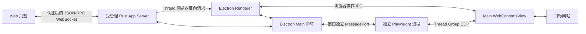

# 前端连接与浏览器能力

TS 前端以浏览器环境为运行边界，业务与系统执行通过协议交给 Rust；启动与 Electron 平台能力属于宿主层。当前 Web 通过受管理 Rust App Server 的认证 HTTP/WebSocket 入口连接，Electron 仍保留 Main 中转。本文说明目标职责、当前连接方式、Node 退场范围和验证边界。
前端 Service、领域 API、协议客户端与 Main 的具体分工见[前端 Service 与 Rust App Server 的连接边界](../frontend-app-server-boundary.md)。

## 前端与 Node 的边界

以下是长期要求，不表示剩余 Node 实现已经删除。WebSocket 握手只建立连接，不会自动转移业务、文件存储或进程的所有权。

| 层次 | 长期职责 | Node 边界 |
| --- | --- | --- |
| TS 前端 | 界面、编辑器模型、工作副本、交互、领域服务与协议客户端 | 在浏览器环境运行，不依赖 Node API |
| Rust 后端 | 业务状态、文件读写与监听、进程、终端执行、Git、搜索和远程执行 | 对应领域拥有能力与资源；App Server 提供协议入口 |
| 桌面宿主 | 启动和连接取得、窗口生命周期、菜单、系统对话框、剪贴板和嵌入网页 | Electron 所需代码可继续使用其运行环境，不承担产品业务执行 |
| 构建与测试工具 | 编译、打包、代码生成和测试运行 | 可以使用 Node，与前端运行时分开 |
| 扩展执行环境 | 执行扩展代码并维持扩展 API 契约 | 独立审计；前端去除 Node 不等于扩展不再需要 JavaScript 运行时 |

- 启动入口属于宿主，不是前端的例外。宿主保留能力按职责判断，不按“是否写在入口文件里”判断。
- 前端生产依赖图中的 `common/`、`browser/`、`electron-browser/` 代码及 Worker 不导入 Node 内置模块、`node/` 实现或 Electron Main；也不依赖 `process`、Node `Buffer`、`require`、`NodeJS.*` 或补齐这些全局的运行时包。
- preload 虽位于 `electron-browser/`，仍属于隔离的宿主入口。前端只消费明确、可序列化的宿主契约，不能借 preload 暴露通用文件、进程或任意 IPC 调用。
- 第三方依赖同样检查实际打包入口及传递依赖。TypeScript 使用 `NodeNext` 模块解析、测试在 Node 中执行，都不能据此判断前端需要 Node。
- 文本模型、未保存内容、撤销、主题应用和快捷键解析继续由 TS 拥有；迁移文件存储与执行不把这些对象搬到 Rust。Rust crate 主要隔离能力和依赖，不按 TS 文件逐一建 crate。
- WebSocket 使用浏览器 API；每个页面或窗口拥有独立连接与协议客户端，领域服务复用该客户端。认证、初始化、请求配对、事件、取消、关闭与恢复仍需完整协议契约。
- Electron 是否改为 Renderer 直连 WebSocket，是独立的连接实现工作。当前 Main 中转不是前端依赖 Node API 的理由，也不能把移除中转写成已完成。

## Node 退场盘点

2026-09-16 源码初查：已检查 `app-ts/src` 的 Node 导入、全局使用、`node/` 目录以及主要装配和调用点；测试与生成物单独识别。以下是后续工作的入口，不是完整传递依赖审计，也没有删除代码。

| 处理范围 | 已定位入口 | 当前情况与下一步 |
| --- | --- | --- |
| 公共环境探测 | [platform.ts](../../src/ash/base/common/platform.ts) | 仍探测 `globalThis.process`；核对宿主与测试调用方，把宿主环境读取留在宿主，前端消费浏览器信息或明确环境数据 |
| 远程连接与隧道 | [remoteCommand.ts](../../src/ash/platform/remote/electron-main/remoteCommand.ts)、[remoteAppServerProcessLauncher.ts](../../src/ash/platform/remote/electron-main/remoteAppServerProcessLauncher.ts)、[sshRemoteTunnelService.ts](../../src/ash/platform/remote/electron-main/sshRemoteTunnelService.ts) | Desktop 数据连接通过本地共享 Rust 后端持有 SSH 子进程；Main 装配本地 daemon carrier，仍协调 runtime 探测、准备与 TCP 隧道。Rust [remote-connections](../../../ash-rs/remote-connections/README.md) 持有安装与连接管理能力；Agent 本地执行与历史迁移尚未完成 |
| 远程包校验与安装协调 | [packagedRemoteRuntimeCatalog.ts](../../src/ash/platform/remote/electron-main/packagedRemoteRuntimeCatalog.ts)、[remoteRuntimeInstaller.ts](../../src/ash/platform/remote/electron-main/remoteRuntimeInstaller.ts) | 仍有 Node 文件、哈希和环境依赖；区分已有 Rust 安装能力、构建产物选择与窗口进度展示，避免重复实现 |
| OAuth 回调监听 | [oauthCallbackHost.ts](../../src/ash/platform/connectors/electron-main/oauthCallbackHost.ts)、[loopbackOAuthCallback.ts](../../src/ash/platform/connectors/electron-main/loopbackOAuthCallback.ts) | Main 创建 HTTP 监听；核对本机与远端后端部署位置、回调地址、取消和超时后确定 Rust 接口，打开授权网页仍归宿主 |
| 配置、快捷键和主题文件 | [revisionedJsonFile.ts](../../src/ash/platform/storage/node/revisionedJsonFile.ts)、`platform/theme/node/userThemeFileService.ts`（初查时的路径） | Node 持有读写、监听和冲突检查；迁移存储前核对配置规范及领域协议，保留 TS 的配置含义、主题应用与快捷键解析 |
| 工作区路径解析 | [workspaces.ts](../../src/ash/platform/workspaces/node/workspaces.ts) | Node 执行 realpath、stat 和文件读取；区分启动目标解析与连接后的工作区能力，保持授权边界和工作区身份 |
| profile 与宿主状态 | [localProfile.ts](../../src/ash/platform/profile/node/localProfile.ts)、[stateService.ts](../../src/ash/platform/state/node/stateService.ts) | 包含文件复制与窗口状态落盘；按启动所需状态和产品数据分别核对，不整包迁入业务后端 |
| 连接启动与开发工具 | [childProcessJsonlTransport.ts](../../src/ash/platform/app-server/node/childProcessJsonlTransport.ts)、[appServerDaemonLauncher.ts](../../src/ash/platform/app-server-daemon/electron-main/appServerDaemonLauncher.ts)、[developmentArtifacts.ts](../../src/ash/platform/environment/node/developmentArtifacts.ts) | 分别属于当前宿主连接、daemon 连接程序与开发产物定位；本地启动配置和开发重启由 `platform/app-server-daemon` 承接，Rust daemon 保持进程管理的唯一所有权 |
| Electron 平台能力 | [app.ts](../../src/ash/code/electron-main/app.ts)、[preload.cts](../../src/ash/base/parts/sandbox/electron-browser/preload.cts)、[browserViewMainService.ts](../../src/ash/platform/browserView/electron-main/browserViewMainService.ts) | 保留明确宿主能力；继续压缩装配文件中的业务执行，不能把整个 Main 当作可删除的 Node 后端 |

当前主窗口配置为 `nodeIntegration: false`、`contextIsolation: true`、`sandbox: true`；Renderer 编译配置没有主动加入 Node 全局类型。这些是已有隔离措施，不是传递依赖审计完成的证据。`VSBuffer` 当前基于 `Uint8Array`，不能因为名称包含 Buffer 就作为 Node 实现删除。

后续按以下顺序推进，每项完成后删除对应旧调用链，不保留双实现：

1. 核对前端生产依赖图与公共环境探测，补齐针对 Node 导入、全局及传递依赖的边界检查。
2. 优先核对远程命令、SSH 与隧道执行：列出 TS 调用方、Rust 能力、协议缺口、取消与资源释放，再做一次完整迁移。
3. 逐项处理 OAuth、文件存储及工作区 IO；配置数据先确认作用域、格式、冲突与通知契约。启动状态和 Electron 平台能力按宿主职责保留。
4. 每项同步生产装配、调用方、协议生成物、测试及打包依赖；实现和实际消费者都退出后才删除模块。

### 退场验收要求

- 检查前端入口及传递依赖，确认无 Node 模块、全局注入或 Node 补齐包；不能只靠文本搜索或 `tsconfig` 声明验收。
- 按实际改动运行受影响的前端检查、Rust 检查和正常构建；纯文档更新只检查文档。
- 用 Playwright 验证受影响的 Web、Electron UI 与真实 Electron 后端链路，以行为断言调试；覆盖多窗口隔离、关闭释放、取消、后端断线恢复，以及相关文件写入冲突。
- 扩展执行与打包的 JavaScript 运行时单独核对。不得把“前端无需 Node”报告为“整个产品已经移除 Node”。

Node 退场盘点尚未完成整体验收；下文按日期记录连接与浏览器基座的实施验证，不能据此宣称整个产品已移除 Node。

## 连接与职责

| 所属位置 | 职责 |
| --- | --- |
| [Rust browser transport](../../../ash-rs/app-server-transport/src/browser.rs) | HTTP、认证、静态资源和 WebSocket 边界 |
| [managed Web](../../../ash-rs/app-server/src/managed/web.rs) | 在现有受管理进程内开监听、绑定已授权工作区、管理启动器租约 |
| [daemon client](../../../ash-rs/app-server-daemon/src/client.rs) | 启动或复用后端，通过私有连接取得 Web 入口 |
| [Web protocol](../../../ash-rs/app-server-protocol/src/web.rs) | 启动和会话元数据契约及生成的 TypeScript 校验器 |
| [Web transport](../../src/ash/platform/app-server/browser/appServerWebSocketTransport.ts) | 兑换凭证、连接、原始 JSON-RPC 帧和断线通知 |
| [build/app_ts/launch/web.ts](../../../build/app_ts/launch/web.ts) | 用编译产物启动本地 Web，显示链接并保持租约 |
| [Vite plugin](../../../build/app_ts/vite/webAppServerPlugin.ts) | 开发资源入口与开发 Origin 配置 |
| [BrowserEditor](../../src/ash/workbench/contrib/browserView/electron-browser/browserEditor.ts) | 地址栏、历史导航、页面容器、布局、焦点和无障碍帮助 |
| [Main 页面服务](../../src/ash/platform/browserView/electron-main/browserViewMainService.ts) | 网页实例、会话隔离、导航和窗口内显示 |
| [Group 服务](../../src/ash/platform/browserView/electron-main/browserViewGroupMainService.ts) | 按窗口与 Thread 选择页面，提供逻辑 CDP 浏览器，管理调试器引用 |
| [Playwright 服务](../../src/ash/platform/browserView/node/playwrightService.ts) | 在独立进程中观察页面、执行元素操作；不创建另一套 Chromium 页面 |

原 Node WebSocket 业务消息中转及对应编译目标已移除。启动脚本仍使用 Node，但不再代转业务帧；普通网页流量也不经过 App Server。

每个 Web 页签和桌面窗口拥有独立协议连接。同一 profile 使用同一个受管理后端进程；registry 仍根据目录、授权来源和产品服务配置选择服务，共享进程不代表所有工作区使用同一个 `AppServer` 对象。不同产品服务配置不能在同一个 profile 中混用。

## 浏览器认证与生命周期

1. 可信启动器以工作区、静态资源目录和允许的 Origin 请求 Web 入口。入口只监听 `127.0.0.1`；没有将独立 `--listen ws://` 进程当作产品后端。
2. 启动记录返回 endpoint、一次性票据及后端 PID。票据通过 URL fragment 交给页面，启动后移除；不放在查询参数中，不暴露 daemon 管理凭证。
3. 页面向 `/ash/session` 兑换会话。票据是 256 位随机值，五分钟内有效且只能兑换一次；服务端在 profile 的 `web-sessions` 中保存会话摘要和到期时间，不保存明文凭证。会话距最近一次认证八小时后过期；存储按工作区、开发 Origin、启动租约和监听端口隔离。每次 Web 启动创建独立随机租约，只有同一个启动器恢复后端连接时复用，后续新启动不能继承旧授权。
4. 页面将会话保存在当前页签的 `sessionStorage`，通过 WebSocket 子协议携带会话凭证。HTTP 与升级请求严格检查 Host 和 Origin，拒绝无效凭证和非法路径。
5. 浏览器业务连接不是产品授权宿主。工作区来自可信启动配置；页面声明 `dirPermissionsHost` 会被拒绝，目录访问仍由后端检查。
6. 刷新页面使用既有会话重新认证、重新初始化协议。关闭页签只释放该连接。关闭启动器释放它的 HTTP/WebSocket 监听及会话，不停止其他窗口使用的受管理后端。

静态资源仅从可信配置的根目录读取，规范化后检查路径归属；入口限制未认证请求的时间、大小和连接数。生产 Web 使用编译后的资源，开发时由 Vite 提供资源，Rust 只接受配置的开发 Origin。

**后端重启边界：**Web 启动器保持租约。后端停止时监听关闭，但已授权会话保留；后端重新启动后，启动器在原端口重新建立监听。浏览器在五分钟内按 0.5 秒至 10 秒的退避间隔重新认证、连接和初始化，无需刷新页面或打开新链接。启动器不会自行拉起被明确停止的后端。关闭 Web 启动器会释放监听并删除该入口的授权记录；凭证过期或被撤销时停止重试，需重新打开认证链接。本实现仅覆盖单用户本机接入，不覆盖公网部署、TLS 或多用户登录。

恢复复用原前端客户端及领域 API，重新发出 `ready`，让现有领域服务重新查询状态、恢复订阅；编辑器不因连接恢复而刷新页面。断线时未完成请求立即失败，重连不自动重发任何旧业务请求，包括写文件或提交任务。后端进程中已丢失的终端、浏览器宿主资源和正在执行的操作不能被当作仍然存在；本次不提供跨进程重启的消息重放或执行续跑保证。

## 桌面浏览器与任务归属

桌面命令 `Browser: Open Browser` 创建可见页签；用户可以输入地址、前进、后退、刷新和停止加载。Main 页面布局跟随编辑器容器及窗口缩放，切换页签、打开对话框和关闭编辑器会调整可见性或释放页面。内部页面 ID 不显示为文件路径面包屑。

- `Ctrl+L`（macOS 为 `Command+L`）或网页中的 `F6` 返回地址栏；`Alt+F1` 打开无障碍帮助。
- Main 的页面创建事件让 Agent 新建页面也进入 Workbench 页签；Agent 关闭页面会同步关闭编辑器。
- [BrowserHost](../../../ash-rs/app-server/src/browser_host.rs) 在提交任务时记录 `(thread, turn) → connection`。重放已有提交不能更换宿主；浏览器工具通过任务执行上下文取得该连接。
- 创建、观察、输入和关闭的协议请求必须携带 `threadId`，浏览器宿主声明 `browser.version = 2`。Rust 同时核对连接和 Thread，Main 再核对页面 owner 和 Agent Session 的 Thread；同一窗口的其他 Thread 也不能观察、操作或关闭该页面。断线清理等待请求与目标归属，取消和超时沿既有反向协议传递。
- Web 发起的任务没有桌面浏览器宿主，不能借用另一个桌面窗口。工具目录的整体可用状态仍由在线宿主决定，但实际执行还会检查任务宿主。
- 自动化、队列和未绑定桌面连接的任务不会隐式继承浏览器权限；子任务的宿主继承尚未提供。

Rust 负责批准和任务归属，Renderer 处理反向请求，Main 保持页面、导航、Session 和显示的所有权。观察及元素操作经过窗口独立 MessagePort 交给应用共享的 Playwright 进程，再由 Thread Group 的 CDP 操作同一可见页面。产品协议只暴露浏览器领域操作。

Group 检查 Agent 页面归属或用户页面的指定 Thread 分享记录，显式页面 ID 不能扩大授权范围。Group 保留 Chromium 的 target ID，并用 `browserViewId` 关联 Ash 页面；主 frame 与 target 的对应关系不能被页面 ID 替换。多个 Group 借用同一页面调试器，释放 Group 只解绑自动化，不关闭页面。固定页面集合的 Group 不接受新建目标。

取消会阻止后续步骤，但已经发送给 Chromium 的单条命令无法强制抢占。Main 保持页面操作顺序，等待执行中的 Chromium 命令结束后才允许下一次操作。Playwright 进程退出会拒绝在途 IPC 并释放 Group；Main 页面仍可手动导航和关闭。

用户页面使用工作区持久 Session；Agent 页面按窗口和 Thread 使用内存 Session，同一 Thread 共享登录，其他 Thread 不共享。Renderer 重载重新接入 Main 的现存用户页面，不重建网页；后端连接退场时关闭 Agent 页面，包括重载导致连接退场的场景。应用重启恢复用户页签及工作区登录；保存的 Agent 页签只作为用户临时页面恢复，不恢复任务权限或 Agent 登录。

用户页面分享由 `browser/sharing/set` 进入 Rust，再请求对应连接的 Main 确认页面归属。授权只允许指定 Thread 使用同一连接的页面，不授予其他页面、窗口或网站权限。撤销先取消 Main 操作并释放 CDP 连接，再更新 Rust 记录；关闭页面释放后端授权记录。分享不持久化，任务仍需通过已有动作批准。

网站权限由 BrowserSessionPermissions 管理，按请求来源、嵌入页面来源及权限类别记录允许或拒绝。支持位置、通知、摄像头/麦克风、剪贴板和全屏；页面导航、关闭或 Renderer 连接退场取消未回答的请求，不把取消记成用户拒绝。重置清除该 Session 的记录。USB、HID、串口和蓝牙设备选择、证书信任仍未提供。

远程工作区从当前 Workspace 获取 SSH 主机，BrowserSessionRemote 在创建网页前配置 SOCKS5。Main 不改写 URL；Chromium 把域名传给代理，也把 loopback、网页子资源和 WebSocket 交给它。远程页面禁止未经代理的 WebRTC UDP。最后一个页面关闭时释放代理进程；代理失败时关闭该 Session 的现有连接，后续请求按保留的代理规则失败。本地 Session 使用原有分区，不受远程代理或远端登录影响。

### 能力边界

| 使用方式 | 当前能力 |
| --- | --- |
| Chrome、Edge 正常访问其他网页 | 不受本方案影响 |
| 浏览器中打开 Ash Web | 已通过 Rust 认证入口接入 |
| Ash 桌面内显示和操作网页 | 已有可见页签、导航和布局 |
| 桌面 Agent 观察及输入网页 | 按连接和 Thread 路由，独立 Playwright 进程操作同一可见页面 |
| 纯 Web 控制任意网站 | 未提供浏览器宿主，不能跨站控制其他网页 |
| 登录与存储隔离 | 用户工作区登录持久化；Agent 登录只在对应窗口和 Thread 的内存 Session 内共享 |
| 下载、页面权限提示 | Electron 选择保存位置，页面显示下载进度并可取消；网站权限按请求来源弹窗，决定保存在该 Session 内，可重置 |
| 浏览器页签跨应用重启恢复 | 用户页签、URL、标题和工作区 Session 可恢复；Agent 页签不会恢复任务权限 |
| 同一页面在多个编辑器组中引用 | 分组引用和关闭行为已有验证；同一 WebContentsView 只在当前宿主编辑器显示 |
| 页面分享与授权受众 | 用户页面默认私有，可分享给指定 Thread；撤销、关闭页面或连接退场后取消访问 |
| 远程 Session 网络策略 | SSH SOCKS5 代理覆盖域名解析、子资源、fetch、WebSocket 和 loopback；本地与远端存储分区分开，断线保留代理规则并关闭连接 |
| 任意脚本工具、延迟执行、网页对话框和文件选择器 | 尚未接入 Agent 产品协议 |

浏览器能力与业务连接方式相互独立。保留或移除 Node 消息中转，都不会自动给普通 Web 页面增加跨站控制能力。

## 对照 VS Code

已核对本地 `../vscode`。采用其公开职责和命名，内部实现由 Ash 编写：

| VS Code 源码 | Ash 对应边界 |
| --- | --- |
| `src/vs/server/node/remoteExtensionHostAgentServer.ts` | 运行时处理连接与认证，build 负责构建 |
| `src/vs/platform/browserView/electron-main/browserView.ts` | Main 管理真正的网页视图 |
| `src/vs/platform/browserView/electron-main/browserViewGroup.ts`、`browserViewDebugger.ts` | Group 选择页面并借用页面调试器，不另建页面 owner |
| `src/vs/platform/browserView/node/playwrightService.ts` | 独立进程拥有 Playwright 连接和元素操作 |
| `src/vs/workbench/contrib/browserView/electron-browser/browserView.contribution.ts` | Workbench 注册可见浏览器功能 |
| `src/vs/code/electron-utility/sharedProcess/sharedProcessMain.ts` | 自动化执行与界面职责分开 |
| `src/vs/base/parts/ipc/common/ipc.mp.ts`、`src/vs/platform/utilityProcess/electron-main/utilityProcess.ts` | MessagePort 双向 IPC 与应用拥有的独立进程 |

Ash 已接通 MessagePort、应用共享进程、Playwright、Group/CDP、Main 页面和 Workbench 模型这条链路。Rust App Server 仍拥有任务权限与反向协议，不能用 TypeScript 浏览器宿主替代它。

## 验证与尚未完成的验收

2026-10-05 浏览器基座验证：

| 检查 | 结果与范围 |
| --- | --- |
| Rust | `ash-app-server` 的 12 项 browser 测试、`ash-app-server-protocol` 的 85 项库测试及 1 项编译 schema 一致性测试通过；协议重新生成成功，两个 owner 的 all-targets warnings 检查通过 |
| TypeScript 与构建 | IPC、Main 页面及 Group、Session 权限与网络租约、编辑器模型和序列化共 51 项定向单测通过；随后新增 CDP 在途撤销回归，Group 文件的 25 项测试通过。生产 Main/Preload 与 Renderer 构建、严格协议检查通过 |
| Electron UI 与真实 App Server | UI 的 8 项、真实 App Server 的 7 项通过；覆盖页面操作、Thread 隔离、分享撤销、权限允许与拒绝、下载完成与取消、重载恢复及关闭释放。另单独验证分享对话框的撤销经 Renderer → Rust → Main 生效 |
| 远程网页网络 | 真实 Chromium 经 SOCKS5 测试端点验证域名解析、子资源、fetch、WebSocket、loopback；代理断开后请求失败、无直连，关闭释放网络租约，本地页面与 Cookie 分区不受影响。SSH 进程参数和共享租约另由单测验证 |
| Web | 生产 Web 读文件与重载、授权边界及双桌面隔离通过，退出没有再报告 `App Server client disposed`。文件夹授权场景修正 Windows 盘符比较后单独重跑通过 |
| 完整自动化类型检查 | `tsc -p test/automation/tsconfig.json` 通过；恢复结果通过 `.workbench.quickaccess` 与 `.workbench.editors` 访问，旧失败记录已失效 |

上述 Electron 场景使用真实页面、IPC、Group/CDP 和 Playwright 进程；Rust 任务路由另由测试验证。分享授予选定 Thread 的 Main 路径与 Rust 宿主确认分别验证，尚未运行外部模型选择会话并浏览网页的完整流程。下载测试模拟用户选择保存位置，文件写入、取消和关闭清理均实际执行。远程网络测试使用测试 SOCKS5 端点，没有连接外部 SSH 主机。浏览器功能的样式检查无错误。

对应场景：[桌面浏览器](../../test/smoke/areas/windows/browser-view.spec.ts)、[远程网页网络](../../test/smoke/areas/windows/browser-network.spec.ts)、[Web 连接](../../test/smoke/areas/windows/web-connection.spec.ts)。USB、HID、串口和蓝牙设备选择、证书信任仍不在已完成范围内。

2026-09-16 实施验证：

| 检查 | 结果与范围 |
| --- | --- |
| Rust transport | 10 项通过，覆盖认证、票据重放、Origin/Host、会话到期、连接关闭和背压 |
| Rust 浏览器归属 | 8 项通过；另有真实任务 RPC → runtime → 工具 → 宿主路由测试通过，覆盖两个桌面连接和无宿主 Web 连接 |
| Rust protocol | 原有 49 项库测试、4 项生成器测试及新增 2 项 Web 契约测试通过 |
| Rust owner 检查 | transport、protocol、daemon、app-server 的 warnings 检查通过 |
| TypeScript | Web API、协议校验器、Main 浏览器服务及编辑器状态测试通过；相关编译通过 |
| Playwright Web | 编译产物读文件、刷新恢复、与 Electron 共用 PID/实例 ID，以及关闭 Electron 后继续读文件通过 |
| Playwright 授权边界 | 已认证 Web 声明目录授权宿主能力被拒绝，读取未授权工作区失败 |
| Playwright Web transport | 原始 JSON-RPC、关闭及非法二进制帧处理通过 |
| Playwright Electron | 可见页签、导航历史、尺寸变化、切换、帮助对话框、释放通过；实际宿主 IPC 的创建、观察、输入和关闭通过 |
| managed 生命周期 | 编译后的集成测试直接运行通过；Cargo 运行时 Windows job 限制导致进程启动 Access denied，现有基线测试也受影响 |

任务路由测试使用测试模型和批准策略；真实 Electron 测试使用实际页面、IPC 与 CDP。两段分别验证，没有声称执行过外部模型驱动的整段 Agent 浏览过程。协议生成仍有已有 MSVC `.lib/.exp` 链接输出 warning。

### 补充验收

同日补充运行，以下结果均来自完成的命令：

| 场景 | 结果 | 证据 |
| --- | --- | --- |
| 生产 Web 重启恢复 | 通过 | 停止后端后监听关闭；旧 token 返回 401；同一页签打开新票据链接后重新读取工作区文件 |
| Vite 开发入口 | 通过 | 真实 Chromium 经不同端口认证，读取文件、刷新、关闭开发服务后释放 Rust 监听 |
| 两个 Electron 窗口 | 通过 | 同 profile 下第二窗口创建页面，第一窗口访问该目标被拒绝；关闭第一窗口不影响第二窗口；重载第二窗口释放宿主页面 |
| 在途导航取消 | 通过 | 真实 HTTP 页面等待响应时取消，操作返回取消结果；随后关闭目标，页签和 Main 视图均释放 |
| Rust 请求生命周期 | 通过 | app-server 的 9 项 browser 相关测试及 transport 的 10 项测试重新运行通过 |
| 编译与构建 | 通过 | automation TypeScript 检查、renderer 严格检查、Main/preload 和生产 Web 构建通过 |

对应测试：[Web 生命周期](../../test/smoke/areas/windows/web-lifecycle.spec.ts)、[多客户端连接](../../test/smoke/areas/windows/web-connection.spec.ts)、[桌面浏览器](../../test/smoke/areas/windows/browser-view.spec.ts)。

验收发现并修复了同一页签打开新认证链接只改变 fragment、没有重新启动连接的问题。另修正 README 中遗留的 Vite HMR 消息中转说明。测试中补齐 Workbench 就绪等待及已经关闭的 Electron 实例清理。

随后补齐了无需页面操作的后端重启恢复：生产 Web 与 Vite 的真实 Chromium 测试停止再启动后端，确认原页面和同一个前端客户端重新读取工作区文件。底层测试覆盖授权跨后端重启恢复、工作区及 Origin 隔离、过期和撤销；前端测试覆盖重新初始化、不重放结果不明的写请求，以及释放和撤销后停止重试。

最终验证：两项 Playwright 场景通过，生产场景还验证关闭旧启动后，旧凭证在新启动的入口返回 401。transport 11 项、daemon 19 项、protocol 52 项库测试及 4 项生成器测试、Web API 10 项测试通过；上述 Rust owner 的 warning 检查及前端严格编译、生产构建通过。验收中发现新启动可能读取旧授权记录，已通过独立随机启动租约隔离修复。

外部模型驱动的多窗口 Agent 整段流程仍未执行，任务 RPC 路由与真实 Electron 页面操作分别验证。本次 Web 重连验收不等于该 Agent 场景也已完成。
