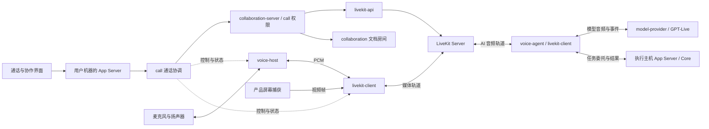

# 协作媒体与 AI 语音方案

Ash 的多人通话、屏幕共享和 GPT Voice 统一使用 LiveKit 房间。GPT Voice 以 AI 协作者身份入房，开发任务交给 Ash 既有 Agent 执行链；`realtime-webrtc` 从目标架构中移除。

- 状态：音频通话已接入 App Server、设备助手和 TypeScript 通话面板；完整 AI 协作与屏幕共享仍在实施。
- 核对日期：2026-09-15。
- 本文负责：crate 边界、部署、房间与权限、AI 接入、实施顺序和验收要求。
- 已新增 `call`、`livekit-client`、`livekit-api`、`voice-agent`，并删除无人调用的 `realtime-webrtc`。

### 当前实现与验收

| 能力 | 当前结果 |
| --- | --- |
| LiveKit 双向音频 | 真实 Server 1.13.7 与 Rust SDK 测试通过 |
| 成员邀请、撤销、角色变更、房间换代 | SQLite 测试与真实服务 HTTP 测试通过 |
| GPT-Live 会话协议 | 本地 WebSocket 契约测试通过；尚未连接真实模型账户 |
| AI 混音、重采样与播放清理 | 单元测试与真实 LiveKit + 本地 GPT-Live 模拟服务的桥接测试通过 |
| 自建服务接入 | HTTP 宿主接受部署者的 LiveKit 地址和密钥 |
| 设备发言权 | 同一成员只向选中设备签发麦克风权限；切换设备更换房间，双 SQLite 宿主竞争测试通过 |
| 成员通知 | HTTP 按修订号等待，App Server 向所属窗口发送 `call/changed` |
| 文档房间关联 | 尚未实现 |
| App Server 与 UI | 通话资源归连接所有；面板提供创建、加入、静音、收听、邀请和离开 |
| Core 任务执行 | AI 委托尚未接入生产任务链 |
| 本地媒体服务与产品打包 | 固定版本服务器与助手随包分发；本地通话持有服务进程，最后一个通话释放时回收 |
| 屏幕共享 | 尚未实现 |
| 真实设备、三平台、公网 NAT、真实 GPT-Live | 尚未验收 |

## 1. 架构决定

| 决定 | 结果 |
| --- | --- |
| 所有通话进入 LiveKit 房间 | 单人与 AI 对话、多人讨论使用同一条媒体路径 |
| GPT Voice 是房间参与者 | 可以被邀请、移除、静音，并显示运行状态 |
| 使用 LiveKit 官方 Rust SDK | 房间协议、WebRTC 和编解码交给 SDK |
| 保留 `voice-host` | 专门处理用户机器上的音频设备和音频处理 |
| 移除 `realtime-webrtc` | 不再维护单独的点对点语音产品路径 |
| 支持用户自建服务 | Ash 不要求用户依赖 Ash 运营的公共媒体服务器 |
| 单机由产品管理本地服务 | 用户无需先租服务器，也能使用同一套房间架构 |
| 开发任务沿用 Ash 执行链 | 房间成员身份不等于工作区、文件或工具权限 |

LiveKit 的 SFU（选择性转发服务器）负责将参与者发布的音视频轨道转发给订阅者。Rust SDK 同时处理 LiveKit 房间信令与底层媒体连接；它依赖 libwebrtc，因此本方案不承诺依赖树全部由 Rust 编写。[SFU 架构](https://docs.livekit.io/reference/internals/livekit-sfu/)、[Rust SDK](https://github.com/livekit/rust-sdks)

### 学习 Zed 的范围

| Zed 的做法 | Ash 的取舍 |
| --- | --- |
| 通话业务、LiveKit 客户端、服务端 API 分开 | 采用这一能力和依赖边界 |
| 通过协作服务返回房间地址与入房凭据 | 采用；地址由用户自己的部署配置提供 |
| 音频采集、播放和回声处理仍有应用侧实现 | 保留 Ash 的 `voice-host`，明确音频处理的唯一负责人 |
| `call` 与 GPUI、项目界面结合 | Ash 的共享领域层保持无 UI 依赖 |

依据是 Zed 的 [call](https://github.com/zed-industries/zed/tree/main/crates/call)、[livekit_client](https://github.com/zed-industries/zed/tree/main/crates/livekit_client)、[livekit_api](https://github.com/zed-industries/zed/tree/main/crates/livekit_api) 和 [collab](https://github.com/zed-industries/zed/tree/main/crates/collab)。这是职责设计参考，不是应用代码移植。独立音频设备进程也不是 Codex 特有机制；是否保留取决于设备故障隔离和生命周期管理。

本方案选择 LiveKit，是因为 Ash 要把多人开发协作和 AI 放进同一房间；这不是对 Zed、Codex、VS Code 或 Warp 的通用性能排名。

## 2. 当前基础与待补能力

| 当前实现 | 已有职责 | 本方案需要补充或调整 |
| --- | --- | --- |
| [collaboration](../../collaboration/README.md) | 结构化文档房间、操作顺序、回放、presence | 与通话关联；继续独立维护文档授权 |
| [collaboration-server](../../collaboration-server/README.md) | 文档协作 HTTP、鉴权、SQLite 宿主 | 装配通话成员权限、媒体票据和房间管理 |
| [voice-host](../../voice-host/README.md) | CPAL 设备、PCM 管道、Sonora 音频处理 | 接入 LiveKit；完善真实设备与切换验证 |
| `realtime-webrtc`（已删除） | 原单条双向音频连接、Opus、数据通道 | 双向音频改由 `livekit-client` 对真实 LiveKit Server 验证；自维护 RTP 播放与数据通道 API 退场 |
| [model-provider](../../model-provider/README.md) | 模型选择、凭据和模型会话装配 | 增加 GPT-Live 会话能力 |
| App Server 与 Core | 产品请求装配、Thread、Turn 和工具执行 | 接收 AI 语音委托，复用权限和任务状态 |

当前 `collaboration` 的 room 是文档房间，并不代表一组人的完整协作会话。原 `realtime-webrtc` 不是 LiveKit 客户端；删除前已核对没有其他生产 crate 依赖它。

现有 Realtime 模型会话与 GPT-Live 是不同 API 契约。实现时新增对应协议能力，不能只替换模型名称并沿用旧事件含义。

## 3. Crate 划分

共 **7 个直接相关 crate：新增 4 个，保留并调整 3 个**。已有 App Server、Core、模型与凭据 crate 继续复用，不计入新增能力的拆分数量。

| Crate | 状态 | 唯一职责 | 主要依赖边界 |
| --- | --- | --- | --- |
| `call` | 新增 | 协作通话身份、成员权限、房间生命周期、客户端通话协调 | 不引入 UI、libwebrtc 或设备驱动 |
| `livekit-client` | 新增 | SDK 封装、入退房、轨道、媒体帧、连接状态 | 隔离 LiveKit SDK 与 libwebrtc |
| `livekit-api` | 新增 | 房间管理、票据签发、参与者权限、服务事件校验 | 复用官方服务端 SDK；不引入媒体客户端 |
| `voice-agent` | 新增 | AI 参与者、多人输入、模型会话、语音与开发任务衔接 | 依赖媒体客户端和模型能力；不打开设备 |
| `voice-host` | 保留 | 本机采集、播放、设备切换、回声与降噪 | 隔离 CPAL、重采样与音频处理依赖 |
| `collaboration` | 保留 | 文档操作、版本、回放、presence 与文档权限 | 不承担通话媒体与模型调用 |
| `collaboration-server` | 扩展 | 用户自建协作服务入口，装配文档和通话领域 | 不承担客户端设备或开发工具执行 |

### 装配与依赖约束

- `call` 定义业务需要的媒体、设备和服务管理接口；具体实现由宿主注入，避免服务端因复用成员规则而链接 libwebrtc。
- `livekit-client` 同时服务人类客户端和 AI 参与者，公开轨道与帧接口，不依赖 `voice-host`、UI 或具体模型。
- `livekit-api` 负责 LiveKit API 适配；成员能否入房由 `call` 判断，密钥由已有凭据存储提供。
- `voice-agent` 使用 App Server 注入的任务执行接口，不复制 Core 的工具循环、权限审批或 Thread 存储。
- App Server 只做产品装配、协议转换和资源绑定；通话规则归 `call`，AI 音频协调归 `voice-agent`。
- `ash-ts` 与 `app` 消费共享业务协议；不通过 `ash-code` 启动或调用这些能力。

`voice-agent` 单独成 crate，是为了隔离模型与媒体的组合依赖和生命周期。它默认由选定执行主机的 App Server 托管，不要求用户额外部署一个 AI 服务。

## 4. 运行拓扑



- 用户端只向房间发布一份麦克风轨道；AI 输出也作为一条房间轨道供其他成员订阅。
- 单人语音是“一名人类 + 一名 AI”的房间，走同一条链路。
- 音频设备始终归用户机器；选择远程工作区不会把麦克风迁到远程主机。
- AI 运行在邀请时选定的执行主机，模型凭据也在该主机解析。SFU 不持有模型密钥。
- 屏幕捕获及系统权限由产品宿主提供，`livekit-client` 负责发布帧；共享文档仍走文档协议。
- 房间成员、静音状态和任务状态走控制协议；PCM、视频帧不经过 App Server JSON 请求和通知。

### 身份与状态

| 身份 | 含义与负责人 |
| --- | --- |
| `callId` | 一次可跨文档协作的通话，由 `call` 管理 |
| `documentRoomId` | 一个文档的同步与授权范围，由 `collaboration` 管理 |
| `mediaEpoch` / LiveKit room | 当前媒体房间代次，由通话权限服务分配 |
| `memberId` | 已认证的人类或 AI 成员身份 |
| `participantId` | 某成员的一次设备连接；映射由服务端建立 |
| `agentId` / `executionHostId` | AI 实例与明确选定的执行主机 |
| `threadId` / `turnId` | Core 中的开发任务及其运行轮次 |

- 一个通话可以关联多个文档；加入通话不会自动取得这些文档的编辑权限。
- 一个成员可有多个设备连接；默认只允许一个连接发布麦克风，切换时撤销旧连接的发布权。
- 通话服务保存成员、权限、媒体代次与修订号；本机 `call` 运行时保存连接和设备资源，不复制服务端权威状态。
- LiveKit 的在线状态和轨道列表只是媒体事实，不能替代 Ash 的成员权限表。
- UI 使用带修订号的快照与事件更新；重连先取得有效快照，旧代次事件直接失效。

## 5. 自建服务与本地使用

| 方式 | 运行位置 | 使用方式 |
| --- | --- | --- |
| 产品管理本地服务 | 本机协作服务 + 本机 LiveKit Server | 单人或本机开发，产品负责启动和关闭 |
| 用户自建团队服务 | 用户服务器上的协作服务 + LiveKit Server | 配置团队入口，成员通过邀请加入 |
| 用户已有 LiveKit 服务 | 协作服务连接指定 LiveKit 部署 | 管理员配置媒体地址与服务端凭据 |

### 配置边界

- 普通成员配置协作服务入口；入房时取得该服务授权的媒体地址，不需要掌握 LiveKit 管理密钥。
- 管理员配置 LiveKit 对外信令 URL、服务端 API 入口和凭据引用；可使用自选域名与端口。
- 外网部署还要配置媒体 UDP/TCP、TURN 和公布给客户端的地址；一个 HTTP 转发端口不能代替这些设置。[部署与端口](https://docs.livekit.io/transport/self-hosting/ports-firewall/)
- 配置在保存边界校验地址、凭据可用性和版本兼容性；不自动扫描端口或连接未经选择的服务。
- 秘密值沿用 [secrets](../../secrets/README.md) 及消费领域的凭据规则，界面配置只保存引用。

### 本地服务生命周期

1. 首次进入通话时，由本机 App Server 装配的运行时启动固定版本的协作服务和 LiveKit Server。
2. 为本机实例生成私有凭据，默认只监听回环地址；就绪探测成功后才允许入房。
3. 按安装布局定位程序，记录进程归属；端口占用、版本不符或启动失败返回明确错误。
4. 通话关闭后按资源引用释放媒体；产品退出时关闭自己启动的服务并等待进程结束。
5. 重启时核对遗留实例的归属，禁止结束仅因占用同一端口而被发现的第三方进程。

LiveKit 官方支持本地启动，但跨平台随产品分发、签名、升级与进程回收仍需 Ash 实现并验证。本地产品使用正式私有配置，不使用开发示例中的公共密钥。[本地服务说明](https://docs.livekit.io/transport/self-hosting/local/)

团队服务持续运行，不随某个客户端退出。本地服务的管理不改变现有 App Server 与 daemon 的依赖方向。

## 6. 入房 API 与权限收回

下表是目标能力契约；具体线上类型由所属协议生成器维护。音频通话已提供 `call/start`、`call/read`、`call/control`、`call/leave`、`call/end`、`call/invite`、`call/remove`、`call/role` 和 `call/changed`；AI 与屏幕共享接口尚未提供。

| 能力 | 输入重点 | 结果与约束 |
| --- | --- | --- |
| 创建通话 | 操作 ID、关联资源、部署选择 | 返回 `callId` 和初始修订号 |
| 加入通话 | `callId`、设备连接 ID、操作 ID | 验证身份，返回成员能力和媒体连接信息 |
| 读取与订阅状态 | `callId`、已知修订号 | 快照与续接点一致，不漏事件 |
| 更新成员权限 | 成员 ID、目标权限、预期修订号 | 服务端串行应用，返回操作状态 |
| 邀请 AI | 模型配置引用、执行主机、任务权限范围 | 创建明确归属的 AI 实例 |
| 退出或结束通话 | 连接或通话 ID、操作 ID | 区分个人退出与结束整个通话 |
| 停止 AI 播放 | AI ID、输出代次 | 停止发布旧音频，清空对应播放缓存 |
| 取消开发任务 | `threadId`、`turnId` | 使用既有任务取消语义 |

- 协作服务以版本化 HTTP API 提供远程入房能力；本地产品通过 App Server 的 typed API 调用同一领域规则。
- 入房结果包含 `serverUrl`、短期 `participantToken`、到期时间、`participantId`、`mediaEpoch` 与授予的能力；凭据只交给负责连接的后端媒体客户端。
- 成员身份由已认证连接推导；客户端不能自行声明 owner、AI 身份或任意 room 名称。
- 发布麦克风、发布屏幕、订阅媒体、邀请 AI、管理成员分别授权；默认不允许远程开启用户麦克风。
- 修改使用独立操作 ID 去重；请求超时后查询操作结果，不能盲目重复邀请 AI 或重复创建房间。
- 长期 UI 订阅按 renderer connection 绑定；关闭一个窗口只释放其资源，不中断其他窗口或成员。
- Main 保持透明转发；生成类型与解码器由 [App Server 协议](../../app-server-protocol/src/protocol/collaboration.rs) 的既有机制扩展。

### 自建服务的撤销语义

LiveKit 自建部署不能把“踢出参与者”当作“旧 token 立即失效”；连接中的 token 还可能被自动刷新。只缩短最初票据的有效期不足以证明权限已彻底收回。[票据生命周期](https://docs.livekit.io/frontends/reference/tokens-grants/)

因此，Ash 对移除成员或缩减媒体权限采用统一的媒体代次切换：

1. 通话服务先保存目标权限和正在切换的操作状态，停止为旧代次签发票据。
2. 关闭旧 LiveKit 房间并确认媒体连接被切断；关闭失败时操作保持未完成并报告原因。
3. 分配新的不可预测 room 名称，仅为仍获授权的成员签发新代次票据。
4. 成员重新发布轨道，恢复同一个 `callId`；已退出成员的旧票据不能进入新房间。
5. 服务重启后先完成未结束的权限操作，再开放相关通话。旧代次不得再次成为当前房间。

这一设计会让其他成员经历一次媒体重连，应显示明确状态。旧票据可能重新创建旧的空房间，但授权成员和 AI 不再向那里发布内容；空房间治理与请求限流由部署管理负责。验收需要使用缓存票据和自动刷新的票据重入，不能只测试正常客户端退出。

## 7. GPT Voice 作为协作者

### 模型与执行链

GPT-Live 支持持续双向语音，并将需要推理或工具的工作委托给另一个执行方。Ash 选择由自己接管委托；模型音频通过服务端 WebSocket 接入，房间这一侧仍统一使用 LiveKit。[GPT-Live 接入](https://developers.openai.com/api/docs/guides/live)

```text
人类音轨 → LiveKit → voice-agent → model-provider → GPT-Live
GPT-Live 委托 → voice-agent → 执行主机 App Server → Core Thread / Turn
任务进度与结果 → voice-agent → GPT-Live → AI 音轨 → LiveKit → 房间成员
```

- `ash-api` 拥有 GPT-Live 的线上消息；`ash-client` 与既有传输 crate 负责协议会话及连接；`model-provider` 负责配置、凭据与调用装配。
- `voice-agent` 将模型事件与房间、成员和执行上下文关联，创建可追踪的任务委托。
- 工具执行沿用已有权限、审批和沙箱；模型输出、转写文字和房间数据消息都不能直接变成系统命令。
- 每个 AI 实例明确绑定执行主机、项目范围、模型配置和授权者。切换主机必须重新建立执行绑定。
- 模型用量和任务用量沿用现有统计；退出、启动失败或连接终止时明确结束模型会话。

LiveKit 的现成 GPT-Live 插件面向 Python 和 Node.js，不是 Rust SDK 自带的能力。本方案用 Rust 实现 Ash 所需的参与者协调和 API 接入；参考插件的上下文与委托语义，不额外引入一套产品后端。[插件说明](https://docs.livekit.io/agents/models/realtime/plugins/gpt-live/)

### 多人输入与任务归属

LiveKit Agents 的默认会话通常关联一名参与者，不能据此认定整个房间已具备多人 AI 对话。Ash 必须显式订阅和处理允许送给 AI 的人类轨道。[关联参与者](https://docs.livekit.io/agents/logic/sessions/#linked-participant)

- 每条输入轨道保留 `memberId`、`participantId` 和时间戳；只合成当前获授权的人类麦克风音轨。
- 混音器以统一时钟对齐输入、限制增益与缓存，将音频送入一个 GPT-Live 会话；适配层按模型要求转换采样率。
- 排除 AI 自己的输出及其他 AI 输出，避免循环；屏幕共享中的系统音频须单独授权。
- 混合音频不自动携带可靠的说话人身份。显示与任务归属使用轨道来源证据，不根据声音猜身份。
- 对归属明确且持有任务控制权的成员，按其已有权限执行委托；多人重叠或来源不明时产生任务提案，由已认证成员认领后进入执行链。
- 委托事件不能被当作已经解析好的工具参数；结合当前转写与会话上下文生成任务，并按委托 ID 关联进度和最终结果。
- 进入有 AI 的房间时明确显示哪些音频会送往模型服务。文档内容与任务结果只有在获授权的共享范围内才能播报。

### 停止、离开与上下文

- “停止说话”停止发布当前 AI 音频，通知客户端清除该 AI 的旧播放代次；它不承诺远端模型已停止生成。
- “取消任务”通过已有 `turn/interrupt` 等执行接口处理；停止播放不隐式撤销开发任务。
- 移除 AI 会结束房间参与和模型会话；已经接受的任务仍由 Core 管理，并在原任务界面显示结果。
- 最后一名人类离开后结束语音会话；如需保留开发任务，使用已存在的后台任务生命周期。
- 持久化开发任务归 Thread；通话转写不是第二份任务数据库，保存范围与保留时间需要明确配置。

GPT-Live 当前支持文本和音频，不支持图像或视频输入。人类之间可共享屏幕；AI 需要理解画面时，由已授权的任务链调用具备视觉能力的模型，不能宣称“加入房间就自动看懂屏幕”。[模型能力](https://developers.openai.com/api/docs/models/gpt-live-1)

## 8. 音频与视频边界

| 环节 | 负责人 | 要求 |
| --- | --- | --- |
| 设备格式与采样率转换 | `voice-host` | 设备回调只做有界读写 |
| 回声消除与降噪 | `voice-host` | 使用实际播放样本作回声参考 |
| 编解码、丢包处理与网络抖动缓冲 | LiveKit SDK | 不再保留第二套自制网络音频管线 |
| 远端轨道选择、音量与混音 | `livekit-client` | 保留来源，按统一播放时钟输出 |
| 模型输入混音与输出发布 | `voice-agent` | 与物理设备无关，不重复做设备回声处理 |
| 屏幕捕获与显示 | 产品宿主 | 系统授权、帧生命周期和停止共享可验证 |

- 通话设备链使用 48 kHz；`voice-host` 当前 20 ms PCM 帧在适配处转换为 SDK 所需格式，不把帧大小当作网络协议。
- SDK 对此输入的回声、降噪和增益处理关闭，避免与 `voice-host` 重复处理；能否完整关闭须用选定 SDK 版本验证。
- 每条轨道与跨进程队列有容量、时间戳和代次；音频过期按明确策略丢弃并计数，控制指令不能静默丢失。
- 切换设备、静音、停止共享和重连都会使相关旧帧失效；音视频资源关闭后不得继续向 UI 或设备发送事件。
- 记录端到端延迟、队列时长、丢帧、欠载、重连原因和音频处理耗时；诊断日志不记录 token 或原始音频。
- 视频走媒体帧通道与 SDK，JSON 只传资源句柄和控制状态；不要把视频帧编码成业务通知。

## 9. 实施顺序与退场范围

以下顺序用于交付同一个最终架构，不形成两套长期运行路径。

1. **确定 SDK 与构建依赖。** 固定 LiveKit SDK、libwebrtc 和服务端版本，验证三平台构建、媒体帧 API、音频处理开关及打包依赖。
2. **实现通话与服务端能力。** 新建 `call`、`livekit-api`，扩展 `collaboration-server` 的成员、入房与媒体代次管理。
3. **实现媒体客户端。** 新建 `livekit-client`，接通 `voice-host`、多人轨道、屏幕共享和真实服务测试。
4. **实现 AI 参与者。** 新建 `voice-agent`，补 GPT-Live 协议与模型能力，接入明确归属的开发任务链。
5. **接入产品。** 完成生成协议、通话 UI、本地服务管理、自建服务器配置与安装包资源。
6. **完成旧实现退场。** 删除 `realtime-webrtc` 及其专属依赖、构建与测试入口，更新相关文档。

### `realtime-webrtc` 删除清单

- 删除 crate 目录、根 workspace member 和只由它使用的依赖，重新生成所属 lockfile。
- 检查 Cargo、Bazel、依赖检查、打包脚本与 CI，不留下失效目标。
- 更新 `voice-host` README 中旧媒体调用方与网络职责的描述。
- 将双向真实音频、有界缓存、连接关闭和异常中断的必要覆盖落到新链路；不能只删除旧测试。
- 不因名称中包含 Realtime 就删除模型 API：模型协议适配与待移除的 WebRTC crate 是不同职责。
- 以完整引用检索和依赖检查确认退场；保留其他 crate 仍使用的第三方库。

## 10. 验收标准

| 范围 | 必须验证的真实行为 |
| --- | --- |
| 多人媒体 | 真实 LiveKit Server 上至少三名人类双向收发、独立静音、入退房与屏幕共享 |
| AI 协作者 | 人类与 AI 双向音频；加入、移除、多人重叠、来源不明和防音频循环 |
| 开发任务 | 语音委托进入真实 Thread / Turn；权限拒绝、审批归属、进度回传和取消 |
| 授权撤销 | 缓存与刷新 token 重入、媒体代次切换、旧房间关闭失败、服务重启恢复 |
| 异常网络 | 公网 NAT、UDP 受阻、TCP/TURN、断线重连；证明无重复 AI 或任务 |
| 真机音频 | macOS、Windows、Linux 的权限、设备切换、蓝牙、回声和连续双向说话 |
| 本地服务 | 首次启动、端口冲突、启动超时、崩溃、升级、应用退出及遗留进程回收 |
| 多窗口 | 各自连接和订阅隔离；关闭一个窗口不会结束其他成员或窗口的通话 |
| 前端 | 用 Playwright 驱动真实 Web/Electron 流程，验证状态、控制和资源释放 |
| 构建与打包 | 三平台依赖、实际产品构建、安装包资源及 SDK 所需运行库 |
| 旧实现退场 | 无生产引用、无失效构建目标，新链路保留所需行为覆盖 |

- 音频测试必须检查可辨识的真实解码输出、双向持续传输和停止后的静默；仅收到连接成功事件不算通过。
- 协议测试覆盖生成类型、错误分类、修订号、幂等操作、资源释放与旧代次隔离。
- 实际模型测试与无需凭据的本地测试分开记录；模拟事件不能证明模型兼容或真实语音质量。
- 发布前确定并测量延迟、连续通话资源占用和重连恢复预算；目前没有实测数字，不预先宣称优于其他方案。

**当前验收状态：真实 LiveKit 的多路音频、成员权限与模型模拟桥接已有回归测试；通话运行时与打包路径已有自动化覆盖。真实麦克风／扬声器、蓝牙切换、三平台签名、公网 NAT、真实模型账户、屏幕共享和生产任务委托尚未完成验收。**
