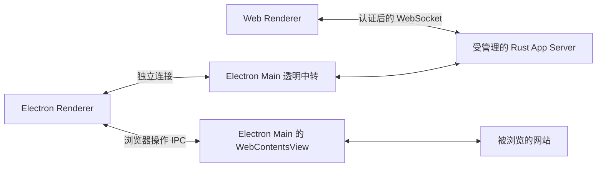

# 前端连接与浏览器能力

结论：Web 前端可以由受管理的 Rust App Server 直接接入；Electron 继续通过 Main 连接同一个后端。桌面内置浏览器仍由 Electron 承载，不依赖 Web 的 Node 中转。这个方向成立，但当前实现尚不满足直接替换条件。

本文记录 2026-09-16 的源码论证、推荐职责和验收条件，不表示推荐方案已经实现。

## 架构选择

| 方案 | 长期判断 | 原因 |
| --- | --- | --- |
| Web → Node 中转 → 受管理后端 | 可以稳定运行 | 保留同源入口和连接管理，但增加 Node 发布依赖、连接进程与清理链路 |
| Web → 独立 `--listen ws://` 后端 | 不适合作为共享产品后端 | 与 `--managed` 分别创建运行时，未统一配置目录、任务队列、自动化和退出管理 |
| Web → 受管理后端的浏览器入口 | 推荐目标 | Web 与桌面共享服务所有权；浏览器接入、认证与连接生命周期在后端闭合 |

推荐直连的依据是职责和部署依赖更清楚。目前没有性能测量，不能声称更快或已经更稳定。Node 中转并非错误架构；现有中转没有业务计算或必须依靠 Node 的浏览器引擎，因此也不是产品的必需层。

推荐的业务连接关系：

- 每个窗口或 Web 页签拥有独立协议客户端和连接；业务服务按现有配置目录及工作区规则共享。
- Rust 通过双向协议请求浏览器宿主执行操作；网页内容的 HTTP 请求由 Chromium 发给目标网站。
- 关闭一个页签只释放该连接及其资源，不停止其他窗口使用的后端。
- Rust 不接管 Electron 页面的布局、渲染和输入，也不通过 App Server 代理普通网页流量。

## 现状与必要改动

| 项目 | 当前实现 | 目标要求 |
| --- | --- | --- |
| Web 连接 | Node WebSocket 中转，每连接启动一个 daemon `connect` 载体 | 浏览器连接进入现有受管理服务；无需该载体 |
| 后端实例 | `--managed` 使用共享 registry；独立 WebSocket 自行创建服务 | Web 复用同一 registry、队列、自动化、闲置退出和停止流程 |
| 浏览器认证 | Rust WebSocket 拒绝 Origin，要求 Authorization Bearer | 独立定义浏览器可用的认证协议，并严格验证 Origin、Host 和授权范围 |
| 前端协议 | Web transport 使用事件包装，Rust WebSocket 接收 JSON-RPC 文本 | 明确握手和元数据契约，更新 transport；继续复用协议客户端 |
| 工作区授权 | 当前 Web 经可信启动器进入产品宿主连接，前端声明目录权限能力 | 浏览器会话绑定已授权配置目录和工作区，后端裁决权限 |
| 开发入口 | Vite 和 Web 脚本编译、加载 Node 中转 | Vite 负责开发资源及刷新；运行时接入不依赖启动时编译 |

源码依据：

- [Web 中转](../../src/ash/platform/app-server/node/webAppServer.ts)只机械转发消息；每个连接的子进程是连接载体，不是一个独立业务后端。
- [独立入口](../../../ash-rs/app-server/src/startup.rs)、[受管理入口](../../../ash-rs/app-server/src/managed.rs)和 [registry](../../../ash-rs/app-server/src/managed/registry.rs)当前有不同的运行时创建路径。共享进程也不等于所有工作区共享同一个 `AppServer` 对象。
- [WebSocket 认证](../../../ash-rs/app-server-transport/src/websocket.rs)明确拒绝 Origin。浏览器的 [WebSocket 标准接口](https://websockets.spec.whatwg.org/#the-websocket-interface)只提供 URL 和子协议参数，不能像 Node 客户端一样任意设置 Authorization 请求头。
- [Web 启动](../../src/ash/workbench/browser/web.bootstrap.ts)和 [Web transport](../../src/ash/platform/app-server/browser/appServerWebSocketTransport.ts)还依赖当前中转握手；直接改 URL 不够。

浏览器入口需要在协议设计中落实：可信启动器发放短期连接凭证，凭证绑定配置目录、工作区和允许的 Origin；业务初始化前完成验证；限制未认证连接的时间、大小及数量。Origin 校验不能替代身份认证，也不能将 daemon 管理凭证放进页面代码或 URL 查询参数。凭证兑换、续期和撤销的具体契约尚未设计和验证。

发布的本地 Web 产品需要稳定的资源与接入入口。推荐由受管理服务的可选 HTTP/WebSocket 入口提供同源访问，静态资源路径由可信启动配置传入，资源仍由前端构建和产品打包负责。开发时 Vite 提供资源，并按明确的开发 Origin 规则连接该服务。当前 loopback 论证不覆盖公网部署和多用户认证。

## 浏览网页是否受影响

| 使用方式 | 结论 | 当前完成程度 |
| --- | --- | --- |
| 用户在 Chrome、Edge 中正常访问其他网页 | 后端连接方案不会改变此能力 | 属于外部浏览器自身行为 |
| 用 Chrome、Edge 打开 Ash Web，连接 Rust | 方案可行 | 目前通过 Node 中转连接；Rust 浏览器入口未完成 |
| 在 Ash 桌面内显示网页 | Electron 能继续承担 | 有 Main 服务和 Renderer API，尚缺完整 Workbench 浏览器界面 |
| 桌面 Agent 观察、点击、输入网页 | 双向协议能够承载 | 已有语义接口和 CDP 执行，宿主选择及可见页面流程仍有缺口 |
| 仅运行 Ash Web，就嵌入并控制任意网站 | 当前不具备 | 普通网页没有 Electron 浏览器宿主权限 |

普通浏览器中的 Ash 可以打开外部链接；这不赋予它读取或操作其他网站的权限。同源策略限制跨站访问，目标站点也可以通过 `frame-ancestors` 禁止嵌入。因而 iframe 不能提供与桌面内置浏览器相同的能力。参见 [同源策略](https://developer.mozilla.org/en-US/docs/Web/Security/Defenses/Same-origin_policy)和 [frame-ancestors](https://developer.mozilla.org/en-US/docs/Web/HTTP/Reference/Headers/Content-Security-Policy/frame-ancestors)。

如果未来要求纯 Web 用户也能让 Agent 操作网页，需要明确提供一个受控浏览器宿主，例如服务端 Chromium，并设计页面展示、用户输入、会话隔离和授权。它是独立产品能力，保留或删除 Node 消息中转都不会自动实现它；当前不为此新增框架。

### 已有桌面调用链

1. Renderer 在初始化前注册 [浏览器宿主请求处理器](../../src/ash/platform/browser/electron-browser/appServerBrowserHost.ts)，接收 `browser/create`、`observe`、`perform` 和 `close`。
2. 处理器通过 IPC 委托 [Main 自动化服务](../../src/ash/platform/browser/electron-main/browserAutomationMainService.ts)，包括取消操作。
3. [页面服务](../../src/ash/platform/browser/electron-main/browserViewMainService.ts)创建 `WebContentsView`；Main 通过 CDP 操作已登记页面。
4. [Rust BrowserHost](../../../ash-rs/app-server/src/browser_host.rs)匹配反向请求与响应，记录页面所属连接，在连接退出时清理等待中的请求和页面归属。

[Electron 官方文档](https://www.electronjs.org/docs/latest/api/web-contents-view)也将 `WebContentsView` 定义为 Main 进程中的页面视图。替换业务连接 transport 无需替换它。

### 必须单独补齐的浏览器缺口

- **页面可见性尚未闭合。** 页面创建后默认隐藏；当前源码只有 platform 的布局和显示 API，未找到 Workbench 的浏览器 editor、地址栏以及对应布局调用。Agent 创建页面也没有自动打开可见页签。不能把“能创建网页进程”视为用户已经能在 Ash 内正常浏览。
- **新页面没有绑定任务选择的宿主。** `BrowserHost::create_owner()`在当前 App Server 的已注册连接中选第一个具备能力的宿主，而不是依据任务或窗口身份选择。已有页面的后续请求会绑定 owner，但这不能证明首次创建的窗口正确。共享实例时，纯 Web 任务也可能看到由桌面连接提供的浏览器工具可用状态，需要明确授权及宿主选择规则。
- **浏览器会话功能有限。** 当前页面使用独立临时 partition，拒绝页面权限和下载；弹窗只发事件并拒绝打开。登录持久化、下载、弹窗和权限交互尚不能按完整浏览器承诺。
- **双向链路必须保留。** WebSocket 支持双向消息，但具体实现仍须验证服务端请求、取消、超时、断线、资源归属以及重连后重新协商宿主能力。

## 对照本地 VS Code

本次实际核对 `D:/vscode` 源码，结论是学习它的职责分离，而不是将 Node 作为必须复制的技术选择。

| VS Code 源码 | 可借鉴的边界 |
| --- | --- |
| `src/vs/server/node/remoteExtensionHostAgentServer.ts` | 服务运行时处理浏览器连接、认证和重连，不由 build 承担 |
| `src/vs/platform/browserView/electron-main/browserView.ts` | Main 创建并管理真正的网页视图 |
| `src/vs/workbench/contrib/browserView/electron-browser/browserView.contribution.ts` | Workbench 注册可见浏览器功能 |
| `src/vs/code/electron-utility/sharedProcess/sharedProcessMain.ts` | 注册 Playwright channel，隔离自动化服务职责 |
| `src/vs/workbench/contrib/browserView/browser/browserView.contribution.ts` | Web 实现明确报告内置浏览器不可用 |

Ash 当前使用 Main 中的 CDP 操作，没有采用 VS Code 的共享进程 Playwright 服务。这里仅借鉴生命周期、宿主能力和产品界面的边界，不宣称实现等同。

## 验证结果与实施验收

本次执行现有 `pnpm --dir ash-ts run test:unit`，选择以下四个测试文件；前置协议生成、图标检查及 `tsconfig.test.json` 编译成功，共 21 项测试通过：

- `browserAutomationMainService.test.ts`：操作委托、宿主释放、异步创建与取消。
- `browser-view.test.ts`：URL、布局参数和 IPC 校验。
- `webRendererApi.test.ts`：连接、通知、反向请求、取消及断线后结果处理。
- `webAppServer.test.ts`：中转进程释放、Origin 拒绝和无效消息。

协议生成出现已有 MSVC 链接器创建 `.lib/.exp` 的 stdout warning。本次没有运行时源码改动，也没有为未实现的直连入口宣称构建或端到端测试通过。上述测试部分使用替身，不证明真实 Electron 页签已经可用。

实施完成必须使用真实产品验证：

| 验收 | 要证明的行为 |
| --- | --- |
| Playwright：Web 与 Electron 同时连接 | 同一配置目录只有一个受管理后端；两端独立请求、取消和断线 |
| Playwright：Web 生命周期 | 刷新、重连、关页和后端重启后恢复；关闭一页不终止其他任务 |
| 浏览器认证测试 | 非法 Origin、Host、失效凭证及越权工作区在业务初始化前被拒绝 |
| Playwright：可见 Electron 浏览器 | 打开页签、导航、前进后退、布局、切换和关闭均在真实界面完成 |
| Playwright：Agent 与用户共享页面 | 任务绑定正确宿主；观察和输入命中可见页面；取消和断线不遗留操作 |
| 多窗口与无宿主场景 | 新页面归属正确；不存在浏览器宿主时明确报告能力不可用 |
| 发布入口 | 使用编译产物启动，运行时无需 TypeScript 编译器和 Web Node 中转 |

最终建议：采用受管理 Rust 浏览器入口作为 Web 的长期接入方式，保留 Electron 的浏览器宿主和透明中转。同时把可见浏览器界面与任务到宿主的绑定列为独立必做项；仅删除中转文件不足以完成这项架构调整。
