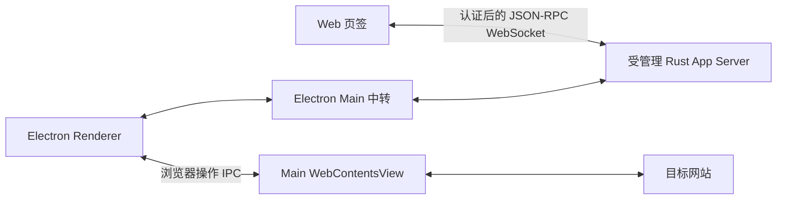

# 前端连接与浏览器能力

Web 通过受管理 Rust App Server 的认证 HTTP/WebSocket 入口连接；Electron 保留 Main 中转。桌面网页继续由 Electron 显示，Workbench 提供浏览器页签，Agent 请求绑定发起任务的连接。本文说明职责、生命周期和验证边界。

## 连接与职责

| 所属位置 | 职责 |
| --- | --- |
| [Rust browser transport](../../../ash-rs/app-server-transport/src/browser.rs) | HTTP、认证、静态资源和 WebSocket 边界 |
| [managed Web](../../../ash-rs/app-server/src/managed/web.rs) | 在现有受管理进程内开监听、绑定已授权工作区、管理启动器租约 |
| [daemon client](../../../ash-rs/app-server-daemon/src/client.rs) | 启动或复用后端，通过私有连接取得 Web 入口 |
| [Web protocol](../../../ash-rs/app-server-protocol/src/web.rs) | 启动和会话元数据契约及生成的 TypeScript 校验器 |
| [Web transport](../../src/ash/platform/app-server/browser/appServerWebSocketTransport.ts) | 兑换凭证、连接、原始 JSON-RPC 帧和断线通知 |
| [scripts/web.ts](../../../scripts/web.ts) | 用编译产物启动本地 Web，显示链接并保持租约 |
| [Vite plugin](../../../build/vite/webAppServerPlugin.ts) | 开发资源入口与开发 Origin 配置 |
| [BrowserEditor](../../src/ash/workbench/contrib/browserView/electron-browser/browserEditor.ts) | 地址栏、历史导航、页面容器、布局、焦点和无障碍帮助 |
| [Main 页面服务](../../src/ash/platform/browser/electron-main/browserViewMainService.ts) | 网页实例、会话隔离、导航和窗口内显示 |

原 Node WebSocket 业务消息中转及对应编译目标已移除。启动脚本仍使用 Node，但不再代转业务帧；普通网页流量也不经过 App Server。

每个 Web 页签和桌面窗口拥有独立协议连接。同一 profile 使用同一个受管理后端进程；registry 仍根据目录、授权来源和产品服务配置选择服务，共享进程不代表所有工作区使用同一个 `AppServer` 对象。不同产品服务配置不能在同一个 profile 中混用。

## 浏览器认证与生命周期

1. 可信启动器以工作区、静态资源目录和允许的 Origin 请求 Web 入口。入口只监听 `127.0.0.1`；没有将独立 `--listen ws://` 进程当作产品后端。
2. 启动记录返回 endpoint、一次性票据及后端 PID。票据通过 URL fragment 交给页面，启动后移除；不放在查询参数中，不暴露 daemon 管理凭证。
3. 页面向 `/ash/session` 兑换会话。票据是 256 位随机值，五分钟内有效且只能兑换一次；服务端保存凭证摘要。会话有八小时闲置期限。
4. 页面将会话保存在当前页签的 `sessionStorage`，通过 WebSocket 子协议携带会话凭证。HTTP 与升级请求严格检查 Host 和 Origin，拒绝无效凭证和非法路径。
5. 浏览器业务连接不是产品授权宿主。工作区来自可信启动配置；页面声明 `dirPermissionsHost` 会被拒绝，目录访问仍由后端检查。
6. 刷新页面使用既有会话重新认证、重新初始化协议。关闭页签只释放该连接。关闭启动器释放它的 HTTP/WebSocket 监听及会话，不停止其他窗口使用的受管理后端。

静态资源仅从可信配置的根目录读取，规范化后检查路径归属；入口限制未认证请求的时间、大小和连接数。生产 Web 使用编译后的资源，开发时由 Vite 提供资源，Rust 只接受配置的开发 Origin。

**后端重启边界：**停止后端会撤销监听与会话。重新启动 Web 后应打开启动器提供的新认证链接；在原页签打开新票据链接也会重新加载并认证。无需用户操作的跨后端重启恢复尚未实现，也没有将失效会话自动升级为新的授权。此实现仅覆盖单用户本机接入，不覆盖公网部署、TLS 或多用户登录。

## 桌面浏览器与任务归属

桌面命令 `Browser: Open Browser` 创建可见页签；用户可以输入地址、前进、后退、刷新和停止加载。Main 页面布局跟随编辑器容器及窗口缩放，切换页签、打开对话框和关闭编辑器会调整可见性或释放页面。内部页面 ID 不显示为文件路径面包屑。

- `Ctrl+L`（macOS 为 `Command+L`）或网页中的 `F6` 返回地址栏；`Alt+F1` 打开无障碍帮助。
- Main 的页面创建事件让 Agent 新建页面也进入 Workbench 页签；Agent 关闭页面会同步关闭编辑器。
- [BrowserHost](../../../ash-rs/app-server/src/browser_host.rs) 在提交任务时记录 `(thread, turn) → connection`。重放已有提交不能更换宿主；浏览器工具通过任务执行上下文取得该连接。
- 创建、观察、输入和关闭只能到达该任务连接及其所属目标。不会选择“第一个有浏览器能力的窗口”。断线清理等待请求与目标归属，取消和超时沿既有反向协议传递。
- Web 发起的任务没有桌面浏览器宿主，不能借用另一个桌面窗口。工具目录的整体可用状态仍由在线宿主决定，但实际执行还会检查任务宿主。
- 自动化、队列和未绑定桌面连接的任务不会隐式继承浏览器权限；子任务的宿主继承尚未提供。

Rust 负责批准和任务归属，Renderer 处理反向请求，Main 通过 CDP 操作已登记页面。Main 不接收任意 CDP 命令作为产品协议。取消会阻止后续步骤，但已经发送给 Chromium 的单条命令无法强制抢占。

### 能力边界

| 使用方式 | 当前能力 |
| --- | --- |
| Chrome、Edge 正常访问其他网页 | 不受本方案影响 |
| 浏览器中打开 Ash Web | 已通过 Rust 认证入口接入 |
| Ash 桌面内显示和操作网页 | 已有可见页签、导航和布局 |
| 桌面 Agent 观察及输入网页 | 按任务连接路由，共用同一可见页面 |
| 纯 Web 控制任意网站 | 未提供浏览器宿主，不能跨站控制其他网页 |
| 登录持久化、下载、页面权限提示 | 未实现；当前页面使用独立临时会话，拒绝下载和权限请求 |
| 浏览器页签跨应用重启恢复 | 未实现 |
| 同一页面在多个编辑器组中同时显示 | 未验证，不作为当前支持能力 |

浏览器能力与业务连接方式相互独立。保留或移除 Node 消息中转，都不会自动给普通 Web 页面增加跨站控制能力。

## 对照 VS Code

已核对本地 `D:/vscode`。采用其职责边界和命名习惯，不要求照搬其后端技术：

| VS Code 源码 | Ash 对应边界 |
| --- | --- |
| `src/vs/server/node/remoteExtensionHostAgentServer.ts` | 运行时处理连接与认证，build 负责构建 |
| `src/vs/platform/browserView/electron-main/browserView.ts` | Main 管理真正的网页视图 |
| `src/vs/workbench/contrib/browserView/electron-browser/browserView.contribution.ts` | Workbench 注册可见浏览器功能 |
| `src/vs/code/electron-utility/sharedProcess/sharedProcessMain.ts` | 自动化执行与界面职责分开 |

Ash 当前使用 Main CDP 服务，没有照搬 VS Code 的共享进程 Playwright 服务。

## 验证与尚未完成的验收

2026-09-16 实施验证：

| 检查 | 结果与范围 |
| --- | --- |
| Rust transport | 10 项通过，覆盖认证、票据重放、Origin/Host、会话到期、连接关闭和背压 |
| Rust 浏览器归属 | 8 项通过；另有真实任务 RPC → runtime → 工具 → 宿主路由测试通过，覆盖两个桌面连接和无宿主 Web 连接 |
| Rust protocol | 原有 49 项库测试、4 项生成器测试及新增 2 项 Web 契约测试通过 |
| Rust owner 检查 | transport、protocol、daemon、app-server 的 warnings 检查通过 |
| TypeScript | Web API、协议校验器、Main 浏览器服务及编辑器状态测试通过；相关编译通过 |
| Playwright Web | 编译产物读文件、刷新恢复、与 Electron 共用 PID/实例 ID，以及关闭 Electron 后继续读文件通过 |
| Playwright 授权边界 | 已认证 Web 声明目录授权宿主能力被拒绝，读取未授权工作区失败 |
| Playwright Web transport | 原始 JSON-RPC、关闭及非法二进制帧处理通过 |
| Playwright Electron | 可见页签、导航历史、尺寸变化、切换、帮助对话框、释放通过；实际宿主 IPC 的创建、观察、输入和关闭通过 |
| managed 生命周期 | 编译后的集成测试直接运行通过；Cargo 运行时 Windows job 限制导致进程启动 Access denied，现有基线测试也受影响 |

任务路由测试使用测试模型和批准策略；真实 Electron 测试使用实际页面、IPC 与 CDP。两段分别验证，没有声称执行过外部模型驱动的整段 Agent 浏览过程。协议生成仍有已有 MSVC `.lib/.exp` 链接输出 warning。

### 补充验收

同日补充运行，以下结果均来自完成的命令：

| 场景 | 结果 | 证据 |
| --- | --- | --- |
| 生产 Web 重启恢复 | 通过 | 停止后端后监听关闭；旧 token 返回 401；同一页签打开新票据链接后重新读取工作区文件 |
| Vite 开发入口 | 通过 | 真实 Chromium 经不同端口认证，读取文件、刷新、关闭开发服务后释放 Rust 监听 |
| 两个 Electron 窗口 | 通过 | 同 profile 下第二窗口创建页面，第一窗口访问该目标被拒绝；关闭第一窗口不影响第二窗口；重载第二窗口释放宿主页面 |
| 在途导航取消 | 通过 | 真实 HTTP 页面等待响应时取消，操作返回取消结果；随后关闭目标，页签和 Main 视图均释放 |
| Rust 请求生命周期 | 通过 | app-server 的 9 项 browser 相关测试及 transport 的 10 项测试重新运行通过 |
| 编译与构建 | 通过 | automation TypeScript 检查、renderer 严格检查、Main/preload 和生产 Web 构建通过 |

对应测试：[Web 生命周期](../../test/smoke/areas/windows/web-lifecycle.spec.ts)、[多客户端连接](../../test/smoke/areas/windows/web-connection.spec.ts)、[桌面浏览器](../../test/smoke/areas/windows/browser-view.spec.ts)。

验收发现并修复了同一页签打开新认证链接只改变 fragment、没有重新启动连接的问题。另修正 README 中遗留的 Vite HMR 消息中转说明。测试中补齐 Workbench 就绪等待及已经关闭的 Electron 实例清理。

结论：当前声明的手动重新授权恢复、开发入口、窗口隔离和主要取消/清理流程通过。**无需用户操作的跨后端重启恢复仍未实现**；外部模型驱动的多窗口 Agent 整段流程未执行，任务 RPC 路由与真实 Electron 页面操作仍分别验证。不能表述为原方案所有验收项全部完成。
