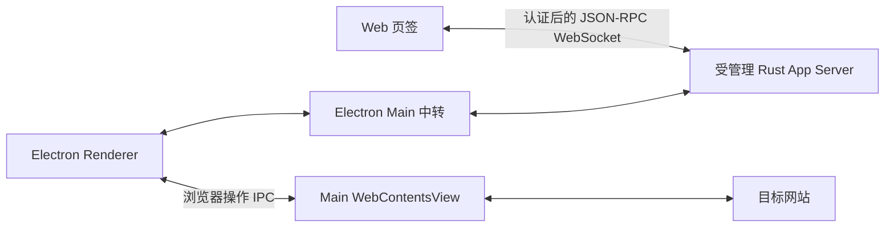

# 前端连接与浏览器能力

TS 前端以浏览器环境为运行边界，业务与系统执行通过协议交给 Rust；启动与 Electron 平台能力属于宿主层。当前 Web 通过受管理 Rust App Server 的认证 HTTP/WebSocket 入口连接，Electron 仍保留 Main 中转。本文说明目标职责、当前连接方式、Node 退场范围和验证边界。

## 前端与 Node 的边界

以下是长期要求，不表示剩余 Node 实现已经删除。WebSocket 握手只建立连接，不会自动转移业务、文件存储或进程的所有权。

| 层次 | 长期职责 | Node 边界 |
| --- | --- | --- |
| TS 前端 | 界面、编辑器模型、工作副本、交互、领域服务与协议客户端 | 在浏览器环境运行，不依赖 Node API |
| Rust 后端 | 业务状态、文件读写与监听、进程、终端执行、Git、搜索和远程执行 | 对应领域拥有能力与资源；App Server 提供协议入口 |
| 桌面宿主 | 启动和连接取得、窗口生命周期、菜单、系统对话框、剪贴板和嵌入网页 | Electron 所需代码可继续使用其运行环境，不承担产品业务执行 |
| 构建与测试工具 | 编译、打包、代码生成和测试运行 | 可以使用 Node，与前端运行时分开 |
| 扩展执行环境 | 执行扩展代码并维持扩展 API 契约 | 独立审计；前端去除 Node 不等于扩展不再需要 JavaScript 运行时 |

- 启动入口属于宿主，不是前端的例外。宿主保留能力按职责判断，不按“是否写在入口文件里”判断。
- 前端生产依赖图中的 `common/`、`browser/`、`electron-browser/` 代码及 Worker 不导入 Node 内置模块、`node/` 实现或 Electron Main；也不依赖 `process`、Node `Buffer`、`require`、`NodeJS.*` 或补齐这些全局的运行时包。
- preload 虽位于 `electron-browser/`，仍属于隔离的宿主入口。前端只消费明确、可序列化的宿主契约，不能借 preload 暴露通用文件、进程或任意 IPC 调用。
- 第三方依赖同样检查实际打包入口及传递依赖。TypeScript 使用 `NodeNext` 模块解析、测试在 Node 中执行，都不能据此判断前端需要 Node。
- 文本模型、未保存内容、撤销、主题应用和快捷键解析继续由 TS 拥有；迁移文件存储与执行不把这些对象搬到 Rust。Rust crate 主要隔离能力和依赖，不按 TS 文件逐一建 crate。
- WebSocket 使用浏览器 API；每个页面或窗口拥有独立连接与协议客户端，领域服务复用该客户端。认证、初始化、请求配对、事件、取消、关闭与恢复仍需完整协议契约。
- Electron 是否改为 Renderer 直连 WebSocket，是独立的连接实现工作。当前 Main 中转不是前端依赖 Node API 的理由，也不能把移除中转写成已完成。

## Node 退场盘点

2026-09-16 源码初查：已检查 `ash-ts/src` 的 Node 导入、全局使用、`node/` 目录以及主要装配和调用点；测试与生成物单独识别。以下是后续工作的入口，不是完整传递依赖审计，也没有删除代码。

| 处理范围 | 已定位入口 | 当前情况与下一步 |
| --- | --- | --- |
| 公共环境探测 | [platform.ts](../../src/ash/base/common/platform.ts) | 仍探测 `globalThis.process`；核对宿主与测试调用方，把宿主环境读取留在宿主，前端消费浏览器信息或明确环境数据 |
| 远程执行与隧道 | [remoteCommand.ts](../../src/ash/platform/remote/electron-main/remoteCommand.ts)、[sshAppServerProcessLauncher.ts](../../src/ash/platform/remote/electron-main/sshAppServerProcessLauncher.ts)、[sshRemoteTunnelService.ts](../../src/ash/platform/remote/electron-main/sshRemoteTunnelService.ts) | Main 仍启动 SSH、持有子进程和 TCP 隧道；优先核对 Rust [remote-connections](../../../ash-rs/remote-connections/README.md) 的能力及产品调用入口，再迁移执行与释放职责 |
| 远程包校验与安装协调 | [packagedRemoteRuntimeCatalog.ts](../../src/ash/platform/remote/electron-main/packagedRemoteRuntimeCatalog.ts)、[remoteRuntimeInstaller.ts](../../src/ash/platform/remote/electron-main/remoteRuntimeInstaller.ts) | 仍有 Node 文件、哈希和环境依赖；区分已有 Rust 安装能力、构建产物选择与窗口进度展示，避免重复实现 |
| OAuth 回调监听 | [oauthCallbackHost.ts](../../src/ash/platform/connectors/electron-main/oauthCallbackHost.ts)、[loopbackOAuthCallback.ts](../../src/ash/platform/connectors/electron-main/loopbackOAuthCallback.ts) | Main 创建 HTTP 监听；核对本机与远端后端部署位置、回调地址、取消和超时后确定 Rust 接口，打开授权网页仍归宿主 |
| 配置、快捷键和主题文件 | [revisionedJsonFile.ts](../../src/ash/platform/storage/node/revisionedJsonFile.ts)、[userThemeFileService.ts](../../src/ash/platform/theme/node/userThemeFileService.ts) | Node 持有读写、监听和冲突检查；迁移存储前核对配置规范及领域协议，保留 TS 的配置含义、主题应用与快捷键解析 |
| 工作区路径解析 | [workspaces.ts](../../src/ash/platform/workspaces/node/workspaces.ts) | Node 执行 realpath、stat 和文件读取；区分启动目标解析与连接后的工作区能力，保持授权边界和工作区身份 |
| profile 与宿主状态 | [localProfile.ts](../../src/ash/platform/profile/node/localProfile.ts)、[stateService.ts](../../src/ash/platform/state/node/stateService.ts) | 包含文件复制与窗口状态落盘；按启动所需状态和产品数据分别核对，不整包迁入业务后端 |
| 连接启动与开发工具 | [childProcessJsonlTransport.ts](../../src/ash/platform/app-server/node/childProcessJsonlTransport.ts)、[localAppServerProcessLauncher.ts](../../src/ash/platform/app-server/electron-main/localAppServerProcessLauncher.ts)、[developmentArtifacts.ts](../../src/ash/platform/environment/node/developmentArtifacts.ts) | 分别属于当前宿主连接、启动和开发产物定位；随对应调用链处理，不能仅因目录名直接删除 |
| Electron 平台能力 | [app.ts](../../src/ash/code/electron-main/app.ts)、[preload.cts](../../src/ash/base/parts/sandbox/electron-browser/preload.cts)、[browserViewMainService.ts](../../src/ash/platform/browser/electron-main/browserViewMainService.ts) | 保留明确宿主能力；继续压缩装配文件中的业务执行，不能把整个 Main 当作可删除的 Node 后端 |

当前主窗口配置为 `nodeIntegration: false`、`contextIsolation: true`、`sandbox: true`；Renderer 编译配置没有主动加入 Node 全局类型。这些是已有隔离措施，不是传递依赖审计完成的证据。`VSBuffer` 当前基于 `Uint8Array`，不能因为名称包含 Buffer 就作为 Node 实现删除。

后续按以下顺序推进，每项完成后删除对应旧调用链，不保留双实现：

1. 核对前端生产依赖图与公共环境探测，补齐针对 Node 导入、全局及传递依赖的边界检查。
2. 优先核对远程命令、SSH 与隧道执行：列出 TS 调用方、Rust 能力、协议缺口、取消与资源释放，再做一次完整迁移。
3. 逐项处理 OAuth、文件存储及工作区 IO；配置数据先确认作用域、格式、冲突与通知契约。启动状态和 Electron 平台能力按宿主职责保留。
4. 每项同步生产装配、调用方、协议生成物、测试及打包依赖；实现和实际消费者都退出后才删除模块。

### 退场验收要求

- 检查前端入口及传递依赖，确认无 Node 模块、全局注入或 Node 补齐包；不能只靠文本搜索或 `tsconfig` 声明验收。
- 按实际改动运行受影响的前端检查、Rust 检查和正常构建；纯文档更新只检查文档。
- 用 Playwright 验证受影响的 Web、Electron UI 与真实 Electron 后端链路，以行为断言调试；覆盖多窗口隔离、关闭释放、取消、后端断线恢复，以及相关文件写入冲突。
- 扩展执行与打包的 JavaScript 运行时单独核对。不得把“前端无需 Node”报告为“整个产品已经移除 Node”。

本次仅更新职责和盘点，未运行产品测试或构建；下文已有实施验证是此前连接工作的记录，不是本次 Node 退场验收结果。

## 连接与职责

| 所属位置 | 职责 |
| --- | --- |
| [Rust browser transport](../../../ash-rs/app-server-transport/src/browser.rs) | HTTP、认证、静态资源和 WebSocket 边界 |
| [managed Web](../../../ash-rs/app-server/src/managed/web.rs) | 在现有受管理进程内开监听、绑定已授权工作区、管理启动器租约 |
| [daemon client](../../../ash-rs/app-server-daemon/src/client.rs) | 启动或复用后端，通过私有连接取得 Web 入口 |
| [Web protocol](../../../ash-rs/app-server-protocol/src/web.rs) | 启动和会话元数据契约及生成的 TypeScript 校验器 |
| [Web transport](../../src/ash/platform/app-server/browser/appServerWebSocketTransport.ts) | 兑换凭证、连接、原始 JSON-RPC 帧和断线通知 |
| [scripts/web.ts](../../../scripts/web.ts) | 用编译产物启动本地 Web，显示链接并保持租约 |
| [Vite plugin](../../../build/vite/webAppServerPlugin.ts) | 开发资源入口与开发 Origin 配置 |
| [BrowserEditor](../../src/ash/workbench/contrib/browserView/electron-browser/browserEditor.ts) | 地址栏、历史导航、页面容器、布局、焦点和无障碍帮助 |
| [Main 页面服务](../../src/ash/platform/browser/electron-main/browserViewMainService.ts) | 网页实例、会话隔离、导航和窗口内显示 |

原 Node WebSocket 业务消息中转及对应编译目标已移除。启动脚本仍使用 Node，但不再代转业务帧；普通网页流量也不经过 App Server。

每个 Web 页签和桌面窗口拥有独立协议连接。同一 profile 使用同一个受管理后端进程；registry 仍根据目录、授权来源和产品服务配置选择服务，共享进程不代表所有工作区使用同一个 `AppServer` 对象。不同产品服务配置不能在同一个 profile 中混用。

## 浏览器认证与生命周期

1. 可信启动器以工作区、静态资源目录和允许的 Origin 请求 Web 入口。入口只监听 `127.0.0.1`；没有将独立 `--listen ws://` 进程当作产品后端。
2. 启动记录返回 endpoint、一次性票据及后端 PID。票据通过 URL fragment 交给页面，启动后移除；不放在查询参数中，不暴露 daemon 管理凭证。
3. 页面向 `/ash/session` 兑换会话。票据是 256 位随机值，五分钟内有效且只能兑换一次；服务端在 profile 的 `web-sessions` 中保存会话摘要和到期时间，不保存明文凭证。会话距最近一次认证八小时后过期；存储按工作区、开发 Origin、启动租约和监听端口隔离。每次 Web 启动创建独立随机租约，只有同一个启动器恢复后端连接时复用，后续新启动不能继承旧授权。
4. 页面将会话保存在当前页签的 `sessionStorage`，通过 WebSocket 子协议携带会话凭证。HTTP 与升级请求严格检查 Host 和 Origin，拒绝无效凭证和非法路径。
5. 浏览器业务连接不是产品授权宿主。工作区来自可信启动配置；页面声明 `dirPermissionsHost` 会被拒绝，目录访问仍由后端检查。
6. 刷新页面使用既有会话重新认证、重新初始化协议。关闭页签只释放该连接。关闭启动器释放它的 HTTP/WebSocket 监听及会话，不停止其他窗口使用的受管理后端。

静态资源仅从可信配置的根目录读取，规范化后检查路径归属；入口限制未认证请求的时间、大小和连接数。生产 Web 使用编译后的资源，开发时由 Vite 提供资源，Rust 只接受配置的开发 Origin。

**后端重启边界：**Web 启动器保持租约。后端停止时监听关闭，但已授权会话保留；后端重新启动后，启动器在原端口重新建立监听。浏览器在五分钟内按 0.5 秒至 10 秒的退避间隔重新认证、连接和初始化，无需刷新页面或打开新链接。启动器不会自行拉起被明确停止的后端。关闭 Web 启动器会释放监听并删除该入口的授权记录；凭证过期或被撤销时停止重试，需重新打开认证链接。本实现仅覆盖单用户本机接入，不覆盖公网部署、TLS 或多用户登录。

恢复复用原前端客户端及领域 API，重新发出 `ready`，让现有领域服务重新查询状态、恢复订阅；编辑器不因连接恢复而刷新页面。断线时未完成请求立即失败，重连不自动重发任何旧业务请求，包括写文件或提交任务。后端进程中已丢失的终端、浏览器宿主资源和正在执行的操作不能被当作仍然存在；本次不提供跨进程重启的消息重放或执行续跑保证。

## 桌面浏览器与任务归属

桌面命令 `Browser: Open Browser` 创建可见页签；用户可以输入地址、前进、后退、刷新和停止加载。Main 页面布局跟随编辑器容器及窗口缩放，切换页签、打开对话框和关闭编辑器会调整可见性或释放页面。内部页面 ID 不显示为文件路径面包屑。

- `Ctrl+L`（macOS 为 `Command+L`）或网页中的 `F6` 返回地址栏；`Alt+F1` 打开无障碍帮助。
- Main 的页面创建事件让 Agent 新建页面也进入 Workbench 页签；Agent 关闭页面会同步关闭编辑器。
- [BrowserHost](../../../ash-rs/app-server/src/browser_host.rs) 在提交任务时记录 `(thread, turn) → connection`。重放已有提交不能更换宿主；浏览器工具通过任务执行上下文取得该连接。
- 创建、观察、输入和关闭只能到达该任务连接及其所属目标。不会选择“第一个有浏览器能力的窗口”。断线清理等待请求与目标归属，取消和超时沿既有反向协议传递。
- Web 发起的任务没有桌面浏览器宿主，不能借用另一个桌面窗口。工具目录的整体可用状态仍由在线宿主决定，但实际执行还会检查任务宿主。
- 自动化、队列和未绑定桌面连接的任务不会隐式继承浏览器权限；子任务的宿主继承尚未提供。

Rust 负责批准和任务归属，Renderer 处理反向请求，Main 通过 CDP 操作已登记页面。Main 不接收任意 CDP 命令作为产品协议。取消会阻止后续步骤，但已经发送给 Chromium 的单条命令无法强制抢占。

### 能力边界

| 使用方式 | 当前能力 |
| --- | --- |
| Chrome、Edge 正常访问其他网页 | 不受本方案影响 |
| 浏览器中打开 Ash Web | 已通过 Rust 认证入口接入 |
| Ash 桌面内显示和操作网页 | 已有可见页签、导航和布局 |
| 桌面 Agent 观察及输入网页 | 按任务连接路由，共用同一可见页面 |
| 纯 Web 控制任意网站 | 未提供浏览器宿主，不能跨站控制其他网页 |
| 登录持久化、下载、页面权限提示 | 未实现；当前页面使用独立临时会话，拒绝下载和权限请求 |
| 浏览器页签跨应用重启恢复 | 未实现 |
| 同一页面在多个编辑器组中同时显示 | 未验证，不作为当前支持能力 |

浏览器能力与业务连接方式相互独立。保留或移除 Node 消息中转，都不会自动给普通 Web 页面增加跨站控制能力。

## 对照 VS Code

已核对本地 `D:/vscode`。采用其职责边界和命名习惯，不要求照搬其后端技术：

| VS Code 源码 | Ash 对应边界 |
| --- | --- |
| `src/vs/server/node/remoteExtensionHostAgentServer.ts` | 运行时处理连接与认证，build 负责构建 |
| `src/vs/platform/browserView/electron-main/browserView.ts` | Main 管理真正的网页视图 |
| `src/vs/workbench/contrib/browserView/electron-browser/browserView.contribution.ts` | Workbench 注册可见浏览器功能 |
| `src/vs/code/electron-utility/sharedProcess/sharedProcessMain.ts` | 自动化执行与界面职责分开 |

Ash 当前使用 Main CDP 服务，没有照搬 VS Code 的共享进程 Playwright 服务。

## 验证与尚未完成的验收

2026-09-16 实施验证：

| 检查 | 结果与范围 |
| --- | --- |
| Rust transport | 10 项通过，覆盖认证、票据重放、Origin/Host、会话到期、连接关闭和背压 |
| Rust 浏览器归属 | 8 项通过；另有真实任务 RPC → runtime → 工具 → 宿主路由测试通过，覆盖两个桌面连接和无宿主 Web 连接 |
| Rust protocol | 原有 49 项库测试、4 项生成器测试及新增 2 项 Web 契约测试通过 |
| Rust owner 检查 | transport、protocol、daemon、app-server 的 warnings 检查通过 |
| TypeScript | Web API、协议校验器、Main 浏览器服务及编辑器状态测试通过；相关编译通过 |
| Playwright Web | 编译产物读文件、刷新恢复、与 Electron 共用 PID/实例 ID，以及关闭 Electron 后继续读文件通过 |
| Playwright 授权边界 | 已认证 Web 声明目录授权宿主能力被拒绝，读取未授权工作区失败 |
| Playwright Web transport | 原始 JSON-RPC、关闭及非法二进制帧处理通过 |
| Playwright Electron | 可见页签、导航历史、尺寸变化、切换、帮助对话框、释放通过；实际宿主 IPC 的创建、观察、输入和关闭通过 |
| managed 生命周期 | 编译后的集成测试直接运行通过；Cargo 运行时 Windows job 限制导致进程启动 Access denied，现有基线测试也受影响 |

任务路由测试使用测试模型和批准策略；真实 Electron 测试使用实际页面、IPC 与 CDP。两段分别验证，没有声称执行过外部模型驱动的整段 Agent 浏览过程。协议生成仍有已有 MSVC `.lib/.exp` 链接输出 warning。

### 补充验收

同日补充运行，以下结果均来自完成的命令：

| 场景 | 结果 | 证据 |
| --- | --- | --- |
| 生产 Web 重启恢复 | 通过 | 停止后端后监听关闭；旧 token 返回 401；同一页签打开新票据链接后重新读取工作区文件 |
| Vite 开发入口 | 通过 | 真实 Chromium 经不同端口认证，读取文件、刷新、关闭开发服务后释放 Rust 监听 |
| 两个 Electron 窗口 | 通过 | 同 profile 下第二窗口创建页面，第一窗口访问该目标被拒绝；关闭第一窗口不影响第二窗口；重载第二窗口释放宿主页面 |
| 在途导航取消 | 通过 | 真实 HTTP 页面等待响应时取消，操作返回取消结果；随后关闭目标，页签和 Main 视图均释放 |
| Rust 请求生命周期 | 通过 | app-server 的 9 项 browser 相关测试及 transport 的 10 项测试重新运行通过 |
| 编译与构建 | 通过 | automation TypeScript 检查、renderer 严格检查、Main/preload 和生产 Web 构建通过 |

对应测试：[Web 生命周期](../../test/smoke/areas/windows/web-lifecycle.spec.ts)、[多客户端连接](../../test/smoke/areas/windows/web-connection.spec.ts)、[桌面浏览器](../../test/smoke/areas/windows/browser-view.spec.ts)。

验收发现并修复了同一页签打开新认证链接只改变 fragment、没有重新启动连接的问题。另修正 README 中遗留的 Vite HMR 消息中转说明。测试中补齐 Workbench 就绪等待及已经关闭的 Electron 实例清理。

随后补齐了无需页面操作的后端重启恢复：生产 Web 与 Vite 的真实 Chromium 测试停止再启动后端，确认原页面和同一个前端客户端重新读取工作区文件。底层测试覆盖授权跨后端重启恢复、工作区及 Origin 隔离、过期和撤销；前端测试覆盖重新初始化、不重放结果不明的写请求，以及释放和撤销后停止重试。

最终验证：两项 Playwright 场景通过，生产场景还验证关闭旧启动后，旧凭证在新启动的入口返回 401。transport 11 项、daemon 19 项、protocol 52 项库测试及 4 项生成器测试、Web API 10 项测试通过；上述 Rust owner 的 warning 检查及前端严格编译、生产构建通过。验收中发现新启动可能读取旧授权记录，已通过独立随机启动租约隔离修复。

外部模型驱动的多窗口 Agent 整段流程仍未执行，任务 RPC 路由与真实 Electron 页面操作分别验证。本次 Web 重连验收不等于该 Agent 场景也已完成。
