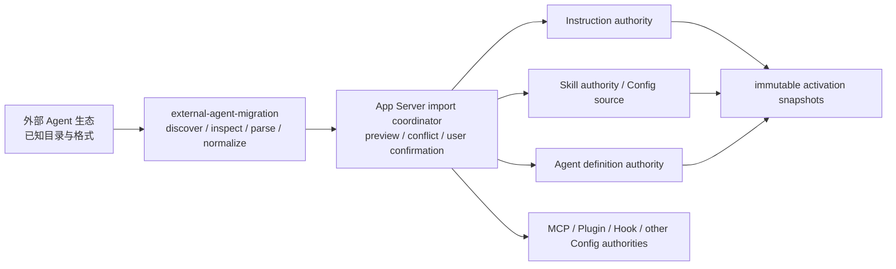

# Agent 自定义系统

> 本文是 Ash 原生 Agent 自定义对象、物理命名空间、加载语义和外部生态导入边界的跨系统
> canonical owner。
>
> 状态：架构边界已接受（2026-08-12）；User 与 Directory 的 `AGENTS.md`、`ASH.md`、Global Instructions 和
> 成功读取文件命中的 Contextual Instructions 会进入后续 model invocation。Skills 已有 metadata catalog、显式 activation 和通用
> context injection，可信 built-in Skill 自动 selector 与 Agent delegation definition 选择已经接通。
> 已有指令列表与显式附件 API；独立指令管理界面、Agent definition list/picker API 和完整 import apply
> 仍未实现。
>
> Skill 的格式、来源与激活细节见 [`skills.md`](skills.md)；外部格式发现和转换实现契约见
> [`external-agent-migration` README](../ash-rs/external-agent-migration/README.md)；配置与事务边界见
> [`config.md`](config.md)；内置与自定义 Agent 的统一定义契约、专化职责和启动范围见 [`agents.md`](agents.md)；最终模型输入由 [`core-context.md`](core-context.md) 定义。

## 快速理解

Ash 只把 Instructions、Skills 和 Agents 作为 Agent 自定义领域对象。Prompt 是运行时送入模型的
信息形式，Slash Command 是调用入口；两者都不是第四种可持久化自定义对象。目录级多文件 Ash 对象
位于小写 `.ash/`；共享的 `AGENTS.md` 与 Ash 专属 `ASH.md` 位于目录根，始终加载。其他产品的
专有目录和格式必须经过 `external-agent-migration`。

内置 Agent 不是 `.ash` 自定义对象。它们随产品发布、不会进入设置或被同名自定义定义覆盖，但与自定义 Agent 使用同一种定义契约；会话入口、委托和工作流只表示本次运行的启动来源，不产生“主 Agent 定义”或“子 Agent 定义”。

| 用户想表达什么 | Ash 对象 | 何时进入运行时 | 典型入口 |
| --- | --- | --- | --- |
| “在这个环境里应长期遵循什么” | Instructions | 全局、上下文匹配或显式按需加载 | 自动解析或用户选择 |
| “这类工作应该怎样完成” | Skills | 被用户选择或模型匹配后渐进加载 | picker、`$name` 或模型选择 |
| “由哪种执行配置来工作” | Agents | 启动会话入口、委托执行或工作流阶段时冻结配置引用 | Agent 选择器、委托或工作流 |
| “现在请完成这件事” | 当前 Turn 的用户输入 | 构造本次 `ModelRequest` 时 | 普通消息 |
| “快速调用某个能力” | 不是新对象 | `$name` 选择已有 Skill，`/name` 调用产品命令 | `$review`、`/status` |
| “把别的 Agent 配置带进来” | Import workflow | 用户确认并由目标 authority 发布后 | Desktop import |

## 1. 领域对象只有三类

| 对象 | 回答的问题 | 拥有 | 明确不拥有 |
| --- | --- | --- | --- |
| Instructions | Agent 应遵循什么长期或作用域指导？ | 指令正文、作用范围、加载策略、优先级来源和内容摘要 | 可执行脚本、工具授权、模型调用本身 |
| Skills | Agent 如何完成一类可复用工作？ | `SKILL.md`、渐进加载、引用资源、选择策略和来源身份 | 工具实现、脚本执行权限、当前任务实例 |
| Agents | 使用什么执行配置？ | 模型/工具/Skill/Instruction 的类型化引用、执行角色和委托约束 | Thread 运行时身份、凭据、批准或工具实现 |

三类对象不能按文件扩展名区分语义，也不能合并成一个泛化的 `PromptArtifact`。它们会以不同方式
参与上下文和执行，因此需要独立 authority、校验与 snapshot。

以下概念不进入 artifact type：

- **Prompt**：模型输入的底层信息形式。Ash 的 provider-neutral 运行时输出是 `ModelRequest`，
  不建立 `Prompt` 领域对象或 `prompts/` 原生目录。
- **Task**：当前工作由 `Turn` 的用户输入和 durable Thread history 表达。重复工作流使用 Skill；
  需要只允许用户主动调用时，使用 `UserOnly` Skill，而不是新增 Task/Preset 类型。
- **Slash Command**：调用已有对象或产品命令的 UI 投影，不是持久化定义格式。
- **Agent runtime identity**：Agent definition 是配置对象；执行分支仍由 Thread 标识，不能仅因
  新增定义文件就在协议中发明第二套运行时身份。

## 2. 类型、来源和加载策略是三条独立轴

一个 artifact 的类型不能同时承担“从哪里来”和“何时加载”。目标模型必须分别表达：

| 轴 | 典型取值 | 决定什么 |
| --- | --- | --- |
| Artifact kind | Instructions / Skills / Agents | 对象结构、authority 与 runtime contribution |
| Scope/source | Built-in / User / Directory / Plugin | 生命周期、优先级、可写位置与失效方式 |
| Provenance | Ash 原生格式 / 从外部生态导入 | 审计、冲突解释和重新导入来源 |
| Activation policy | 按对象类型定义的 named enum | 自动加载、上下文匹配、用户调用或模型选择 |

“Imported”不是 User/Directory 的替代 scope。导入后的对象仍属于明确的 User 或 Directory
authority，同时保留外部生态、来源位置 identity 和 digest 等 provenance。Plugin 贡献继续由
Plugin package 拥有，不能复制成普通目录文件后丢失 package/version 身份。

### 2.1 Instruction 加载策略

Instruction authority 的 canonical policy 使用穷尽枚举，不通过 `applyTo` 是否存在或
`alwaysApply: bool` 间接猜测：

```rust
pub enum InstructionLoadPolicy {
    Global,
    Contextual { patterns: Vec<GlobPattern> },
    OnDemand,
}
```

- `Global`：在对应 scope 的每次 Agent interaction 中加载。
- `Contextual`：只有当前资源或工作上下文命中 pattern 时加载。
- `OnDemand`：在用户显式附加、Agent 成功读取准确文件或上层已验证引用选择时加载。描述仅用于发现。

外部格式中的 `applyTo`、`globs`、`alwaysApply` 等字段由 `external-agent-migration` adapter 转换成这三种
语义。`applyTo: "**"` 仍是“恰好匹配所有文件的上下文规则”，不能偷偷改写成 Global；真正的
Global 必须由来源格式中明确等价的语义产生。

Ash 原生 `patterns` 对应 `applyTo` 的文件匹配用途。当前只使用本 Turn 已成功读取、并由 App Server
确认仍位于对应授权目录内的文件路径；不会从聊天正文猜路径，也不会让父 Agent 的读取记录决定子
Agent 的匹配。Agent definition 按名称显式引用的 Instruction 不受自动匹配限制。
文件匹配只决定该 Agent 本次上下文应包含哪些规则，不选择 Agent 角色、拆分任务或授予工具；编排仍由
Agent definition、任务与现有 capability ceiling 决定。

### 2.2 Skill 调用策略

Skill 的可发现性与调用方也使用 named policy，而不是两个容易产生非法组合的布尔字段：

```rust
pub enum SkillInvocationPolicy {
    UserOrModel,
    UserOnly,
    ModelOnly,
}
```

保存的 review、fix-tests、create-component 等重复任务属于 `UserOnly` 或 `UserOrModel` Skill。
Skill 统一使用 `$name` 选择器，产品 Slash Command 不注册 Skill 的别名。

## 3. `.ash` 是目录级 Ash 命名空间

目录级 Ash 对象统一规划到小写 `.ash/`。大写 `.ASH` 不作为第二个兼容名称，避免在
大小写敏感文件系统上形成两个 authority。

```text
<dir_root>/.ash/
├── config.toml       # Current：严格只读 Directory intent
├── instructions/     # Current：有界发现；Global 自动注入
├── skills/           # Current：metadata-only Directory Skill source
└── agents/           # Current：有界 definition catalog；委托时可选择并执行
```

三个 artifact root 都使用固定原生布局：Instructions 和 Agents 是直接 `.md` 文件，Skills 是
`<name>/SKILL.md` 目录。目录加入 Environment 且具备相应 Grant 时，App Server 才把 root 交给对应 runtime；
`ash-skills-extension` 拥有 Skill catalog 与 watcher refresh。模型调用不在 Core context assembly
中扫描 catalog：Global Instructions 使用冻结的 `HarnessInstructions` snapshot；已激活 Skill 由
extension 按 durable digest 精确加载正文。扫描 Agent catalog 本身不会执行定义。当前只有 `spawn_agent` 在委托安全点完成目录定义的选择、引用解析与冻结；让会话入口和工作流使用同一契约属于 [`agents.md`](agents.md) 的计划设计。

| Scope/source | 物理 owner | 是否经过 `external-agent-migration` |
| --- | --- | --- |
| Built-in | release/package resources | ❌ 原生 authority 直接加载 |
| User | `<profile_root>/{AGENTS.md,ASH.md,instructions/}` | ❌ 原生 authority 直接加载 |
| Directory | `<dir_root>/{AGENTS.md,ASH.md,.ash/}` | ❌ 原生 authority 直接加载 |
| Plugin | Plugin package contribution | ❌ 由 Plugin snapshot 交给目标 authority |
| External ecosystem | `.codex`、`.agents`、`.claude` 等已知布局 | ✅ 只经 `external-agent-migration` |

`<profile_root>` 本身已经是 Ash 的用户级命名空间，因此不再嵌套一个 `~/.ash` 兼容目录。
Directory `.ash` 继续作为受保护 metadata；普通文件搜索、Agent 工具写入和外部 source
registration 不能把它当作任意内容目录。

原生 loader 只读取自身文件与通用共享的 `AGENTS.md`。它不得自动扫描 `.codex/`、`.agents/`、
`.claude/`、`.github/` 等产品专有目录；否则外部格式会反向定义 Ash schema。导入外部专有
Instructions 时，目标是 Ash 专属 `ASH.md` 或相应 `instructions/` 文件；已经直接读取的
`AGENTS.md` 不能再导入一份。

每次模型调用的拼接顺序固定为用户级、工作区级；同一作用域内先放共享 `AGENTS.md`，再放 Ash
专属 `ASH.md`，最后放命中的多文件 Instruction。每份正文带原文件来源，工作区内容标出所属根目录。
系统与安全规则高于全部这些文件；用户级规则高于工作区级，`ASH.md` 可以细化同作用域的
`AGENTS.md`。文件顺序不授予工具、目录或审批权限。
工作区嵌套 `AGENTS.md` 与 `ASH.md` 在本 Turn 成功读取其下文件后，按浅到深顺序加入；
不会预先扫描无关子树，也不会让一个目录的规则影响其他目录。

## 4. `external-agent-migration` 是外部反腐化层

`external-agent-migration` 的“Agent”表示外部 Agent 生态，不表示它只导入 Agents artifact。它统一处理
Codex、Claude、Copilot、Cursor 以及未来明确支持的其他生态中的 Instructions、Skills、Agents 和设置类内容。



| 责任 | `external-agent-migration` | App Server coordinator | 目标 authority |
| --- | --- | --- | --- |
| 已知外部路径与敏感排除 | ✅ | ❌ | ❌ |
| source-specific bounded parser | ✅ | ❌ | ❌ |
| normalized preview fragment 与 provenance | ✅ | 组合 | 最终复核 |
| 用户选择、冲突预览与 apply orchestration | ❌ | ✅（Proposed） | 提供 prepare/publish contract |
| Ash canonical schema 与领域校验 | ❌ | ❌ | ✅ |
| `.ash` 原生发现与加载 | ❌ | 协调 snapshot | ✅ |
| 持久化、enablement 与 runtime activation | ❌ | 调用 | ✅ |

parser 输出必须是目标明确、可审查的 typed fragment，例如 Instruction、Skill source、Agent
definition 或 Config mutation fragment；不能输出一段“以后再解释”的原始 JSON/Markdown。外部字段
无法确定性映射时必须标记 unsupported，不能 raw passthrough，也不能让 `external-agent-migration` 依赖
`ash-config`、Core 或具体产品 UI。

当前 `external-agent-migration` 已完成 `AgentPathInspection` 和有界 source parser 输出的
`MigrationPlan` fragment（settings、MCP、hooks、plugins、memory、agents、commands、rules、skills
名称清单）；仍不读取 skill/command/memory 正文，session 与认证明确不在范围。上图 import apply
路径保持 Proposed。

## 5. Import 与来源注册不等价

| 操作 | 权威正文在哪里 | 外部变化是否自动影响 Ash | 撤销语义 | 适合对象 |
| --- | --- | --- | --- | --- |
| Import | Ash 原生 authority | ❌，再次导入需显式触发 | 删除/回滚 Ash artifact 或 import receipt | Instructions、Agents、需要独立管理的 Skills |
| Register source | 外部只读 root | ✅，刷新后产生新 catalog generation | 禁用或移除 source | 当前已支持的 standalone Skill source |

两条路径可以复用相同的外部 discovery、containment 和 parser，但不能共享生命周期决定：

- Import 不授予来源目录的持续文件访问；apply 前必须重读并校验 identity/digest。
- Source registration 只保存窄 root 与 provenance，不复制整个外部配置目录。
- 注册 Skill source 不允许顺便激活其中的 Instructions、Agents、Hooks、MCP 或执行规则。
- `ash-file-access` 是第三条独立路径：它管理目录访问生命周期，不等于 Import 或持久 source registration。

首个完整 apply 可以只支持 Config 内部的原子 batch，但不能假装同时原子提交尚不存在的
Instruction/Agent authority。在跨 authority prepare/publish 可用前，对应条目必须保持 unsupported。

## 6. 运行时只消费冻结快照

```text
原生与已导入来源
→ 各 artifact authority 发现、校验、解析
→ Config/enablement 与作用域解析
→ Instruction / Skill / Agent immutable snapshots
→ ContextPlan / ContextAssembler
→ ModelRequest
```

Core 不读取 customization 文件，也不在组装模型请求时扫描目录。每次 model invocation 消费已经
冻结的 snapshot 或由 extension 根据 durable provenance 贡献的精确 fragment；文件或配置变化只在
下一个安全点生效，且不能替换 in-flight Skill 的 digest。最终输入可以包含系统内置指令、作用域
Instructions、Agent references、已激活 Skill 内容、用户消息和 Tool results，但它仍是
`ModelRequest`，不是一个需要持久化的 Prompt artifact。

Slash Command catalog 只包含产品和服务命令；独立 `$name` Skill selector 把用户选择绑定到稳定 `SkillRef`。两种入口的名称、补全和展示状态都不能代替目标对象的 identity、权限或 activation validation。文件和 Plugin 提供的上下文继续使用 `@`，不进入 Skill selector。

## 7. 当前状态与实施顺序

| 能力 | 状态 | 实现证据或前置条件 |
| --- | --- | --- |
| `.ash/config.toml` Directory intent | 已实现 | `ash-config` / App Server local composition |
| Skill built-in/user/Directory catalog 与 enablement | 已实现 | `ash-skills`、`SkillRuntime::compose_sources` 与 [`skills.md`](skills.md) |
| Skill activation snapshot 与通用 context injection | 已实现 | validated `SkillRef`、正文加载、safe-point freezing 与 extension contributors |
| Skill metadata 自动 selector | 已实现 | 仅 `BuiltInVerified`、唯一高置信、pinned `SkillRef` 后加载正文 |
| Codex/Claude known-path inspection | 已实现 | `external-agent-migration::inspect_agent_paths` |
| Codex/Claude bounded source parsers 与 `MigrationPlan` fragments | 部分具备 | settings/MCP/hooks/plugins/memory/agents/commands fragments 已实现；sessions、apply adapter、wire contract 未实现 |
| User Instructions authority | 部分具备 | `ash-home` + `ash-instructions`；`AGENTS.md`、`ASH.md`、Global 与已读文件 Contextual 注入已实现 |
| Directory Instructions authority | 部分具备 | `ash-instructions` + `DirContributions`；共享/专属 always-on、Global 与已读文件 Contextual 注入已实现 |
| Directory Agents authority | 部分具备 | catalog/refresh、spawn 显式/自动选择、reference/capability freezing 已实现；list/picker API 未实现 |
| `.ash/{instructions,skills,agents}` loader | 已实现 | 固定 roots、有界校验、Directory activation 与 watcher refresh |
| External parser、preview 与 apply | 部分具备 | 四种来源的项目指令已有 typed fragment、摘要预览和逐文件发布；其他 apply、跨领域事务与持久回执未完成 |
| `$name` Skill selector | 已实现 | TUI/Desktop `$name` 绑定 stable `SkillRef`；`/skills` 只管理，`@` 留给文件和 Plugin 上下文 |

`$create-instructions` 是创建或更新细分 Instruction 的内置 Skill，复用通用激活机制；`/init`
保留为初始化 `ASH.md` 的产品命令。两者使用正常文件工具和目录授权；已有文件先读取再修改。
指令 metadata、按需读取、显式附件 API 与写入前置条件由
[`ash-instructions` README](../ash-rs/instructions/README.md) 维护。
外部 `CLAUDE.md` 导入是独立的确定性文件操作：重新校验用户选中的来源，只在目标缺失或为空时
复制到 Ash 的目标文件；已有非空目标报告冲突，不交给 Agent 合并。来源正文不进入 `/init`
或任何用于整理导入内容的 Agent Turn。四种来源的项目指令均已接通预览与目标写入。

实施顺序：

1. 固定本文的三类对象、命名空间和 import boundary，代码与文档不再新增 Prompt/Task artifact。
2. 已完成 Directory 三类 catalog、Global Instruction safe-point injection 与 watcher refresh。
3. 已完成 Skill 显式 activation、可信 built-in 自动 selector、Directory source、用户可调用投影
   和通用 context injection；已接通按需读取、显式附件与写入前规则检查；管理界面仍待接入。
4. Agent definition catalog 已开放给 multi-agent delegation 的受限选择；下一步补 list/picker API，
   cross-authority reference 在具备明确 authority contract 前继续拒绝。
5. `external-agent-migration` 的 bounded parsers 和 typed preview fragments 已实现；四种来源的项目指令已接入
   App Server 预览与发布。其他条目只在具备对应 target authority 时开放 apply。

## 8. 长期不变量

- Ash 原生 Agent customization 只有 Instructions、Skills、Agents 三类领域对象。
- Prompt、Task、Preset 和 Slash Command 不成为第四种 artifact；重复任务使用 Skill。
- Directory 的 Ash-owned 目录只使用小写 `.ash`，不维护 `.ASH` alias。
- 外部生态格式只由 `external-agent-migration` 理解；原生 authority 不扫描兼容目录。
- 类型、scope/source、provenance 与 activation policy 分开建模。
- 导入成功不授予工具、脚本、网络、凭据、沙箱绕过或长期执行批准。
- Preview 不是 authorization；apply 前必须重读并验证 source identity/digest。
- 原生 loader、Import、source registration 与 `add-dir` 保持四条不同生命周期路径。
- ContextAssembler 只消费冻结 snapshot 并产生 `ModelRequest`，不拥有 artifact discovery。
- Agent 定义只有一种；内置与自定义是来源差异，会话、委托与工作流是运行时启动来源。

### 多来源项目指令导入实现

Copilot、Claude、Codex、Cursor 项目指令已具备后端预览与发布接口，详情由
[external-agent-migration](../ash-rs/external-agent-migration/README.md#多来源项目指令导入)
和 [App Server 协议](../ash-rs/app-server-protocol/README.md#指令导入) 维护。
导入后由 Ash 指令目录独立管理，复用主、子 Agent 的 catalog 与 Core 路径；不注册持续外部来源。
用户级指令发布、跨领域事务和 Desktop 导入界面仍未完成。
