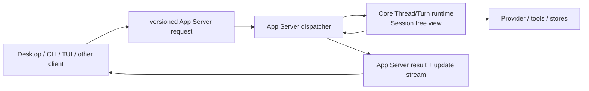

# Ash App Server API

```yaml
title: Ash App Server API
status: development
owner: crates
consumers:
  - desktop
  - cli
  - external-clients
lastUpdated: 2026-09-29
```

本文描述当前开发期的唯一 App Server 契约。项目不保留旧 wire API、旧 DTO 或旧持久化格式
的兼容入口；Rust DTO、生成的 TypeScript 和 JSON Schema 必须始终一致。

具体 method registry、artifact generator 与 schema fixture 见
[`ash-app-server-protocol` README](../crates/app-server-protocol/README.md)；JSON-RPC dispatch、
subscription broker、resource store 与 local composition 见
[`ash-app-server` README](../crates/app-server/README.md)。本文拥有跨客户端 API 语义与演进方向，
两个 README 拥有当前实现接口与修改路径。

## 快速理解

App Server API 是 Desktop、CLI、TUI 和外部客户端访问 Ash 产品能力的唯一版本化接口；它暴露
Session、Thread、Turn 和更新流，不建立第二套领域模型。

| 客户端需求                   | 使用方式                                                                                              | 关键保证                                                                                        |
| ---------------------------- | ----------------------------------------------------------------------------------------------------- | ----------------------------------------------------------------------------------------------- |
| 创建一次工作                 | `session/create` 创建根 Thread 并返回按 `session_id` 聚合的 Session 视图，随后在该 Thread 上启动 Turn | 持久化身份与顺序始终属于 Thread                                                                 |
| 组织长期多根工作             | 受信产品 host 使用 `project/*` 保存根目录表并弱关联 Session                                           | Project 不授予目录权限，也不改变 Thread 身份                                                    |
| 管理长期 Memory              | 受信产品 host 使用 `memory/*` 在 Profile、Project 或 Dir 作用域显式读写                               | 后端持久化正文；普通连接不可读取，删除后 live store 与命令回执不保留正文                        |
| 关闭一个 Session Tab         | 前端通过 `session/request` 提交 `request.type = stop`                                                 | 枚举同一 `session_id` 的 Thread，持久化各 Thread 的停止事实并中断活动 Turn；不创建 Session 状态 |
| 持续显示执行进度             | 读取 Thread 正文快照并订阅语义条目更新                                                                | 后端整理条目内容和顺序；客户端决定排版，发现缺口时重新读取快照                                  |
| 修改配置或资源               | 调用类型化方法并携带命令身份                                                                          | 重复命令可重放结果，冲突载荷会被拒绝                                                            |
| 同步 Marketplace 安装状态    | 同一 profile daemon 写入，收到 generation 失效提示后重新 list                                         | Desktop、Ash Code 与 app 不建立第二份安装 authority                                             |
| 响应批准或用户输入           | 回复等待中的类型化请求                                                                                | 回复绑定精确请求和当前 Thread                                                                   |
| 让 Agent 操作 Desktop 浏览器 | Desktop 初始化时声明 browser host                                                                     | Rust 保留批准和目标 owner，Electron Main 只执行语义动作                                         |
| 连接本地 App Server          | 先初始化并校验能力和模式哈希                                                                          | 初始化前不能调用产品方法                                                                        |
| 协议发生不兼容变化           | 同步修改 Rust 类型、生成物和调用方                                                                    | 开发期不保留隐藏的旧 DTO 入口                                                                   |

### 上下文用量

`context/read` 按 `scope.type = environment` 读取当前环境，或按 `thread` 携带 `sessionId` 和 `threadId` 读取所属线程。`detail` 必须明确为 `usage` 或 `diagnostics`：前者的 `toolDefinitions` 为空，后者返回与估算同次采样的工具名称、说明、参数结构、strict 标志及逐项 token 数。首次请求前也可调用；不会创建回合、调用模型、检索查询证据或触发压缩。线程选择会校验 Session membership。

结果的分类及总量共用 Core 执行时的本地估算器，区分系统提示词（含环境与时间）、实际暴露的工具定义、已加载记忆／指令文件、技能目录与已激活正文、对话和工具结果。已被 checkpoint 覆盖的历史不重复计入，未加载的文件和技能正文不计入。分类来源只返回身份、估算 token 数与目录条目数，不返回正文。`sources[].itemCount` 对技能目录返回已启用且兼容的技能总数，包含因提示词字节上限未列入的技能；单条指令或工具来源为 `null`。

`allocation` 来自当前模型执行预算；未知窗口时为 `null`，不推导百分比。完整窗口由自动压缩输入阈值、输出预留、安全余量和压缩 buffer 组成，模型计量校准的额外保留计入安全余量。`autoCompactWindow` 为完整窗口扣除 buffer 的压缩窗口，`autoCompactAt` 再扣除输出和安全预留，表示实际输入触发阈值。`latestRequest` 单独保留同一模型最近请求的测量值及来源，不能按它分摊分类，也不能把分类估算标为服务商实测。

### 音频通话资源

- `contracts.calls.version = 1` 表示支持通话接口。前端通过领域服务调用生成协议，不持有 LiveKit 管理密钥或入房票据。
- `call/start` 使用客户端生成的 `resourceId`、`operationId` 和 `deviceId`，部署方式为本地服务、自建服务或邀请。每条连接至多持有一个活动通话，入房默认关闭麦克风。
- `call/changed` 只发给资源所属连接，携带完整快照与递增 `sequence`；前端丢弃旧序号及其他资源的通知。`call/read` 返回同一资源的当前状态。
- `call/control` 控制静音、停止收听、设备发言权及轨道音量。`call/leave` 释放本连接的媒体与设备后返回；`call/end` 由房间所有者关闭整个房间。
- 邀请、移除、角色变更和结束操作携带操作身份与已读修订号，冲突明确失败。邀请密钥只按显式邀请操作返回，普通状态通知不携带密钥。
- 连接关闭会释放其资源；其他窗口的通话不受影响。媒体重连期间停止采集，房间换代后重新取得权限和票据。
- AI 任务委托、屏幕共享及文档关联尚未进入此协议。类型和错误以 [通话协议源](../crates/app-server-protocol/src/protocol/call.rs)及生成 schema 为准。

### 听写资源

- `dictation/start` 与 `dictation/stop` 使用客户端生成的 `resourceId`。只有受信产品 host 可以启动听写；停止只能针对同一连接创建的资源。
- `backend` 明确选择本地模型，或选择 `openAi` / `xai` 云端供应商及其转写模型。云端识别使用该供应商的直接 API 凭据，不读取当前文字模型的订阅凭据。
- [realtime-voice](../crates/realtime-voice/README.md) 管理设备所在进程的识别会话，一个进程同时只占用一个麦克风。`dictation/transcript` 携带临时或最终文本，`dictation/ended` 携带结束及错误；这些通知只送给发起连接。停止响应也携带最终文本。
- 停止请求或连接关闭会释放听写资源。App Server 在所在设备上采集音频；远端客户端需要由本机语音会话持有麦克风。
- `dictation/model/read` 查询模型包是否已安装，不加载识别器、不采集麦克风。`dictation/model/start` 使用连接所属的 `resourceId` 接受准备或导入操作，立即响应；`dictation/model/progress` 报告检查、下载字节数、加载及最终结果。停止请求和连接关闭取消该连接的操作，等待写入与工作线程结束后释放资源。模型发布成功与取消竞争时，已发布的包保留；可重复停止，不恢复断线前的操作。
- Rust 统一决定模型缓存目录。导入参数只包含模型 ID 和源目录；源目录包含 `dictation-model.json`、`encoder.onnx`、`decoder.onnx`、`tokens.txt`。下载校验和导入均在临时目录中完成，实际加载通过后再发布；跨进程文件锁阻止同一模型同时安装，已安装的包不可覆盖。下载进度为每个文件实际收到的字节数，没有未知总大小的百分比。
- TypeScript 的 `platform/localTranscription/common/localTranscription.ts` 定义前端契约，Workbench 的 `services/localTranscription/electron-browser/localTranscriptionService.ts` 通过现有 renderer connection 接入上述资源。Workbench 与 Sessions 的本地听写共用该服务和模型管理表单；关闭模型设置页取消其未完成操作。停止听写等待最终文本，取消丢弃后续文本，连接关闭结束当前输入。浏览器和 SSH 窗口不提供设备本地采集或模型操作。采集、模型缓存和识别由共享 Rust 后端负责，前端不推送 PCM、不启动转写工作进程。

### 唯一外部门禁

这条规则适用于所有 `Session`、`Thread`、`Turn`、`ThreadItem` 产品能力：App Server 同时是
客户端请求进入 Core 的唯一入口，也是 Core 更新离开系统的唯一出口。

| 参与者                         | 允许路径                                                                              | 禁止路径                                                       |
| ------------------------------ | ------------------------------------------------------------------------------------- | -------------------------------------------------------------- |
| Desktop、CLI、TUI 和其他客户端 | 版本化 App Server 协议 → 分发器                                                       | 直接链接 Core、Store、Provider 或读取私有运行时接口            |
| 进程内宿主                     | 类型化客户端 → 同一个 App Server 分发器                                               | 为性能增加隐藏的进程内业务方法                                 |
| App Server                     | 校验、路由、订阅、DTO 编解码和事件投影 → Core                                         | 复制领域归约器（reducer）、直接写 Store 或消费 Provider 内部流 |
| Core                           | 持有 Thread/Turn/Item 的权威状态，按 `session_id` 得出 Session 树视图，并调用内部端口 | 依赖 App Server wire、客户端状态或 UI 生命周期                 |



进程内 App Server、stdio/JSONL 和未来的远程 App Server 只是不同传输方式。它们必须保持相同的
请求、结果、错误和通知语义。`app` 当前的直接 Rust 终端/PTY 组合只覆盖
终端宿主；一旦该宿主承载 Agent 的 Session/Thread/Turn/Item 能力，也必须接入同一 App Server
门禁，不能新增 Core 旁路。

## 1. 产品模型

Canonical 产品实体和内部契约的详细定义见 [`protocol.md`](protocol.md)。本 API 直接暴露
其中的 readable Session/Thread/Turn/ThreadItem view，不维护第二份领域定义。

- App Server connection/session 只是传输生命周期，不能与产品 Session 混用。

Session 是按 `sessionId` 聚合 Thread 的只读树视图，不保存独立状态。Fork 的 lineage 固定为
`parentThreadId + parentSequence`；Core 按这个锚点重放父 Thread，并把锚点内连续、已结束的 Turn
导入子 Thread，因此未完成的 Turn 和父 Thread 后续提交都不会进入已创建的分支。

Project 是独立持久化领域，保存长期根目录表以及对 Session 的弱关联；它不复制 Thread 事件，也不改变 Session 只读聚合语义。一次多 Agent 工作只由同一 Session 的 Agent tree 表达。目标 Team 另存跨任务成员关系和任务引用，不建立跨 Session 的执行树；见 [Agent Team](../crates/docs/agent-teams.md)。

Memory 是独立 profile 持久化领域。它不属于 Thread transcript，也不因 Session 关闭而删除；Profile、Project 和 Dir 作用域使用各自稳定身份，Dir 作用域不保存路径。

## 2. 一致性模型

每个修改命令都使用：

- `commandId`：客户端生成的稳定命令身份；
- Thread 写入分支中的 `expectedSequence`：客户端观察到的目标 Thread sequence；
- typed command payload：参与重放与冲突判断。

同一 `commandId + typed payload` 重试返回原结果；同一 `commandId` 携带不同 payload 返回
`CommandConflict`。JSON-RPC request `id` 只做当前 connection 的 response pairing，不能替代
`commandId`。

每个 Thread 拥有独立 durable sequence。修改一个 Thread 不会占用其他 Thread 的 sequence；Session
没有 sequence。Create、fork、rewind 和 tree lifecycle 请求不伪造 Session 并发序号。

## 3. 传输

当前外部 transport 是 UTF-8 JSONL/stdio：

- 每行一个完整 JSON-RPC 2.0 message；
- 单条 message 最大 1,048,576 bytes；
- stdout 只允许协议 message，stderr 只用于诊断；
- 同一 request 的 response 先于由它产生的 causal notifications；
- connection 断开后 request ID、subscription、Resource 与 Terminal ownership 全部失效。

In-process client 使用 protocol-owned typed request/event channel，可以省略 JSON string
编解码，但必须经过相同 initialize gate、method dispatcher、result/error envelope 与
notification contract，不能拥有隐藏业务接口。JSONL/stdio、WebSocket 等外部 transport 才在
边界执行 wire encoding。

## 4. 初始化

`initialize` 必须是 connection 的首个 request。

```json
{
  "jsonrpc": "2.0",
  "id": 1,
  "method": "initialize",
  "params": {
    "clientInfo": { "name": "ash-desktop", "version": "0.1.0" },
    "capabilities": {
      "notifications": true,
      "browser": { "version": 1, "observe": true, "input": true }
    }
  }
}
```

返回值包含 `serverInfo`、`protocolVersion`、自动生成的完整协议指纹 `schemaHash`、实际可用的 server capability，
以及 composition 边界冻结的 `slashCommands` snapshot：

```json
{
  "serverInfo": { "name": "ash-app-server", "version": "0.1.0" },
  "protocolVersion": { "major": 7 },
  "schemaHash": "sha256:...",
  "capabilities": {
    "sessions": true,
    "threads": true,
    "turns": true,
    "projects": true,
    "memories": true,
    "approvalEnvironment": true,
    "resources": true,
    "fileSystem": true,
    "directorySearch": true,
    "codebase": true,
    "cloudCodebase": false,
    "terminal": true,
    "mcp": true,
    "mcpOAuth": false,
    "typst": true,
    "updateReplay": true,
    "contracts": {
      "memoryDiagnostics": { "version": 1 }
    }
  },
  "slashCommands": [
    {
      "name": "compact",
      "description": "Compact older conversation context",
      "argumentMode": "optional"
    }
  ]
}
```

本地打包、开发启动、远程连接与后端更新统一要求相同的 protocol major 和 `schemaHash`。指纹由 Rust 协议生成器根据完整 JSON Schema 自动计算；协议字段、方法或返回类型变化后运行 `just generate-protocol`，无需维护 revision 或所有能力共用的版本计数。主版本只用于明确的破坏性协议语义变化。前端与后端随同一次构建交付，启动入口先准备对应后端产物。

每条连接在进入 Ready 前还必须验证 server identity、响应形状以及必需能力的布尔值。`sessions`、`threads`、`turns` 只表达是否可用；`contracts` 仅保留 `taskDelivery`、`marketplaceSearch` 等独立可选能力自己的契约版本。指纹不同必须拒绝连接，并报告客户端与后端的指纹；不得忽略字段差异后继续发送请求。远程后端也必须使用匹配的生成协议，当前不提供跨指纹版本范围协商。

权限 ID 使用 `manual / auto / bypassPermissions`。名称、说明、翻译 key 与确认标记由共享 Rust 定义生成到 `ApprovalModes.ts`，界面通过领域适配层渲染，不需要新增一次菜单查询 RPC。旧权限字段、模型选择、Guardian 观察或时间策略的协议变化由生成指纹校验覆盖。

`slashCommands` 每项的 `name` 只能使用 lowercase ASCII letters、digits 与 interior hyphens，
description 不能为空，同一 snapshot 中 name 必须唯一。可选字段 `argumentHint`（如 `<path>`、`<prompt>`）
用于向客户端声明行内参数占位虚提示。该 snapshot 负责 discoverability 与 inline argument parsing；
客户端必须按命令契约分发。Skill 和 server prompt command 通过 `StartTurn.input` 保留 `/name`、text/image 顺序；
内置 `/compact` 通过 `session/request::CompactContext` 执行，不发送普通聊天文本。
校验、local/server 合并与 Rust client 交互状态的 canonical owner 是
[`ash-slash-commands`](../crates/slash-commands/README.md)；App Server 只组合并发布 server snapshot。
三种 client surface 的合并、执行与渲染边界见 [`slash-commands.md`](slash-commands.md)。

### 客户端-hosted 浏览器能力

Browser 是当前 Server → Client request capability。只有在 `initialize` 中提交 version 1 browser
capability 的连接才能成为宿主；`observe` 与 `input` 分别声明页面观察和语义输入支持。该声明是
短暂的 connection routing authority，不进入 Session、Thread 或持久化配置。

| Host method           | Params                           | Result                     | 当前语义                                |
| --------------------- | -------------------------------- | -------------------------- | --------------------------------------- |
| `browser/create`      | `{ url }`                        | `{ targetId }`             | 创建一个隔离、默认隐藏的新目标          |
| `browser/observe`     | exact target + 三个 include flag | 页面状态 + 可选 AX/DOM/PNG | 不执行脚本，不返回 Electron 对象        |
| `browser/perform`     | tagged semantic action           | `{ targetId }`             | 导航、node click/type、滚动、后退或刷新 |
| `browser/close`       | `{ targetId }`                   | `null`                     | 关闭精确目标                            |
| `browser/sharing/set` | `{ targetId, threadIds }`        | `null`                     | 更新用户页面的授权受众，空数组撤销      |

`browser/sharing/set` 是桌面用户的 Client → Server 请求，也是 Rust → Main 的同名宿主请求。调用连接必须具有桌面授权宿主与浏览器能力，Web 连接被拒绝。Main 确认目标为本窗口用户页面后，Rust 将页面绑定到同一连接的指定 Thread（最多 32 个）；Agent 页面不能由该方法扩大受众。撤销取消在途操作并解绑 CDP；关闭页面或连接释放记录。该授权不持久化，也不替代任务动作批准。

请求 ID 使用保留的非空字符串，与 Client → Server 正整数 ID 隔离。App Server 把 create result 的
`targetId` 绑定到响应它的连接；此后不能由另一连接响应，也不能把观察或动作结果切换到另一个
目标。connection 退出后 target authority 立即失效，Desktop 同时回收由该 host connection 创建的
原生目标。

```json
{
  "jsonrpc": "2.0",
  "id": "browser-host:1:7",
  "method": "browser/perform",
  "params": {
    "action": {
      "type": "click",
      "targetId": "browser_target_123",
      "target": { "nodeId": "42" }
    }
  }
}
```

成功响应必须保留同一 ID 和 target：

```json
{
  "jsonrpc": "2.0",
  "id": "browser-host:1:7",
  "result": { "targetId": "browser_target_123" }
}
```

App Server deadline 为 30 秒。Turn 取消或 deadline 到达时，Server 发送
`$/cancelRequest { id }`；client 终止尚未开始的步骤，并用 `-32800` 返回已取消的在途请求。
已放弃请求的晚到 terminal response 可以丢弃，已完成请求的重复 response 仍是协议错误。
截图 payload 只允许 `image/png`，App Server 校验 decoded length、Base64 和 PNG signature 后才
创建 connection-owned Resource。

该契约从不接受任意 CDP method、JavaScript source、localhost 调试端口或 Node sidecar 配置。
完整 Browser Tool generation 要求当前 Environment tool composition 已建立，并且至少一个 live
version 1 宿主同时声明 `observe + input`；最后一个完整宿主断开会移除该工具 port，Environment runtime 切换则重建对应 Tool generation。恢复条件后
只影响后续 Tool generation，不恢复或重放旧调用。
Desktop 当前实现和 Playwright 后续边界见
[`ash-desktop-architecture.md#7-浏览器能力`](ash-desktop-architecture.md#7-浏览器能力)。

### Agents 窗口应用工具宿主

受信 Desktop 或 Browser 连接可以在 initialize 中声明
`appTools: { version: 1, agents: true, desktop: boolean }`。普通 wire client 不能通过该字段
提升宿主权限，Browser 不能声明 desktop。业务工具在后端直接执行；需要窗口的操作走
Server → Client `app/request`，不增加 Main 中的业务分发。

请求包含发起操作的 sessionId、threadId、turnId 和类型化 operation。操作包括打开文件、
浏览器、终端或比较，任务导航，侧栏分组管理，以及检查更新与庆祝。响应是
`{ json: string }`，Rust 验证其为不超过 1 MiB 的 JSON 文本，再形成模型工具结果。

请求绑定到发起 Turn 的连接，其他连接不能响应。它复用 ClientHost 的 30 秒 deadline、
`$/cancelRequest`、断连失效和晚到响应处理。取消会阻止尚未提交的 UI 操作；已经完成的导航
或保存不会回滚，因此未知结果时应先查询状态，不自动重放。缺少窗口或能力时返回执行错误。
工具定义和使用约束见 [工具契约](agent-tools-spec.md#应用级工具)。

## 5. 方法清单

| Method                                                                                   | Aggregate                                 | Effect                                                                                                                                                                                                    |
| ---------------------------------------------------------------------------------------- | ----------------------------------------- | --------------------------------------------------------------------------------------------------------------------------------------------------------------------------------------------------------- |
| `agent/read`                                                                             | Agent identity                            | 按 agentId 读取身份与全部执行分支，不加载历史                                                                                                                                                             |
| `agent/roles/list`                                                                       | authorized environment Agent catalog      | 刷新并列出可作为根 Agent 启动的目录定义；不返回定义正文                                                                                                                                                   |
| `agent/capabilities/read`                                                                | 当前 Tool generation 与本地执行配置       | 只读工具目录、来源、模型暴露方式、可申请的权限类别，以及已配置的进程沙箱候选后端                                                                                                                          |
| `session/create`                                                                         | new root Thread                           | 创建根 Thread，返回由其 `session_id` 得出的 Session 视图                                                                                                                                                  |
| `session/read`                                                                           | session tree view                         | 按 `session_id` 读取当前树视图                                                                                                                                                                            |
| `session/trace/read` | Session 的持久 Thread 历史 | 通过存储索引按独立 Thread 游标分页；不启动模型或改写历史 |
| `session/trace/diagnostics/read` | 本地可选诊断捕获 | 按捕获内序号读取模型 attempt；返回记录可用性与完整性 |
| `session/trace/payload/read` | 捕获所属正文 | 验证 Session、capture 和 payload 身份及正文摘要后按需返回 |
| `session/trace/graph/read` | 派生执行关系 | 明确请求时归纳关系；不在增量历史分页中重算 |
| `session/list`                                                                           | global                                    | 列出按 `session_id` 聚合的 Session 视图                                                                                                                                                                   |
| `session/subscribe`                                                                      | connection + session tree                 | Session 视图 + 每个 child Thread 的 snapshot 和 durable gap；Session 没有 `afterSequence`                                                                                                                 |
| `session/request`                                                                        | `session_id` grouping boundary            | tagged request；树级动作枚举 Thread，Thread/Turn 写入绑定具体 Thread                                                                                                                                      |
| `session/unsubscribe`                                                                    | connection                                | 删除订阅                                                                                                                                                                                                  |
| `model/preferences/update`                                                               | model preferences                         | 更新当前接入的 Fast 或上下文档位；带配置版本校验，后端验证模型能力及可选档位                                                                                                                              |
| `model/list`                                                                             | model catalog                             | 参数 `{}`；各端使用固定内置目录，登录和接入切换不改变模型身份集合；目录不证明请求成功                                                                                                                     |
| `session/thread/read`                                                                    | Session + Thread                          | 读取 Thread 及其正文快照                                                                                                                                                                                  |
| `session/thread/subscribe`                                                               | Session + Thread + connection             | Thread 与正文快照，加上 `afterSequence` 之后的 durable gap                                                                                                                                                |
| `session/thread/unsubscribe`                                                             | Session + Thread + connection             | 删除 child Thread 订阅                                                                                                                                                                                    |
| `config/read`                                                                            | config                                    | 读取配置                                                                                                                                                                                                  |
| `approval/environment/read`                                                              | Guardian Environment + State              | 按实际 Thread 或已授权目录读取，刷新已选来源，返回实际根目录、用户描述 `entries` 和未确认当前观察 `observations`；实际变化递增资料 revision                                                               |
| `approval/environment/scan`                                                              | Guardian Environment                      | 按范围生成待确认草稿；`operationId` 绑定取消；可使用当前任务模型整理，模型没有工具                                                                                                                        |
| `approval/environment/save`                                                              | Guardian Environment + State              | 带 `commandId`、`expectedRevision` 和可选 `draftId` 保存用户选中的条目；版本冲突不覆盖                                                                                                                    |
| `approval/environment/cancel`                                                            | 当前 connection                           | 取消所属 `operationId` 的扫描；断开 connection 同样取消                                                                                                                                                   |
| `network/read`                                                                           | configured network dependencies           | 返回配置 revision、HTTP 兼容模式，以及服务域名、用途、端口和实际代理路线；不发送网络请求                                                                                                                  |
| `network/http/configure`                                                                 | User Config + shared HTTP transport       | 带 revision 保存 HTTP 兼容模式，后续请求使用所选协议                                                                                                                                                      |
| `network/diagnostics/run`                                                                | configured network dependencies + Account | 使用共享 HTTP 客户端检查连通性，并单独查询已就绪账号额度；只返回安全的状态与错误分类                                                                                                                      |
| `connector/list`                                                                         | Connector authority                       | 读取不含 secret/reference 的外部账号连接投影                                                                                                                                                              |
| `connector/connect/apiToken`                                                             | Connector authority + secret store        | retry-safe 保存 API token 并发布 connected account                                                                                                                                                        |
| `connector/connect/oauth/start` / `complete` / `cancel`                                  | Connector OAuth owner                     | 启动 exact PKCE flow，一次性消费 callback state/code，或显式结束 abandoned flow                                                                                                                           |
| `connector/disconnect`                                                                   | Connector authority + secret store        | 先撤销 runtime readiness，再报告 credential cleanup 状态                                                                                                                                                  |
| `connector/credential/cleanup`                                                           | Connector credential owner                | 重试 durable post-disconnect secret 删除义务                                                                                                                                                              |
| `plugin/list`                                                                            | Plugin authority                          | 分别投影 installed/enabled/granted/effective package 状态                                                                                                                                                 |
| `plugin/enable` / `disable` / `grant` / `revokeGrant` / `uninstall`                      | Plugin authority                          | exact-package CAS lifecycle mutation                                                                                                                                                                      |
| `marketplace/search` / `get` / `install` / `update` / `uninstall`                        | Marketplace Manager                       | 通用 package discovery 与唯一安装状态；不自动授权或激活 capability                                                                                                                                        |
| `marketplace/listInstalled` / `acquireCapability` / `releaseCapability` / `openResource` | Marketplace Manager                       | 返回当前 profile generation 与唯一安装状态，并通过 lease + opaque resource 完成 path-free capability handoff；本地可信 runtime adapter 不经过 Renderer                                                    |
| `config/update`                                                                          | config                                    | typed command 更新配置                                                                                                                                                                                    |
| `execPolicy/rule/upsert` / `execPolicy/rule/remove`                                      | config + local policy runtime             | revision-safe 持久化 User typed rule，并为未来 Tool safe point 重组 policy snapshot                                                                                                                       |
| `toolSearch/configure`                                                                   | config + semantic model runtime           | 选择词法模式，或探活 exact embedding 模型后启用混合 Tool Search                                                                                                                                           |
| `session/dirs/list` / `add` / `remove` / `permissions/set`                               | Session directory access                  | 管理当前 Session 的目录与完整能力集合；权限替换使用目录访问 revision，不改变 `cwd`                                                                                                                        |
| `project/list` / `read`                                                                  | Project                                   | 读取长期多根目录表以及 Session 弱关联                                                                                                                                                                     |
| `project/create` / `project/details/update` / `project/archive` / `project/restore`      | Project                                   | 使用 Project revision 和命令回执修改元数据与生命周期                                                                                                                                                      |
| `project/root/add` / `project/root/update` / `project/root/remove`                       | Project + Session directory access        | `add` 只接受 Session 已有的精确 `DirId`，Environment 和路径由 host 重建；操作不创建 Grant                                                                                                                 |
| `project/session/link` / `project/session/unlink`                                        | Project                                   | 只建立或删除组织关系；目标 Session 必须真实存在                                                                                                                                                           |
| `memory/add` / `memory/update` / `memory/delete`                                         | Memory                                    | 产品 host 使用 commandId、精确作用域和 record revision 显式修改；删除后的 live row、命令回执和 tombstone 不保留正文                                                                                       |
| `memory/scopes`                                                                          | Memory + 当前任务                         | 返回 Profile、当前关联 Project 和已授权 Dir 的标签与 policy                                                                                                                                               |
| `memory/list` / `memory/read` / `memory/search` / `memory/citation/read`                 | Memory                                    | 有界摘要、正文、命中摘录与版本引用；cursor 绑定 catalog revision、作用域和查询                                                                                                                            |
| `memory/policy/read` / `memory/policy/update`                                            | Memory                                    | 按作用域分别管理自动读取与模型保存授权；默认关闭，使用独立 policy revision                                                                                                                                |
| `codebase/configure`                                                                     | config + Directory                        | 配置可选设备内模型与自动上下文行为；不保存索引数据                                                                                                                                                        |
| `languageServer/configure` / `languageServer/remove`                                     | config                                    | revision-safe 修改或恢复 language-server mode/path preference                                                                                                                                             |
| `provider/configure` / `provider/remove`                                                 | config                                    | 按 connection ID 保存或移除配置；后续请求按已就绪凭据重新选择连接。                                                                                                                                       |
| `provider/apiKey/set` / `provider/list`                                                  | model connection                          | 按 connection ID 保存独立凭据；列表返回所属厂商、接入类型、configured、active 和 ready，不返回密钥。`active` 表示当前自动选中的连接。                                                                     |
| `provider/probe`                                                                         | model provider                            | 使用未保存的 `config` 和可选临时 `apiKey`；填写 `model` 时发起一次最小生成请求，省略时获取模型 ID 列表。返回 `passed`、`models` 或 `failed`；不保存配置和密钥，不重试其他路径。成功不证明完整上下文容量。 |
| `provider/models/list`                                                                   | model observations                        | 按 connection 刷新观察目录，返回 models、empty 或 failed。缓存隔离接入、账户和配置；不改写内置目录、模型选择或当前接入。订阅账户的后台观察在模型变化时另发 `provider/models/updated`。                    |
| `mcp/server/upsert` / `mcp/server/remove` / `mcp/server/enablement/set`                  | config                                    | 修改 standalone MCP desired config                                                                                                                                                                        |
| `mcp/server/connect` / `mcp/server/disconnect`                                           | runtime                                   | 设置 process-local lifecycle intent，不改变 Config revision                                                                                                                                               |
| `mcp/server/status`                                                                      | read                                      | 读取 active Config/Plugin/Connector MCP runtime 的 redacted lifecycle 与 generation projection                                                                                                            |
| `mcp/oauth/start` / `mcp/oauth/complete`                                                 | MCP OAuth owner                           | 为 exact standalone Config server 启动和一次性完成 PKCE flow                                                                                                                                              |
| `mcp/oauth/refresh` / `mcp/oauth/revoke`                                                 | MCP OAuth owner + secret store            | 轮换 runtime/lifecycle credential；或先断开 runtime、远端 revoke 后删除本地 secret                                                                                                                        |
| `skill/source/add` / `skill/source/remove` / `skill/source/enablement/set`               | config                                    | 修改 User Skill source                                                                                                                                                                                    |
| `plugin/request/upsert` / `plugin/request/remove` / `plugin/request/enablement/set`      | config                                    | 修改 exact Plugin request；不安装或激活                                                                                                                                                                   |
| `hook/upsert` / `hook/remove` / `hook/enablement/set`                                    | config + `ash-hooks` runtime              | 修改 declarative Hook；App Server 取得目录执行 Authorization 后组合 runtime，后续 safe point 按 immutable snapshot 执行匹配的 sandbox process                                                             |
| `skills/list`                                                                            | global Skill catalog                      | 读取 cached projection 或请求完整 refresh                                                                                                                                                                 |
| `skill/enablement/set`                                                                   | config + Skill catalog                    | revision-checked 启用/禁用 exact `SkillId`                                                                                                                                                                |
| `skill/resource/open`                                                                    | Skill runtime + Resource                  | 将 digest-pinned package resource materialize 为 connection-owned resource                                                                                                                                |
| `resource/metadata`                                                                      | Resource                                  | 读取元数据                                                                                                                                                                                                |
| `resource/read`                                                                          | Resource                                  | 分块读取                                                                                                                                                                                                  |
| `resource/release`                                                                       | Resource                                  | 释放 connection-owned resource                                                                                                                                                                            |
| `fs/getMetadata`                                                                         | directory                                 | 读取根相对路径的 metadata                                                                                                                                                                                 |
| `fs/readDirectory`                                                                       | directory                                 | 枚举根相对目录的直接子项                                                                                                                                                                                  |
| `fs/readFile`                                                                            | directory                                 | 读取不超过 10 MiB 的 UTF-8 文件                                                                                                                                                                           |
| `fs/writeFile`                                                                           | directory                                 | 原子替换或新建不超过 10 MiB 的 UTF-8 文件                                                                                                                                                                 |
| `syntax/analyze`                                                                         | stateless syntax                          | 返回同一 revision 的 bounded token/fold/symbol/diagnostic facts                                                                                                                                           |
| `syntax/selectionRanges`                                                                 | stateless syntax                          | 只沿当前 UTF-16 selections 返回 bounded parser ancestor scopes                                                                                                                                            |
| `git/init`                                                                               | authorized dir                            | 以 `dirId` 选择已授权工作区文件夹并创建仓库；返回重新发现的仓库清单                                                                                                                                       |
| `git/catalog`                                                                            | repository                                | 返回标签、储藏提交 ID、远端名称和进行中的整合状态；不返回远端 URL                                                                                                                                         |
| `git/command`                                                                            | repository                                | 封闭 intent：分支改名、远端分支删除、merge/rebase/cherry-pick、继续/中止、stash、tag、remote、amend/undo；返回实际状态、完成或冲突结果和当前整合状态                                                      |
| `git/indexDiff`                                                                          | repository/path/comparison                | 返回当前 index 对比文本和可选的更改块                                                                                                                                                                     |
| `git/indexEdit`                                                                          | repository/path/comparison                | 比较两侧预期文本，按选中的块或行更新 index；过期时返回 `GitIndexChanged`，不重试旧选择                                                                                                                    |
| `git/repositories`                                                                       | authorized dirs                           | 列出从已授权 `Dir` 中发现的稳定 repository identity                                                                                                                                                       |
| `git/checkIgnore`                                                                        | repository                                | 携带连接内唯一的 `operationId`，批量查询 1–5000 个仓库相对路径，返回被忽略的路径；遵循嵌套规则、排除规则与 tracked 状态，不递归列出忽略目录，也不进入待提交列表                                           |
| `git/checkIgnore/cancel`                                                                 | connection/operation                      | 按 `operationId` 取消同一连接的忽略查询，包括排队和执行中的查询；返回 `requested`、`alreadyRequested` 或 `completed`，原查询仍返回终态响应                                                                |
| `git/status`                                                                             | repository                                | 按可选 `repositoryId` 读取 HEAD、upstream 和 index/worktree change snapshot                                                                                                                               |
| `git/textDiff`                                                                           | repository                                | 读取 status 及有界 UTF-8 HEAD/worktree text diff projection                                                                                                                                               |
| `git/graph`                                                                              | repository                                | 以 `limit`/`cursor` 读取一页 history、local/remote-tracking refs 和 credential-free remote identity，并返回 `hasMore`/`nextCursor`                                                                        |
| `git/commitDetails`                                                                      | repository                                | 按完整 commit ID 读取作者、时间、完整提交说明及第一父提交的变更统计，供悬停卡片按需使用                                                                                                                   |
| `git/branch/list`                                                                        | repository                                | 列出现有本地分支及 current/upstream 信息                                                                                                                                                                  |
| `git/branch/switch`                                                                      | repository                                | 切换到 host 重新解析确认存在的本地分支                                                                                                                                                                    |
| `git/branch/create`                                                                      | repository                                | 基于 HEAD 新建本地分支，不切换目录                                                                                                                                                                        |
| `git/branch/delete`                                                                      | repository                                | 只删除已合并且未被检出的本地分支                                                                                                                                                                          |
| `git/worktree/create`                                                                    | repository                                | 在 HEAD 建立独立的 detached 工作树，不创建 Session                                                                                                                                                        |
| `git/worktree/delete`                                                                    | repository                                | 按明确的 `mode` 删除干净的独立工作树，或删除受管工作树所属 Session 及其工作目录                                                                                                                           |
| `git/worktree/list`                                                                      | repository                                | 列出同仓库工作树、对应目录及可打开状态                                                                                                                                                                    |
| `git/worktree/resolve`                                                                   | repository                                | 按 checkout root 重新确认工作树可打开，返回对应目录                                                                                                                                                       |
| `git/stage`                                                                              | repository                                | stage 一组 repository-relative path                                                                                                                                                                       |
| `git/unstage`                                                                            | repository                                | 从 index 移除一组 repository-relative path 的 staged change                                                                                                                                               |
| `git/discardWorktree`                                                                    | repository                                | 恢复 tracked working-tree change，不删除 untracked 文件                                                                                                                                                   |
| `git/commit`                                                                             | repository                                | 使用有界非空 message 创建 commit                                                                                                                                                                          |
| `git/fetch`                                                                              | repository、可选 `mode: "default"         | "all"`                                                                                                                                                                                                    | non-interactive fetch 并 prune；省略 mode 时获取全部 remotes |
| `git/pull`                                                                               | repository                                | non-interactive fast-forward-only pull                                                                                                                                                                    |
| `git/push`                                                                               | repository                                | 按当前 Git upstream/default 配置 push                                                                                                                                                                     |
| `grep/search/start`                                                                      | connection + directory                    | 启动有界内容搜索                                                                                                                                                                                          |
| `grep/search/read`                                                                       | connection + search job                   | 按游标读取最多 200 条结果                                                                                                                                                                                 |
| `grep/search/cancel`                                                                     | connection + search job                   | 取消并释放搜索                                                                                                                                                                                            |
| `codebase/status`                                                                        | directory                                 | 读取本地 index lifecycle 与 generation counters                                                                                                                                                           |
| `codebase/search`                                                                        | directory                                 | 返回有界、revision-bound 的本地 lexical chunks                                                                                                                                                            |
| `codebase/symbols/status` / `search`                                                     | directory                                 | 读取 declaration projection 状态并执行有界 local fuzzy symbol query                                                                                                                                       |
| `codeIntelligence/document/synchronize` / `close`                                        | directory + editor document               | 发布或释放 ephemeral dirty snapshot；不持久化 overlay                                                                                                                                                     |
| `codebase/retrieve`                                                                      | directory                                 | 融合已启用召回源，返回复核、去重、受预算约束的 excerpts                                                                                                                                                   |
| `codebase/rebuild`                                                                       | directory                                 | 同步执行一次 full reconcile                                                                                                                                                                               |
| `grep/index/status` / `rebuild`                                                          | directory                                 | 查询公共 grep 索引状态或同步重建；ready 表示索引覆盖完整，不保证最新编辑已被监听处理                                                                                                                      |
| `grep/index/disableAndDelete`                                                            | directory + config revision               | 显式切回 ripgrep，停止索引服务并删除公共 grep 索引                                                                                                                                                        |
| `codebase/cloud/status`                                                                  | directory                                 | 读取 selected deployment、grant 与 local/remote generation state                                                                                                                                          |
| `codebase/cloud/preview`                                                                 | directory                                 | 本地计算 proposed scope 的 chunk 外发单位与 bytes，不授权、不触网                                                                                                                                         |
| `codebase/cloud/authorize`                                                               | directory                                 | 持久化 root-bound destination/scope/byte grant                                                                                                                                                            |
| `codebase/cloud/sync`                                                                    | directory                                 | 按 grant 复核 source revision 后调用 provider publication                                                                                                                                                 |
| `codebase/cloud/revoke`                                                                  | directory                                 | 先持久化 Revoking，再请求 provider 幂等删除                                                                                                                                                               |
| `terminal/profile/list`                                                                  | directory                                 | 列出 App Server 冻结的可信 Shell Profile                                                                                                                                                                  |
| `terminal/create`                                                                        | connection + directory                    | 取得 `ExecuteCommands` Authorization 后在选定 `Dir` 内启动 PTY                                                                                                                                            |
| `terminal/write`                                                                         | connection + Terminal                     | 写入有界 UTF-8 输入 batch                                                                                                                                                                                 |
| `terminal/resize`                                                                        | connection + Terminal                     | 修改 PTY rows/cols                                                                                                                                                                                        |
| `terminal/read`                                                                          | connection + Terminal                     | 按 sequence 拉取有界 Base64 输出                                                                                                                                                                          |
| `terminal/close`                                                                         | connection + Terminal                     | 终止并释放 PTY                                                                                                                                                                                            |

`marketplace/search` 的可选 `capabilityKind` 按包携带的能力筛选，跨 package family 包含 Plugin bundle；
可选 `languageId` 要求已验证 catalog 声明该语言到 executable 的明确路由。它与 `query`、
`packageType` 同时生效，不会把静态语法资源当作语言服务器。支持这些筛选的后端在 initialize
发布 `contracts.marketplaceSearch.version=1`；客户端在带筛选的查询前检查该能力，防止旧后端忽略条件。

`session/create`、`session/read`、`session/list` 与 Session mutation result 返回的每个 `Session`
都包含 `manager` 读取视图。App Server 从完整 Thread snapshots 推导 `idle`、`needsInput`、
`working`、`readyForReview`、`completed`、`failed`、`stopped`，同时提供进入当前状态的
`statusChangedAtUnixMs`。等待态携带准确的 pending question，运行态携带未完成 Tool Call 或当前
Plan step，失败态携带稳定错误；这些字段不从 transcript 文案推断。`Archive` 写入 completed
归档原因，`Stop` 写入 stopped 归档原因，旧归档事件默认按 completed 读取。`summary` 是可选字段；
当前 App Server 不调用模型生成它，没有结果时省略。

Connector account 是 GitHub、Slack 等外部产品账号，不是第 11 节的 Ash account/login control plane。

### Project

`initialize.capabilities.projects` 表示当前 App Server 已安装 Project 后端，但不授权普通客户端调用。读取或修改 Project 要求服务端创建连接时已经授予产品宿主身份；Renderer、extension 和任意协议对端不能靠初始化参数自报升级权限。

当前产品宿主入口包括产品直接启动的 stdio，以及位于当前用户私有目录、套接字权限仅允许当前用户访问的本地和 Remote 后台代理。通用进程内连接和通用 JSONL 入口始终是普通连接。套接字权限只建立当前系统账号内的产品边界，不抵御已控制该账号或未受 SandboxScope 约束的进程；Agent 工具执行必须看不到 profile 状态目录和协调套接字。

所有 mutation 都保存完整命令回执。相同 `commandId + typed payload` 返回原结果且不重复发布 notification；相同 `commandId` 的不同 payload 返回 `CommandConflict`。Project 根新增必须引用真实 Session 的现有 `DirId`，服务端从目录授权权威重建 Environment 与规范路径；Project 记录保留后续组织用途，但不能在 Grant 被删除后恢复访问。

同一 Session 的 Agent 协作只通过 Thread tree、委托消息、等待和取消接口表达；Project 不建立第二套执行状态或跨 Session 工作关系。

### Memory

`initialize.capabilities.memories` 表示当前 App Server 安装了 Memory 后端。所有 `memory/*` 方法只接受服务端授予的产品 host 连接；协议对端不能通过 initialize 参数提升权限。

`config/update.features.memories` 是记忆总开关，默认关闭；`config/read.features` 返回其有效值与来源。关闭后模型的自动召回、搜索、引用读取和保存不可用；用户显式管理与各范围授权保留。每次准备上下文和执行模型记忆操作都重新检查当前配置。

支持用户显式 add、update、list、read、search、delete、精确引用读取，以及独立授权的自动读取和模型保存。模型整理通过当前 Turn 的 `memories-save` 完成。add/update/delete 使用稳定 `commandId`；相同输入重放不会重复发布 `memory/changed`。删除后 live row、命令回执和 tombstone 都不保留 title/body，tombstone 只阻止 Memory ID 被重新使用。旧 add command 在删除后返回 `MemoryNotFound`，不会恢复正文。SQLite page、WAL 和外部备份的物理清理由存储维护策略负责，当前接口不把逻辑删除描述为介质擦除。

list/search 默认每页 20 条，最大 50 条。cursor 绑定 catalog revision、精确作用域和搜索 query；任一 Memory 变化后继续使用旧 cursor 返回 `MemoryCursorStale`。list 不返回正文，search 返回命中位置附近最多 1024 UTF-8 字节的摘录及 citation，read 返回完整的最多 16 KiB 正文。

| Method                 | 输入                                                                    | 结果与行为                                                                                                          |
| ---------------------- | ----------------------------------------------------------------------- | ------------------------------------------------------------------------------------------------------------------- |
| `memory/scopes`        | 可选 `threadId`                                                         | 返回 scope 标签和当前 policy；无 Thread 时返回 Profile，有 Thread 时包含当前关联 Project 与已授权 Dir               |
| `memory/update`        | `commandId`、`memoryId`、`scope`、`expectedRevision`、`title`、`body`   | 更新精确版本并推进 revision，来源转为 user；保留创建时间，旧引用失效                                                |
| `memory/citation/read` | `citation`                                                              | 返回相同引用、title、source、body；引用包含 `memoryId`、`scope`、`revision`、`startByte`、`endByte`                 |
| `memory/policy/read`   | `scope`                                                                 | 返回 `scope`、`revision`、`automaticRead`、`modelWrite`；未配置时 revision 为 0，读取和模型保存均关闭               |
| `memory/policy/update` | `commandId`、`scope`、`expectedRevision`、`automaticRead`、`modelWrite` | 返回 disposition、catalogRevision、policy；读取为 `disabled` / `firstInvocation`，模型保存为 `disabled` / `enabled` |

引用范围是半开 UTF-8 字节区间，不能切开字符；`memory:` 引用文本是相同 citation JSON 的 URL-safe Base64 编码。引用不授予读取权限。已删除引用返回 `MemoryNotFound`，版本不符返回 `MemoryConflict`，无效范围返回 `InvalidParams`。

读取与模型保存授权由 Memory 领域独立持久化。每次成功修改增加该作用域 policy revision 与 catalog revision，并发布不含正文的 `memory/changed`；并发旧版本返回 `MemoryConflict`。重放返回原命令结果且不重复应用，关闭授权后重放旧开启命令不会重新启用；客户端重连后重新读取 policy。

开启 `firstInvocation` 后，每个 Turn 的首次模型调用按当前任务关联的活跃 Project、Thread 绑定目录、Session 已授权读取的目录及 Profile 检索；每个作用域都必须单独开启。Project 关联本身不授予目录权限。最多处理 32 个作用域、输入前 2048 个字符中的 16 个查询词、64 条候选；最终最多 8 条、单条正文 4 KiB、正文合计 16 KiB，并继续接受 Core 的模型预算限制。

`ext/memories` 注册以下模型工具。宿主绑定 Session、Thread 身份；保存只能选择当前任务已授权的 scope，模型不能扩大范围或伪造身份。
搜索和引用读取复用对应作用域的 `firstInvocation` 读取授权；`disabled` 同时关闭自动召回与工具读取。模型保存由独立的 `modelWrite` 控制。

当前任务存在已开启模型保存的作用域时，ext 通过 `TurnInputContributor` 提供固定的自动整理说明，指导模型保存长期有用的偏好并遵守用户不保存具体信息的要求。每次准备模型输入重新检查授权；说明不包含记忆正文或作用域名称。

| 模型工具          | 参数                                          | 结果与边界                                                                                                                        |
| ----------------- | --------------------------------------------- | --------------------------------------------------------------------------------------------------------------------------------- |
| `memories-scopes` | 无                                            | 返回当前任务的 scope 标识和 policy，不读取正文                                                                                    |
| `memories-save`   | `scope`、`title`、`body`、`expected_revision` | 保存或合并模型记忆；scope 必须属于当前任务并开启模型保存；新增用 revision 0，更新用已读取版本                                     |
| `memories-search` | `query`，1–512 个字符                         | 返回 `trust: untrusted-data` 与 `matches`；每条包含可直接读取的 `reference` 和 `memory` 引用摘录；沿用自动检索的条数和正文预算    |
| `memories-read`   | `reference`，完整 `memory:` 引用              | 返回 `trust: untrusted-data` 与 `memory`；重新核对当前范围、授权、revision 和 UTF-8 范围，返回该版本完整正文及覆盖全文的 citation |

模型不能修改授权或删除记忆。保存使用独立状态写入契约；参数错误和缺少宿主身份会阻止执行；未授权、版本冲突或已删除引用返回明确的工具错误。

模型记忆记录来源 Session、Thread、Turn，同一作用域与标题对应稳定 Memory ID；合并需要精确 revision。用户编辑后取得所有权，模型不能覆盖。写入授权在同一 SQLite 事务中检查，撤销后旧调用不能重放正文。仅已提交写入发布 `memory/changed`。

`memory/add`、`memory/update` 传递当前 RPC 的取消令牌，`memories-save` 传递当前 Turn 的取消令牌。存储在等待连接或写锁前检查取消，并在取得写事务后、读取或修改记录前再次检查；第二次检查是取消截止点。该检查观察到取消时，正文、记录与 catalog revision、命令回执都不变，不发布通知。取消不会抢占同步锁等待，仍需等到取得锁或存储返回错误。

通过截止点后的取消不打断事务；Memory 领域返回实际提交结果或存储错误，已提交写入仍发布通知。RPC 请求整体仍遵循请求取消规则，客户端收到 `RequestCancelled` 不代表写入已撤销；可使用相同 `commandId` 与参数重试，按现有回执及版本规则确认结果。模型合并前须用 `memories-read` 取得完整正文并保留已有事实。

Schema v2 升级到 v3 时保留读取授权，模型保存设为 `disabled`，旧授权回执仍可重放但不会重新应用。记录更新后，旧写回执不会恢复旧正文；已有后续版本时返回冲突。
模型主动调用产生的工具结果按普通 Tool Result 保存；撤销读取授权或删除 Memory 不会追溯删除既有任务历史。

自动读取只产生临时的低信任参考材料，不写入系统指令或 Thread 历史。授权与正文在同一 SQLite 读取事务中取快照；该快照前提交的删除或撤销立即生效，已交给模型的请求不会被追溯修改。上下文准备因压缩或计量重试时重新读取。来源失败使本次 Turn 明确失败，取消沿现有 Turn 中断链路传播。上述显式短查询没有单独的取消资源；connection 关闭不删除持久 Memory 或读取授权。

### Connector 外部账号连接

`initialize.capabilities.connectors` 只有在 host 注入 `ConnectorCredentialService` 时为 true；
`initialize.capabilities.plugins` 只有在 host 注入 live Plugin authority 时为 true。客户端收到
`connector/changed { generation }` 后重新调用 `connector/list`；notification 不携带 account body、
credential reference 或 secret。

connect/disconnect 都携带 `commandId` 与 `expectedGeneration`。API-token connect 还携带单调的
`connectionGeneration`、外部 account ID/display name 和 `apiToken`。Secret field 只存在于 inbound
request；App Server 把它移出通用 JSON value 后包装为 zeroizing `SecretValue`，任何 list/result/error
都不得回显。一次 successful connect 会因 Begin 和 Complete 两次 commit 推进两个 snapshot generation。

disconnect 先提交新的 disconnected generation，再删除 secret。结果中的 `credentialCleanup` 为
`deleted`、`alreadyAbsent` 或 `retryRequired`；后者不回滚 disconnect。客户端不得因为 cleanup 需要重试
而继续显示 tools ready。失败的删除会持久化为 `credentialCleanupPending`，并由
`connector/credential/cleanup` 收敛。`reauthorizationRequired` 同样不是 ready 状态，通常表示 Plugin package/runtime
authorization revision 已改变。

OAuth start 返回 browser navigation URL 与 opaque flow ID；callback state/code 只进入 inbound-only
complete DTO。PKCE verifier 留在 Connector OAuth service 内存，Desktop 的随机 loopback callback listener
由 Electron main 持有，Renderer 不接触 verifier 或 provider token。具体 provider adapter 必须由产品
composition 显式注入。

### 独立 MCP OAuth

`initialize.capabilities.mcp` 表示 host 安装了 Config-backed MCP runtime surface；
`initialize.capabilities.mcpOAuth` 只有在 host 注入至少一个 standalone MCP OAuth provider 时为 true。
这两个 capability 分开：有 MCP Config/状态 RPC 不代表任意 server 都有 OAuth adapter。

`mcp/oauth/start` 只接受 exact server ID 与 redirect URI，返回 browser navigation URL 和 process-local
flow ID。目标必须是带 credential reference 的 HTTPS Streamable HTTP server；redirect 只允许 HTTPS 或
本机 loopback HTTP。`mcp/oauth/complete` 的 state 与 authorization code 是 inbound-only zeroizing
field，不出现在 result/error/debug；flow 一次性消费，并在 exchange 前重新读取当前 Config target。

`mcp/oauth/refresh` 轮换 SecretStore 中分离的 runtime bearer 与 lifecycle secret，并触发 connect
reconcile。`mcp/oauth/revoke` 先设置 disconnect intent，等待 active Tool generation 移除该 server，
再调用 provider remote revoke；只有远端成功后才删除本地 secret。具体 discovery、client identity、
scope、token parsing、audience 和 provider
endpoint policy 属于 host 注入的 provider adapter，不属于 App Server protocol。

Plugin request 是 config intent；legacy Plugin lifecycle authority 是另一层事实。`plugin/list` 不把它们
压成一个布尔值，而是分别返回 enabled、granted 与 effective，只有 exact installed package 同时 enabled
且 granted 时才进入 activation。新的远端 package 只能通过 `marketplace/*` 方法进入
`PluginsManager`；Plugin authority 不再拥有 Marketplace catalog 或安装入口。

`marketplace/search` 和 `marketplace/get` 查询远程目录，在后台处理且不持有本地状态的全局许可；慢目录请求不阻塞配置读取、保存或 Session 操作。客户端打开 Marketplace 后即可结束导航命令，目录加载与错误由 Marketplace 页面显示。

同一 profile 的 App Server daemon 是 Marketplace mutation 的 single writer。成功的
install/update/uninstall 在 consumer reconcile 后推进共享 generation，并向该 profile 的全部
App Server connection 广播 `marketplace/changed { instanceId, generation }`。该通知只表示“本地安装投影可能
过期”；客户端必须重新调用 `marketplace/listInstalled`，并以返回的 instanceId + generation + packages 为事实。
`whenUnused` 卸载会先广播 pending-removal 状态；最后一个 capability lease 被释放或随连接关闭清理、删除
真正提交时再广播一次，避免其他端长期保留已经消失的 Skill、Connector 或 Extension 投影。
共享 profile runtime 为唯一 Manager 持有一个 committed-change watcher，所以内部运行时 lease 的异步释放
也走同一广播；standalone App Server 才自行持有 watcher。broker 对 Manager generation 去重，同一 profile
拒绝绑定第二个 Marketplace authority。
重连不要求回放旧通知：新连接直接 list 即可补到当前 generation。客户端应忽略不大于已观察
generation 的同 instance 重复或乱序通知；instanceId 变化表示 authority 已重启，新的低 generation
也必须接受。

Ash account control plane 另见[第 11 节](#11-account-与登录)。其 Rust DTO、TypeScript 与 JSON Schema
由同一个 registry 生成并同步提交。

### 文件系统

Filesystem method 的 `path` 是选定 `Dir` 下的相对路径；空字符串表示该 `Dir` 的 root。
绝对路径、父目录逃逸和解析后越过 root 的 symlink 会在可信 Rust 边界被拒绝。Desktop 的
IPC 层会先做同形状校验以便快速失败，但不承担最终授权。

当前 contract 提供 `fs/getMetadata`、`fs/readDirectory`、`fs/readFile` 和 `fs/writeFile`，
用于单根 Folder 的 Explorer、文本文件打开和后端保存。读写均限制为不超过 10 MiB 的 UTF-8；
写入在目标同目录完成有界临时写、flush 和原子替换，保留现有文件权限，不隐式创建父目录。

App Server 对整个 `Dir` 建立递归 watcher。普通变化经 75ms debounce 后发布
`fs/changed { type: "pathsChanged", paths }`，其中 path 全部是 directory-relative；backend
可能丢失事件时发布 `fs/changed { type: "rescanRequired" }`。两种通知都是失效 hint，不是
durable event 或文件内容事实，客户端收到后必须重新读取自己拥有的视图。

Filesystem contract 仍不包含重命名、删除、一次请求跨多个 `Dir` 或跨请求 snapshot 一致性。当前
Desktop 尚未调用 `fs/writeFile` 或消费 `fs/changed`；这些属于独立的前端接入阶段。

### 语法事实

`syntax/analyze` 接收最多 4 MiB 的完整 UTF-8 text、language 与 host revision，返回同一 revision 的
bounded tokens、folding ranges、document symbols、parse diagnostics 和 `hasErrors`。它是 stateless
projection，不建立 App Server-owned editor document，也不返回 Tree-sitter node。

`syntax/selectionRanges` 使用同一 document envelope，并额外接受最多 1,024 个 UTF-16 ranges；server
拒绝越界位置和 surrogate pair 中间位置，只沿每个 exact selection 的 named parser ancestors 返回
默认最多 64 层，去重后按 source order 投影。该 operation 与普通 analyze 分离，避免 token/diagnostic
请求携带整棵树的 selection nodes。Desktop 必须用 captured snapshot revision、request cancellation 与
当前 selection set 做 stale gate。

### Git SCM

`initialize.capabilities.git` 表示 server 已为获得 `InspectRepository` Authorization 的 `Dir`
安装 Git backend，包括当前尚无仓库的目录。`git/repositories` 返回稳定的 repository identity。
`git/status` 不接受路径参数，但可携带 `repositoryId`；省略时选择排序后的首个仓库。
它返回 `GitStatusResult`：标识当前 Git runtime incarnation 的
`streamInstanceId`、在该实例内单调递增的 repository status revision、
HEAD 的 branch/detached/unborn
状态、可选 upstream ahead/behind，以及每个 directory-relative path 的 index/worktree status、
rename original path、conflict 和 submodule flags。Revision 表示 App Server 观察到的投影版本，
不是 durable CAS token，客户端不能把一次 snapshot 当作后续 mutation 的 compare-and-swap 前提。
当授权 `Dir` 是更大 repository 的子目录时，server 会过滤 `Dir` 外 change，并将保留路径
重新映射为 `Dir`-relative；写操作再把已校验路径映射为 repository-relative。

App Server 通过 `ash-file-watcher` 接收 directory、Git metadata 和相关 ancestor `.gitignore`
invalidation hint，100ms debounce 后重新读取 Git 状态及引用。HEAD、文件、分支、标签、remote 配置、stash 或整合状态变化时 revision
递增并向支持 notification 的连接发送 `git/statusChanged { status }`；实际状态未变时不发送并保留历史分页；明确操作完成后仍发布状态，并使旧历史分页失效。
仓库发现监听覆盖没有仓库的授权目录；外部 init、仓库移动或删除后发送 `git/repositoriesChanged {}`，客户端重读 `git/repositories`。清单变化不重建未变仓库的状态流和分页。该通知也使前端丢弃变化前已发出的清单查询结果。
Watcher 初始化失败时显式 `git/status` 与 mutation 仍可用。客户端只在相同
`streamInstanceId` 内比较 revision 并忽略不大于当前 revision 的通知或响应；实例变化表示
App Server 已重启，客户端必须接受新 snapshot，并在连接重新 ready 时主动执行 `git/status`
恢复权威状态。

忽略规则变化通过 `git/ignoreChanged { repositoryId, paths }` 单独通知同一授权范围的连接，
不依赖待提交列表变化。`paths` 是仓库相对路径；目录路径包含其后代，空列表表示整个仓库。
普通文件变化只使相关路径失效；`.gitignore` 变化使所在目录失效；index、Git 配置、
`info/exclude` 或 Git 解析出的全局排除文件变化使对应仓库失效。客户端重新查询这些范围，
保留已完成的装饰直到新结果到达，并合并异步完成通知；相同结果不触发重绘。

`git/textDiff` 返回同一 directory 范围内的 `GitStatusResult`、每个可展示文本变化的 original/
modified UTF-8 source，以及文件级和聚合增删行统计。单侧文件上限为 2 MiB；binary、symlink、
非 UTF-8、不可读或超限内容仍保留在 status 中，但不进入 text diff。客户端可以用 source 构建
presentation diff，不得直接读取 Git revision 或复制 Git 统计规则。

`git/graph` 首次接受 `limit`（1–1000），后续请求携带服务端返回的不透明 `cursor`；服务端为一次
traversal 启动单个 bounded `git log --all --topo-order` 进程，并只在启动时读取 local branch refs、
本地已经 fetch 的 `refs/remotes/*` 以及 configured remote 的 `name` 和可选 credential-free identity
（`provider`、`host`、`owner`、`repository`）。新遍历创建游标前同步当前状态；迟到的文件监听通知
若只报告本次遍历已观察到的变化，不会使它失效。返回 `hasMore` 和继续请求所需的 `nextCursor`；
遍历开始后的状态变化、mutation 或连接关闭会使游标失效。symbolic remote refs（例如 `origin/HEAD`）不会作为 branch
ref 返回。协议不暴露 raw remote URL、token 或本地 `gh` 登录配置；因此该方法表示 local Git
repository snapshot，不是 GitHub API、PR、Checks 或 review 查询。Desktop Workbench 可在用户设置中开启自动 fetch；Desktop SCM
负责自动消费后续页并合并全部 commit；它可据此显示不同 graph lane 颜色、local/remote ref labels
和 GitHub repository 摘要。

`git/commitChanges` 接受 graph 返回的完整 commit object ID，按第一父提交（root commit 使用空树）
返回 directory-relative changed paths、rename original path、status 和 comparison parent object ID。
`git/compareChanges` 接受完整 `objectId`、左侧 `baseReference` 和 `mode`（`direct` 或 `mergeBase`）；
server 将引用解析为提交，后者再计算两侧共同祖先，返回确切 `baseObjectId` 和 changed paths。
两个方法都受当前 directory 的读取授权和路径过滤约束，不修改仓库，也不重启 graph traversal。
远程比较读取本地已存在的 remote-tracking ref，不执行 fetch。

`git/commitFile` 接受 commit object ID 与 changed paths 中的 path；可传 `parentObjectId` 固定比较左侧，
省略时使用所选提交的第一父提交。server 重新计算该基准与提交之间的 changed paths，确认 path
属于当前 directory，然后按需返回 original/modified 两侧的 `text`、`binary` 或 `missing` 状态，
并按 rename original path 读取左侧。每侧文本上限为 2 MiB。客户端必须将比较返回的确切 base ID
随 changed path 保存，后续文件读取不能再次解析可移动的分支名称。
`git/commitMessage` 使用同样的完整 commit object ID，返回完整提交说明（含正文），供复制操作使用。
`git/commitDetails` 使用同样的参数，返回作者姓名和邮箱、提交时间、完整提交说明及变更统计
（`files`、`additions`、`deletions`）。统计按第一父提交计算，根提交使用空树；重命名计为一个文件，
二进制文件计入文件数但不计增删行数。该读取受 directory 授权和仓库排队约束；客户端只在
悬停卡片显示时请求，不改变 history 分页或读取文件正文。

SCM 只在展开 history item 时读取路径，并只在用户点击具体文件时读取内容；“打开改动”和比较操作
按需创建只读多文件比较编辑器。`git/command` 的 `createBranchAt` 在所选提交创建分支而不切换；
`checkoutDetached` 检出完整 commit object ID；`checkoutRemoteBranch` 创建并检出指定远程引用的跟踪分支。
它们经过已有写授权、仓库排队和状态发布。Git 拒绝冲突的未提交内容，客户端不会丢弃改动。
`cherryPick` 可带一基 `mainline` 选择 merge commit 的父提交；冲突继续使用既有 Continue/Abort 流程。

`git/branch/list` 返回当前仓库的现有本地分支。`git/branch/switch` 只接受有界非空 branch name；
server 会重新列出当前仓库分支并按 exact name 解析后才执行 mutation，因此客户端提交的字符串
不会直接成为未经确认的 Git argv。成功结果包含新的 status；脏工作树或 linked worktree 冲突由
Git 拒绝，server 不重试或丢弃用户内容。
`git/branch/delete` 使用 Git 的非强制删除，未合并或在任一工作树中检出的分支会被拒绝；成功后返回新的分支列表。

`git/worktree/create` 仅创建未绑定 Thread 的 detached checkout；`git/worktree/list` 保留来源目录在
repository 内的相对路径，并标出当前、锁定、失效以及已有 Thread 归属的 checkout。客户端选择后必须
调用 `git/worktree/resolve`；服务端重新核对该 checkout 属于同一 repository、目录仍存在、未锁定且
未绑定 Thread。返回的目录供产品 host 建立以该目录为根的新连接；这一步不创建或迁移 Session。
`git/worktree/delete` 接受 `commandId`、`checkoutRoot` 和必填 `mode`。`unbound` 模式重新核对 checkout 属于同一仓库、不是当前或 primary 工作树、未绑定 Thread，再由 Git 非强制删除；有本地改动或锁定时拒绝。`sessionAndWorktrees` 模式要求选中的非当前工作树属于受管 Thread；服务端删除该 Thread 所属 Session，再清理该 Session 的所有受管工作目录，包括未提交的改动。清理失败时保留目录绑定，调用方可从仍存在的工作树重试。成功后返回新的工作树列表。

Mutation contract 提供 `git/stage`、`git/unstage`、`git/discardWorktree`、`git/commit`、
`git/branch/create`、`git/branch/switch`、`git/branch/delete`、`git/worktree/create`、`git/worktree/delete`、
`git/fetch`、`git/pull` 和 `git/push`。Path mutation 接受 1–5000 个 directory-relative path；
Rust service 负责最终边界校验和 repository-relative 映射。Commit message 必须非空、无 NUL，
且不超过 64 KiB UTF-8。每个成功 mutation 都返回新的 status；commit 另外返回 object ID。

Remote operation 禁用 terminal/credential prompt，pull 固定使用 fast-forward only。Discard 只恢复
tracked working tree，不删除 untracked 文件。Git operation 按实际仓库公共目录在进程内排队，
默认选择、显式 `repositoryId` 和 linked worktree 共享排队身份。相同仓库的读写按接收顺序串行，读取也更新状态缓存或游标并取得仓库操作锁；
不同仓库及其他领域的查询不等待这个许可。后台提交继续使用同一仓库的领域操作锁。当前
没有可观测 queue、progress 或 caller cancellation。跨层 ownership、当前 UI 和演进顺序见
[`git.md`](git.md)。

### Directory 搜索

`initialize.capabilities.directorySearch` 表示 server 已安装 directory 内容搜索 backend。
客户端通过 `grep/search/start` 获得 connection-owned `searchId`，用
`grep/search/read` 的 `afterMatch` cursor 分批读取结果，最后调用
`grep/search/cancel` 释放作业。每个结果包含 directory-relative path、1-based line
number、单行 preview 和 UTF-16 match ranges。

查询、glob、batch 和总结果都有协议上限；Rust backend 重新校验 directory 边界并直接启动
公共 grep 服务。`freshness` 可选 `indexed` 或 `current`，省略时搜索当前磁盘；成功读取结果返回实际执行模式。
`completed` 只有在执行结束且本页已读完全部结果时为真，客户端应继续推进 cursor 直到完成。
未知 ID、跨 connection 访问和并发超限使用稳定的
`SearchNotFound`、`SearchNotOwner` 与 `SearchBusy` error name。执行失败作为 terminal
read result 的 `error` 返回。完整 ownership 与当前 UI 限制见
[`search.md`](search.md)。

### Directory 代码索引

`initialize.capabilities.codebase` 表示 local composition 可以在当前 directory authority 内建立
本地代码索引。`codebase/status` 返回 `empty/indexing/ready/stale/failed` 和 published
generation counters；`codebase/search` 接受最多 8 KiB query 与 1–100 个结果上限，
返回 root-relative path、language、source revision、chunk key/hash、UTF-8 byte/line span、当前
验证过的 content 与 lexical score。初始 generation 尚未发布时返回 `CodebaseNotReady`。

`codebase/symbols/status` 投影 `empty/indexing/ready/stale/failed` 与 source/symbol generation；
`codebase/symbols/search` 对当前持久 projection 和 dirty overlay 做 Nucleo fuzzy query，返回 UTF-16
declaration/selection ranges、source revision、score 与 matched name indices。它不声称 reference 或 type
语义；LSP workspace symbols 由 Desktop provider aggregator 并发补充。

`codebase/retrieve` 使用相同 query/result 数量上限；内部始终按 Directory excerpt identity
校验和去重，对外只返回 revision-bound excerpt 与 RRF score，不暴露全文、符号、设备内模型或云端模型
等内部候选来源。非致命问题只返回 `codebaseIncomplete`、`cloudCodebaseUnavailable`、候选复核失败或
content budget 丢弃计数，不把 provider candidate body 当作 source authority。

`codeIntelligence/document/synchronize` 接收 Editor-authoritative full snapshot；Codebase
首先校验 path、language、revision 与 text，再建立 canonical in-memory chunks，SymbolIndex 随后投影
declarations。同一 dirty path 的磁盘 symbol、FTS、vector 和 cloud candidates 全部被抑制；保存后只有
磁盘 generation 的 content hash 对齐才 handoff。`close`、Directory replacement 或 host lifecycle
释放 overlay。响应只包含 generation 和 dirty document count，不泄露正文。

`codebase/rebuild` 是 global-exclusive、同步 manual reconcile；通常由 watcher-driven
runtime 自动维护，不应在每次查询前调用。该能力不创建 embedding/network 请求，也不等价于产品
文字/正则搜索。完整 chunking、持久化、stale gate 与隐私边界见
[`codebase.md`](codebase.md)。

`initialize.capabilities.cloudCodebase` 表示 host 已注入非空 provider registry；当前 `Dir`
没有 active cloud controller 时，即使 server 支持该方法，调用也会返回
`CloudCodebaseUnavailable`。云端只有一种 publication contract：上传本地 Codebase 已切块并复核的
exact chunks；provider 不得读取完整 source 后重新切块。客户端必须先用
`codebase/cloud/preview` 展示 file/chunk/unit/byte shape，再用 authorize 固定
provider、tenant、collection、path scope 和 `maxEgressBytes`；该 ceiling 计算 source-content bytes，
不包含 transport metadata overhead，authorize 本身不上传。旧 `mode` 字段按未知字段拒绝，不能把
旧 `managed` consent 静默解释为新的 chunk-only grant。

同一 root 同时只允许一个 grant。destination、scope 或 byte ceiling 变化必须先 revoke；
每次 sync 都重检 byte ceiling 和 source revision。状态为
`localOnly/granted/syncing/ready/stale/revoking/failed`。revoke 在 provider call 前持久化
`revoking`，删除失败保留 pending grant，供幂等重试；目录访问被撤销也会自动触发删除并移除
cloud runtime。默认 local composition 没有 concrete provider，所以示例 capability 为 false，当前
不会发起云网络请求。

### 集成终端

`initialize.capabilities.terminal` 表示 local composition 已提供具备 `ExecuteCommands` 的 `Dir` 和 PTY
runtime。`terminal/profile/list` 只返回稳定 `profileId`、显示标题与 default 标记，不暴露
program、args 或 environment。`terminal/create` 接受 rows/cols 和 `default | profileId`
tagged selection；Rust owner 把 ID 解析到冻结的本机 Shell Profile，并以显式 environment
allowlist 在 directory root 启动。客户端不能提交任意 executable、environment 或绝对 cwd。
Terminal ID 绑定创建它的 App Server connection，跨 connection 操作返回 `TerminalNotOwner`。

Electron 与 Vite development host 只把 Shell 正常运行所需的用户目录、临时目录、locale、
`PATH`、Windows system/profile 或 Unix XDG 变量传入 App Server；token、API key 和其他未列出
变量会在 host 边界丢弃。Rust `TerminalEnvironment` 再按同一类别过滤，并覆盖
`TERM=xterm-256color`、`COLORTERM=truecolor` 与 `TERM_PROGRAM=ash`。`ash-utils-pty` 在
spawn 前执行 `env_clear`，所以 PTY 看不到最终 map 之外的 App Server 环境。Terminal request DTO
拒绝 unknown field；通过 `terminal/create.environment` 夹带变量会返回 `InvalidParams`。

当前 Terminal contract 选择有界 pull，而不是高频主动输出。客户端通过
`terminal/read { terminalId, afterSequence, maxChunks }` 拉取最多 128 个 raw-byte chunk；
每个 chunk 使用标准 Base64，并以单调 sequence 排序。Server 保留最多 1 MiB 输出，cursor
落后于 ring 时返回 `outputGap: true`，客户端必须显式显示截断而不能把缺口当作连续输出。
`exited` 只在 authoritative process exit 且尾部输出流关闭后为 true。

当前 terminal 不持久化、不跨 App Server 重启恢复，也不支持用户或 Directory 环境变量修改、
`.env` 自动加载或远程 attach。
正常客户端在实例关闭后调用 `terminal/close`；connection 结束时 server 终止该 connection
拥有的剩余 PTY。App Server 重启后的显式 Relaunch 会创建新 PTY，不能冒充原进程恢复。

## 6. 会话命令

### 创建（Create）

```json
{
  "method": "session/create",
  "params": {
    "commandId": "command_session_1",
    "title": "Investigate repository",
    "agent": { "type": "default" }
  }
}
```

返回 `{ "session": Session, "agentTree": AgentTree }`。创建根 Thread，Session 由其 `sessionId` 聚合。

`agent` 使用 `{ "type": "default" }` 或 `{ "type": "exact", "source": { "type": "builtIn" }, "name": "issue" }`；目录来源为 `{ "type": "directory", "id": "<authorized-directory-id>" }`。省略 agent 等同 Default，不按标题匹配。调用方不能提交角色正文或扩大工具权限。

角色及必需 Skill/Tool 校验完成后，配置随 ThreadCreated 原子提交。相同 commandId、身份、标题与角色选择返回原 Thread，不重新加载角色；改变选择或标题返回 CommandConflict。创建失败不留下半成品 Thread。协议主版本 4 包含消息恢复点与共享历史前缀；历史记录版本 17 保存消息文件证据，版本 16 起保存明确的 AgentId 与来源。

`agentId` 可指定已存在的长期 Agent 身份；省略时创建新身份。未知 ID 返回错误。角色选择 `agent` 与长期身份 `agentId` 分别表达，执行配置仍按新任务冻结。

可选的 `branchName` 要求在创建根 Thread 时同时创建同名本地 Git 分支和独立 linked worktree，并让新 Thread 在该分支内运行。分支名由调用方提供，后端按 Git ref 规则校验；重名或非 Git 来源返回创建错误，来源目录的 HEAD 不变。省略时沿用默认的 detached 受管 worktree。

`agent/read` 接受 `{ "agentId": "..." }`，返回 `{ "agentId", "createdAtUnixMs", "threads": [{ "sessionId", "threadId", "origin" }] }`。分支按 ThreadId 稳定排序，包含归档分支；任务删除后相应分支消失，Agent 记录保留。

`agent/roles/list` 接受 `{}`，只读取当前环境中具备有效 `LoadInstructions` 授权的 `.ash/agents/*.md`。每项返回 `name`、`description` 与精确的 `source`；客户端把后两者中的来源和名称原样提交给 `session/create.agent`。每次读取刷新 catalog，失效或撤销的授权不会继续列出角色。该接口不授予权限，也不改变已有 Session 的冻结角色。

`agent/capabilities/read` 接受 `{}`，读取当前已组合的工具注册表。`tools` 中每项包含名称、描述、来源类别、无凭据的 `sourceChain`、暴露方式与 `authority` 类别；其中本地文件工具区分目录读写、命令工具标记进程执行，扩展、MCP 等提供方工具的具体范围由提供方定义。`localProcessSandboxConfigured` 表示当前环境已启用本地进程执行；`sandboxBackends` 是已注册的候选后端，不保证任意请求能通过后端检查。`directoryGrantsReadable` 表示本连接有目录授权宿主权限；只有此时才能再通过 `config/dirPermissions/list` 读取目录路径与已保存授权。某个 Session 实际选中的目录和每次调用的参数、操作策略、沙箱策略还会进一步收窄权限。该接口不授予权限，也不预测单次执行的结果。Workbench 的 Settings > Agents > Tools / Sandbox 使用这两个只读接口。

### 创建 Thread

```json
{
  "method": "session/request",
  "params": {
    "commandId": "command_thread_1",
    "sessionId": "session_1",
    "request": { "type": "createThread", "title": "Main" }
  }
}
```

`createThread` 同样接受可选 `agentId`。创建直接追加一个带相同 `sessionId` 的新 Thread stream。`commandId` receipt 提供幂等，不需要
Session planned/attached saga。

### 分叉 Thread

`session/request` 的 `request.type = forkThread` 比 create 多一个 `parentThreadId`。Server 固定父 Thread 的当前 sequence；新分支以 `HistoryPrefixBound` 引用截至该位置的原事件。它只追加自己的事件并独立计数。第一段未完成 Turn 保留已有内容并标为 Interrupted，未配对的工具调用得到中断结果，不重放旧工具；之后尚未执行的 Turn 不导入。父分支的后续提交不改变该前缀。

`request.type = forkSession` 接受相同的 `parentThreadId` 和 `title`，将该 Thread 的当前历史复制到独立 Session 的根 Thread，返回目标 Session 和 Thread ID。保留 Agent 身份、配置和来源记录，目标 Session ID 等于新根 Thread ID；只有这种根 Thread 复制允许 Fork 来源跨 Session。命令重试返回同一副本。此请求不订阅目标 Thread，也不启动 Turn；调用方可用目标身份提交 `StartTurn` 在后台执行，并通过 `/resume` 打开，结果不自动写回来源会话。

### 消息恢复点

`session/thread/checkpoints` 接受 `{ "sessionId": "...", "threadId": "..." }`，按可见消息顺序返回 `{ "checkpoints": [...] }`。每项含 `itemId`、`turnId`、原始 `sourceThreadId`、`sourceSequence`、`afterSequence` 和 `workspace`。继承的消息仍指向其原始位置；`workspace.type = unavailable` 时同时给出原因。

`session/request` 接受 `{ "type": "restoreMessage", "threadId": "...", "itemId": "...", "boundary": "before" | "after", "title": "..." }`。服务端固定所选位置，新建同 AgentId、同 Session 的分支，还原对应的受管 Git 文件；返回现有 `SessionThreadResult`。`origin.type = message` 保存来源、消息和边界。相同 commandId 与参数重试返回同一分支，参数不同报冲突。

Before 保留消息之前的事件；After 还包含同一原子提交中的结束事实。文件恢复使用消息提交时冻结的版本；例如工具调用前是执行前版本，工具结果处是执行后版本。恢复不会撤销已发生的外部服务副作用。源分支历史保留，操作开始时尚未结束的源 Turn 及委托后代被中断。

Git 文件和目标 commit 由私有引用保留；源分支工作目录清理后仍能在同一源目录重建。无 Git、消息记录时有写工具运行、捕获失败或旧记录缺少文件证据时，该消息不能用于完整恢复。TUI 的 Rewind 列表提供消息前后选项并显示不可用原因；没有新式消息记录的历史仍显示已有 Turn 级入口。

恢复不能使用选定位置之后产生的压缩摘要。共享前缀和文件引用的生命周期见 [`protocol.md`](protocol.md#6-消息恢复点与共享历史)。

### 替换 Thread

`session/request` 接受 `{ "type": "replaceThread", "sourceThreadId": "...", "title": "..." }`。源 Thread 必须属于当前 Session 且已归档；新 Thread 保留 AgentId 和冻结配置，历史从空开始。`origin` 记录 `replacement`、`sourceThreadId` 与 `sourceSequence`。旧历史、委托和结果不迁移。每个源 Thread 最多产生一个替代者，并发请求由存储事务保证唯一；同 commandId 重试返回同一 Thread。

普通 fork 与 rewind 也保留 AgentId。身份一致不建立新的委托关系，也不保证模型缓存命中。

### 生命周期

`request.type` 明确选择 `archive` 或 `stop`。这些树级动作枚举同一 `sessionId` 下的
Thread 并逐一归档；停止还会中断活动 Turn。连接断开只释放订阅、请求和资源 ownership，不隐式
触发停止。

### 执行选择

Session 不保存 model、下一次 approval mode 或 current Thread。`model/list` 返回固定内置模型目录；
App Server 在创建 Turn 时读取执行配置，并把实际 model、approval mode、tool mode 与 policy revision
冻结到该 Turn。产品当前选中的分支属于产品导航状态，不进入 Core Session 视图。

`model/list` 参数为 `{}`，桌面端、Rust 桌面端和 TUI 使用同一份静态目录。模型身份始终为厂商＋模型，条目包含名称、规格和能力，不携带认证方式或执行适配器。

目录中的 `context_window` 是当前生效容量，`default_context_window` 是未设置模型偏好时的容量，`maximum_context_window` 是上限。`context_window_options` 由后端按当前接入提供，按容量递增排列：未知容量返回空数组，固定容量返回一个值，可切换容量返回两个值。客户端仅在两个选项时显示开关，不能从上限推导档位。`acceleration_options` 提供该接入可选的加速档位，每项包含原始 `id`、名称和说明；`selected_acceleration` 保存选中的 ID，`null` 使用默认请求设置。各档位独立受接入限制；ChatGPT 订阅还叠加当前账号的套餐及工作区授权，API Key 不套用 ChatGPT 套餐规则。权限观察不会写入用户配置，客户端不从 `capabilities.fast_mode` 推导档位。接入未就绪不清除已保存偏好。已保存档位变成不可用时，调用会被拒绝；客户端提供清除选择的操作，不自动改成其他档位。

`model/preferences/update` 接收 `command_id`、`expected_revision`、模型身份以及可选的 `acceleration`、`context_window`；至少包含一项更新。`acceleration` 缺省保留原值，`null` 清除选择，字符串选择目录中的准确 ID。后端选择当前接入，只修改该模型的偏好，保留其他模型及自动压缩设置。不可选的加速档位、目录未声明的容量返回 `InvalidParams`；配置版本变化返回 `ConfigRevisionConflict`。成功返回配置写入回执，并发出已有的配置变更通知。

接入定义和凭据由后端分别管理。GLM 的模型厂商为 `glm`，四个服务 ID 是独立接入。每轮调用前从已就绪连接中选择，订阅优先于 API；GLM 按 BigModel 订阅、Z.AI 订阅、BigModel API、Z.AI API 排序。凭据变化只影响后续调用。

每轮开始保存模型、当前接入和参数。远端目录缺项不阻止内置模型请求；认证、权限、限流和模型拒绝均直接返回，不更换模型或接入。已开始轮次及其顾问调用保留原配置，新轮次读取最新选择。

## 7. Thread 与 Turn

`session/thread/read` 返回：

```text
Thread {
  sessionId,
  threadId,
  title,
  status,
  sequence,
  turns: Turn[]
}
```

每个 Turn 始终包含完整的 `items: ThreadItem[]`、累计 `usage`、可选 `contextUsage`、可选 `pendingInteraction` metadata 与可选稳定错误。`contextUsage` 是最近一次模型调用完成后的当前 model-visible context token 数；优先使用 provider-reported input + output，缺字段时使用 Core 的 deterministic input estimate 并以 `source = estimated` 标识。`pendingInteraction` 不含 interaction payload；完整请求只能通过 owner-directed delivery 获得。客户端不得从日志文本或瞬态 delta 推断权威终态或当前上下文占用。

### Thread 正文条目与三端显示

当前的分工是：后端确定一段内容属于什么、在哪个 Turn、按什么顺序出现；客户端决定宽度、换行、间距、折叠、滚动和交互。`session/thread/read` 与 `session/thread/subscribe` 均返回 `thread` 和 `transcript`。`transcript` 是 `ThreadTranscriptSnapshot`，含稳定 `entryId`、当前 `revision` 和按序排列的完整条目。定义以 [`ash-thread-transcript`](../crates/thread-transcript/src/model.rs) 与 [`ThreadItem`](../crates/protocol/src/item.rs) 为准。

| 正文条目     | 后端给出的含义                                                                                                 |
| ------------ | -------------------------------------------------------------------------------------------------------------- |
| `item`       | 带类型的 `ThreadItem`：用户和 Agent 消息、思考、计划文本、工具调用与结果、附件及上下文；同时标明是否为临时内容 |
| `turnPlan`   | 当前 Turn 的结构化计划                                                                                         |
| `turnError`  | 当前 Turn 的稳定错误                                                                                           |
| `toolOutput` | 绑定 `toolCallId` 的临时 stdout 或 stderr 内容                                                                 |

App Server 的 [`TranscriptAccumulator`](../crates/thread-transcript/src/accumulator.rs) 汇集内部增量，向客户端发送完整条目的 `upsert`、按 ID `remove` 或 `clearTransient`，而不是让各端自行拼接零散文字。`session/thread/transcript/update` 带 `sessionId`、`threadId`、`durableSequence` 和递增的 `revision`；`streamCursor` 只用于临时流的连续性。客户端按条目身份应用更新；修订号不连续时重新读取正文快照，不从可见文字推断消息、工具或执行状态。`Thread` 仍是已提交事实的权威来源，正文快照负责显示顺序和临时内容。

工具执行产生的 `ToolCall`、`ToolResult` 是后端条目；`/status` 等本地斜杠命令是客户端操作，TUI 可在自己的正文中显示操作与结果，但不把它们伪装成持久化的 Thread 条目。当前三端都接入了后端语义条目，具体显示能力仍有差异：TypeScript 聊天列表和 Rust 桌面时间线主要以文字显示工具结果；TypeScript 服务虽保留工具结果的富内容字段，列表尚未逐种呈现这些内容。这是客户端显示范围，不改变后端的内容归属。

`ToolCall.binding.activity` 由工具 owner 提供操作事实。文件操作携带实际路径、搜索模式或请求读取范围；命令携带原始 program、arguments 与 workingDirectory。客户端只负责本地化标签和排版，不按工具名解释参数。命令结果的 JSON（直接对象或 `result` 对象）中的 `exit_code`、`stdout`、`stderr` 是进程证据；工具成功返回并不意味着进程退出码为零，更不代表测试或任务已经通过。没有公开文本的 Reasoning 条目仍可保存并接收后续更新，客户端无需显示空的思考记录。

`session/request` 的 `StartTurn` 参数：

```json
{
  "commandId": "command_turn_1",
  "sessionId": "session_1",
  "request": {
    "type": "startTurn",
    "threadId": "thread_1",
    "expectedSequence": 1,
    "approvalMode": "manual",
    "input": [
      { "type": "text", "text": "Describe this image" },
      {
        "type": "imageAttachment",
        "attachment": {
          "contentDigest": "sha256:...",
          "mediaType": "png",
          "encodedBytes": 12345,
          "width": 1024,
          "height": 768
        }
      }
    ]
  }
}
```

acceptance、user items 与 started facts 作为一个 atomic Thread batch 提交。最终 Agent item
与 completed fact 也作为一个 atomic batch 提交。Provider 失败时持久化稳定
`StableTurnError`；持久化失败时内存投影不得伪造终态。直接供应商首次返回上下文溢出时，Core 会把完整 terminal 旧历史压缩成 durable checkpoint，以新 Thread snapshot 重试一次；没有可压缩前缀或再次溢出才投影 `contextOverflow`。认证失败、无效请求和无效响应分别投影为 `providerAuth`、`invalidRequest` 和 `invalidResponse`；原始供应商错误体不进入 RPC、Thread snapshot 或 Desktop 状态。未细分的模型失败继续使用 `modelInvocationFailed`。

`input` 是保持顺序的非空 tagged union。文本项必须非空；新客户端应先调用
`attachment/upload/start`，按服务端返回的 `maxChunkBytes` 顺序调用
`attachment/upload/write`，然后调用 `attachment/upload/finish` 取得
`ImageAttachmentRef`。远程 HTTP(S) 图片使用 `attachment/importRemote`，由 host 执行 public-only
DNS/redirect/size/image 校验。上传 session 归 connection 所有，断连、取消或 idle timeout 会清理；
App Server 不接受本地路径。Core 持久化 `UserImageAttachment`，command receipt、Thread history 与
snapshot 均只保存 content digest 和验证后的媒体元数据。旧 `image` URL input 仅作为兼容入口，
在 durable Thread append 前同样会被归一化为 attachment reference。

`session/request` 的 `InterruptTurn` 同样携带 `commandId`、Session/Thread/Turn identity 与
`expectedSequence`，成功返回新的 Thread sequence。

`session/request` 的 `CompactContext` 创建独立压缩 Turn：

```json
{
  "commandId": "command_compact_1",
  "sessionId": "session_1",
  "request": {
    "type": "compactContext",
    "threadId": "thread_1",
    "expectedSequence": 8,
    "retentionPrompt": "保留当前迁移方案和未完成测试"
  }
}
```

retention prompt 可省略；提供时 trim 后上限为 8 KiB，并与所选模型一起冻结到 durable command
receipt。Thread 存在任何非终态 Turn 时请求被拒绝，压缩 Turn 不接受 steering。直接供应商路径只
吸收最新 checkpoint 之后由完整 terminal Turn 和完整 Tool Call/Result 组组成的最老前缀；每批模型
usage 和 verified checkpoint 都先持久化，再从新 snapshot 规划下一批。失败不会提交当前批次的
半成品 checkpoint，相同 command replay 不会重复模型或后端调用。订阅模型的无提示请求转发
upstream `thread/compact/start`；上游没有 retention prompt 字段，因此带提示的订阅请求明确失败。

`session/request` 的 `ResolveInteraction` 在具体 request 分支中携带 `expectedSequence`，并带上
outstanding interaction 的 `requestId` 和 typed response。它只接受该 Turn 当前 pending
interaction 的同一 request kind；相同 `commandId + typed payload` 会重放原结果，错误的
`requestId` 或 response kind 会被拒绝。该 method 解决已 durable 的 interaction，不用于创建
新的 Agent request。

connection 在 initialize 时通过
`agentInteractions { version: 1, kinds: [...], dynamicTools?: [...] }` 声明实际支持的 interaction
kind；承载 dynamic tool 时还必须列出 exact hosted tool name。App Server 只在声明对应 capability
且订阅该 Session-owned Thread 的 connection 中确定性选择一个 owner，并通过 `agent/request`
主动投递 full `AgentRequestEnvelope`。approval/user-input 在 owner 断连或退订后可以重选；已经
投递的 dynamic tool 不会转交给另一连接，而是 durable 取消并按 unknown outcome 收口，避免不确定
副作用被重复执行。ownership 始终是短暂 delivery state，不写入 Thread snapshot/event。非 owner
resolve 返回 `AgentInteractionNotOwner`。

可选 `InteractionDeadline` 是 durable absolute Unix millisecond instant。App Server runtime 在
mutation gate 下重读 exact pending request，过期后持久化 `DeadlineElapsed` cancellation 并将 Turn
失败为可重试 `InteractionDeadlineElapsed`；过期响应返回 `AgentInteractionExpired`。Core reducer
只归约 durable fact，不运行 timer，TUI 也不拥有 deadline policy。

## 8. 更新流

与 Session/Thread 交互相关的 notification method 包括：

- `session/changed`，只提示 `sessionId` 对应的派生树需要重新读取；
- `session/thread/update`，payload 为 Session subscription 的 `ThreadUpdateEnvelope`；
- `session/thread/transcript/update`，payload 为后端整理后的 `ThreadTranscriptUpdateEnvelope`；
- `agent/request`，payload 为仅发送给 selected owner 的 full `AgentRequestEnvelope`；
- `config/changed`，payload 为已提交的 Config `revision` 与 `generation`；
- `skills/changed`，payload 为新的 catalog `generation`；
- `marketplace/changed`，payload 为 profile Marketplace 安装状态的 `instanceId` 与新 `generation`；
- `git/statusChanged`，payload 为新的 directory Git status；
- `git/ignoreChanged`，payload 为 repository identity 和受影响的忽略查询路径；
- `git/repositoriesChanged`，空 payload，表示当前授权目录的仓库清单已变；
- `fs/changed`，payload 为相对路径变化或 scoped rescan hint；
- `project/changed`，payload 为已提交的完整 Project 视图，只投递产品 host。
- `memory/changed`，payload 为发生变化的 Memory 作用域和 catalog revision，只投递产品 host；正文不进入通知。

durable update 使用 `durableSequence`。Thread 的低延迟非 durable update 可额外携带
`streamCursor { streamInstanceId, sequence }`，两者不能混为一个计数器：

- durable sequence 可用于恢复、重放和 optimistic concurrency；
- stream cursor 只用于检测当前 runtime 的瞬态 update 空洞；
- streamInstanceId 变化时客户端丢弃旧瞬态 cursor，并以 durable snapshot/gap 重新同步。

`session/request` 固定携带 `commandId`、`sessionId` 和 tagged `request` operation。只有修改具体
Thread 的 operation 在 request 分支中携带该 Thread 的 `expectedSequence`。结果通过 tagged
`SessionRequestResult` 区分树视图、child Thread 和 Turn 返回值。

Session subscription 和显式 `session/thread/subscribe` 都接收同一 Thread 的原始更新与正文更新；通知 payload 始终带有 Session/Thread scope。原始更新提供已提交事实与执行事件，正文更新供显示；客户端不应再从原始文字增量重复组装正文条目。

`session/subscribe` 原子建立 Session subscription，并返回当前 Session 视图，以及每个 child Thread 的
`SessionThreadProjection` snapshot/gap；Session 自身没有 sequence 或 committed gap。同一
connection 会接收这些 child Thread 的实时 update。产品宿主应先应用 aggregate snapshot/gap，再
接收实时 notification；发现 durable 空洞时重新执行 `session/subscribe`。
需要单独读取一个 Thread 的客户端使用 `session/thread/read` 和
`session/thread/subscribe`，并始终携带 `sessionId`；这保证了 Thread scope 在协议边界被验证。

## 9. 配置与资源

`config/update` 使用 `commandId`。Patch 字段三态语义为：

- 缺失：不修改；
- `null`：清除；
- value：替换。

`gui` 与 `tui` patch 分别原子替换完整的前端键值表；App Server 不解释其中字段。客户端修改已知键前
必须读取当前表并保留未知键，`null` 清除整张表，缺失字段的默认值由对应前端决定。Settings 与手工
TOML 编辑共享同一 Config revision/generation 和 `config/changed` 通知链。

### 网络诊断

`network/read` 与 `network/diagnostics/run` 参数均为 `{}`。前者返回当前配置的模型连接、已就绪订阅的模型/登录/额度端点，以及后端接入的 Marketplace、图片和账号代理服务。端点归所属服务维护，诊断不维护另一份固定域名清单；外部 Kimi 程序、浏览器和插件自行发出的请求不在此列表中。每项含稳定目标 ID、连接身份、域名、端口、用途，以及共享网络快照选择的直连、代理主机/端口或权限阻止状态。路径、查询参数、代理认证信息和凭据不返回。

运行诊断时，通过同一生产 HTTP 客户端向每个端点的 origin 根路径发送一次无认证 GET，保留现有代理、证书、权限和超时规则。任何收到的 HTTP 状态，包括 401、404、5xx，都表示该次请求已到达服务；这不证明账号授权、模型生成或流式响应有效。DNS、代理连接、TLS、系统证书验证器初始化、连接和超时错误分别报告；一个端点失败不抹掉其他端点的结果。随后通过现有 `account/rateLimits/read` 检查已就绪账号，账号结果与连通性结果分开。服务响应正文不返回。连接关闭取消进行中的等待，结果不缓存，也不写入配置。

`network/read` 和诊断结果中的网络快照也返回 User Config revision 与 `httpMode`。`network/http/configure` 接收 `commandId`、`expectedRevision` 和 `httpMode`，使用同一配置 authority 的 revision 冲突与幂等命令语义。模式存于 `config.toml` 的 `[network].httpMode`；默认 `http2` 通过 TLS ALPN 协商 HTTP/2 或 HTTP/1.1，`http1` 只使用 HTTP/1.1。切换后新的共享应用 HTTP 请求选择对应连接池，已经进行中的请求继续；手工配置更改也通过配置监听应用。WebSocket、外部程序与自行管理传输的 SDK 不受此 HTTP 模式控制。

客户端拥有入口、翻译和界面状态。Workbench 的 Settings → General → Network 提供 HTTP 兼容模式、域名展示/复制/刷新和网络诊断；HTTP 配置保留在后端，不复制到前端 `settings.json`。TUI 在 `/config` 的网络页提供运行、重试和复制域名。诊断动作不需要持久化开关，代理或证书策略仍由共享 HTTP 配置负责。

### Coding Plan 连接规范

BigModel 与 Z.AI 的六条连接使用精确 ID 隔离配置、凭据和请求地址，模型引用统一使用 `glm`。Coding Plan 登录走 Account RPC；开发者 API 密钥走 Provider RPC：

| 连接                 | Provider ID            | 默认或连接地址                                   | 退出登录                                 |
| -------------------- | ---------------------- | ------------------------------------------------ | ---------------------------------------- |
| BigModel Coding Plan | `bigmodel-coding-plan` | `https://open.bigmodel.cn/api/coding/paas/v4`    | `account/logout` 删除该账户凭据          |
| Z.AI Coding Plan     | `zai-coding-plan`      | `https://api.z.ai/api/coding/paas/v4`            | `account/logout` 删除该账户凭据          |
| BigModel Start Plan  | `bigmodel-start-plan`  | `https://zcode.z.ai/api/v1/zcode-plan/anthropic` | `account/logout` 删除 Ash 管理的账户凭据 |
| Z.AI Start Plan      | `zai-start-plan`       | 同一 Start Plan 服务                             | 同上                                     |
| BigModel API         | `bigmodel`             | `https://open.bigmodel.cn/api/paas/v4`           | 无订阅登录                               |
| Z.ai API             | `zai`                  | `https://api.z.ai/api/paas/v4`                   | 无订阅登录                               |

四种地址对应 [ZCode 官方连接说明](https://zcode.z.ai/cn/docs/configuration)中的 Coding Plan 与通用 API 端点。

Coding Plan 首次连接使用 `account/login/start` 浏览器授权，后端取得并保存内部请求凭据，用户无需输入 Key。六条接入凭据独立，并按上述优先级自动选用已就绪的一条。七种订阅登出均使用各自的 `account/logout`。

`execPolicy/rule/upsert` 接收完整 typed rule：selector 支持 action digest/kind、trusted source、
tokenized command prefix、structured network target、capability scope 和显式 `all`；effect 支持
`continue`、`allowUnsandboxed`、`requireApproval`、`requireSandbox` 与带理由的 `deny`。
`execPolicy/rule/remove` 按 stable rule ID 删除。两者都使用 `commandId + expectedRevision`，并走
Config authority 的 exact receipt/atomic TOML contract。`config/read.execPolicyRules` 返回当前 User
rules；Directory restrictions 不作为 User 配置回写。

Config authority 提交 consumer-visible change 后向所有 connection 发布 `config/changed`。
notification 是重新 `config/read` 的失效提示，不包含完整 desired document；no-op command 与
exact replay 不推进 revision/generation，也不发布 change。外部 TOML 编辑与同一 profile 的其他
SQLite connection 提交也会被观察并投影。

`config/read` 当前返回 Agent preference、原样的 `gui` 与 `tui` 表、Provider、standalone MCP、
Skill source、exact Plugin request、declarative Hook、language-server mode/path preference、semantic Codebase 配置和 Tool
Search 配置，以及 User `execPolicyRules`。`toolSearch.embeddingStatus` 明确区分 `disabled`、`ready` 和带脱敏原因的
`unavailable`；不能只根据 desired `mode` 推断 embedding 已可用。Plugin request 的 `enabled` 只表示期望参与未来 activation；
Hook 的 `enabled` 也不表示 process 已获准或已经执行。两者的 runtime/lifecycle projection 必须由
后续独立领域 API 返回，不能从 Config desired state 推断。

`toolSearch/configure` 的 `hybridEmbedding` 必须携带 exact `embeddingModel`。App Server 在 durable
commit 前从 Provider Config 解析模型并发送固定 readiness probe；失败返回
`ToolSearchUnavailable`，不会把混合模式写入配置。默认 `lexical` 完全本地运行。Tool Search 的模型
选择与 semantic Codebase 的模型和 `CloudCodebaseGrant` 相互独立。外部配置或启动恢复的
hybrid 模型不可用时，`embeddingStatus` 为 `unavailable`，自然语言搜索明确失败而不回退 BM25；
显式 Regex 仍保持本地运行。

Provider DTO 的 `modelContext` 以模型 ID 映射 `contextWindow` 和可选
`autoCompactTokenLimit`，用于 Core context budget。配置写入时拒绝零值；`models-manager` 按准确
provider/model 合并配置，配置窗口不能超过目录已知窗口。模型列表返回生效后的窗口和压缩阈值，
App Server 再扣除输出预留和安全余量。单模型配置优先于自定义连接默认窗口；GPT 没有显式
配置时使用 272k。列表和执行读取同一批静态规格及当前连接的缓存发现信息，每轮开始时冻结。
未知窗口保持未知，目录事实不会被用户配置改写；窗口缺失或预留导致没有输入空间时，
执行以不可重试的 `ModelConfiguration` 失败，并保留具体配置原因，provider 不会收到请求。

`skills/list` 返回 source-qualified `SkillId`、description、source kind、content digest、
compatibility、effective enablement 和 isolated diagnostics。`reload: "cached"` 可复用当前
projection；`reload: "refresh"` 要求 server 重扫受控 roots。`skill/enablement/set` 必须携带
config `expectedRevision` 与 exact discovered `SkillId`，结果使用标准 config command receipt。
enablement 或 filesystem/config invalidation 导致可见 projection 变化时发布
`skills/changed`；notification 是重新 list 的提示，不包含 catalog body，也不表示 Skill 已注入
正在运行的 Turn。

`session/request` 的 StartTurn input 可以携带 `Skill { skill: SkillRef }`。App Server 只接受当前
catalog 中 enabled 且 compatible 的 exact Skill，随后冻结 digest、catalog generation 与
activation reason；客户端 raw path 没有 wire 入口。正文不会出现在 `skills/list`，而是在执行
safe point 从受控 source 按 frozen digest 重载。

`skill/resource/open` 接受 exact `SkillId`、`skillContentDigest` 与 package-relative `path`。服务端
重新验证当前 enablement、compatibility、Skill digest、source containment 和文件 identity，再将有界
bytes 写入当前 connection 的 Resource store。图片/PDF MIME 只有在扩展名与文件签名匹配时发布；
HTML/SVG 等 active content 返回 `application/octet-stream`。后续读取和释放统一使用
`resource/read`、`resource/metadata` 与 `resource/release`。

Resource bytes 使用标准 RFC 4648 Base64；`decodedLength` 是原始 byte 数，单 chunk 最大
262,144 bytes。客户端用 `decodedLength` 推进 offset，并在结束后校验 size 与 SHA-256。

## 10. 稳定错误

标准 JSON-RPC errors 为 `ParseError`、`InvalidRequest`、`MethodNotFound` 和
`InvalidParams`。产品稳定错误包括：

- `NotInitialized`
- `AlreadyInitialized`
- `ServerOverloaded`
- `CommandConflict`
- `CoreOperationFailed`
- `ResourceNotFound`
- `ResourceNotOwner`
- `ResourceTooLarge`
- `InvalidResourceChunkSize`
- `InvalidResourceOffset`
- `TerminalUnavailable`
- `TerminalNotFound`
- `TerminalNotOwner`
- `TerminalBusy`
- `TerminalOperationFailed`
- `GitUnavailable`
- `GitNotRepository`
- `GitOperationFailed`
- `ConfigUnavailable`
- `DirectoryAccessRevisionConflict`
- `McpServerNotFound`
- `McpRuntimeUnavailable`
- `McpOAuthUnavailable`
- `McpOAuthInvalidCallback`
- `McpOAuthExpired`
- `McpOAuthOperationFailed`
- `ConnectorsUnavailable`
- `ConnectorGenerationConflict`
- `ConnectorOperationFailed`
- `SkillsUnavailable`
- `SkillNotFound`
- `SkillOperationFailed`
- `WorkCoordinationUnavailable`
- `WorkCoordinationNotFound`
- `WorkCoordinationRevisionConflict`
- `WorkCoordinationOperationFailed`
- `ProjectsUnavailable`
- `ProjectNotFound`
- `ProjectRevisionConflict`
- `ProjectOperationFailed`
- `MemoryUnavailable`
- `MemoryNotFound`
- `MemoryAlreadyExists`
- `MemoryConflict`
- `MemoryCursorStale`
- `MemoryOperationFailed`

当前 `error.data` 为 `null`。客户端必须匹配稳定 code/name，不能解析人类错误文本。

## 11. Account 与登录

Account 是 App Server 暴露给客户端的 redacted 控制面，不是 secret/token authority。当前 method：

```text
account/read
account/rateLimits/read
account/login/start
account/login/cancel
account/logout

account/login/completed
account/updated
provider/models/updated
```

`account/rateLimits/read` 按 `{ provider, accountId }` 查询指定账号。支持 `provider = "chatgpt-subscription"`、`"kimi-subscription"`、`"xai-subscription"`、`"bigmodel-coding-plan"` 、`"zai-coding-plan"`、`"bigmodel-start-plan"` 和 `"zai-start-plan"`。本地组合复用对应供应商的登录与模型认证对象，通过各自的 `backend-client` 模块读取后台数据，不接触客户端凭据。

- xAI 的 `limits` 为空、`credits` 为 `null`；`xai` 保留独立的信用额度合约：`usedPercent` 为小数，`periodType/periodStart/periodEnd` 为上游周期，`allowed/message` 为访问状态。`prepaidCents/onDemandUsedCents/onDemandCapCents` 为整数 USD 分字符串，避免跨语言精度损失。未提供的数据为 `null`；ChatGPT 不序列化 `xai`。
- 后台账户观察查询已就绪 xAI 账号的 `/user?include=subscription` 与 Grok Build `/settings`，并通过登录服务更新邮箱、姓名、组织及 `plan`。xAI 的 `plan` 优先使用设置接口给出的完整 `subscription_tier_display`，其次使用 `subscription_tier` 或账户接口的 `subscriptionTier`；没有服务端等级时为 `null`。`account/rateLimits/read` 的 xAI `plan` 使用同一优先顺序。
- Kimi 的后台账户观察从 `/coding/v1/me` 更新昵称、邮箱与 `user_level_name`。额度查询从 `/coding/v1/usages` 读取实际返回的 `limit_5h`、`limit_7d` 和 `limit_month_total`；每个窗口成为单独的 `limits` 项。缺失的窗口不生成，`limit_month_code` 是月度总量中的 Code 用量份额，不作为独立额度。重置时间缺失时 `resetsAt = null`，客户端显示“未提供”。
- BigModel 与 Z.AI 使用当前 Coding Plan 请求密钥读取各自区域的 `/api/monitor/usage/quota/limit`。`TOKENS_LIMIT` 与 `CREDIT_LIMIT` 按上游的窗口单位映射五小时或每周额度；`TIME_LIMIT` 作为 MCP 额度显示。缺失的比例不生成额度项，缺失的重置时间为 `null`，套餐等级仍为 `null`。请求完成后重新核对账号与凭据代次。
- 两个 Start Plan 的登录方法分别为 `{ type: "bigModelStartPlanBrowser" }` 和 `{ type: "zaiStartPlanBrowser" }`，返回已有的 browser 或 connected 挑战。后端保存官方 OAuth 返回的 ZCode JWT，不把令牌放入协议结果。额度读取有效套餐名称与当前模型额度桶：`usedPercent` 根据使用量及总量计算，`allowed/limitReached` 来自可用额度，周期及重置时间保留 Unix 秒。过期、未开始或账户不匹配的桶不进入结果；请求完成后检查账户和凭据代次。
- 账号资料和额度查询均不持有全局读写锁。请求前后检查登录身份，取消或退出登录后的旧响应不进入账号状态。订阅接入不提供充值、购卡、充值提醒或付款入口。已有重置卡的查询和使用保留在 `backend-client::chatgpt`，尚未暴露为 RPC。

- 结果为 `{ provider, accountId, plan, limits, credits, xai? }`；`plan` 未提供时为 `null`。ChatGPT 的 `limits` 包含 `codex` 主额度和上游提供的附加模型额度，各项含 `id`、`name`、`model`、`allowed`、`limitReached`、`primary`、`secondary`。
- 每个窗口返回已使用百分比 `usedPercent`、精确时长 `windowSeconds` 和可为空的 Unix 秒时间戳 `resetsAt`。余额为 `{ hasCredits, unlimited, balance }`，金额保留上游十进制字符串；缺失窗口、状态和余额保持 `null`。
- 此接口只查询，不消费重置额度、不修改套餐、不计算本地参考成本。组织消费上限与重置额度明细不在当前结果中。
- 每次查询读取当前认证，HTTP 401 只允许同一用户与工作区恢复一次；Codex 管理凭据时不会刷新或写入其凭据。查询前后及重试前检查这两个身份；上游提供用户 ID 时也校验它，避免将同一工作区内不同用户的结果混用。
- 不持有全局请求锁，不阻塞其他领域写入；连接关闭取消额度 HTTP 等待和后续重试。认证刷新期间的取消在刷新提交后生效，以保留上游已轮换的凭据。当前没有单次请求的主动取消 method，也不轮询或缓存额度。
- 空账号返回 `InvalidParams`；未安装账户能力返回 `AccountUnavailable`，Kimi 未登录或认证被拒绝返回 `AccountAuthenticationRequired`；不支持的 provider 返回 `AccountRateLimitsUnavailable`；账号变化返回 `AccountChanged`；其他上游失败返回 `AccountOperationFailed`。错误不包含上游正文、地址或凭据。
- 协议、类型映射和运行时 decoder 由 Rust registry 统一生成；界面展示仍由产品客户端实现。

`account/read` 读取各 driver 当前凭据和登录服务中的账户状态，不等待远端资料或模型目录。被同一供应商后续登录、登出、读取或账户更新取代的旧读取结果不会发布为新版本。本机 `chatgpt-subscription` 的 `account/login/start` 在凭据缺失或需要重新登录时返回 `AccountExternalLoginRequired`（code `-32030`，`data.kind` 同名）。客户端应提示用户先在 Codex 完成登录，再重新连接；错误不转发供应商原始消息。

ChatGPT 的两条登录入口分别为：

| 登录参数                                                                    | 连接                   | 行为                                                                                           |
| --------------------------------------------------------------------------- | ---------------------- | ---------------------------------------------------------------------------------------------- |
| `{ type: "openAiChatGptDeviceCode" }` 或 `{ type: "openAiChatGptBrowser" }` | `chatgpt-subscription` | 连接已有有效 Codex 凭据；缺失或过期返回 `AccountExternalLoginRequired`，不创建或刷新共享 token |
| `{ type: "chatGptPlanBrowser", accountId: null }`                           | `chatgpt-plan`         | 发起 Ash 独立浏览器授权和新注册                                                                |
| `{ type: "chatGptPlanBrowser", accountId: "<registration ID>" }`            | `chatgpt-plan`         | 使用该 Ash 注册已签发的 client ID 重新授权，核对原账号身份                                     |

其他供应商的登录方法和所有 DTO 从 [Rust 协议定义](../crates/app-server-protocol/src/protocol/account.rs) 生成，不在文档中维护另一份枚举。两条 ChatGPT 连接的凭据、取消、登出和目录范围各自独立；自动选择顺序为有效本机登录、Ash 独立登录、Platform API key。详见[账户边界](models/chatgpt.md)。

上述 RPC、带版本的 `accounts[]` 和 `account/login/completed` / `account/updated` 主动通知已实现，并通过注入的 multi-driver `LoginService` 工作；未安装服务时返回稳定 `AccountUnavailable`。`account/logout` 必须携带 provider，避免同时登录多个供应商时误删另一账户。

本地 App Server 在后台定期核对可能由其他进程修改的账户凭据，检查间隔为 60 秒；Ash 自己的登录和登出会立即发布账户变化。远端套餐和模型请求只针对已就绪的登录账户；没有已就绪账户时不发起远端请求。已就绪的 Super Grok 与 Kimi 账户以及各订阅的模型目录每 5 分钟检查一次，账户身份或套餐变化时提前刷新模型。`account/updated` 只在账户状态改变时发布。`provider/models/updated` 包含 connection、账户 ID、组织、套餐和模型查询结果（models、empty 或 failed）；客户端只把它应用到身份与套餐仍匹配的账户。订阅页进入时只在缺少账户状态时读取，后续变化由通知更新。

本地默认组合安装两条 `ash-chatgpt` 连接及 `ash-kimi`、`ash-supergrok` 等 driver。独立 ChatGPT 使用浏览器 OAuth；本机 ChatGPT 只读复用 Codex 登录；Kimi 和 Super Grok 请求 device code 并在后台轮询。API key 继续属于对应模型凭据领域，不进入 account/login payload。

Provider 是否支持 interactive login、credential 的实际所有者和 refresh 语义由 [`ash-login`](login.md) 的 exact driver 决定。Ash 独立 ChatGPT、Kimi 与 Super Grok 的 driver 各自管理授权、SecretStore persistence 与 refresh；本机 ChatGPT 不接管 Codex 的凭据维护。Ash App Server 只编排和映射 redacted control plane：

```text
app-server-protocol/src/protocol/account.rs
  └─ login/account request、redacted result、notification DTO

app-server/src/server/account_operations.rs
  └─ start/cancel/read/logout、额度查询和通知映射

login/
  └─ 用户可见的登录生命周期和脱敏账号状态

chatgpt/
  └─ device OAuth、token refresh、SecretStore owner 与 authenticated Responses target

kimi/
  └─ device OAuth、token refresh、SecretStore owner 与 authenticated API target

supergrok/
  └─ device OAuth、凭据轮换、账号资料、订阅查询与 Responses 认证目标

backend-client/
  └─ chatgpt/ 与 supergrok/ 后台接口、wire 类型和解码；不持有凭据

ash-secrets
  └─ direct-provider/API-key 或 exact OAuth-owner 的 opaque secret bytes
```

Browser 打开、URL 展示和 device code UI 属于 Desktop/CLI/TUI。Desktop 已提供 account IPC adapter 与 Models 设置页入口：Electron main 使用系统浏览器打开 Kimi 验证页并复制一次性 user code，Renderer 只接收 `loginId`、authorization URL、一次性 user code 和以下 redacted metadata：

- opaque account ID；
- email/display name（Provider 返回且 UI 需要时）；
- directory/organization display metadata；
- plan/status；
- credential revision；
- reauthentication required 状态。

禁止进入 RPC/schema：

- access token、refresh token、API key；
- authorization/cookie header map；
- PKCE verifier、authorization code；
- secret-store key 的内部 namespace；
- raw token、cookie 或其他绕过 provider-owned OAuth lifecycle 的 login variant。

ChatGPT 订阅登录的顺序固定为：

1. App Server 调用 `LoginService::begin`；
2. `ash-chatgpt` 向 OpenAI authorization server 请求 device code，返回 authorization URL 与一次性 user code；
3. client 打开 URL、展示并复制 code；
4. `ash-chatgpt` 在可取消窗口内轮询 token endpoint，成功后把 opaque credential envelope 写入本机 `SecretStore`；
5. driver 向 `ash-login` 提交 redacted completed/account-updated result；
6. `ash-login` 发布 account revision，Ash App Server 返回 completed 并通知客户端。

Ash App Server 绝不接触 OAuth access/refresh token、authorization header 或 provider secret-store envelope。`account/login/cancel` 必须取消 exact provider login；logout 只删除 exact provider credential，并将失败映射为稳定的 redacted diagnostic。

Kimi 订阅登录使用 device-code flow，没有本地 callback listener：App Server 返回 verification URL 与 user code，`ash-kimi` 按 server interval 轮询 token endpoint，成功后先将 envelope 写入本机 SecretStore，再发布 completed/account-updated。模型调用前若 token 接近过期，`ash-kimi` 在同一 refresh lock 下轮换 envelope，再构造只存活于该调用 runtime 的 bearer headers。

## 12. 权威来源

- Rust DTO 与 registry：`crates/app-server-protocol/src/protocol/`
- JSON Schema：`.build/protocol/json/schema.json`
- TypeScript 入口：`.build/protocol/typescript/index.ts`
- 前端与构建工具直接引用同一个 TypeScript 入口，不生成消费副本。

修改契约后执行：

```bash
pnpm run protocol:generate
```

Rust DTO 与 registry 是唯一协议来源。Schema、TypeScript 与 metadata 统一生成到 Git 忽略的 `.build/protocol/`，前端、构建工具和打包共用这份产物；禁止手改生成物。

前端构建、类型检查、测试、Rust 的 `just check/test/verify` 和开发或发布包入口会先准备协议。首次准备需要 Rust 工具链；此后按 Cargo manifests、锁文件、工具链配置、导出依赖源码和产物内容校验缓存，未变化时不运行 Cargo，也不重写文件。并发准备共用进程锁；导出失败或输入在导出中变化时不发布新产物。`pnpm clean` 清除产物与缓存，下一次准备自动重建。

默认 Rust 构建从生成 metadata 嵌入握手 hash；`export` 构建直接从 Rust schema 计算 hash，因此生成器不依赖已有产物。直接使用 Cargo 前先运行 `just generate-protocol`；Bazel 启用 exporter 从 Rust 计算 hash，不读取本地 `.build`。`pnpm typecheck:protocol` 严格检查生成类型，受影响的前端构建验证真实消费方。

生成类型只用于协议客户端、领域通信接口和运行时 adapter；领域服务、编辑器与 UI 使用前端自有类型。WebSocket 只传输消息，`initialize` 负责主版本、生成协议指纹和必需能力可用性检查。schema hash 不同会阻断连接；允许扩展的结果对象可增加字段，严格对象、未知枚举和未声明通知仍须经过解码规则校验，不会因握手通过而跳过。

生成快照一致性测试、`pnpm typecheck:protocol`、协议行为测试和受影响的前端构建必须同时通过。

## 13. Typst 文档编译

`initialize.capabilities.typst` 表示支持 `document/typst/compile`。该方法接受
`{ "source": string }`，返回由当前连接拥有的 `application/pdf` 资源和警告，或者类型化源码
诊断。源码按 UTF-8 字节计算，最大 1 MiB。

当前编译器只暴露内存中的 `/main.typ`，不暴露宿主文件、网络访问、包下载、系统字体或当前
日期。PDF 字节沿用 `resource/metadata`、`resource/read` 和 `resource/release` 生命周期。
跨进程所有权和计划演进见 [`typst.md`](typst.md)。

## Issue 浏览与 Agent Session

Issue 浏览接口由 [`issues.rs`](../crates/app-server-protocol/src/protocol/issues.rs) 定义。

| 方法              | 契约                                                                              |
| ----------------- | --------------------------------------------------------------------------------- |
| `issue/list`      | 按 state、page、query、mode 读取当前仓库，返回摘要、分页、缓存时间和刷新提示      |
| `issue/read`      | 校验仓库身份，读取所选 Issue 正文和评论                                           |
| `issue/configure` | 按 commandId/expectedRevision 保存 autoRefreshMinutes，允许 0/5/10/30/60，默认 10 |

`issue/list` 与 `issue/read` 使用连接内唯一的 `operationId`，可通过 `github/cancel` 取消。

`issue/list.mode` 为 cached、auto、refresh 或 clearCache。普通列表分页、编号精确查询、关键词搜索与失败保留缓存的行为不变。

TUI 选择 Issue 后调用通用 `session/create`，指定内置 `issue`；随后以稳定的首 Turn commandId 调用 `session/request.startTurn`，把准确 Issue URL 作为用户输入。一个或多个 Issue 使用同一路径。工作目录、委托、停止与恢复由既有 Session/Thread/Agent 能力拥有，GitHub 状态修改由获准的 Plugin 工具执行。

`InputItem.type = issue` 只把正整数编号转换成带来源的任务上下文，不再查询 Issue task 存储。需要准确仓库定位时传入完整 URL。TUI `/pr` 提交普通 Agent 任务，不使用专属发布状态机。

Issue Workflow、plan、assignment、task、专属 PR 发布接口及对应存储已退出生产调用链；这些旧 method 返回 MethodNotFound。配置文件 schemaVersion 1 升级到 2 时移除 issues.repositories、recommendMerge 和 analysisModel，保留浏览刷新偏好；SQLite 配置文档版本为 10。已有用户数据库中的旧 Issue 表不会在后台被自动删除。

指令组合和外部参考见 [Agent 指令系统](../crates/docs/agent-instructions.md)，模型和权限选择不能由 Issue 页面另建一套规则。

## GitHub 仓库管理

`initialize.capabilities.github` 与 `contracts.github.version = 1` 表示后端提供内置 GitHub 能力。
[`github.rs`](../crates/app-server-protocol/src/protocol/github.rs) 定义 `github/*` 请求和结果。
请求直接携带 host/owner/name，不要求本地工作目录；登录复用已有 GitHub 账号入口，凭据不进入协议。

接口覆盖仓库信息、Issue 读写、Issue/PR 讨论评论、PR 列表/详情/创建/修改/文件/评审/合并/自动合并、提交检查、标签和可分配负责人。
前端消费者使用 `IGitHubService`，由 Renderer Host 在 Web 与 Electron 中绑定现有 App Server 连接，并注册到 Workbench 服务容器。
`workbench/api` 继续提供扩展 API；GitHub 管理界面尚未实现。

同一托管仓库的写入独占，读取可并行；仓库身份按 ASCII 大小写无关规则协调。
每次操作使用新的 `operationId`，`github/cancel` 只取消当前连接所属的操作，原请求仍返回最终结果。
提交不会自动重试；已开始的写入遇到超时、取消、连接失败或无法解码的成功响应时，返回 `GitHubSubmissionUncertain`。
确认成功的写入不会因随后取消而改报失败。读取取消返回 `RequestCancelled`。
权限、限流、缺失资源、冲突与认证错误保持各自分类；产品报告器继续使用独立 `IssueReporter*` 契约。

PR 评审和合并必须提供审阅时的 commit；合并使用 REST `sha`，自动合并使用 GraphQL `expectedHeadOid`，由 GitHub 校验当前 head。
PR 文件最多 3000 个，达到上限的结果设置 `limitReached`，不能据此声称获得完整差异。
账号仍只支持当前 GitHub.com 授权；Enterprise、多人账号选择和逐行评审线程尚未实现。

## 时间上下文配置

客户端与后端必须使用相同的生成协议指纹，旧后端不能静默忽略时间策略。

`config/read.timeContext` 返回 profile 的模型时间策略；`config/update.timeContext` 接受完整策略对象，沿用 `commandId` 与 `expectedRevision` 的原子提交、重放和冲突规则。缺失该更新字段保持原策略，`null` 恢复默认 `{ "mode": "date" }`。

```json
{
  "timeContext": {
    "mode": "time",
    "timeZone": "Asia/Shanghai"
  }
}
```

- `mode`：`off`、`date` 或 `time`，更新对象中必填；分别表示不注入、日期、秒级时刻。
- `timeZone`：可省略的 IANA 时区；省略或 `null` 使用宿主时区。非法名称拒绝，不能替换成别的时区。
- 此配置属于 backend Agent 行为，保存在 `[agent.timeContext]`；不是 `[gui]`、`[tui]` 或目录配置。
- 后续采样读取新配置，已持久化的输入参照不随配置变化。
- `ModelInvocationRecord.timeContext` 可选记录完成的模型调用所用快照：`sampledAtUnixMs`、`utcOffsetSeconds`、`timeZone`、`origin`（`host` / `configured`）和 `mode`。关闭时间上下文时缺省。
- Unix 毫秒受既有 `UnixMillis` 范围约束，日期与时区类型不进入传输契约。

输入参照、跨日、重试、恢复与 Token 边界统一维护在 [Agent 时间与等待](../crates/docs/agent-wait.md)。

## Advisor

此契约由生成协议指纹绑定，客户端与后端必须匹配。

`session/request` 提供两种顾问操作：

| request.type       | 参数                                        | 结果                                                 |
| ------------------ | ------------------------------------------- | ---------------------------------------------------- |
| `configureAdvisor` | `threadId`, `expectedSequence`, `selection` | `{ type: "advisorConfigured", value: { sequence } }` |
| `consultAdvisor`   | `threadId`, `expectedSequence`, `question`  | 既有 `{ type: "turn", value: TurnStartResult }`      |

未配置顾问的显式咨询返回 `AdvisorDisabled`。两种操作都使用外层 `sessionId` 和 `commandId`，遵循序列冲突与相同命令重放规则。`selection` 为 `{type:"default"}`、`{type:"off"}` 或 `{type:"model",config:AdvisorConfig}`。显式选择须存在于模型目录。问题长度为 1–8000 字节，不能全为空白。

`AdvisorConfig` 包含 `model:{provider,model}`、`enabled`（默认 `true`，兼容旧配置）、可选 `reasoningEffort`、`maxCalls`（默认 3，范围 1–16）、`maxOutputTokens`（默认 2048，范围 256–32768）。`config/read.advisor` 和 `config/update.advisor` 管理 `[agent.advisor]` 全局配置；`enabled:false` 关闭顾问但保留模型和预算，更新时省略表示不变，`null` 清除配置。全局关闭优先于 Thread 的显式模型选择。

Thread 保存普通 Coding Turn 的顾问选择策略；接受 Turn 时将解析后的顾问配置写入 `Turn.advisor`，其中显式咨询直接读取全局默认。修改选择不影响已经接受的 Turn。分支继承分支点的选择。目标自动续跑使用当前 Thread 的显式选择；使用默认时沿用目标上一轮已冻结的配置。子 Agent 不自动启用顾问。

`consultAdvisor` 创建 `kind:"advisor"` 的 Turn，经正常工具权限与取消流程直接执行一次顾问调用，不调用工作模型，也不触发目标自动续跑。普通 Coding Turn 在启用顾问时可以调用 `advisor({question})`。关闭时目录中不提供该工具。

顾问没有可用工具。Core 固定一次读取的对话序列，剔除未完成的工具调用，保留已完成调用与结果的配对，沿用已有压缩记录。上下文仍超过顾问窗口时明确返回错误。调用过程中固定供应商配置，不会在失败后切换模型。

顾问输出作为普通 ToolResult 持久化，成功 JSON 包含 `status:"reviewed"|"declined"`、`model`、`question`、`advice`、`sourceSequence`、`checkpoint`、`elapsedMs`、`usage` 和 `stopReason`；次数超限为 `status:"limitReached"`，模型错误为 `status:"failed"`。权限拒绝及恢复中的结果未知状态使用 Core 的普通工具错误文本。

每次实际发起的顾问请求都有带 `toolCallId` 的 `ModelInvocationRecord`。顾问用量与参考费用计入 Turn、Thread 和目标预算；它不更新工作模型的上下文占用。供应商未返回用量时保留未知状态。恢复遵循既有 ToolCall 规则，已开始且结果未知的请求不自动重新计费调用。

桌面端和 TUI 的 `/advisor` 打开模型配置，`/advisor <provider/model>` 选择并启用模型，`/advisor off` 关闭顾问但保留选择，`/advisor clear` 清除选择；其他 `/advisor <question>` 参数直接提交一次咨询。`off`、`clear` 和不含空白的 `<provider/model>` 优先按配置命令解析。TUI 在“配置 → 通用 → 顾问”中分别设置启用开关和顾问模型；“提供商”只管理供应商。首次在配置页选择模型时保持关闭，须显式开启。界面从 `model/list` 获取模型；所有端统一请求固定目录 `{}`，通过 `config/read.advisor` 显示当前选择，再通过 `config/update.advisor` 保存。直接咨询使用 `consultAdvisor` 和全局顾问模型，即使旧会话保存了单独的关闭或模型选择也以全局配置为准；只选择模型不创建会话。普通提问中要求“先咨询 Advisor”时，由工作模型决定是否调用 `advisor({question})`。

## 可用语言服务器

`language/servers` 接收可选的 `dirId` 或 `sessionDirectory`，沿用语言操作的目录选择与执行权限校验。
返回 `{ servers: [{ id, languageIds }] }`，只包含当前配置下可解析的服务器；无服务器时数组为空。
该查询不启动服务器，也不暴露可执行文件路径。非法目录或权限不足按现有目录错误返回；配置或运行时不可用返回
`LanguageServiceUnavailable`。客户端在 `config/changed`、`marketplace/changed` 和工作区变化后重新查询。

## 工作区测试

`crates/testing` 持有测试目录、执行进程和结果。Renderer 负责测试树、编辑器入口、保存脏文件与显示输出；Electron Main 仅转发现有 App Server 消息。

| 归属                         | 实现入口                                                                                                                                                           |
| ---------------------------- | ------------------------------------------------------------------------------------------------------------------------------------------------------------------ |
| Rust 测试领域                | `crates/testing/src/lib.rs`，App Server 在 `crates/app-server/src/server/testing_operations.rs` 分发并转换类型                                                     |
| 前端公共契约与工作区生命周期 | `src/ash/platform/testing/common/testExecutionService.ts`、`src/ash/workbench/services/testing/common/testingService.ts`、同级 `browser/testingService.ts`         |
| 协议适配                     | `src/ash/platform/testing/browser/appServerTestExecutionService.ts`                                                                                                |
| 测试树与编辑器按钮           | `src/ash/workbench/contrib/testing/browser/testingViewPane.ts`、`testingEditorContribution.ts`                                                                     |
| 协议与生成物                 | `crates/app-server-protocol/src/protocol/testing.rs`、`.build/protocol/typescript/`，包括 method map 和 `AppServerProtocolDecoder.ts`；Renderer 直接引用同一份快照 |

桌面调用沿用 `appServerProtocolClient.ts` → `appServerMessagePortTransport.ts` → `appServerConnectionRelay.ts` → 共享 App Server。前两者位于 `src/ash/platform/app-server/` 的 `browser/`、`electron-browser/`，Relay 与进程启动入口 `appServerProcessLauncher.ts` 位于 `electron-main/`。每个 Renderer 使用独立连接，进程由现有启动层共享。本次新增测试领域，没有替换旧 Host。测试脚本保留既有 Tasks 与终端执行链，不生成单条测试结果。

内置支持 Cargo 工作区中的普通测试、宏展开后生成的测试、异步测试属性和文档测试。库、二进制及集成测试先通过 Cargo 编译，再读取测试程序的 `--list`；编译配置未启用的测试不进入目录。Rust 语法树只补充源码位置，宏生成的测试没有可靠位置时 `source` 为 `null`，仍可运行和调试。文档测试通过 rustdoc 列举和执行，保留 `ignore`、`no_run`、`compile_fail` 的含义。

客户端先监听 `testing/updated`，再发送带唯一 `operationId` 和 `dirId` 的 `testing/discover`。发现需要目录的 `ReadFiles` 与 `ExecuteCommands` 权限；返回接受响应后，按 `sequence` 接收最终目录。测试身份来自包、目标与测试程序的完整名称；`source.path` 是授权根目录下的相对路径，使用 `/` 分隔，`source.line` 从 1 开始。

`testing/run` 使用已完成目录的 `catalogId` 和确切 `testIds`；目录与运行都归当前连接，且必须使用同一个授权目录。普通、宏和异步测试用 `--exact` 运行，工作目录为包目录。rustdoc 会拆分含空格的过滤参数，因此文档测试基于完整目录生成唯一过滤条件，不能唯一选择时明确报错。合并与独立文档测试程序的结果一起统计，必须实际得到一个结果，零匹配不能算通过。通过、失败、忽略、执行错误和取消分别记录。

`testing/prepareDebug` 使用相同的 `catalogId` 和一个 `testId`，异步准备包含调试信息的测试程序，通过 `testing/updated.launch` 和 `testing/read.launch` 返回 `program`、`arguments`、`directory`、`adapterProgram`。Renderer 将其交给已有 DebugService 启动 DAP 会话；断点、调用栈、继续、重启及停止归 DebugService。编辑器按 F9 设置断点，测试树选择“调试所选测试”，或按住 Alt 点击测试边栏图标启动。该操作不会写入 `launch.json`，也不会先运行所选测试。macOS 通过 `xcrun --find lldb-dap` 找到适配器，其他平台使用 PATH 中的 `lldb-dap`。文档测试的 `debuggable` 为 `false`，不提供调试按钮。

`testing/read` 读取已有操作的完整快照，不重新执行。`testing/cancel` 等待进程终止与最终更新；`testing/release` 还删除操作状态。连接关闭取消并回收该连接的所有操作。操作最多保留 10,000 个测试，单条结果输出最多 16 KiB，每次运行保留的总输出最多 2 MiB；超出部分明确标记 `outputTruncated`。`TestingNotFound` 表示当前连接没有对应操作，`TestingBusy` 表示操作数量达到上限，`TestingOperationFailed` 表示后端无法完成操作。

## 素材入库与确切版本读取

`crates/assets` 拥有 PNG、JPEG、WebP 原件校验、正式元数据和不可变版本；`ash-state::SqliteAssetStore` 将原件与版本在同一事务中保存。该存储属于 Profile，独立于 Thread、窗口与 connection。初始化的 `contracts.assets.version = 1` 表示接口可用。

调用方先确定 `assetId` 与 `versionId`，调用 `asset/import/start`，按返回的 `maxChunkBytes` 顺序调用 `asset/import/write`，再调用 `asset/import/finish`。原件最多 16 MiB，上传块最多 192 KiB；上传资源只属于发起 connection，重复上传 ID 拒绝，取消使用 `asset/import/cancel`，断开连接清理未完成上传。完整上传的完成请求消费上传并进行原子入库，入库不承诺取消。修改响应丢失后使用 `asset/version` 查询原身份，不自动重放。相同版本与同一内容、名称和来源重试不产生第二条版本记录，身份冲突返回 `AssetConflict`。

`asset/version` 返回确切版本的名称、来源、摘要、类型、原件大小和包含图片方向的显示尺寸。`asset/read` 按偏移与限长读取该版本的原始字节；返回长度、偏移和 EOF 用于边界验证。读取基于持久素材与版本身份，不建立短期 resource ID；不同已初始化 connection 可以读取同一 Profile 的已发布版本。当前没有目录订阅、删除回收或音视频接口。

Frontend 的公共契约为 `platform/assets/common/assetService.ts`，`browser/appServerAssetService.ts` 机械转换生成协议并处理上传释放。所有领域适配器复用所在 Renderer 的唯一 protocol client 与既有 Main 透明 relay，不增加后端进程或连接。Design 导入使用该服务，采用后端版本身份并读取入库内容；文档模型、裁切、历史、工作副本及文件保存冲突留在前端。普通文件图片预览继续使用前端文件服务与浏览器显示资源。

错误通过现有结构化 `data.kind` 区分 `AssetsUnavailable`、`AssetInvalid`、`AssetInvalidImage`、`AssetNotFound`、`AssetConflict`、`AssetCapacity` 和 `AssetOperationFailed`。不按错误消息字符串判断状态。

## 审核环境契约

`approvalEnvironment` capability 仅向产品或浏览器连接提供。普通连接不能扫描、读取或修改用户确认的
审核资料，initialize 参数不能提升连接身份。领域定义位于 `crates/guardian-environment`，State 实现
持久化和命令回执；App Server 只解析目录权限、路由模型调用和编解码。

`scope` 为 `{ "type": "thread", "threadId": "…" }` 或
`{ "type": "directory", "root": "/absolute/path" }`。Thread 使用它实际执行的工作目录，
Directory 必须已被当前环境授权。读取和保存结果为 `{ root, profile, scanOptions }`，
扫描结果为 `{ root, draft, history? }`，开启近期会话扫描时返回覆盖量 `history`。
草稿不参与审核；保存只接受后端已记录的来源 ID，客户端不能提供来源路径或校验值。
草稿保留 15 分钟，成功保存后释放；重新扫描会取代同一项目的旧草稿。
来源变化、草稿失效、保存版本过期或命令 ID 被用于不同内容时返回
`ApprovalEnvironmentConflict`。失败不会自动重放保存，也不会切换整理模型。
相同命令 ID 与相同请求可读取原提交回执，来源后续变化不会使该回执重新接受新资料。

扫描选项为 `recentCommands`、`shellHistory`、`otherRepositories` 和 `summarizeWithModel`；
近期命令在 Thread 与 Directory scope 都可使用，范围由 `history: { sessions, commandsPerSession, days }`
控制，后端默认值由 read/save 的 `scanOptions` 返回：50 个会话、每会话 200 条命令、`days: null`。
允许 1–200 个会话、每会话 1–2000 条命令和可选 1–3650 天；超出范围返回 InvalidParams。
存储轮流取各会话的近期成功命令，合计上限 8 MiB 输入和 20000 条，不恢复历史用户消息。
命令名和目标分别聚合为最多 20 条事实，来源 `command` 含 occurrences、sessionCount 和最多 3 个 samples；
每个 sample 含 sessionId、threadId、turnId、sequence、recordedAtUnixMs，客户端不能改写来源。
scan 的可选 `history` 报告 sessionsAvailable/sessionsScanned、commandsAvailable/commandsScanned、
factsAvailable/factsIncluded；客户端须显示覆盖量，读取量与事实预算截断不等于没有更多历史。
三个扩展来源默认关闭，Sessions 的整理选项默认开启。历史观察不能确认
目标归属；`target` 是用户确认的精确归属说明，仍不授予操作权限。条目含来源种类、版本、接受状态
和当前状态；详细范围与信任规则见 [准备项目审核环境](guardian.md#准备项目审核环境)。
