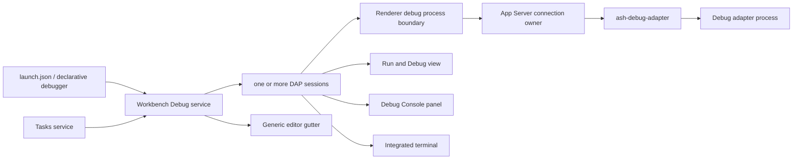

# 调试系统

> 状态：Code 产品已具备通用 DAP 调试平台；SSH Remote Workbench 的 stdio adapter、debuggee Terminal、断点路径和调用栈源码都绑定同一个远端 Environment，编辑器 Workspace 只负责路径与配置呈现；Academic 不组装 Tasks、Testing 或 Debug。后端实现细节由 [`ash-debug-adapter` README](../crates/debug-adapter/README.md) 拥有，Renderer 实现细节由 [Workbench Debug README](../src/ash/workbench/services/debug/README.md) 拥有。

## 快速理解

Code 可以从 `.vscode/launch.json` 启动或附加到一个调试目标，并同时运行多个 DAP 会话。用户可以设置持久化行断点、选择线程和栈帧、递归展开和修改变量、维护 Watch、在调试控制台求值、启用异常断点、读取适配器提供的虚拟源码，以及启动 compound 配置。调试前后的 Tasks 由 Workbench 编排；后端只负责受信任的适配器进程和 DAP framing。

| 使用场景                    | 当前结果                                                                                                                                                                                | 关键边界                                                             |
| --------------------------- | --------------------------------------------------------------------------------------------------------------------------------------------------------------------------------------- | -------------------------------------------------------------------- |
| 启动或附加                  | ✅ `launch`、`attach`、重启、停止和 `runInTerminal`                                                                                                                                     | Workbench 解释配置；后端启动适配器                                   |
| 断点                        | 行断点、函数断点、变量数据断点、指令地址断点、条件和命中次数、日志消息、单独或批量启用/禁用、适配器确认状态、异常断点                                                                   | 条件和日志能力取决于适配器；不支持时显示未验证原因，不下发普通断点   |
| 停住后检查                  | 线程选择、调用栈、作用域、递归变量树和 `sourceReference`；侧栏检查暂停状态时，首个栈帧有可用行列号时定位源码，正在查看反汇编时保留反汇编编辑器；支持 `setVariable` 的适配器允许修改变量 | DAP Session 拥有请求语义；只读或尚未展开的延迟变量不能修改           |
| 反汇编                      | 中央编辑器展示地址、机器码、指令与符号；地址跳转、分页、当前指令、F9 指令断点、源代码导航与指令单步                                                                                     | 需要适配器声明反汇编能力；指令单步另需粒度能力；恢复执行后清空旧指令 |
| Watch 与控制台              | ✅ 持久 Watch；独立 Panel `Debug Console` 提供多会话 DAP 输出、清理和 `evaluate`                                                                                                        | Watch 持久；每窗口控制台历史有界且不进通用 Output                    |
| 多目标调试                  | ✅ 多会话、会话切换、compound 和 `stopAll`                                                                                                                                              | 后端会话仍按连接隔离                                                 |
| SSH Remote 调试             | ✅ adapter 由远端 App Server 启动；`${workspaceFolder}`、断点、调用栈源码和 `runInTerminal` 使用远端路径/Terminal                                                                       | stdio 不需要额外 Tunnel；socket/server adapter 尚未实现              |
| 调试任务                    | ✅ `preLaunchTask`、`postDebugTask`                                                                                                                                                     | Tasks 负责执行和退出状态                                             |
| 适配器发现                  | ✅ 声明式 `contributes.debuggers`，仍可显式写 `debugAdapter`                                                                                                                            | 不执行扩展 JavaScript                                                |
| 完整 VS Code Debug 扩展 API | 非目标                                                                                                                                                                                  | Ash Host RPC v1 不是 VS Code/Node Extension API；兼容层需独立立项    |

## 一次调试如何执行

1. `DebugService` 读取并验证 `.vscode/launch.json`。配置可显式声明适配器命令，也可按 `type` 从声明式扩展注册表解析；compound 只在 Workbench 中展开。
2. 如果存在 `preLaunchTask`，Tasks 必须先返回成功；缺失、歧义、失败或取消都会阻止调试启动。
3. App Server 校验当前 Environment 的目录 Grant、可执行配置与进程执行能力，启动 stdio 适配器，并把会话归属绑定到发起连接。Remote Workbench 的 App Server 位于 SSH host，因此 adapter executable 与 debuggee 都在远端启动，不回落到本机进程。
4. DAP Session 完成 `initialize`、`launch`/`attach`、行断点、异常断点和 `configurationDone`。反向 `runInTerminal` 请求委托给现有 Terminal service；Remote Workspace 下该 service 创建 Remote PTY。DAP 返回的绝对源码路径由 Session 投影为当前编辑器 Workspace 的 URI，View 不自行猜测本机 `file://`。
5. `stopped` 事件驱动线程、栈帧、作用域、变量、Watch 和源码请求。多个会话独立保存运行状态，Run and Debug 侧栏只负责检查；独立 Debug Console Panel 在不可见时也持续捕获 DAP output，并按会话提供 REPL。
6. 适配器退出、用户停止、编辑器 Workspace 切换、目录 Grant 撤销或连接关闭都会回收进程。Workbench 随后运行对应的 `postDebugTask`。

## 所有权边界

| 能力                               | Editor  | Workbench Debug  | Platform / App Server | `ash-debug-adapter` |
| ---------------------------------- | ------- | ---------------- | --------------------- | ------------------- |
| 通用 gutter 槽位                   | ✅ 拥有 | 投影断点         | ❌                    | ❌                  |
| 断点、Watch、会话和 DAP 客户端语义 | ❌      | ✅ 拥有          | 传输                  | ❌                  |
| launch、compound 与 Tasks 编排     | ❌      | ✅ 拥有          | ❌                    | ❌                  |
| `runInTerminal` 产品组合           | ❌      | ✅ 委托 Terminal | 终端传输              | ❌                  |
| Environment 与目录 Grant           | ❌      | 请求             | ✅ 拥有               | 消费能力            |
| 进程、framing、缓冲与回收          | ❌      | 消费             | 连接包装              | ✅ 拥有             |

Editor 不得 import Debug service；它只提供无领域语义的 gutter decoration contract。后端 runtime 不得解析 launch 配置、持久化断点、决定当前线程或拥有 Workbench 会话选择。声明式扩展服务只贡献经过验证的适配器命令元数据；Ash executable Host v1 是另一条逐扩展进程、Plugin + Environment/Grant 与 brokered provider 边界，当前产品接入状态见 [`editor-extensions.md`](editor-extensions.md)。

## 持久性与失败语义

工作区存储保留行断点、函数断点，以及适配器明确允许持久化的数据断点；同时保存启用状态、条件、行断点日志消息、Watch 表达式和按适配器类型划分的异常过滤器。旧版行断点存储迁移到版本 2。不能持久化的数据标识和指令地址只属于创建它们的会话，会话结束即移除。适配器确认状态、调用栈、变量、控制台输出和活跃会话不会持久化。控制台在当前窗口内最多保留 20 个会话、每会话 128,000 字符；会话结束后仍可查看，但不能继续求值。切换工作区时先保存旧状态，再恢复新工作区状态并停止旧会话。

在断点行按 F2 或点击编辑按钮，可修改表达式条件、命中次数条件和日志消息；Enter 保存，Escape 取消。表达式语法由适配器决定，日志消息中的空白和插值内容原样发送。不支持某项能力的适配器不会收到对应断点，侧栏和 gutter 提示未验证原因。单行复选框和分组工具栏分别控制单个或全部断点；每个会话按顺序下发完整的文件断点集合，已经编辑或删除的断点不会被迟到的确认结果覆盖。

断点工具栏可添加函数断点。暂停时，变量行的数据访问按钮通过 `dataBreakpointInfo` 查询可用位置，再选择读取、写入或读写中断；无可用位置时显示适配器说明。调用堆栈工具栏可添加指令断点，带入选中栈帧的 `instructionPointerReference`，允许输入地址和正负字节偏移。三类断点分别使用 `setFunctionBreakpoints`、`setDataBreakpoints` 和 `setInstructionBreakpoints`，不支持的类型或条件会显示原因；所有替换请求按会话排序。

暂停时，在变量行按 F2 或双击可输入新值，Enter 提交，Escape 取消。适配器拒绝修改时保留输入并显示原因；成功后显示适配器返回的值、刷新 Watch，并把焦点还给变量行。继续执行、切换会话或栈帧会结束编辑，旧检查请求和修改请求的迟到结果不能更新当前侧栏。已经发出的修改仍由适配器执行，关闭输入框不会撤销它。

compound 启动中任一配置失败时，已经启动的会话会回滚。自然退出和主动停止都只执行一次 `postDebugTask`。声明式适配器被卸载后，Workbench 会先清空旧 launch 候选再重新解析，避免继续执行已经失效的命令。

## 当前实现与后续演进

当前已实现：已授权 stdio adapter、连接级归属、有界 framing/分页、显式和声明式适配器解析、初始化与请求配对、持久行断点和函数断点、变量数据断点、指令断点、异常断点、线程/栈/递归变量、Watch/`evaluate`、调试控制台、虚拟源码、多会话、compound、restart、Tasks 生命周期、`runInTerminal`、Code-only 组装和断点 gutter。Remote Workbench 复用相同协议让 App Server 在远端启动 adapter，并保持 Workspace 变量、断点、调用栈源码和集成终端都映射到同一个远端 Environment。

仍属于后续扩展：socket/server adapter，跨进程会话恢复，以及 VS Code Debug Extension API 兼容层。Ash Host v1 的 runtime core 已存在，但 production enforcing launcher 和跨层 Debug factory bridge 未完成验证前，不能把声明式适配器发现描述成可执行第三方扩展运行时。
