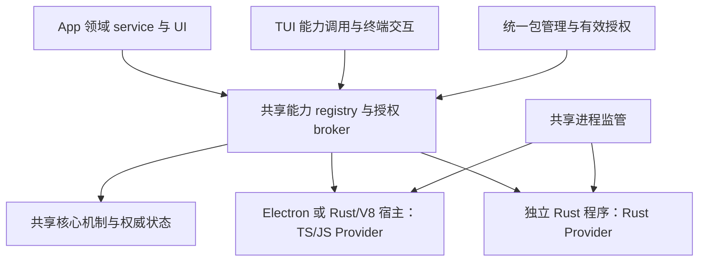
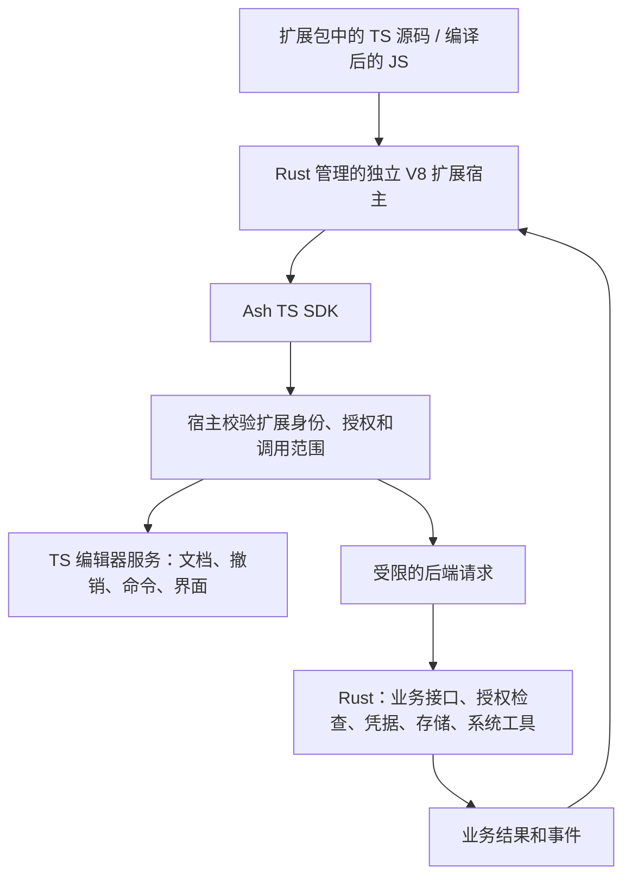
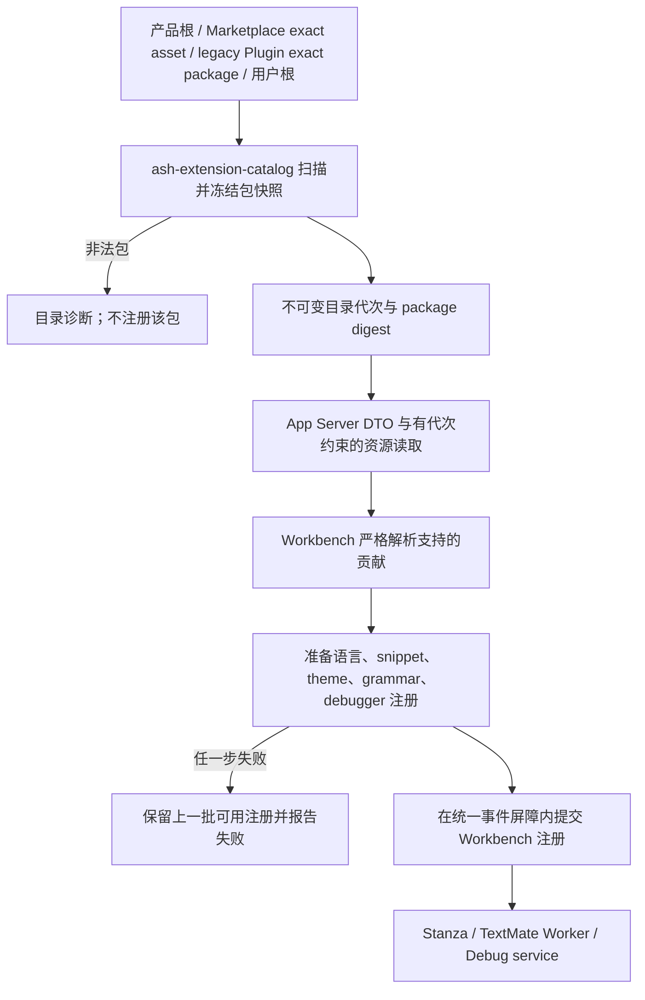
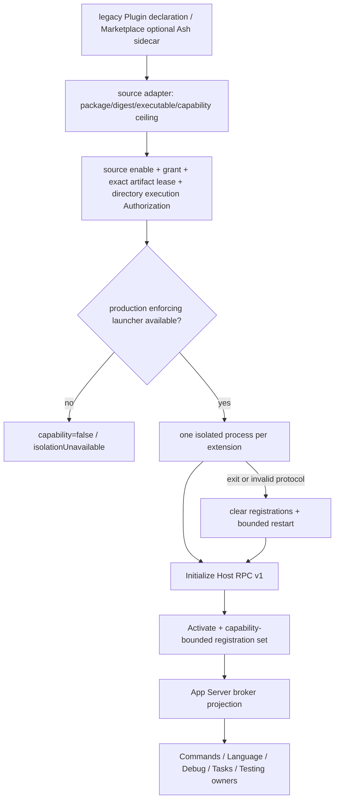

# 扩展架构与编辑器接入

> 本文维护共享核心、TS/JS 扩展、Rust 扩展和客户端的职责边界，以及编辑器接入的当前实现。
> 目标有两类可执行扩展：TS/JS 包在 Desktop 复用 Electron 的运行能力，在共享后端由独立 Rust/V8 宿主执行；Rust 能力由独立 Rust 程序运行。
> 共享后端的目标运行基础是 Rust + V8，不依赖独立 Node。两类扩展复用包管理、授权、注册与进程监管；已有受限 SDK V8 和可信 Worker 不证明完整 VS Code/Node 兼容已经实现。
> 静态包与资源实现见 [`crates/extension-catalog/README.md`](../crates/extension-catalog/README.md)，
> Workbench 接入见 [`src/ash/workbench/services/extensions/README.md`](../src/ash/workbench/services/extensions/README.md)。
> 进程监管与权限门禁继续复用
> [`crates/external-ext/README.md`](../crates/external-ext/README.md)；作者接口见
> [`TS SDK`](../sdk/typescript/README.md)，JS 执行见 [`Rust V8 宿主`](../crates/external-js-ext/README.md)。
> Marketplace 安装由 [`core-plugins.md`](../crates/docs/core-plugins.md) 维护，
> Plugin 来源授权由 [`plugins.md`](plugins.md) 维护。

## 快速理解

Ash 的共享核心服务 App、TUI 与其他客户端，拥有 Agent 执行、权威状态、权限裁决和通用资源机制。服务商认证、托管平台 API 和特定产品工作流由可选扩展提供；实现需要 Rust、后台执行或跨窗口存活，都不能单独成为进入核心的理由。

TS/JS 扩展沿用 Open VSX 包与 VS Code API，运行时职责按第 0.1 节分配给 Electron、Rust 和 V8。Rust 扩展承接从核心拆出的可选后端能力，运行编译后的独立程序，不需要 Node、V8 或 JS 包装。App 和 TUI 经公开能力契约按需使用同一个 Provider；客户端只选择和呈现能力，不复制其业务状态。编辑器文档、未保存文本和撤销仍由 TS 编辑器服务拥有。

下面第 0 节是目标架构，其余实现记录不表示迁移已经完成。Open VSX 来源已接入；包能否运行仍取决于实际入口、API、平台与授权。Rust SDK 与产品 launcher 已用于独立 GitHub 认证试点；通用第三方 Rust 包安装、隔离与其余服务商能力迁移尚未完成。

当前代码同时存在声明式目录、可信浏览器 Worker 和 Rust 可执行扩展 Host。声明式目录只读取
`package.json` 与资源；内置 Markdown 预览已经走浏览器 Worker。现有 `ash-external-ext-sdk` 的注册、typed DataChannels、scoped Services 与 stdio runtime 已被 Rust 认证试点复用，继续作为 Rust 作者接口建设；旧命令/Hover 示例本身不证明其他业务契约已完成。TS SDK v1 与 Rust V8 宿主已实现命令、悬停 Provider、文档快照、
授权磁盘读取、通知、Quick Pick 和停用释放；本地包安装、启用、授权和 macOS、64 位 Windows JS 系统隔离已接入。目标是建设统一的 VS Code/Node API 兼容层，由 Electron、Rust 和 V8 按执行位置承担职责；当前真实 Node 与受限 V8/Worker 路径仍需迁移，不能直接删除已有行为和权限保障。
Open VSX 已接入现有 Rust 包管理。VSIX 安装先加载受支持的声明式贡献；用户另外启用并授权后，标准包由产品 Node Host 执行，兼容范围取决于所用 VS Code API。Node 路径支持 macOS、Linux 和 64 位 Windows；本轮验证平台是 macOS。
现有 Host RPC v1 的细节在下文作为当前实现记录保留；可以复用其监管与取消机制，但窄编辑器契约不能代替 Rust 能力扩展的完整业务契约。

这里的声明式 `Extension` 是领域 consumer，不是独立 Marketplace 或 package family；当前远端
Theme/Language package 通过 typed adapter 进入它；Theme 的 portable manifest 由 host 规范化为声明式
manifest，同时 package 原始 bytes/digest 保持不变。通用 `asset` 不会被自动解释为编辑器扩展。

| 用户或产品场景                                          | 当前行为                                                                                                              | 明确不会发生                                                   |
| ------------------------------------------------------- | --------------------------------------------------------------------------------------------------------------------- | -------------------------------------------------------------- |
| 打开受支持的源码文件                                    | 使用内置声明式扩展提供的语言关联、配置、grammar 和 snippet                                                            | 不下载扩展，不执行 manifest 中的脚本                           |
| 打开 Markdown 预览                                      | 内置浏览器扩展注册命令、菜单和文本预览，源码与预览共享未保存内容                                                      | 不把 Markdown 渲染器放进工作台编辑器实现                       |
| 主机配置静态用户扩展目录                                | 扫描该目录的直接子包，非法包产生诊断                                                                                  | Workspace 或 Renderer 不能提交任意扩展根                       |
| Marketplace Theme / Language                            | Manager 验证同一 package 后，将声明式 assets 投影进共享 Extension catalog                                             | 不建立 `extension-marketplace`，不执行静态资源                 |
| Open VSX 编辑器扩展                                     | 搜索、验证并安装精确版本；声明式贡献直接加载，受支持的 JS 在分别启用和授权后执行                                      | 安装不授权脚本，不把下载校验和当成 Ash TUF 签名                |
| Legacy Plugin 声明 `declarativeExtensions[]`            | 仅 effective exact package 的静态目录进入 catalog                                                                     | 本地兼容来源不成为远端 Marketplace 旁路                        |
| 用户静态包与内置包使用同一扩展 ID                       | 内置包优先，用户包被报告为重复项                                                                                      | 可变用户文件不能静默替换产品资源                               |
| Plugin 声明 Editor Extension                            | 显式声明 `runtime: javascript` 或 `hostRpc`；校验入口、API 版本和能力；只有独立 RPC 程序需要 exact process permission | 安装或 manifest 校验本身不会启动进程                           |
| Marketplace package 带可选 `ash/editor-extensions.json` | 产品 adapter 绑定同 package 的 exact executable；独立 admission 与 Manager lease 都通过后才进入 Host                  | sidecar 不成为通用 Marketplace 必需 manifest；安装不自动 grant |
| 已授权可执行扩展启动                                    | Runtime core 创建受监督进程，完成版本握手和整批 registration validation；标准 Node 包继承开发环境                     | 不把扩展加载进 App Server，不传递产品内部认证变量              |
| 可执行扩展崩溃                                          | 清除旧 incarnation 注册，按有界预算重新握手和激活；超限进入 crash loop                                                | 不无限重启，不把旧请求重绑定到新进程                           |
| 调用超时或取消后没有 terminal response                  | 结果标为 unknown outcome，终止旧 incarnation 后恢复                                                                   | 不声称副作用没有发生                                           |
| 需要 VS Code Extension API                              | 真实 Node 宿主提供已实现的命令、语言、Tasks/Debug、配置和工作区 API 子集                                              | 包可安装不代表全部 API 可用；完整兼容仍需真实扩展验证          |
| 本地 SDK JS 包                                          | 工作区相对路径安装；分别启用、授权后，macOS 或 64 位 Windows 产品宿主执行                                             | 不自动授权，也不放宽独立可执行扩展的限制                       |
| 生产平台不支持 SDK 所需隔离                             | SDK V8 包运行失败并报告 isolation unavailable；Node 包按单独的精确包执行授权运行                                      | 不把 Node 的用户级 IO 声称为 SDK 系统沙箱                      |

当前声明式装载链已接入 App Server 与 Workbench。Legacy Plugin 与 Marketplace executable source 都会
先规范化为 Host deployment，Host runtime 不解析任何 package manifest。App Server broker 以及
Workbench 的 Commands/Language/Tasks/task-backed Testing、数据通道和链接展示接入已实现。产品 launcher 分别选择受限 V8 与真实 Node。
SDK V8 的第三方系统隔离在 macOS 与 64 位 Windows 实现；标准 Node 包需单独的精确包执行授权。独立可执行扩展仍要求整个进程的系统硬限制，目前产品 launcher 拒绝启动它们。
后续章节说明这些流程、所有权、信任与失败边界、完成度及演进。

Web 和 Electron 的工作台共用可信浏览器扩展入口：`build/resources/extensions.ts` 将内置包及显式配置的
`ASH_WEB_EXTENSION_PATHS` 冻结为 Browser catalog 和资源快照。`platform/extensions/browser/extensionApi.ts`
提供目录与 `IExtensionResourceLoaderService` 资源契约；`platform/extensionHost/browser/extensionHostApi.ts` 持有每个可执行包的 Worker，
`extensionHostWorker.ts` 在 Worker 内导入 package 的单文件 ESM `browser` 入口。
Markdown 从公共 `@ash/extension/browser` 导入 `defineBrowserExtension`、命令、语言 Provider 和文本自定义编辑器接口；
SDK adapter 封装私有 Worker 消息，并复用共享 SDK 的注册、调用、取消和停用 owner。
作者回调通过具名文档、配置、目录和命令服务消费发起窗口的状态，不发送任意协议请求或导入产品内部模块。
语言位置统一使用 SDK 的零起始 UTF-16 `line`/`character`，adapter 转换为宿主格式。
激活入口协商 SDK API 版本并由宿主绑定扩展身份。注册与调用仍使用 Ash 的有界扩展契约，不提供完整的 `vscode` 模块或 Node API。
Worker 持有调用的取消信号；到达截止时间后终止 Worker 并撤销该 incarnation 的注册。
刷新、替换和关闭页面释放 Worker 与入口 Blob URL。Vite 监听开发包文件并重新生成快照、刷新页面。
依赖编译进入浏览器资源，后端内置包目录不复制 `node_modules`。
该路径仅执行内置或开发者显式指定的可信资源，不属于 Marketplace 执行许可或生产第三方隔离路径。
Worker 无法访问 Workbench DOM，但仍是同源代码，不宣称具备生产 launcher 的 hard limits。

离线窗口仍加载打包目录中的语言声明和主题，因此 Markdown 动作不依赖后端连接。
工作台组合入口同时持有浏览器 Worker 与 App Server 可执行扩展的注册快照；同一扩展 ID 只能由一个
运行宿主持有。`MainThreadExtensionApi` 把扩展命令和编辑器菜单接入工作台，
`MainThreadCustomEditors` 注册文本自定义编辑器。内置 `extensions/markdown-language-features`
使用 `vscode-markdown-languageservice` 提供路径和标题补全、定义、引用、标题与链接重命名、
文档及工作区符号、折叠、链接、悬停、快速修复、链接诊断、扩大选择和引用高亮。
每次请求固定文档快照，打开的未保存文档先于磁盘内容；跨文件编辑附带原文，由编辑器批量编辑服务检查冲突。
Workspace edit 的 `entries` 按顺序执行：`kind: textDocument` 带 `resource`、`expectedText` 和 `edits`；
`kind: rename` 带 `source`、`target` 和 `existing`。链接路径重命名将文件改名和引用修改交给同一批量编辑事务，
预览确认后才执行，目标冲突与撤销由该服务处理。
文档扫描只使用文件服务可访问的工作区目录；后端未连接时，仅扫描本地浏览器已授权的目录。
补全触发字符属于语言 Provider 注册契约。取消和扩展退出会终止对应请求。

该扩展还提供 Markdown 预览及富文本编辑器，使用 `@vscode/markdown-editor` 以 Markdown 源码驱动排版。
工作台通用 `WebviewEditor` 承载这些视图，`CustomTextEditorModel` 引用源码的共享文本模型。
预览用源文档 URI 作为资源基址；相对图片、样式、字体和模块路径通过隔离 Webview 的资源通道加载。
允许读取的目录是当前工作区与源文档目录，实际读取还必须满足已有文件服务的授权。
切换文档和关闭视图后，旧请求不会向新页面发送结果。
富文本视图只保留当前显示内容，编辑必须带上共享模型的版本；撤销、重做、保存和关闭确认均由同一文档状态决定。
版本冲突保留视图中的草稿，并提供重新载入操作。库资源由 Worker 创建、工作台在沙箱内加载，
不占用文档编辑消息的 JSON 限额；SDK 资源句柄可显式释放，Worker 退出时宿主释放剩余 URL。
“打开富文本编辑器”（`markdown.showRichEditor`）保留源码标签；“重新打开为富文本”替换当前视图。
源码、预览与富文本标签可以同时打开。此入口没有扩大第三方扩展的生产执行许可。

## 0. 确定的产品方向

### 0.0 共享核心与两类扩展

核心保留客户端共用的机制与执行契约，具体可选能力留在扩展。TUI 当前不需要 GitHub 浏览器登录，因此不默认加载该扩展；以后有真实消费者时，可以启用同一个 Provider 并提供终端交互。App 预装一个扩展只改变产品默认选择，不使它成为核心依赖。

| 层                     | 拥有                                                                                                      | 不承担                                                  |
| ---------------------- | --------------------------------------------------------------------------------------------------------- | ------------------------------------------------------- |
| 共享核心与通用后端服务 | Agent/Thread/Turn 状态、模型调用与工具执行契约、最终权限裁决、通用存储与 SecretStore、HTTP/进程等资源机制 | GitHub OAuth、Enterprise 规则、PR/Issue API、App 界面   |
| 扩展基础设施           | 包来源与精确版本、安装/启用/授权、Provider registry、能力协商、调用身份、进程监管与恢复                   | 服务商业务、账号有效性判断、编辑器对象                  |
| TS/JS 扩展             | Electron 或 Rust/V8 宿主中的激活与回调、VS Code 兼容 Provider、编辑器贡献、扩展自己的业务和流程           | 核心状态副本、产品内部认证、Workbench DOM/Electron 对象 |
| Rust 扩展              | 独立 Rust 程序中的可选后端 Provider、服务商协议与认证、业务状态和后台任务                                 | Node/V8 依赖、核心最终授权、UI 和编辑器模型             |
| App / TUI 客户端       | 默认扩展选择、能力发现、输入输出和交互适配；App 的编辑器与账号选择界面                                    | Provider 的第二份账号、令牌刷新或业务执行状态           |

TS/JS 与 Rust 是执行形态，不限定业务种类。认证 Provider 可以用任一种语言实现；需要 App 和 TUI 共用的能力也可以是扩展。Rust 包使用 Ash 已有包管理与来源 adapter，不借 Open VSX 的 VSIX 格式伪装成 JS 扩展。一个 Plugin bundle 可以携带两类能力，其启用与授权仍分别检查。



App Server 提供 typed dispatch、能力发现和调用路由，不链接每个扩展的业务实现。扩展协议必须固定 Provider 身份、契约版本、请求/响应/事件、结构化错误、取消、截止时间与资源释放；传输 DTO 不进入客户端领域 contract。两类运行时在相同语义的操作上使用同一契约，不开放任意 method 注册或通用后端调用。

Provider 注册绑定精确包、能力 ID 与声明的 scope；同一能力与 scope 的实现选择由有效授权和明确的产品/用户选择决定，重复注册报告冲突，不能靠启动顺序抢占。按能力请求激活，未安装、未授权、契约不兼容或平台不支持时返回明确的能力不可用结果；客户端可以展示安装/启用入口，核心基础任务继续可用，不静默启动另一份内置实现。

每个能力的业务状态只有一个 Provider owner，持久数据通过其隔离命名空间保存；核心存储只拥有安全读写。Provider scope 按真实状态需求选择 profile、Environment 或 workspace，UI 请求另外绑定发起客户端。共享认证 Provider 可以跨 App 窗口存活；窗口关闭取消该窗口的交互和调用，最后订阅退出后由 scope owner 按已声明的后台策略停止或保留任务。不能让 TUI 的存在自动维持 App 登录流程。

停用、撤权和更新先使旧 registration 与调用身份失效，再取消任务、释放订阅并结束旧运行实例。重启重新注册，旧响应不能发布到新实例；写入结果无法确认时保留结果不确定语义，不自动重放。停用扩展与登出账号是不同动作：前者停止使用能力，后者由认证 Provider 撤销会话并按其规则清理凭据。

### 0.1 两类目标运行时与现有兼容路径

| 扩展形态   | 目标运行时与来源                                                                            | 作者与消费者边界                                                      |
| ---------- | ------------------------------------------------------------------------------------------- | --------------------------------------------------------------------- |
| TS/JS 扩展 | Desktop 复用 Electron；共享后端使用独立 Rust/V8 宿主；Open VSX / VS Code 兼容包或产品预装包 | 公共 TS API 与统一兼容层；业务可在扩展内实现，也可消费已授权 Provider |
| Rust 扩展  | 独立 Rust executable；Ash 包来源或产品预装包                                                | 公共能力 SDK/协议；App、TUI 按能力消费，不链接扩展实现 crate          |

#### 运行时职责与兼容契约

共享后端保留 Rust + V8，目标移除独立 Node 的启动与随包依赖。Code Mode 继续在独立 Rust Host 中嵌入 V8，支持 App、远程和 TUI 在执行主机上运行代码，不依赖 Electron 或 Node；TUI 不通过启动 Desktop 来取得 JS 执行能力。扩展宿主与 Code Mode 可以共用引擎版本和初始化设施，但分别拥有执行状态、权限和生命周期，不共享运行实例。

| 职责                                                   | Desktop                                                             | 远程 / TUI 后端                                      |
| ------------------------------------------------------ | ------------------------------------------------------------------- | ---------------------------------------------------- |
| 扩展的 JS 求值、回调与微任务执行                       | 复用 Electron 内的 V8，扩展使用独立运行环境                         | 独立 Rust Host 中的 rusty_v8                         |
| 文件、网络与子进程等系统机制                           | 兼容层按执行位置接入 Electron 或 Rust 的已有机制                    | 执行主机上的 Rust 机制                               |
| 窗口与桌面系统交互                                     | Electron 产品宿主，通过公开且受授权的接口提供；扩展不进入产品主进程 | 向发起客户端请求其已支持的交互，不假定 Electron 存在 |
| 秘密安全存取、共享资源监管与最终授权                   | Rust owner；具体服务商业务仍归扩展 Provider                         | Rust owner；具体服务商业务仍归扩展 Provider          |
| VS Code 编辑器 API、文档模型与 UI 对象                 | 现有 TS 编辑器与 Workbench owner，兼容层机械转换调用                | 按能力契约路由到客户端；TUI 不建立第二份编辑器模型   |
| 模块加载、Buffer、事件、Stream、定时器及 Node API 行为 | 统一兼容契约，复用 Electron 的适用运行能力                          | JS facade 和 Rust 机制实现适用契约                   |

这里按职责分配，不按扩展是否导入 `node:*` 简单切换宿主：Node 承担的系统机制可由 Rust 实现，但 JS 对象、模块加载和事件行为仍由运行时兼容层提供。V8 负责执行 JS，不能单独代替 Node API。Desktop 复用 Electron 不表示 Code Mode 转入 Electron；Code Mode 在各客户端继续使用独立 Rust/V8 宿主，App Server 调度执行而不链接 V8 引擎。

兼容建设以公开 VS Code 扩展 API 和相关 Node 运行时契约为依据，不为每个扩展维护特判或要求扩展改写成 Ash 专用 API。Rust 能执行底层 IO 不等于已经兼容 Node 的对象、同步/异步返回、事件顺序、错误和资源生命周期；兼容层必须实现这些行为并覆盖依赖模块加载。未实现的 API 或二进制模块能力应明确报告不支持，不能用空实现声称兼容。

能力按扩展声明与工作区的执行位置路由。远程工作区的文件、网络和子进程由远端 Rust owner 执行，不能借本机 Electron 改成操作本机资源；桌面交互回到发起客户端。纯 Web、远端与无 Desktop 的 TUI 不假定 Electron 存在。

这是目标决策，当前标准包仍使用真实 Node，V8 路径仍是窄 SDK。迁移需同步公开契约、调用方、授权、取消、释放、宿主选择、包清单和恢复逻辑；以契约测试、真实扩展调用和 App/远程/TUI 验证确认行为后，才移除现有 Node 路径。语言服务器、调试器或其他外部工具自身需要 Node 时，属于该工具的执行依赖，不能因此把独立 Node 重新设为共享后端的必需运行时。

Rust 扩展的边界是独立程序与版本化协议，不建立稳定 Rust dynamic-library ABI，也不把第三方 crate 链入共享核心。作者 SDK 应封装注册、调用、取消与释放，不能要求作者操作 App Server 私有协议。系统隔离和资源限额由对应 launcher 执行；Rust 语言本身不提供沙箱。

#### 共享接入与语言适配的 crate 边界

产品继续支持 TS/JS 和 Rust 两类扩展，采用一个外部扩展接入体系，共享能力协商、调用身份、激活、取消、撤权与恢复语义；TS/JS 兼容实现与 Rust 作者 SDK 分开。`external` 表示扩展在共享核心之外执行，包含产品预装、本地与市场来源，不表示仅支持第三方或远程扩展。共享接入不要求两类扩展使用同一个引擎、作者 API 或包格式，也不要求 Rust 扩展包装成 JS。

当前 `sdk/rust`（`ash-external-ext-sdk`）是 Rust 作者 SDK，已有 `Extension`、typed DataChannels、scoped Services 和 stdio runtime，并被 GitHub 认证扩展使用；它不是产品侧的扩展管理中心。保留这个依赖方向，不把 VS Code/Node 兼容、V8、安装 authority 或 App Server 组合放进作者 SDK。

运行 crate 与作者 SDK 已按下表重命名和搬迁，Cargo package 沿用产品 `ash-` 前缀。本次仅迁移目录、包名、可执行文件名及其消费者与构建引用；VS Code/Node 兼容改造、App Server 运行管理提取和来源解耦仍是后续工作。

| 当前目录 / 包名 | 职责 |
| --- | --- |
| `crates/external-ext` / `ash-external-ext` | 共用启动门禁、进程监管、取消、释放和有界恢复；产品组合与 fleet 仍在 App Server，后续按接入与路由职责提取，不复制领域业务或语言 API |
| `crates/external-js-ext` / `ash-external-js-ext` | TS/JS 激活、模块与依赖加载、VS Code/Node API 兼容；当前仍保留真实 Node 与窄 SDK V8 路径，Electron 侧实现仍按前端平台职责放在 `src/` |
| `crates/external-ext-protocol` / `ash-external-ext-protocol` | 扩展进程通信的版本化生命周期、调用身份、错误与取消；业务请求/响应保留 typed 领域契约 |
| `sdk/typescript` / `@ash/extension` | TS/JS 作者使用的公共声明、API 包装与注册/释放接口 |
| `sdk/rust` / `ash-external-ext-sdk` | Rust 作者注册、typed capability 调用、回调与 stdio runtime；不依赖产品宿主或 V8 |

`host` 不必出现在 crate 名中；具体类型只有确实表达承载扩展的执行环境时才使用它。Rust 扩展运行自己的 executable，由共享接入层监管，不另建 `external-rs-ext` 执行器。`ash-extension-catalog` 保持静态目录快照和资源读取职责；`ash-v8-runtime` 保持引擎初始化设施职责，不承担扩展管理、Node API 或 Code Mode/扩展的执行状态。

协议独立保留，不并入根 `ash-protocol`。扩展进程通信有自身消费者、版本协商和生命周期，Rust SDK、监管器与 JS 执行程序共同依赖这个轻量契约；根 `ash-protocol` 继续维护 Thread、Turn 等共享领域事实。通用 ID 按真实共享需求复用，不复制类型，也不让作者 SDK 为扩展通信而依赖整套产品协议。重命名本身不改变 wire 格式或版本；接口变化另按兼容与能力协商规则处理。

外部扩展运行体系独立于 Plugin bundle。内置、本地、Open VSX 和 Plugin 来源在产品组合层通过 adapter 提供已验证的精确包、入口、来源租约与有效授权；运行层不解释 Plugin manifest，不直接依赖 `ash-core-plugins`。Plugin bundle 可以携带扩展，但不是运行扩展的必要条件。当前 `core-plugins` 已拥有的包存储、安装状态和来源授权继续由它维护，本次决策不修改该 crate，也不把同一包的状态复制到扩展运行层；后续迁移只在消费者与来源适配边界落实解耦。

产品组合继续由 App Server 与各客户端宿主完成：从来源 adapter 取得有效包与授权，按声明的 scope 和执行位置选定 launcher，完成激活后发布能力注册，再通过领域契约调用；停用、撤权和更新按第 0.0 节使旧身份失效并释放实例。运行状态与恢复由 supervisor 拥有，包状态归对应来源的安装 authority，业务状态归 Provider；不新增同时复制这些状态的统一 `Extensions` 对象。前端编辑器注册仍由已有 TS owner 接入。

#### 根目录 SDK 与运行时实现

根目录采用 `sdk/typescript` 与 `sdk/rust` 组织两种语言的作者接口，不采用 `typescript-runtime` 或 `rust-runtime` 命名。SDK 可以封装通信、取消与公共对象的生命周期；V8 引擎、进程监管、Node API 模拟、模块解析和产品授权留在运行时 owner。面向作者的 JS 包装可以在 TypeScript SDK 中维护，产品提供的 `vscode`/Node 兼容实现属于 `external-js-ext` 与桌面兼容层。现成 VS Code 扩展沿用公开 API，不要求改写为 `@ash/extension`。

```text
sdk/
  typescript/                 # TS/JS 作者接口
  rust/                       # Rust 作者 SDK
crates/
  external-ext/               # 产品侧接入与监管
  external-js-ext/            # Rust/V8 JS 执行与运行时兼容
  external-ext-protocol/      # 独立扩展进程通信契约
```

上述目录已迁移。Rust SDK 仍属于根 Cargo workspace；目录移出 `crates/` 不改变依赖与构建约束。Cargo/Bazel、JS 包路径、构建与打包清单、消费者、示例、测试和文档链接已同步使用新名称；通信格式与现有授权、取消和恢复行为保持原契约。确有多个执行宿主需要复用同一兼容实现时再提取完整的兼容库，不为命名创建空壳；Rust 作者 SDK 不因此依赖 JS 运行时。

#### 现有 TS SDK 与 Rust V8 扩展宿主

以下记录已有 SDK V8 行为，供统一兼容层建设与迁移核对；Rust 能力扩展不使用此路径。已有可信浏览器 Worker 同样只记录其当前边界。纯 Web 页面不能直接启动产品 Rust/V8 宿主或 Rust 程序，需要已授权后端；无后端时只使用支持的声明式资源与现有可信浏览器贡献，不宣称拥有后端扩展运行能力。

图片、音频和视频预览由内置 `extensions/media-preview` 包声明文件匹配规则和编辑器名称，
Rust catalog 与离线 Browser catalog 都收录同一个包。声明只选择产品已注册的 TS 编辑器实现，
不执行扩展脚本。图片保留现有缩放与元数据界面；音频和视频使用浏览器媒体控件，
通过文件服务读取内容，切换离开时暂停，关闭时停止播放并释放文件 URL。编解码支持取决于
当前浏览器或 Electron。媒体预览不建立文本模型，也不接入尚未支持自定义编辑器的 V8 SDK。



当前 V8 路径中，Rust 拥有包安装、授权记录、扩展宿主进程和 V8 执行调度；入口、回调和 Provider 是 JS。这不代表 Rust 能力扩展必须使用 JS。编辑器对象、未保存文本、撤销和 UI 状态继续由 TS 管理，业务 App Server 不链接 V8。
Code Mode 和扩展宿主复用引擎初始化实现与锁定版本，分别管理执行状态和权限，不共享扩展或工具身份。

SDK 是作者的公共入口；协议是宿主内部的调用约定，不要求作者自己发送请求。接口覆盖必须包含
实际调用、错误、取消和释放，不能只有同名声明。直接依赖 Node 的标准扩展走真实 Node Host；
现有 Ash SDK 仍使用受限 V8 执行，协议不会把 JS 变成 Rust。现有后台操作通过 SDK 请求已接入的共享 Rust 服务；目标能力接口还可消费已授权 Rust Provider，
是否降低内存或加快启动需由真实扩展测量，不能由实现语言推定。

| 能力                                               | 当前 V8 路径 owner             | 扩展使用方式                                           |
| -------------------------------------------------- | ------------------------------ | ------------------------------------------------------ |
| 扩展入口、激活、回调、注册释放                     | TS SDK 与独立 Rust V8 扩展宿主 | 编写 TS，运行编译后的 JS                               |
| 扩展自己的流程、数据整理、业务特有 Provider        | TS 扩展包                      | 组合公开 API，保留在扩展内部                           |
| 文档模型、未保存文本、撤销、选区、编辑器和界面组件 | TS Editor / Workbench 服务     | 宿主校验后，通过 SDK 请求或贡献 Provider               |
| Git、数据库、凭据、受授权的远端请求与系统工具      | 已接入的 Rust 服务             | SDK 请求明确操作；目标按通用机制与可选 Provider 再分工 |
| 安装、包完整性、启用和授权记录                     | Rust 包管理与授权服务          | 安装和授权是独立动作，宿主只取得当前有效授权           |
| 扩展请求身份和范围                                 | 可信宿主与 Rust 授权服务       | 宿主绑定身份，Rust 每次执行前复核授权                  |

SDK 提供语义明确的 API，不公开任意 App Server 方法、原始 IPC、后端连接或通用系统执行入口。
Rust V8 宿主通过共享扩展协议请求 App Server；编辑器与 UI 操作由 App Server 回到发起调用的 TS 客户端。
Workbench 消费前端领域类型，后台文件读取不会转发到 Renderer。

SDK v1 的实际入口是 `@ash/extension`。作者导出 `activate(context)`，在激活阶段注册命令并把
Disposable 放入 `context.subscriptions`；每个命令收到独立的调用上下文。`workspace.openTextDocument`
读取 TS 的当前文档与版本，`workspace.readTextFile` 由 Rust 文件服务读取工作区相对路径，限制为
256 KiB UTF-8。文件读取必须同时满足 Plugin 的 `directory: read` 声明与当前目录的 `ReadFiles` 授权；
工作区切换不会把在途请求转到另一个文件服务。撤销目录授权后读请求失败。

包中用 `runtime: javascript` 明确选择产品打包的 `ash-external-js-ext`，入口为 `.js` 或 `.mjs` ESM。
相对模块只能来自包快照，`@ash/extension` 由宿主提供；不支持 Node、CommonJS 或动态导入。
激活阶段只完成本地初始化和命令注册，模块顶层初始化必须完成后再激活。注册的 dispose 立即撤销回调，
对外注册快照在停用或重启时整体更新。`deactivate` 即使失败仍释放 subscriptions；异步停用不能等待外部服务。
SDK 的 `ExtensionError.code` 保留 Rust 服务的错误分类。

`languages.registerHoverProvider` 已接入现有 TS 语言服务。manifest 需声明 `languageProvider`；回调取得
当前编辑器的不可变文本、版本和从 0 开始的 UTF-16 坐标，可返回文本、代码块和可选范围。
未保存内容来自当前编辑器，不重新读盘；SDK 校验语言选择器、坐标和范围，TS 编辑器负责展示与无障碍交互。
`languages.registerCompletionProvider` 使用同一份快照和坐标，支持触发字符、未完成列表刷新、普通文本和 snippet 插入。
`workspace.registerTextDocumentEvents` 在激活后发送现有模型的打开事件，随后顺序发送打开、修改、关闭事件；
语言变化先关闭旧语言再打开新语言。事件回调可以等待调用内服务；单订阅最多保留 64 个待处理事件，超限停止订阅并报告错误，不跳过修改。
`call.languages.setDiagnostics` 替换当前扩展运行实例的命名诊断集合，空数组清除；带过期文档版本的替换不会覆盖新结果。
停用、重启和断开连接清除实例持有的标记。单集合最多 1,024 个资源、10,000 条诊断，单扩展最多 128 个集合。
Provider、事件与命令共用调用身份、受限服务、取消和释放规则；其他语言 Provider 的作者接口尚未开放。

宿主将纯 JS 执行和 Promise 续执行纳入截止时间；取消会退役整个扩展运行实例，在途调用不会重放到新进程。
macOS 产品宿主先读取包快照并初始化 V8，再通过 Seatbelt 禁止直接文件访问、网络和创建子进程，随后才处理握手和执行扩展。
64 位 Windows 使用无网络能力的 AppContainer、每次启动独立的限制 SID 和单进程 Job。初始线程仅在可信准备阶段能读取扩展包；执行 JS 前释放该权限，已有与后续工作线程均使用受限主令牌。无需管理员权限或账户安装；终止后移除该次启动的包读取授权和 AppContainer 配置。宿主错误通过退出码交给监管器，不弹系统错误窗口。
本机已验证 Windows x64 的真实 V8 执行、VS Code 文档事件/诊断/补全、内存预算、超时恢复及文件/TCP/UDP/进程隔离；macOS 和 Windows ARM64 未在本轮运行。
每个运行实例有 64 MiB V8 堆预算与独立的 64 MiB 堆外 ArrayBuffer 预算；极小 TypedArray 的内联存储计入 JS 堆。
堆超额会终止执行，V8 可取得最多 4 MiB 的结束执行余量；堆外缓冲区累计超额立即结束扩展进程。它们不是整个进程的系统内存上限。
共享、可调整大小的缓冲区和 WebAssembly 不开放，因为其分配绕过该 ArrayBuffer 接口。独立可执行扩展的原有系统硬限制不变。
其他系统目前拒绝产品 JS 执行；Open VSX 下载包不会自动选用此入口。

作者可运行 `pnpm --dir sdk/typescript build:example`，得到 `.build/sdk/typescript/` 下的 JS 与 Plugin manifest。
真实子进程测试覆盖 SDK→前端文档调用、SDK→Rust 磁盘读取、错误、取消、新运行实例和停用释放；
当前不是完整 VS Code API，也尚未向公共 npm registry 发布 SDK。

### 0.2 GitHub 的具体分工

`github-authentication` 提供 GitHub.com 与 Enterprise 认证 Provider。VS Code 的对应扩展通过 `registerAuthenticationProvider` 注册实现，说明认证机制与具体服务商可以分离。它是设计参照，不表示 Ash 当前已支持该包的完整 API，也不表示该内置包可从 Open VSX 直接获取。

| 职责                                                                                             | 目标 owner                                                                 |
| ------------------------------------------------------------------------------------------------ | -------------------------------------------------------------------------- |
| Provider 注册、发现、能力版本、调用与停用                                                        | 核心扩展基础设施                                                           |
| 哪个扩展可访问哪个账号与 scope；最终授权与审计                                                   | 核心权限服务；App 呈现授权交互                                             |
| 秘密加密存储、扩展命名空间与访问控制                                                             | 通用 SecretStore 与宿主服务                                                |
| GitHub OAuth/设备码策略、scope 解释、Enterprise issuer、身份校验、令牌交换/刷新/撤销、会话有效性 | GitHub 认证扩展；TS/JS 或 Rust 实现二选一                                  |
| PR/Issue 查询、分页、限流、Review 与合并语义                                                     | GitHub API 能力扩展，消费认证 Provider                                     |
| 账号选择、浏览器打开/回调接入、列表、评论输入、文件和 Diff                                       | App 的通用 UI/编辑器服务与 TS 扩展贡献；TUI 有需求时提供自己的交互 adapter |
| 本地 Git、文件事务、进程与通用 HTTP                                                              | 相应共享服务；不依赖 GitHub 登录扩展                                       |

认证 Provider 拥有会话权威状态；SecretStore 只保存凭据，broker 只保存 Provider registration 与消费者授权，不建立第二份会话或刷新任务。登录请求从客户端到认证 broker，经有效授权调用 Provider；Provider 使用公开浏览器/回调和秘密存储接口完成认证并发布会话变化。GitHub API Provider 经同一访问控制取得所需授权，客户端显示账号描述与结果。

默认的 Ash 能力契约使用不透明会话/凭据引用，消费方请求受限操作；认证 Provider 在获准范围内可以读取自身令牌，否则无法完成交换和刷新。VS Code 兼容 `AuthenticationSession.accessToken` 属于另一个明确契约：只有经账号、scope 和精确扩展授权的调用方可取得 token，不能用不透明引用冒充兼容，也不能暴露产品内部认证。该兼容桥尚未完成。

复用现有生态时，TS `github-authentication` 通过公开兼容层在所选宿主运行；当前标准包的 Node 路径仍需迁移。从现有 Rust GitHub 后端拆出时，可以提供纯 Rust 认证扩展，再由 TS 桥注册相同 Provider，桥本身不拥有会话。两种方式是可选实现，同一 Provider 身份只允许一个有效 owner；不能同时启动两套登录、存储和刷新逻辑。

多窗口共享认证需要一个 profile-scoped Provider 实例；TS/JS 实现也必须把交互路由到发起客户端。当前标准 Node 包仍按窗口启动，这项共享 scope 尚需补齐，不能直接启动每窗口认证实现并声称已有唯一共享会话。会话变化带版本并通知已授权消费者；账号切换、登出或撤权使旧读取与缓存失效，迟到结果不得恢复旧账号。已向兼容扩展交付的 token 不会因 broker 撤权自动消失，须按 Provider 的远端撤销规则处理，不能承诺撤权回滚已完成的外部操作。

App 可预装并按认证请求激活 GitHub 扩展；TUI 默认不加载、不提示 GitHub 登录，也不启动 Node。如果以后 TUI 的 GitHub API 工具需要认证，再显式启用同一能力并协商设备码或终端交互。模型账号登录、Git SSH/HTTPS 凭据和 GitHub API 登录保持各自身份与契约，不能因这个例子把 TUI 必需的认证机制移除。

仓库已经有 [`IGitHubService`](../src/ash/platform/github/common/githubService.ts) 和
[`AppServerGitHubService`](../src/ash/platform/github/browser/appServerGitHubService.ts)，
后者通过生成协议调用 [`App Server GitHub processor`](../crates/app-server/src/server/request_processors/github.rs)
和 [`crates/github`](../crates/github/README.md)。认证已切换到根 [`extensions/github-authentication`](../extensions/github-authentication/README.md) 的独立 Rust executable，API processor 暂留现有后端路径。试点复用 `ash-external-ext-sdk` 的 typed DataChannel／核心 Services 和 `ExtensionHostSupervisor`，App 的领域接口与账号 RPC 保持不变。profile runtime 只创建一个认证监管器；目录代理映射交互 ID，核心把完成通知送至发起连接，并同步脱敏账号视图。断连取消该连接的在途登录，保留 profile 共享账号。默认 TUI 组合没有此 Provider。

产品打包包含独立 executable 和根扩展 manifest。产品 launcher 只接受安装目录中选定的 executable，不把受信任产品程序宣称为已受 OS 沙箱隔离的第三方包。通用第三方 Rust 安装／授权、Node 共享认证与 `AuthenticationSession.accessToken` 的逐扩展账号／scope 授权仍未完成。

迁移先固定认证与 API 能力契约、状态 scope 和凭据命名空间，再经一次明确切换转移唯一 owner。迁移既有账号需保留主机/issuer、账号、scope、撤销与历史数据语义；没有显式用户授权不能把旧产品凭据自动授予新第三方包。只有全部消费者、启动注册、数据读取和测试已转移，才从 App Server 组合根及打包依赖移除具体 GitHub 实现。TUI 启动链应验证不加载它。

### 0.3 权限必须在运行环境和服务端执行

- Electron 主进程与受信任 preload 只用于产品自身的宿主工作。Desktop 扩展使用独立运行环境；后端扩展在 Rust/V8 宿主通过统一兼容层使用模块、文件、网络和子进程，不能取得产品 Electron 主进程对象、DOM 或通用 IPC。当前标准包使用真实 Node，SDK V8 尚不提供 Node 模块；目标兼容层仍需实现。
- 承载扩展或其界面的窗口关闭 `nodeIntegration`、`nodeIntegrationInWorkers`、
  `nodeIntegrationInSubFrames`，开启 `contextIsolation` 和 `sandbox`。扩展运行环境与产品界面隔离，
  不能取得 DOM、产品存储、登录会话或后端连接。Worker 本身不提供完整的权限隔离。
- 宿主根据已加载包和当前授权绑定扩展身份；请求内自报的 `extensionId` 不能决定权限。请求还绑定
  工作区、窗口和激活代次，宿主只允许公开且获授权的命令和操作。
- Rust 对每次操作复核扩展有效授权、目录或仓库范围、账号、网络目标和写入权限。撤销、更新、
  停用或工作区切换后，旧身份不能继续调用；长任务持有相应授权并处理取消。
- 产品内部认证凭据留在后端，继承与显式环境覆盖均过滤这些变量。当前标准 Node 扩展具有用户级 IO，可读取开发凭据和继承开发环境；目标兼容层的每项 IO 绑定执行主机、精确包授权与资源范围。执行确认绑定精确包和宿主权限契约，不能因宿主迁移静默扩大或缩减已声明权限。SDK 仅调用获授权的受限业务操作。
- Rust 扩展使用独立进程和公开能力接口，同样按精确包、Provider、账号与操作复核授权；自身业务凭据按命名空间存取。它不继承产品内部 token，也不因预装或 Rust 实现获得核心授权权。各扩展宿主的直接 IO 按各自 launcher 契约执行，宿主 broker 的权限检查不能被描述为整个进程的系统沙箱。
- 网络和浏览器存储的限制也在运行环境中执行。只从 SDK 删除 `fetch` 或存储方法不能阻止扩展自己调用
  浏览器 API；必须限制扩展来源、会话、网络策略和消息入口。
- Rust 可以管理已授权 Git、LSP 等外部工具的受限执行；这种工具执行权限不授予 JS 扩展本身。

即使扩展绕过 SDK、自己构造消息，宿主和 Rust 仍须拒绝未授权操作。Electron 官方的
[上下文隔离说明](https://www.electronjs.org/docs/latest/tutorial/context-isolation#security-considerations)
明确指出，开启隔离并不使通用 IPC 自动安全；基础窗口设置不能代替 API 权限检查。

### 0.4 当前状态与验收要求

| 项目                                                | 当前状态                                                                                                          |
| --------------------------------------------------- | ----------------------------------------------------------------------------------------------------------------- |
| 内置或显式可信包的浏览器 Worker 执行、Markdown 预览 | 已有实现；当前同源 Worker 不代表第三方权限隔离已完成                                                              |
| Rust GitHub 领域能力与 TS 产品服务调用              | 已有实现；尚未开放为逐扩展授权的 SDK API                                                                          |
| 产品窗口禁用 Node、开启上下文隔离和沙箱             | 已有基础设置；preload 仍有按 `ash:` 前缀过滤的通用 IPC                                                            |
| TS SDK v1 与独立 Rust V8 宿主                       | 已实现并通过独立进程测试；支持命令、悬停 Provider、文档快照、授权文件读取、通知、Quick Pick 和释放                |
| 第三方 SDK v1 生产执行与系统隔离                    | macOS 与 64 位 Windows JS 扩展已接通；系统沙箱、V8 堆和 ArrayBuffer 预算在独立进程实施；其余平台尚未开放          |
| 完整 TS API                                         | 尚未完成；现有可信 Worker 仍接入通用命令，不属于第三方 SDK 权限边界                                               |
| Open VSX 搜索、下载、安装、更新和卸载               | 已接入 Rust Manager 与 Marketplace 界面；支持 universal 正式版本、已有静态贡献及分别授权的基础 CommonJS API 子集  |
| Rust 能力扩展与作者接口                             | GitHub 认证已用公共 Rust SDK／Host RPC v1、受限核心服务和产品 launcher 实现独立程序；通用第三方安装／授权仍待完成 |

后续实现必须通过真实扩展入口验证：正常授权操作成功；伪造扩展身份、越界文件或仓库、未授权命令、
SDK 的直接 Node 访问及所有扩展的产品 IPC/后端越权访问失败；授权 Node 包的真实文件、网络和子进程调用成功；撤销授权后在途和后续调用停止；关闭窗口释放注册与任务；文档编辑
读取未保存文本并保留版本冲突和撤销语义。扩大 SDK API 或平台范围时必须继续验证这条权限和生命周期链。
Rust 扩展还需通过真实独立进程验证注册、业务调用、取消、崩溃恢复和停用；用同一能力契约检查 App/TUI 结果与错误一致。没有启用 GitHub 的 TUI 应正常启动和执行基础任务，不能产生 GitHub 或 Node 进程。App 多窗口登录、取消、登出与关闭窗口的测试应断言实际会话变化和资源释放；截图或旧 Hover 示例不能代替这些验证。

### 0.5 第三方扩展来源采用 Open VSX

Ash 接入 Open VSX 获取已有扩展包，不要求所有作者重新发布到 Ash 自建市场。Open VSX 是由
Eclipse 管理的开放扩展 registry，可供兼容编辑器使用；每个扩展仍按自己的许可证使用。
见 [Open VSX 官方说明](https://www.eclipse.org/legal/open-vsx-registry-faq/)。Cursor 已采用
Open VSX，并通过自己的代理提供搜索、下载与扩展检查，见
[Cursor 扩展文档](https://prod.cursor.com/help/customization/extensions)。

| 部分                            | Ash 的目标做法                                                                                 |
| ------------------------------- | ---------------------------------------------------------------------------------------------- |
| 搜索、版本查询、下载来源        | Rust 的 Open VSX 来源 adapter 获取目录与 VSIX 包                                               |
| 包安装、更新、卸载              | 由现有 Rust 包管理 owner 管理；来源接入不新建第二套安装生命周期                                |
| 包格式和声明式资源              | 解析 VSIX 中的 `package.json` 与资源，交给现有扩展目录和各 TS 贡献 owner                       |
| 扩展入口与回调                  | 独立 Node 宿主执行受支持的标准入口，TS 提供已实现的扩展 API                                    |
| 文件、Git、凭据、网络和工具操作 | 产品能力经受限接口调用共享服务或 Provider；直接 Node IO 按其授权契约执行；编辑器模型由 TS 管理 |

Open VSX adapter 必须保留 registry、publisher、扩展 ID、版本、平台和包摘要。不同 registry 中
相同的 `publisher.name` 不证明作者或内容相同；切换来源不能沿用原来源的授权。来源目录提供的
摘要、发布者信息与 Ash 市场的签名验证分别记录，不能把 Open VSX 包标记为已通过 Ash 的 TUF 验证。
VSIX 使用其自身的包格式，不要求上游包额外携带 Ash Plugin manifest 或旧 executable Host sidecar。

市场页面分别说明“包可获取”和“在 Ash 中可运行”。安装前检查已知的入口、平台、API 与贡献要求；
实际兼容性以扩展入口、调用、取消及释放的验证结果为准，不能只检查 `browser` 字段或 API 名称。

| 扩展形态                                 | 支持条件                                                  |
| ---------------------------------------- | --------------------------------------------------------- |
| 声明式主题、语法、snippet 等             | 包验证通过，全部必要贡献由 Ash 对应领域支持               |
| 使用 `browser` 入口的 JS 扩展            | 所用扩展 API 与运行环境能力均受支持，并符合逐扩展权限要求 |
| 直接依赖 Node 文件、网络或进程能力的扩展 | 真实 Node Host 执行；需精确包授权和所用编辑器 API 验证    |

VS Code 的 [Web 扩展说明](https://code.visualstudio.com/api/extension-guides/web-extensions)
也区分浏览器入口与 Node 能力。Ash 的标准 Node 路径与受限 SDK 路径分别执行第 0.3 节的权限边界。
Node 能力不能取得产品通用 IPC 或内部认证。兼容范围以真实入口与调用验证为准。

当前 `OpenVsxClient` 已实现来源 adapter 和 VSIX 安装链，复用 `PluginsManager` 的安装、更新、
持久化恢复及卸载。产品配置中的 `openVsx` 定义唯一来源名、HTTPS API 和允许的下载 origin；
每次请求与 CDN 跳转均检查这些地址。搜索不下载所有包，打开选中包详情时取得并验证该版本的
VSIX，随后安装复用同一份已验证内容。校验和与包内 publisher/name/version 必须一致，解压遵守
现有路径、文件数和大小限制。来源记录、精确版本、平台与校验和随安装保存。

Marketplace 的“编辑器扩展（Open VSX）”筛选及安装确认说明：安装加载受支持的主题、语法、
代码片段等声明式资源；脚本执行需要在命令面板“管理市场扩展执行”中分别启用和授权。
标准 `api: vscode` 包由产品 Node Host 执行，Ash SDK 包继续使用 Rust V8；可信 Worker 不执行下载包。完整兼容 API 尚未完成。`universal` 正式版本是当前支持的包目标；平台专用包和预发布包未接入。

### 0.6 已支持的 VS Code JavaScript 接口

先从 Open VSX 安装包，再在命令面板打开“管理市场扩展执行”，分别选择“启用”和“授权执行”。
授权绑定已安装包的精确版本、摘要、能力 ID 和宿主权限版本，保存于 Profile；更新包或扩大宿主权限后需要新授权。
停用或撤销先使旧调用失去权限、取消在途操作并结束旧进程，再返回成功。运行中的安装包持有 Manager 租约，卸载前先停用。
这些状态由 `core-plugins::EditorExtensionPolicy` 管理，与本地 Plugin 的授权来源分开。

| 接口       | 当前支持范围                                                                                                                                                                      |
| ---------- | --------------------------------------------------------------------------------------------------------------------------------------------------------------------------------- |
| 包入口     | 标准包优先 `main`，其次 `browser`；Node 负责 CJS/ESM、相对模块、JSON、package exports、依赖及缓存；宿主提供 `vscode` 与产品 SDK                                                   |
| 激活与释放 | `activate(context)`、可选 `deactivate()`、`context.subscriptions`；按命令、语言或启动完成事件激活                                                                                 |
| 命令       | `commands.registerCommand`，命令须声明在 `contributes.commands`；标准参数和 `thisArg`                                                                                             |
| 界面       | 三种消息通知（无按钮或选项）；字符串或 label 项的单选 `window.showQuickPick` 与 `placeHolder`；`window.createStatusBarItem`                                                       |
| 文档       | `workspace.openTextDocument(Uri)`；打开、修改、关闭事件；UTF-16 `getText(range)`、`offsetAt`、`positionAt`、`lineAt`、单词范围                                                    |
| 诊断       | `languages.createDiagnosticCollection`、Diagnostic 四种严重度；set/delete/clear/dispose；资源版本与运行实例隔离                                                                   |
| 语言       | 字符串语言 ID 的 Hover 和 CompletionItem Provider；触发字符、未完成列表、snippet、附加文本编辑                                                                                    |
| 基础类型   | `Uri`、`Position`、`Range`、`Hover`、`MarkdownString`、`Diagnostic`、`CompletionItem`、`CompletionList`、`TextEdit`、`SnippetString`、`Disposable` 的上述用法，不提供完整类型成员 |

激活上下文提供同一生命周期的 `subscriptions`、包快照对应的 `extensionUri`/`extensionPath`、
`asAbsolutePath`、生产运行模式及自身 Extension 元数据。激活完成后，导出对象和激活 Promise
保持身份；`Uri.joinPath` 保留 query、fragment 并规范化资源路径。
持久 memento、存储目录、secrets 和环境变量集合仍未接入。
接口未实现时明确报错；Node 内置模块、文件、网络和子进程使用真实 Node 能力；任意产品后端 RPC 与完整 ExtensionContext 尚未提供。
补全不支持 resolve、命令、分别插入/替换的范围，以及 Color、EnumMember、Constant、Struct、Event、Operator kind；
诊断不支持 relatedInformation、tags 或带目标链接的 code。标准 Node 扩展可在激活阶段等待服务请求，并在后台监听器中调用绑定窗口的服务；SDK 保持调用级权限。停用或关闭窗口后请求失效。
文档事件对象随修改更新；语言 Provider 使用不可变快照。`workspace.textDocuments` 在激活后的事件送达或显式读取文档时建立，激活阶段不是完整的初始文档列表。
状态栏支持 `createStatusBarItem` 的两个重载、`StatusBarAlignment`、文本、字符串 tooltip、name、accessibilityInformation.label、命令字符串或带 JSON 参数的 Command，以及 show/hide/dispose。首次显示随激活结果提交；回调内的同步更新合并为一次替换。隐藏条目只保留当前命令，不保存旧参数；点击开始后，该次调用持有自己的参数。停用、重启、卸载或断开连接会释放工作台条目。暂不支持颜色、Markdown tooltip 和 `setStatusBarMessage`。优先级允许有限小数；每个状态栏注册最多 128 个可见条目，VS Code 桥接最多创建 128 个未释放条目。

状态栏扩大窗口操作范围后，市场执行授权契约版本升为 3；旧授权需重新启用并授权。
V8 将调用身份随 Promise 续执行保留；并行命令不共享身份，过期续执行不能借用后来的调用。
命令忽略通知的 Thenable 时，宿主仍等待该通知结束再关闭调用。

未经修改的 Open VSX `mark-wiemer.helloworld-2022` 0.2.3 已通过真实 Electron 下载、安装、命令通知、
同 Profile 重启、撤销与卸载验证。这证明该原包兼容，不代表整个市场的扩展都兼容。

## 1. 当前 App Server 装载与激活实现

### 1.1 声明式静态扩展



产品构建把仓库根目录 `extensions/` 复制到包内 `ash-resources/extensions/`。App Server 同时把当前
Plugin activation snapshot 中的 `declarativeExtensions[]` 与 Manager 的 Theme/Language capabilities
解析为 exact immutable package directories。`ash-extension-catalog` 按 built-in → dynamic authority sources
→ profile user 顺序扫描，每个扩展 ID 的第一个有效包获胜。每次 `Refresh` 或任一动态 source
generation 改变都会重新扫描；只有 descriptor、完整 package digest 或 diagnostics 改变才推进目录
代次，并把包内 regular-file bytes 冻结为当前内存快照。内容相同的刷新保留代次，避免启动时多个
加载器互相打断资源读取。资源读取必须携带该代次，只能读取当前快照；目录内容改变后请求旧代次会得到 generation
conflict，而不是从已变化的磁盘路径读取内容。

Renderer 不接收主机路径。它先取得目录描述，再以“目录代次 + 扩展 ID + 包内相对路径”请求资源。
App Server 把有界 bytes 放入 connection-owned `ResourceStore`，前端通过分块 API 读取并释放临时
资源。Workbench 最后把声明式贡献投影到各自领域 registry。

Workbench 启动会保留初次 `AppServerExtensionService.start()` 的 Promise，在扩展激活完成或失败后
才恢复 working-copy backup 并推进 `AfterRestored`。App Server 连接状态从任一非 `ready` 状态回到
`ready` 时，组合根调用 `reload()`；该请求复用 single-runner 合并规则。

### 1.2 现有来源授权的可执行 Host v1（待扩展能力契约）



Legacy Plugin v1 的 `editorExtensions[]` 仍可作为本地兼容来源。Marketplace 来源则由可选
`ash/editor-extensions.json` consumer sidecar 把声明绑定到同 digest 内的 exact `executable`
capability；没有独立 `MarketplaceEditorExtensionAdmission` grant 时 deployment 不会被接纳或启动。
Admission authority 必须为 policy commit 推进 generation，并在可变时发布变更；Host 据此撤销旧
fleet 并重新评估 grant。两条来源都只发布规范化 deployment 与 live authority，不启动进程。Host adapter 还必须绑定当前 Environment 的显式 source 与目录 Grant。独立可执行扩展交给能够实施系统沙箱与进程资源上限的 launcher；标准 JS 包由 Node 执行，现有 SDK 包仍由 V8 执行。后者在 macOS 与 64 位 Windows 实施系统沙箱和第 0.1 节的 JS 内存预算。缺少所选运行方式要求的 launcher 时拒绝启动，不能自动改用可信开发 launcher。

一个 `ExtensionHostSupervisor` 只监管一个扩展程序。它先取得 live activation lease，再 spawn、执行
Initialize/Activate，最后一次发布整批 registrations。每次 provider invocation 重新取得 lease，并绑定
request ID、process incarnation 和 activation generation。崩溃后的新进程会重新握手和激活；旧
registration、pending request 和 lease 不会迁移。

Open VSX JS 扩展由 App Server 在 Rust 中匹配激活事件。启用且授权后先进入 `dormant`，
不创建进程，也不产生 incarnation 或 provider registrations。命令清单先供命令面板展示；第一次
调用等待启动，再使用实际注册和进程代际执行。TypeScript 编辑器传递当前模型的语言，以及窗口
恢复后的 `onStartupFinished`。Rust 支持 `onCommand`、`onLanguage`、`onStartupFinished` 与
立即启动的 `*`，并从标准 commands、languages 贡献生成隐式事件。健康轮询和失败重试不会启动
等待中的扩展，匹配事件也不能绕过精确包授权。切换目录后激活代际仍单调递增，迟到的旧事件
不能使用新目录中的扩展。其他激活事件类型尚未实现，本地 SDK 与独立
可执行扩展仍沿用现有启动方式。`ash-external-ext` 只监管进程，不监听编辑器事件。

标准 resolver 使用 `ResolvedAuthority(host, port, token)` 或 `ManagedResolvedAuthority(makeConnection, token)`。
Desktop 的 `NativeExtensionService` 在远端 Workbench 启动前选择本地扩展，`ExtensionHostManager`
执行当前 incarnation 的解析，平台 `RemoteAuthorityResolverService` 保存地址与错误，
`MainThreadManagedSockets` 绑定受管工厂。Rust 在私有调用边界注入 backend connection owner；
SDK 按此身份隔离工厂与 socket，连接关闭时由 Rust 发送 `remoteReleaseOwner`。断线重连重新解析，
旧结果不能恢复已退役端点。公开声明、调用顺序与当前支持限制见 [SDK](../sdk/typescript/README.md)。

## 2. 当前实现所有权

| 能力                                                                                      | 权威所有者                                                    | 不负责                                              |
| ----------------------------------------------------------------------------------------- | ------------------------------------------------------------- | --------------------------------------------------- |
| 内置静态资源源码与上游 provenance                                                         | 根目录 `extensions/`                                          | 运行时扫描、Extension API                           |
| Rust 作者接口、回调分发、scoped Services 与 typed DataChannels（认证试点已复用）           | `sdk/rust` / `ash-external-ext-sdk`     | 不拥有产品监管或最终授权；通用第三方支持仍需验证 |
| 静态包扫描、路径/文件类型校验、快照、摘要与目录代次                                       | `ash-extension-catalog`                                       | Editor 贡献语义、任意代码执行                       |
| 静态可信根选择和顺序                                                                      | App Server 产品组合根                                         | 由 Renderer 提交任意主机路径                        |
| Plugin 静态目录选择                                                                       | `ash-core-plugins` activation authority + App Server provider | 解析静态 `package.json`、授予代码执行               |
| Marketplace Theme/Language 静态目录选择                                                   | `PluginsManager` + App Server provider                        | 解析 Workbench 贡献、主题选择或 LSP lifecycle       |
| 静态 DTO、connection resource 与错误映射                                                  | App Server / `platform/extensions` adapter                    | Workbench 领域注册                                  |
| 声明式 catalog 与生命周期                                                                 | `IExtensionService` / `AppServerExtensionService`             | transport DTO、Plugin enable/grant                  |
| Marketplace package artifact/install/update/uninstall 与 capability lease                 | `ash-core-plugins`                                            | Editor Extension enable/grant、启动进程             |
| Marketplace Editor Extension enable/grant generation、通知与 lease                        | 产品注入的 `MarketplaceEditorExtensionAdmission`              | package 安装、目录权限、进程隔离                    |
| Legacy Plugin 本地 package 与 enable/grant generation                                     | `ash-core-plugins` compatibility authority                    | 远端 Marketplace 安装、启动进程                     |
| 可执行进程、Host RPC、incarnation、取消和 crash recovery                                  | `ash-external-ext`                                   | package discovery、目录权限决定、领域 payload       |
| source normalization + Dir Authorization adapter、Host fleet 与客户端 RPC                 | App Server composition                                        | OS sandbox implementation、Workbench UI             |
| 生产 sandbox、hard resources 与 killable process tree                                     | 注入的 platform `ExtensionHostLauncher`                       | package enable/grant 或 provider semantics          |
| Host snapshot normalization 与 transport                                                  | `platform/extensionHost` adapter                              | 领域 provider ownership                             |
| Host fleet 生命周期、刷新和连接状态                                                       | `IExtensionHostService` implementation                        | 扩展 provider 注册、generated DTO 作为 domain API   |
| 扩展 API 的 Workbench 接入、原子注册、调用和 Output 生命周期                              | `workbench/api/browser`                                       | 进程监管、WebSocket、App Server 协议定义            |
| Renderer Host service 安装与启动阻塞                                                      | Code 产品入口选择的 `workbench/contrib/extensionHost`         | 通用 Workbench 或 Academic 产品隐式安装             |
| Commands、Language、Debug、Tasks、Testing、DataChannel、LinkPresentation 注册与调用 shape | 各自 Workbench domain owner                                   | package 安装、进程监管                              |

Frontend common contract 使用 Workbench 自己的 snapshot/descriptor/failure 类型；generated DTO 和
资源传输 shape 只存在于运行时 adapter。`src/ash/base` 不认识扩展、语言、grammar 或 Host RPC。

`workbench/api/browser/mainThreadExtensionApi.ts` 接收宿主服务已取得的扩展快照，把命令、受支持的语言操作、
任务与测试配置注册到现有领域服务，并管理扩展命名 Output。语言和任务结果的严格转换由同目录的
`extensionHostLanguageBridge.ts`、`extensionHostWorkflowBridge.ts` 负责。宿主服务通过实例化容器创建 API
实现；领域注册、调用取消和输出频道只有一个 owner，原服务目录不再保留转换实现。

替换注册集合会取消旧集合的调用；提交失败保留上一组有效注册。断线、停止或释放宿主服务会撤销注册并释放
扩展命名 Output。输出按扩展 ID、激活代次和进程 incarnation 隔离，重新连接恢复内容但不重放旧的显示请求。
此层当前接入已有 Host RPC v1 可执行扩展；JS 加载与 `vscode` 兼容桥由对应宿主负责，不能由本层注册成功推断完整 VS Code 扩展兼容。

数据通道和链接展示由 `workbench/api/browser/mainThreadDataChannels.ts` 单独管理，通用扩展 API
不重复注册这两类贡献。Web、Electron 和 Sessions 入口都装配共享的平台契约与 Workbench 服务。
编辑器补全结束事件经 `DataChannelForwardingTelemetryService` 发布到 `editTelemetry`，再通过现有
`IExtensionHostApi` 与生成协议、Renderer 专属连接交给 App Server。Main 继续只转发消息；没有新增
进程、连接、持久状态或文件写入路径。Rust Host 拥有进程与授权门禁，前端拥有通道订阅和链接显示。

静态 `package.json` catalog 与 executable consumer manifest 之间没有隐式转换。未来即使共享安装
UI，也必须保留两种 package identity、authority、generation 和 failure semantics；不能把“静态资源目录可读”转换成
“允许执行包内程序”。

## 3. 当前支持的声明式贡献

| `package.json` 贡献                            | 当前状态     | 当前边界                                                                                                 |
| ---------------------------------------------- | ------------ | -------------------------------------------------------------------------------------------------------- |
| `languages`                                    | ✅           | ID、aliases、extensions、filenames、filename patterns、MIME type、first-line pattern                     |
| language `configuration`                       | ✅           | 读取 JSONC 并注册 comments、brackets、indentation、on-enter 等语言配置                                   |
| `grammars`                                     | ✅           | root/injection grammar、embedded languages、token types、balanced/unbalanced bracket scopes              |
| `snippets`                                     | ✅           | 有 prefix 的 snippet 投影为 completion provider；file template 进入可查询 template catalog               |
| `themes`                                       | ✅           | 严格解析并注册可选择 Workbench color theme，同时投影活动主题的 TextMate token scope rules                |
| `debuggers`                                    | ✅（窄契约） | debugger type 映射到默认程序或动态工厂；标准 runtime/平台声明已接入，完整 VS Code Debug 扩展兼容仍在补齐 |
| `configurationDefaults`、`semanticTokenScopes` | 尚未完成     | 内置 manifest 可包含，但当前 loader 不投影                                                               |
| JavaScript、LSP server declaration、动态 UI    | ❌           | 不执行、不隐式信任                                                                                       |

内置包当前覆盖 CSS、HTML、JavaScript、JSON/JSONC、Markdown、Python、Rust、Shell、SQL、
TypeScript、XML、YAML 和四个默认主题文档。Manifest 中的 `%...%` 本地化占位符当前没有 NLS
解析；未解析占位符使用 theme document 自身的 name 或稳定 manifest ID 回退。

Theme document 当前必须是自包含资源：`include` 会被拒绝，`uiTheme` 只接受 `vs`、`vs-dark`、
`hc-black` 或 `hc-light`，颜色必须是合法十六进制值，token settings 只允许
`foreground`、`background` 和受支持的 `fontStyle`。未知 Workbench color token ID 可以保留在
catalog 中，但投影为产品主题时会被忽略。

## 4. 现有可执行 Host v1 的窄契约

### 4.1 清单与激活上限

每个 legacy Plugin `editorExtensions[]` item 或 Marketplace Ash sidecar item 必须有唯一
manifest-local ID、唯一入口绑定、数值 `runtimeApiVersion: 1`、非空且有界的 activation events 和 capabilities。
Legacy `runtime: hostRpc` 入口必须有对应 `process` permission；`runtime: javascript` 的 `api: ash` 入口由产品 V8 宿主加载，`api: vscode` 由真实 Node Host 加载，
SDK v1 允许 command 和 languageProvider ceiling，目前语言作者 API 仅支持 hover。Marketplace sidecar 的入口仍须绑定同一 Manager package 的
`runtime: direct` executable capability，尚未开放第三方 JS 下载包执行。
regular-file 校验不证明当前 OS、CPU、ABI 或代码签名可运行；launcher 仍需在目标平台失败关闭。

v1 activation event 为 `startup`、`onCommand`、`onLanguage`、`onDemand`、`onDebugType`、
`onTaskType` 和 `onTestProfile`。`workspaceContains` 当前没有 Workspace-owned bounded scanner，因而
明确不在 schema 中；扩展程序不得自行扫描工作区来模拟这一 trigger。

### 4.2 RPC 与注册

Host RPC v1 是 newline-delimited strict JSON 协议，不是 JSON-RPC。请求与响应都绑定 protocol version、
request ID、incarnation 和 activation generation；扩展主动发送的命名 Output event 没有 request ID，但
仍绑定其余三个 stale-process fence。未知 request、response kind 不匹配、correlation 不一致、重复/未知
request ID、无效 Output 操作、超限 frame/Output 队列或未声明 capability 均使当前 incarnation 失败关闭。

| Registration kind          | Runtime v1 ceiling                                             | 产品接入状态                                                                                                                                         |
| -------------------------- | -------------------------------------------------------------- | ---------------------------------------------------------------------------------------------------------------------------------------------------- |
| Command                    | command ID、title 与 brokered invocation                       | 已接入；按 registration、incarnation 与 activation generation 调用                                                                                   |
| Language Provider          | language IDs + operation set                                   | Runtime vocabulary 已实现；Frontend v1 已投影 completion、Parameter Hints、hover、formatting、Inlay Hints、Linked Editing；其余 operation 仍部分接入 |
| Debug Adapter              | debugger type                                                  | 已接入异步 executable descriptor；只在显式启动时调用扩展，Rust 启动现有 DAP process；取消、重启和 stale fence 共用原运行时                           |
| Task Provider              | task type                                                      | 已接入；发布用户可选择的 canonical Task，可选 env 经共享校验与变量解析后交给 PTY；不自动执行命令                                                     |
| Test Profile Provider      | provider ID、label                                             | 已接入 task-backed profile；不冒充完整 test tree/controller API                                                                                      |
| Data Channel               | channel ID；只允许 receiveData                                 | 已接入；当前窗口事件按订阅顺序交给授权扩展                                                                                                           |
| Link Presentation Provider | URI pattern、presentation kind；只允许 provideLinkPresentation | 已接入；Chat 链接展示 title、status、reference 与变更数，保留原目标和键盘焦点                                                                        |

Debug Adapter 的 Host RPC 操作 `createDebugAdapterDescriptor` 接收 `{ configuration: { name, type, request, ...launchArguments }, session: { id, workspaceFolder }, dirId? }`，返回 `{ program, arguments }`。发现 `launch.json` 只确认类型已注册，不能调用工厂或启动进程。配置变量先解析，描述符参数保持字面值；Workspace 切换、工厂撤销或服务释放取消待完成调用。重启重新取得描述符，完成初始化后已失效的进程在会话发布前关闭。配置 provider 已接入 `provideDebugConfigurations`、`resolveDebugConfiguration` 和 `resolveDebugConfigurationWithSubstitutedVariables`；初始配置由 DebugView 创建 launch.json 时使用，解析回调分别位于变量替换前后。扩展收到真实工作区 URI、name、index；注销或工作区切换会取消待完成调用。Select and Start 已支持 Dynamic 配置选择；类型重定向会激活目标休眠扩展，新增 owner 不会取消仍有效的配置解析。描述符工厂接收准备中的稳定 DebugSession，后续 start/custom/end 事件使用同一 ID。`MainThreadDebugService` 接入现有 DebugService；标准 `vscode.debug` 已支持活动会话、启动/结束/活动变化/自定义事件、start/stop、customRequest 和名称修改。SourceBreakpoint、FunctionBreakpoint、add/remove、breakpoints、变化事件及会话的 getDebugProtocolBreakpoint 已接入同一断点 owner。源断点 ID 和列号保存在工作区；DAP 返回信息只保存在对应会话，断点删除、禁用或编辑后不再返回旧绑定。适配器 breakpoint 事件更新 DAP 结果，不改写用户原始位置。事件队列按扩展 incarnation 持有，上限 64，结束事件等待适配器释放确认；缺失 body 与 JSON null 保持区别。标准 Tracker 工厂支持多个同类型注册和 `*`，接收准备中的同一会话；六个生命周期/消息回调进入实际 DAP 链，停止和退出回调分别位于进程关闭前后。工厂注销保留运行中 Tracker，超时或迟到的创建结果会释放。标准 DebugAdapterServer、DebugAdapterNamedPipeServer 与 launch.json 的 debugServer 已接入同一 DAP 会话；server/pipe 描述符经现有权限与连接 owner 创建传输，关闭确认等待读写端释放。DebugAdapterInlineImplementation 也进入同一 TypeScript DAP 会话，SDK 只保留有限消息队列和不透明句柄；工厂注销不终止运行中的实现，会话结束等监听器与实现释放后发布。标准 debug.asDebugSourceUri 支持文件源和绑定活动会话的 debug URI；暂停视图、反汇编和扩展 openTextDocument 共用 DebugContentProvider 与现有模型引用 owner。正数 sourceReference 优先于适配器 path；并发加载共享 DAP source 请求，迟到回复不创建孤立模型，最后引用释放模型。activeStackItem 与 onDidChangeActiveStackItem 从现有会话、所选线程和聚焦帧生成；DebugThread/DebugStackFrame 保留同一 DebugSession 身份，线程切换、继续和停止更新或清空此值。完整 namespace 与会话选项仍未完成。

Task Events 注册要求 `taskProvider` capability，接收 `taskEvent` 和自身的六个 CustomExecution PTY 操作；不能提供任务目录或执行命令。SDK 的 `tasks.registerTaskEvents` 与标准 `vscode.tasks` 的四个任务/进程事件共用窗口 TaskService 的执行身份；进程结束事件等待后端释放确认，扩展注销会中止其事件队列。标准 `fetchTasks` 已支持 version/type 筛选，`executeTask` 支持查询得到的 catalog Task 和显式新构造的 shell/process/custom Task，`TaskExecution.terminate()` 和 `taskExecutions` 使用同一运行身份。回复携带顺序号，迟到查询和执行回复不会恢复已经结束的运行。修改过的查询 shell/process Task 通过显式执行保留其公开字段与对象身份，只有 definition 的任务会调用 provider resolveTask。新构造任务绑定认证过的扩展实例，实例退休会取消其任务；CustomExecution 的结束事件等待 PTY 释放确认。标准 Task 默认 presentationOptions/runOptions 是空对象；build/test/clean/rebuild 分组及可选 isDefault 元数据在查询、解析、执行事件间保留。`runOptions.reevaluateOnRerun` 已贯通查询与执行：重跑设为 false 时复用已有变量结果，当前配置中的新变量仍会解析，普通重新执行仍重新解析；工作区切换或扩展退休会清除相应重跑权限。presentation 和自动运行/并发策略仍未完成。

Task Provider 的 `provideTasks` 结果继续使用 `{ tasks: [...] }`，每项可选 `env` 对象与 `.vscode/tasks.json` 的 `options.env` 共用校验、变量解析和后端环境覆盖。不存在的 `${env:NAME}` 解析为空字符串。手动终端、Tasks 与 Debug 继承开发主机环境，字符串覆盖、空字符串保留、`null` 删除；继承和显式覆盖均隔离产品内部认证变量。Agent 执行继续使用独立策略。

标准 Node 扩展按认证窗口创建独立实例，包在第一次收到该窗口的 Workspace/Configuration 快照后才求值。恢复从同一窗口 owner 重新读取事实，关闭窗口只释放它的实例、调用和注册。`ExtensionHostStart.environment` 在选定可执行程序后的握手阶段应用，Node 子进程继承结果；另一个窗口不共享这份环境。单窗口的多个扩展目前仍各自运行进程，跨扩展可调用导出尚未补齐。

这两类注册分别要求 manifest 声明 `dataChannel`、`linkPresentationProvider` capability。数据通道只
接收前端发布的数据；链接供应商只接收正在展示的匹配 URI。查询结果按平台类型校验后以文本更新链接，
不会执行扩展返回的 HTML。订阅队列、更新周期、取消与迟到结果隔离约定见
[Host RPC v1](../crates/external-ext/README.md#4-host-rpc-v1)。产品不收集或上传遥测；
`editTelemetry` 目前只发布补全接受状态与持续时间，扩展订阅不等同于新增产品遥测采集。

扩展命名 Output 是带背压的事件流，不是静态 registration kind，也不扩大 manifest capability ceiling。
扩展必须先 `create` channel，随后才可 `append`、`replace`、`clear`、`show` 或 `dispose`。Supervisor 分配
单调 sequence 并保留有界历史；App Server 通过 fleet generation 投影，Workbench 按 sequence 去重，
恢复内容时不重放旧 `show` 事件。它提供与 VS Code OutputChannel 相近的用户语义，但不是 VS Code Node
Extension API 的二进制或源码兼容实现。

`capabilities` 是注册种类的最大集合，不代表 extension 已注册 provider，也不批准某次调用的副作用。
App Server 必须对每个 registration 建立 owner-bound identity，并让领域 owner 定义 operation/payload；
Renderer 不能把任意 Host RPC method 直接透传给扩展进程。

Language Provider 调用会把当前 immutable editor snapshot 的完整 normalized text、version、language ID、
可选 resource URI 及本次 position/range/options 交给扩展程序；因此 grant 该 capability 必须被产品明确
解释为“允许 broker 披露当前参与调用的文档内容”，但不等于任意工作区文件读取。传输仍受 512 KiB
payload ceiling、Directory/source live authority、activation generation 和 incarnation fence 约束，超限
请求拒绝。
Frontend v1 当前只投影 completion、Parameter Hints、hover、formatting、Inlay Hints 和 Linked Editing；
Host vocabulary 中虽有 definition、references、rename、code action 等 operation，尚无严格 Workbench
codec 的 operation 会发布 `unsupportedRegistrationBridge` 并使 aggregate state 降级；同一 registration
中已有严格 codec 的子集继续保持 active。Parameter Hints 已进入 v1；它不是完整 VS Code Signature
Help API。Task Provider
只能提出用户可选择的任务，实际命令仍由 canonical Task/Terminal 安全边界执行；Test
Profile Provider 只能引用同一扩展当前 Task Provider 贡献的任务。Debug Adapter 也必须经专用 DAP
session seam，不能把任意 executable descriptor 从扩展进程直接交给通用 process API。若这些 broker
规则不存在，对应 registration 应保持不可用，不能因为 runtime capability 已声明就直接透传。

## 5. 信任、完整性和资源限制

### 5.1 声明式静态资源

主机选择的 built-in root、Manager dynamic source 与 legacy Plugin activation authority 是静态来源的
唯一入口。内置根固定优先于 dynamic exact packages，后者又优先于用户 profile 根；Workspace、
Renderer、静态 manifest 和网页内容均不能提交任意绝对路径。目录扫描拒绝 symlink、hard link、special file、越界相对路径和不
满足 manifest 身份的包。当前限制为：manifest 最大 4 MiB，单文件最大 16 MiB，每包最多 4096 个
regular files、8192 个 filesystem entries，总 bytes 最大 64 MiB。

目录代次解决“目录描述与资源 bytes 属于同一快照”，package SHA-256 解决“一个完整包快照的内容
身份”。`manifestSha256` 只校验 transport 暴露的 canonical `manifestJson` bytes；它不能代替完整
package digest，原始 `package.json` bytes 已包含在 `packageSha256` 的整包身份中。当前快照只保留
最新代，旧代资源请求明确失败，不做隐式重绑定。

静态 profile 根当前没有独立 Editor Extension registry、signature、revocation 或 grant authority。
Marketplace Theme/Language 静态目录继承 Manager 的 TUF/digest/revocation 与 exact installation
identity，但声明式消费不等于 executable grant；所有来源都只能贡献第 3 节列出的声明式数据。

### 5.2 可执行进程

可执行扩展必须同时满足三层 gate：来源的 exact package/digest + enable/grant lease、当前 Environment 的有效 source/目录 Grant，以及 launcher 对所选运行方式的隔离和资源预算的实际实施。Marketplace 来源额外同时持有 Manager
capability lease 与产品 admission lease；admission generation/notification 负责使 grant/revoke 触发
fleet replacement。任一 gate 失效都拒绝新 activation
和 invocation；App Server 还须取消 connection-owned invocation，并在 disable/update/uninstall 或
Environment 或有效目录集合切换时停止旧进程。

默认 process/protocol limits 为 1 MiB frame、512 KiB payload、256 registrations、32 个普通和 8 个
control in-flight requests、256 KiB stderr、4096 个 / 512 KiB queued/retained Output events、10 秒
startup、30 秒 request、2 秒 cancel grace、5 秒 shutdown。独立可执行扩展默认请求 512 MiB 进程内存、
300 秒 CPU 和单进程上限。macOS 与 64 位 Windows JS 扩展分别限制 V8 堆和 ArrayBuffer 为 64 MiB，执行有超时；这不是整个进程的内存上限。restart policy 在 60 秒窗口内
最多允许 5 次，以 100 ms 起步、最高 5 秒指数退避。确切实现和修改义务见 Host crate README。

`TrustedDevelopmentLauncher` 只允许显式可信本地开发。生产第三方执行必须注入能实施所请求隔离的
launcher。macOS 与 64 位 Windows JS 使用 `ProductJavaScriptLauncher`；其他平台或独立可执行扩展缺少符合要求的 launcher 时，App Server 对外能力必须为 false。

## 6. 失败、刷新和恢复语义

### 6.1 声明式刷新

Rust 扫描以包为单位失败关闭：一个无效包产生结构化诊断且不进入目录，其他有效包仍可发布。请求
不安全、缺失、过大或旧代资源分别返回 typed error，不回退到工作区文件系统或磁盘最新内容。

Workbench 刷新采用 single-runner 队列。同一时间只有一次装载；装载期间的多个刷新请求合并为恰好
一次 follow-up refresh，所有等待者等待队列 drain。服务销毁后不再提交 in-flight 结果、启动后续刷新
或发送普通失败事件。

Manifest、配置、snippet、theme 和 debugger 解析及注册组成一条失败安全的激活序列；失败时释放
候选注册并尝试恢复上一批可用状态。提交阶段使用同步事件屏障：各领域 registry 先更新状态，全部
成功后才依次投递已缓冲事件，因此监听者查询其他 registry 时会看到同一扩展代次。同步提交失败会
丢弃候选事件并恢复上一批可用状态。TextMate grammar 的 bytes 解析和 catalog materialization 仍由
`TextMateGrammarService` 拥有；Worker 运行期的后续故障属于 TextMate 自身生命周期。

### 6.2 可执行调用与故障恢复

启动和每次 invocation 都持有 live authority lease。caller cancellation 与 absolute UTC deadline 会发送
独立 control request；cancel grace 内没有 terminal response 时返回 unknown outcome，终止旧进程并进入
recovery。不能把 timeout 映射为“未执行”。connection 断开时 App Server 必须取消该 connection 拥有的
invocation，防止后台结果泄漏或孤儿 lease。

Host exit、invalid protocol 或 unknown outcome 会清空旧 registration，终止 process tree，并在 authority
仍有效且 restart budget 未耗尽时重新 Initialize/Activate。空闲 crash 由 App Server health loop 调用
`reconcile()` 检测；Runtime core 不自带后台 poller。进入 crash loop 后只发布 terminal failure，不无限
重启。客户端 snapshot 和 registration replace 必须是整批原子操作，不能让旧/new incarnation provider
混用。

## 7. 当前实现状态与明确限制

| 子系统                                                           | 状态               | 实现证据或缺口                                                                                                        |
| ---------------------------------------------------------------- | ------------------ | --------------------------------------------------------------------------------------------------------------------- |
| 静态 package discovery、snapshot、digest、资源读取               | 已实现             | `ash-extension-catalog` + App Server extension operations                                                             |
| Plugin 声明式 Extension 分发与 live activation                   | 已实现             | `declarativeExtensions[]`、dynamic source provider、Workbench Plugin generation refresh                               |
| 声明式语言、grammar、snippet、theme、debugger 投影               | 已实现             | `AppServerExtensionService` 与领域 registry tests                                                                     |
| Plugin executable declaration 与 exact process permission        | 已实现             | `ash-plugin` manifest/package tests                                                                                   |
| Plugin executable authority                                      | 已实现             | `ash-core-plugins` authority tests                                                                                    |
| Marketplace executable consumer adapter 与独立 admission         | 已实现             | exact sidecar/executable binding、双 lease 与 deferred uninstall tests                                                |
| Host RPC v1、独立进程监管、取消、配额、restart                   | 已实现             | `ash-external-ext` standalone tests                                                                          |
| TS 作者 SDK 与 Rust V8 执行                                      | 已实现（v1）       | 独立进程测试覆盖 ESM、命令、前端文档、Rust 读取、服务错误、取消、超时与停用                                           |
| Rust 能力扩展 SDK 与业务 Provider contract                       | 认证试点已接入，通用支持待补齐 | SDK 已迁入 `sdk/rust`；独立 GitHub 认证程序与产品 launcher 已组合，第三方安装、隔离与其他能力契约仍需各自验证 |
| 扩展命名 Output event stream                                     | 已实现             | process-fenced create/append/replace/clear/show/dispose、bounded retention 与 Workbench sequence projection tests     |
| App Server Host fleet、目录 Grant gate、async invoke/cancel/read | 已实现             | exact operation broker、连接配额/TTL、退役取消与 changed notification                                                 |
| Workbench Commands/Language/Tasks/Testing bridge                 | 已实现（窄契约）   | 原子投影、取消、stale fence 与 last-good 测试；Testing 仅 task-backed profile                                         |
| Workbench DataChannel/LinkPresentation bridge                    | 已实现             | 按扩展进程注册订阅、有序发送、取消与重连；Chat 链接语义和键盘行为由 Playwright 验证                                   |
| Workbench executable Debug bridge                                | 已实现（窄契约）   | Host-broker executable descriptor 与配置 provider 接入现有 Debug owner                                                |
| 生产第三方 launcher                                              | 部分具备           | macOS 与 64 位 Windows JS 已实现系统隔离和独立内存预算；其余平台和独立可执行扩展缺少所需 launcher 时 capability=false |
| Open VSX 按事件启动                                              | 已实现（限定事件） | Rust 调度命令、语言、窗口恢复事件及 `*`；等待状态无进程，首次调用绑定实际注册                                         |
| Open VSX 来源、VSIX 安装和声明式贡献                             | 已实现             | 复用 Manager；精确版本、校验和、来源和安全解压；接入共享声明式目录                                                    |
| Open VSX 基础 JS 扩展运行                                        | 已实现             | macOS 与 64 位 Windows 显式启用与授权，标准 CommonJS 入口与 `require('vscode')`；原包命令和重启、撤销已验证           |
| 完整 VS Code 扩展 API                                            | 尚未完成           | 真实 Node 已接入；完整 ExtensionContext、扩展间导出与部分运行行为仍需补齐                                             |
| 扩展直接使用 Node / Electron 能力                                | 分运行时           | 精确授权的标准 Node 包具有用户级 IO；SDK 不提供 Node，所有扩展均隔离产品 Electron/IPC                                 |

Node 模块加载由真实 Node 负责。当前不支持完整公共 OutputChannel、publisher signature/revocation feed、
per-platform artifact selector、跨重启 invocation 恢复或多个扩展共享一个 Host process。完整 test tree、
任意 Webview/UI contribution、任意 App Server method registration 和扩展直接 filesystem/network access
也不属于 v1 provider bridge。

## 8. 后续实现按确定方向推进

目标分工由第 0 节维护。实现时完成以下内容：

- 按第 0.1 节的职责分配建设统一 VS Code/Node API 兼容层，Desktop 复用 Electron，后端使用 Rust/V8；按公开契约实现与验证，不按扩展增加特判。保留已有权限语义，同步调用方、打包、CI 和测试，再移除后端真实 Node 路径。
- 沿 `sdk/rust` 与认证试点完善 Provider 契约、来源 adapter、第三方 launcher 和资源限制；独立协议继续保留，不重建第二套作者 SDK 或进程通信。
- 将 GitHub 认证与托管平台业务从内置服务接入可选扩展；共享核心保留通用 Git、HTTP、SecretStore、执行与授权机制。复用已有业务实现，但改变其组合与状态 owner，不在核心和扩展各维护一份。
- 保持 Open VSX 来源 adapter、VSIX 格式和 Rust 安装生命周期；进一步完成 API 与运行环境支持
  检查，用真实扩展验证可运行范围。
- 完成宿主身份绑定、逐扩展授权和 Rust 操作检查；收紧 preload、通用命令调用、浏览器来源、
  网络、存储和凭据入口，不能让扩展借用产品的完整权限。
- 在同一扩展调用链中补命令、文档与事件、语言 Provider、配置、扩展存储、账号、界面和任务 API；
  只有注册、实际调用、取消和释放都经过真实 owner 并通过测试，才计为可用。
- 产品组合根按客户端能力与默认策略选扩展；App 预装 GitHub 不使 TUI 默认加载。完成账号数据迁移、唯一 Provider 切换与全部消费者迁移后，移除核心对具体扩展实现的构建和运行依赖。

Open VSX 安装与基础 JS 执行已接入，不表示全部扩展 API、平台或上述迁移已完成。扩展兼容建设遵守既定权限
边界，不能因 API 名称相似或市场中存在某个包就声称它可以运行。

## 9. 长期不变量

- TS/JS 扩展按第 0.1 节分配运行时职责，Rust 能力扩展使用独立程序；共享后端目标不依赖独立 Node。已有窄 SDK V8、Worker 和 Node 路径不证明目标迁移已经完成。实现语言、后台存活或跨客户端复用不决定能力必须进入核心。
- 核心拥有通用机制和最终授权；可选 Provider 拥有具体业务与会话，App/TUI 按需消费。产品预装不改变扩展身份、权限或可停用边界。
- 各扩展宿主使用明确的授权与隔离契约；产品内部认证、Electron 主进程、DOM、通用 IPC 和完整后端连接不向扩展开放。
- 静态扩展资源读取绑定精确目录代次；刷新不能使旧描述读取到新 bytes。
- 内置静态产品包不能被可变 profile 包以同 ID 静默覆盖。
- 安装、启用或 manifest validation 都不等于操作授权。身份由宿主绑定，每次操作检查当前权限和范围。
- 取消不代表副作用撤销；超时或断线后的写入结果必须保留明确结果或结果不确定语义。
- 请求、响应和 registration 绑定扩展、声明的状态 scope、调用客户端、激活代次与当前运行实例；共享 Provider 不因 UI 请求而复制状态，恢复不重用旧身份或授权。
- Workbench 消费领域类型，transport DTO 留在 adapter；各 contribution 由自己的领域 registry 拥有。
- 扩展业务、核心机制与客户端交互各有唯一 owner。服务商认证和 API 可以由 TS/JS 或 Rust 扩展提供，秘密存储和最终授权仍由核心服务管理。
- 包完整性、声明式资源可读和代码可执行分别检查；共享产品 UI 不合并这些授权。

## 10. 实现证据与验证

下列命令覆盖声明式目录、现有进程监管及新 SDK；它们不代替第三方系统隔离验收。
迁移时按实际受影响包选择对应检查，TS/JS 扩展还必须验证真实 Web/Electron 入口与第 0 节权限行为。
Rust 扩展的新增验证需覆盖独立进程与共享能力契约；以下旧 SDK 命令只验证现有实现，不证明新的扩展运行链已完成。

```text
pnpm --dir sdk/typescript typecheck
pnpm --dir sdk/typescript build:example
just check ash-external-js-ext
just test ash-external-js-ext
just rust-warnings ash-external-js-ext
just test ash-code-mode-runtime
just test ash-extension-catalog
just test ash-plugin
just test ash-core-plugins
just test ash-core-plugins live_open_vsx -- --ignored
just test ash-app-server marketplace
just test ash-app-server product_services
just generate-protocol
pnpm typecheck:renderer
just test ash-external-ext-protocol
just test ash-external-ext
just test ash-external-ext-sdk
powershell -NoProfile -ExecutionPolicy Bypass -File crates/external-ext/check-standalone.ps1
pnpm test:extensions
pnpm typecheck:extensions
pnpm test:unit
pnpm test:build-tools
```

`test:extensions` 与 `typecheck:extensions` 覆盖静态链、Host transport 与 Workbench Provider 接口。
Open VSX 的确定性 Rust 测试覆盖校验和、包身份、解压路径、下载来源、安装更新和卸载；
App Server 测试覆盖共享目录接入、精确包授权持久化、revision 冲突、入口路径限制及运行时持有安装包的租约。

真实市场验证显式启用网络，不纳入默认离线测试：

```sh
ASH_PLAYWRIGHT_OPEN_VSX=1 pnpm run test:smoke:desktop test/smoke/areas/chat/marketplace.spec.ts --grep 'Open VSX installs|Open VSX JavaScript'
```

该 Electron 测试下载 Dracula，检查安装后主题可选、使用同一 profile 重新打开进程后安装仍在、
卸载后贡献移除；JavaScript 场景检查原包命令、独立授权、重启恢复和撤销。浏览器集成测试覆盖英文和中文的市场筛选、安装确认、启用、授权、撤销、停用与卸载。

声明式 debugger 的默认可执行程序与同类型动态 descriptor factory 共用一个注册表；默认程序不会阻止动态工厂注册。工厂接收已解析的默认 DebugAdapterExecutable，实际 descriptor 决定执行路径；debugServer 和显式 debugAdapter 优先。只声明类型的 debugger 可用于动态工厂激活。标准 package.json 的 program/runtime/runtimeArgs/args 默认执行链已接入；win、windows、winx86、osx 和 linux 覆盖使用扩展执行主机的平台。程序相对路径基于目录服务验证的扩展包位置，带路径的相对 runtime 同样基于该包，普通 runtime 名称通过执行主机 PATH 查找。runtimeArgs、程序路径、args 按顺序组合，空参数和美元符号保持字面值。目录协议传递 extensionLocation 和 targetPlatform，前端不根据 Web/Electron 客户端 OS 猜测这些值。跨扩展同类型声明合并、Node 运行时特殊选择与完整 DebugSessionOptions 仍需继续对齐。父会话、受父会话管理的重启/停止、noDebug 继承与覆盖、父子控制台合并已接入标准 API 和同一会话 owner；工厂、tracker 与事件使用相同父会话标识。noDebug 不安装各类断点，合并控制台保留各适配器输出并向当前选中的存活会话求值。无目录配置启动保持 workspaceFolder 为空，绝对适配器/源路径与执行主机环境变量可用；无目录时未限定目录的工作区变量会拒绝。UI 抑制选项与测试运行关联仍待补齐。
