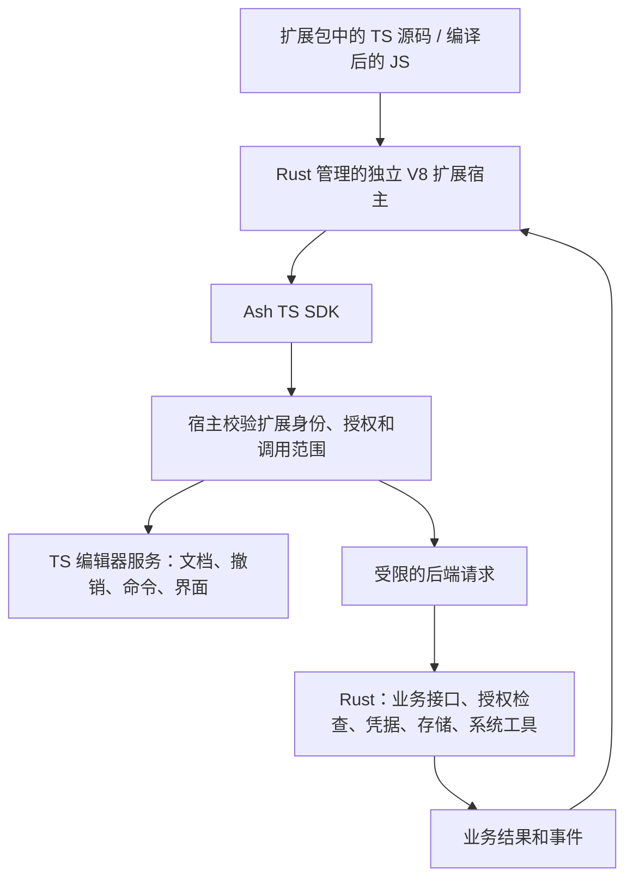
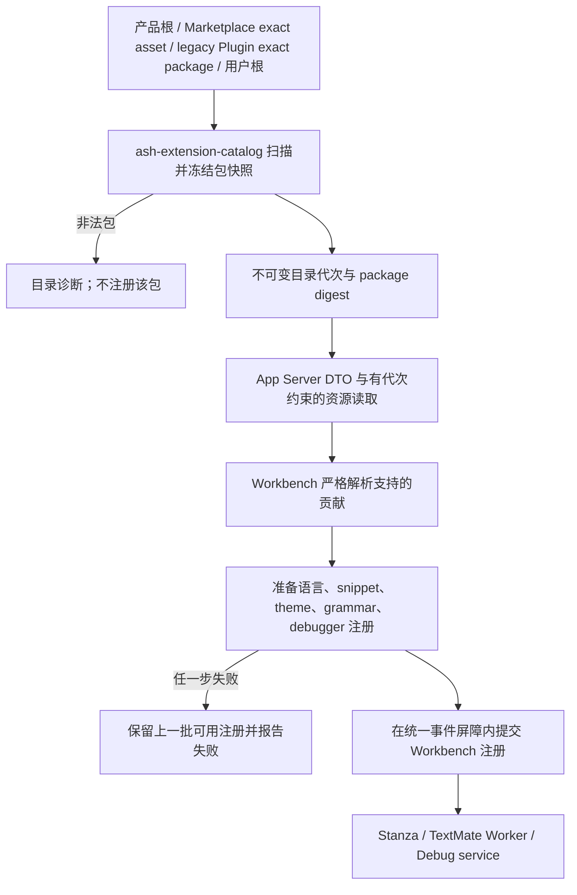
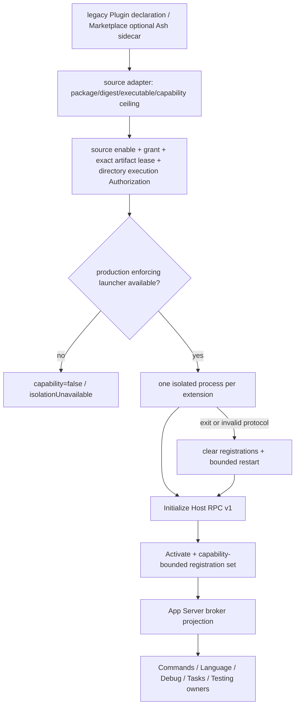

# 编辑器扩展系统

> 本文是 Ash 编辑器扩展的职责、运行方式与权限边界的权威说明。
> 产品方向已确定为：扩展用 TS 编写，编译后的 JS 在 Rust 管理的独立 V8 宿主内运行，通过 TS SDK 调用编辑器服务或 Rust 后端。
> 第三方扩展包来源选用 Open VSX；市场接入与扩展运行兼容性分别建设和验证。
> 静态包与资源实现见 [`ash-rs/extension-catalog/README.md`](../ash-rs/extension-catalog/README.md)，
> Workbench 接入见 [`app-ts/src/ash/workbench/services/extensions/README.md`](../app-ts/src/ash/workbench/services/extensions/README.md)。
> 进程监管与权限门禁继续复用
> [`ash-rs/editor-extension-host/README.md`](../ash-rs/editor-extension-host/README.md)；作者接口见
> [`TS SDK`](../app-ts/extension-sdk/README.md)，JS 执行见 [`Rust V8 宿主`](../ash-rs/js-extension-host/README.md)。
> Marketplace 安装由 [`core-plugins.md`](../ash-rs/docs/core-plugins.md) 维护，
> Plugin 来源授权由 [`plugins.md`](plugins.md) 维护。

## 快速理解

扩展用 TS 编写，编译为 JS 后在独立的 Rust V8 扩展宿主中执行，不启动 Node。扩展通过 Ash TS SDK 注册命令、语言服务
和界面贡献；编辑器文档、未保存文本、撤销和界面由 TS 服务管理。需要 Git、账号凭据、网络授权、
数据库或系统工具等后端能力时，宿主代为请求 Rust。扩展作者不链接 Rust crate，也不编写 stdio 协议。
采用这个分工是为了明确职责和权限。第三方扩展包从 Open VSX 获取；现成扩展能否直接运行，取决于
它使用的贡献、API、运行入口和权限是否被 Ash 支持，不能由市场来源决定。

当前代码同时存在声明式目录、可信浏览器 Worker 和 Rust 可执行扩展 Host。声明式目录只读取
`package.json` 与资源；内置 Markdown 预览已经走浏览器 Worker。此前新增的 `ash-extensions` Rust
作者 SDK 不再作为产品扩展入口继续建设。TS SDK v1 与 Rust V8 宿主已实现命令、悬停 Provider、文档快照、
授权磁盘读取、通知、Quick Pick 和停用释放；本地包安装、启用、授权和 macOS、64 位 Windows JS 系统隔离已接入。完整 API、其余系统的 JS 隔离和旧作者 SDK 源码退场尚未完成。
Open VSX 已接入现有 Rust 包管理。VSIX 安装先加载受支持的声明式贡献；macOS 与 64 位 Windows 用户另外启用并授权后，可执行使用受支持 VS Code API 的 CommonJS JavaScript 包。
现有 Host RPC v1 的细节在下文作为当前实现记录保留，不能当作新方向的实现要求。

这里的声明式 `Extension` 是领域 consumer，不是独立 Marketplace 或 package family；当前远端
Theme/Language package 通过 typed adapter 进入它；Theme 的 portable manifest 由 host 规范化为声明式
manifest，同时 package 原始 bytes/digest 保持不变。通用 `asset` 不会被自动解释为编辑器扩展。

| 用户或产品场景                                          | 当前行为                                                                                                              | 明确不会发生                                                   |
| ------------------------------------------------------- | --------------------------------------------------------------------------------------------------------------------- | -------------------------------------------------------------- |
| 打开受支持的源码文件                                    | 使用内置声明式扩展提供的语言关联、配置、grammar 和 snippet                                                            | 不下载扩展，不执行 manifest 中的脚本                           |
| 打开 Markdown 预览                                      | 内置浏览器扩展注册命令、菜单和文本预览，源码与预览共享未保存内容                                                      | 不把 Markdown 渲染器放进工作台编辑器实现                       |
| 主机配置静态用户扩展目录                                | 扫描该目录的直接子包，非法包产生诊断                                                                                  | Workspace 或 Renderer 不能提交任意扩展根                       |
| Marketplace Theme / Language                            | Manager 验证同一 package 后，将声明式 assets 投影进共享 Extension catalog                                             | 不建立 `extension-marketplace`，不执行静态资源                 |
| Open VSX 编辑器扩展                                     | 搜索、验证并安装精确版本；声明式贡献直接加载，受支持的 JS 在分别启用和授权后执行                                      | 安装不授权脚本，不把下载校验和当成 Ash TUF 签名                |
| Legacy Plugin 声明 `declarativeExtensions[]`            | 仅 effective exact package 的静态目录进入 catalog                                                                     | 本地兼容来源不成为远端 Marketplace 旁路                        |
| 用户静态包与内置包使用同一扩展 ID                       | 内置包优先，用户包被报告为重复项                                                                                      | 可变用户文件不能静默替换产品资源                               |
| Plugin 声明 Editor Extension                            | 显式声明 `runtime: javascript` 或 `hostRpc`；校验入口、API 版本和能力；只有独立 RPC 程序需要 exact process permission | 安装或 manifest 校验本身不会启动进程                           |
| Marketplace package 带可选 `ash/editor-extensions.json` | 产品 adapter 绑定同 package 的 exact executable；独立 admission 与 Manager lease 都通过后才进入 Host                  | sidecar 不成为通用 Marketplace 必需 manifest；安装不自动 grant |
| 已授权可执行扩展启动                                    | Runtime core 为它创建独立进程，完成版本握手和整批 registration validation                                             | 不把它加载进 App Server 进程，不继承主机环境                   |
| 可执行扩展崩溃                                          | 清除旧 incarnation 注册，按有界预算重新握手和激活；超限进入 crash loop                                                | 不无限重启，不把旧请求重绑定到新进程                           |
| 调用超时或取消后没有 terminal response                  | 结果标为 unknown outcome，终止旧 incarnation 后恢复                                                                   | 不声称副作用没有发生                                           |
| 需要 VS Code Extension API                              | 已支持命令、通知、单选 Quick Pick、只读文档和 Hover 的基础子集                                                        | 包可安装不代表全部 API 可用；不提供 Node 运行环境              |
| 本地 SDK JS 包                                          | 工作区相对路径安装；分别启用、授权后，macOS 或 64 位 Windows 产品宿主执行                                                              | 不自动授权，也不放宽独立可执行扩展的限制                       |
| 生产平台不支持所需隔离                                  | 运行失败并报告 isolation unavailable                                                                                  | 不允许无 sandbox 的第三方执行                                  |

当前声明式装载链已接入 App Server 与 Workbench。Legacy Plugin 与 Marketplace executable source 都会
先规范化为 Host deployment，Host runtime 不解析任何 package manifest。App Server broker 以及
Workbench 的 Commands/Language/Tasks/task-backed Testing、数据通道和链接展示接入已实现。macOS 与 64 位 Windows 产品已注入
JS 专用 launcher，启用且授权的本地 SDK 包和兼容的 Open VSX 包可以运行；独立可执行扩展仍要求整个进程的系统硬限制，目前产品 launcher 拒绝启动它们。
后续章节说明这些流程、所有权、信任与失败边界、完成度及演进。

Web 和 Electron 的工作台共用可信浏览器扩展入口：`build/resources/extensions.ts` 将内置包及显式配置的
`ASH_WEB_EXTENSION_PATHS` 冻结为 Browser catalog 和资源快照。`platform/extensions/browser/extensionApi.ts`
提供同一目录与资源契约；`platform/extensionHost/browser/extensionHostApi.ts` 持有每个可执行包的 Worker，
`extensionHostWorker.ts` 在 Worker 内导入 package 的单文件 ESM `browser` 入口，调用
`activate({ register, executeCommand, clientRequest, createWebviewResource, language })`。注册与调用使用 Ash 的有界扩展契约，不提供完整的 `vscode` 模块或 Node API。
Worker 持有调用的取消信号；到达截止时间后终止 Worker 并撤销该 incarnation 的注册。
刷新、替换和关闭页面释放 Worker 与入口 Blob URL。Vite 监听开发包文件并重新生成快照、刷新页面。
依赖编译进入浏览器资源，后端内置包目录不复制 `node_modules`。
该路径仅执行内置或开发者显式指定的可信资源，不属于 Marketplace 执行许可或生产第三方隔离路径。
Worker 无法访问 Workbench DOM，但仍是同源代码，不宣称具备生产 launcher 的 hard limits。

离线窗口仍加载打包目录中的语言声明和主题，因此 Markdown 动作不依赖后端连接。
工作台组合入口同时持有浏览器 Worker 与 App Server 可执行扩展的注册快照；同一扩展 ID 只能由一个
运行宿主持有。`MainThreadExtensionApi` 把扩展命令和编辑器菜单接入工作台，
`MainThreadCustomEditors` 注册文本自定义编辑器。内置 `extensions/markdown-language-features`
使用 `vscode-markdown-languageservice` 提供路径和标题补全、定义、引用、标题与链接重命名、
文档及工作区符号、折叠、链接、悬停、快速修复、链接诊断、扩大选择和引用高亮。
每次请求固定文档快照，打开的未保存文档先于磁盘内容；跨文件编辑附带原文，由编辑器批量编辑服务检查冲突。
Workspace edit 的 `entries` 按顺序执行：`kind: textDocument` 带 `resource`、`expectedText` 和 `edits`；
`kind: rename` 带 `source`、`target` 和 `existing`。链接路径重命名将文件改名和引用修改交给同一批量编辑事务，
预览确认后才执行，目标冲突与撤销由该服务处理。
文档扫描只使用文件服务可访问的工作区目录；后端未连接时，仅扫描本地浏览器已授权的目录。
补全触发字符属于语言 Provider 注册契约。取消和扩展退出会终止对应请求。

该扩展还提供 Markdown 预览及富文本编辑器，使用 `@vscode/markdown-editor` 以 Markdown 源码驱动排版。
工作台通用 `WebviewEditor` 承载这些视图，`CustomTextEditorModel` 引用源码的共享文本模型。
富文本视图只保留当前显示内容，编辑必须带上共享模型的版本；撤销、重做、保存和关闭确认均由同一文档状态决定。
版本冲突保留视图中的草稿，并提供重新载入操作。库资源由 Worker 创建、工作台在沙箱内加载，
不占用文档编辑消息的 JSON 限额；Worker 退出时释放资源 URL。
“打开富文本编辑器”（`markdown.showRichEditor`）保留源码标签；“重新打开为富文本”替换当前视图。
源码、预览与富文本标签可以同时打开。此入口没有扩大第三方扩展的生产执行许可。

## 0. 确定的产品方向

图片、音频和视频预览由内置 `extensions/media-preview` 包声明文件匹配规则和编辑器名称，
Rust catalog 与离线 Browser catalog 都收录同一个包。声明只选择产品已注册的 TS 编辑器实现，
不执行扩展脚本。图片保留现有缩放与元数据界面；音频和视频使用浏览器媒体控件，
通过文件服务读取内容，切换离开时暂停，关闭时停止播放并释放文件 URL。编解码支持取决于
当前浏览器或 Electron。媒体预览不建立文本模型，也不接入尚未支持自定义编辑器的 V8 SDK。

### 0.1 TS SDK 与 Rust V8 扩展宿主



Rust 拥有包安装、授权记录、扩展宿主进程和 V8 执行调度；扩展入口、回调、Provider 和特有流程
仍是 JS。编辑器对象、未保存文本、撤销和 UI 状态继续由 TS 管理，业务 App Server 不链接 V8。
Code Mode 和扩展宿主复用引擎初始化实现与锁定版本，分别管理执行状态和权限，不共享扩展或工具身份。

SDK 是作者的公共入口；协议是宿主内部的调用约定，不要求作者自己发送请求。接口覆盖必须包含
实际调用、错误、取消和释放，不能只有同名声明。原扩展直接依赖 Node 模块时，需要改用受限 SDK；
协议不会自动把任意 JS 变成 Rust，也不会完整模拟 Node。后台重活可以通过 SDK 交给共享 Rust 服务，
是否降低内存或加快启动需由真实扩展测量，不能由实现语言推定。

| 能力                                               | 目标 owner                     | 扩展使用方式                                 |
| -------------------------------------------------- | ------------------------------ | -------------------------------------------- |
| 扩展入口、激活、回调、注册释放                     | TS SDK 与独立 Rust V8 扩展宿主 | 编写 TS，运行编译后的 JS                     |
| 扩展自己的流程、数据整理、业务特有 Provider        | TS 扩展包                      | 组合公开 API，保留在扩展内部                 |
| 文档模型、未保存文本、撤销、选区、编辑器和界面组件 | TS Editor / Workbench 服务     | 宿主校验后，通过 SDK 请求或贡献 Provider     |
| Git、数据库、凭据、受授权的远端请求与系统工具      | Rust 领域服务                  | SDK 请求明确的业务操作，返回领域结果         |
| 安装、包完整性、启用和授权记录                     | Rust 包管理与授权服务          | 安装和授权是独立动作，宿主只取得当前有效授权 |
| 扩展请求身份和范围                                 | 可信宿主与 Rust 授权服务       | 宿主绑定身份，Rust 每次执行前复核授权        |

SDK 提供语义明确的 API，不公开任意 App Server 方法、原始 IPC、后端连接或通用系统执行入口。
Rust V8 宿主通过共享扩展协议请求 App Server；编辑器与 UI 操作由 App Server 回到发起调用的 TS 客户端。
Workbench 消费前端领域类型，后台文件读取不会转发到 Renderer。

SDK v1 的实际入口是 `@ash/extension`。作者导出 `activate(context)`，在激活阶段注册命令并把
Disposable 放入 `context.subscriptions`；每个命令收到独立的调用上下文。`workspace.openTextDocument`
读取 TS 的当前文档与版本，`workspace.readTextFile` 由 Rust 文件服务读取工作区相对路径，限制为
256 KiB UTF-8。文件读取必须同时满足 Plugin 的 `directory: read` 声明与当前目录的 `ReadFiles` 授权；
工作区切换不会把在途请求转到另一个文件服务。撤销目录授权后读请求失败。

包中用 `runtime: javascript` 明确选择产品打包的 `ash-js-extension-host`，入口为 `.js` 或 `.mjs` ESM。
相对模块只能来自包快照，`@ash/extension` 由宿主提供；不支持 Node、CommonJS 或动态导入。
激活阶段只完成本地初始化和命令注册，模块顶层初始化必须完成后再激活。注册的 dispose 立即撤销回调，
对外注册快照在停用或重启时整体更新。`deactivate` 即使失败仍释放 subscriptions；异步停用不能等待外部服务。
SDK 的 `ExtensionError.code` 保留 Rust 服务的错误分类。

`languages.registerHoverProvider` 已接入现有 TS 语言服务。manifest 需声明 `languageProvider`；回调取得
当前编辑器的不可变文本、版本和从 0 开始的 UTF-16 坐标，可返回文本、代码块和可选范围。
未保存内容来自当前编辑器，不重新读盘；SDK 校验语言选择器、坐标和范围，TS 编辑器负责展示与无障碍交互。
`languages.registerCompletionProvider` 使用同一份快照和坐标，支持触发字符、未完成列表刷新、普通文本和 snippet 插入。
`workspace.registerTextDocumentEvents` 在激活后发送现有模型的打开事件，随后顺序发送打开、修改、关闭事件；
语言变化先关闭旧语言再打开新语言。事件回调可以等待调用内服务；单订阅最多保留 64 个待处理事件，超限停止订阅并报告错误，不跳过修改。
`call.languages.setDiagnostics` 替换当前扩展运行实例的命名诊断集合，空数组清除；带过期文档版本的替换不会覆盖新结果。
停用、重启和断开连接清除实例持有的标记。单集合最多 1,024 个资源、10,000 条诊断，单扩展最多 128 个集合。
Provider、事件与命令共用调用身份、受限服务、取消和释放规则；其他语言 Provider 的作者接口尚未开放。

宿主将纯 JS 执行和 Promise 续执行纳入截止时间；取消会退役整个扩展运行实例，在途调用不会重放到新进程。
macOS 产品宿主先读取包快照并初始化 V8，再通过 Seatbelt 禁止直接文件访问、网络和创建子进程，随后才处理握手和执行扩展。
64 位 Windows 使用无网络能力的 AppContainer、每次启动独立的限制 SID 和单进程 Job。初始线程仅在可信准备阶段能读取扩展包；执行 JS 前释放该权限，已有与后续工作线程均使用受限主令牌。无需管理员权限或账户安装；终止后移除该次启动的包读取授权和 AppContainer 配置。宿主错误通过退出码交给监管器，不弹系统错误窗口。
本机已验证 Windows x64 的真实 V8 执行、VS Code 文档事件/诊断/补全、内存预算、超时恢复及文件/TCP/UDP/进程隔离；macOS 和 Windows ARM64 未在本轮运行。
每个运行实例有 64 MiB V8 堆预算与独立的 64 MiB 堆外 ArrayBuffer 预算；极小 TypedArray 的内联存储计入 JS 堆。
堆超额会终止执行，V8 可取得最多 4 MiB 的结束执行余量；堆外缓冲区累计超额立即结束扩展进程。它们不是整个进程的系统内存上限。
共享、可调整大小的缓冲区和 WebAssembly 不开放，因为其分配绕过该 ArrayBuffer 接口。独立可执行扩展的原有系统硬限制不变。
其他系统目前拒绝产品 JS 执行；Open VSX 下载包不会自动选用此入口。

作者可运行 `pnpm --dir app-ts/extension-sdk build:example`，得到 `.build/extension-sdk/` 下的 JS 与 Plugin manifest。
真实子进程测试覆盖 SDK→前端文档调用、SDK→Rust 磁盘读取、错误、取消、新运行实例和停用释放；
当前不是完整 VS Code API，也尚未向公共 npm registry 发布 SDK。

### 0.2 GitHub 的具体分工

GitHub 扩展仍用 TS 编写和运行。它负责“什么时候查询 PR、如何组织列表、用户点击后做什么”；
Ash 的 TS 服务负责实际显示列表、编辑评论、打开文件和 Diff；Rust 负责账号授权、持有凭据、发送
GitHub 请求，以及 Git 和持久化。扩展取得所需业务结果，不取得用户令牌。

| GitHub 场景             | TS 扩展与工作台                                        | Rust 后端                                                |
| ----------------------- | ------------------------------------------------------ | -------------------------------------------------------- |
| 登录                    | 扩展请求登录，工作台展示账号选择和授权交互             | 管理认证状态、凭据保存、账号权限与撤销                   |
| 展示 PR 和检查结果      | 扩展发起查询并整理结果，工作台渲染                     | 发送 GitHub 请求，处理分页、限流和业务错误               |
| 提交评论、Review 或合并 | 扩展组织流程，工作台呈现输入和确认                     | 校验扩展操作授权、账号及仓库范围，执行写入并返回明确结果 |
| 打开文件或 Diff         | 使用工作台编辑器和当前文档模型                         | 提供所需 Git 对象或远端内容                              |
| 保存数据                | 保存扩展范围内的持久数据请求；窗口显示状态仍由 TS 管理 | 校验存储范围并持久化，隔离不同扩展的数据                 |

仓库已经有 [`IGitHubService`](../app-ts/src/ash/platform/github/common/githubService.ts) 和
[`AppServerGitHubService`](../app-ts/src/ash/platform/github/browser/appServerGitHubService.ts)，
后者通过生成协议调用 [`App Server GitHub processor`](../ash-rs/app-server/src/server/request_processors/github.rs)
和 [`ash-rs/github`](../ash-rs/github/README.md)。这条产品服务路径可以作为 SDK 接入的后端能力来源；
当前产品账号授权不等于第三方扩展授权，不能把现有服务或完整连接直接交给扩展。
GitHub 的独立 TS 扩展入口、TS SDK 的 GitHub API 和逐扩展权限接入尚未完成。

代码在 `extensions/` 或 `src/` 不决定它是否交给 Rust。扩展特有流程在扩展包，通用编辑器和界面
服务在 TS `src/ash`，共享后端业务在 `ash-rs`。迁移依据是能力和状态由谁管理，不是上游目录名。

### 0.3 权限必须在运行环境和服务端执行

- Electron 主进程与受信任 preload 只用于产品自身的宿主工作。扩展不能取得 `require`、Node
  文件和进程模块、Electron API、主进程对象或通用 IPC。
- 承载扩展或其界面的窗口关闭 `nodeIntegration`、`nodeIntegrationInWorkers`、
  `nodeIntegrationInSubFrames`，开启 `contextIsolation` 和 `sandbox`。扩展运行环境与产品界面隔离，
  不能取得 DOM、产品存储、登录会话或后端连接。Worker 本身不提供完整的权限隔离。
- 宿主根据已加载包和当前授权绑定扩展身份；请求内自报的 `extensionId` 不能决定权限。请求还绑定
  工作区、窗口和激活代次，宿主只允许公开且获授权的命令和操作。
- Rust 对每次操作复核扩展有效授权、目录或仓库范围、账号、网络目标和写入权限。撤销、更新、
  停用或工作区切换后，旧身份不能继续调用；长任务持有相应授权并处理取消。
- 凭据留在后端。扩展使用受限业务操作，不获得令牌、完整环境变量或其他扩展的存储权限。
- 网络和浏览器存储的限制也在运行环境中执行。只从 SDK 删除 `fetch` 或存储方法不能阻止扩展自己调用
  浏览器 API；必须限制扩展来源、会话、网络策略和消息入口。
- Rust 可以管理已授权 Git、LSP 等外部工具的受限执行；这种工具执行权限不授予 JS 扩展本身。

即使扩展绕过 SDK、自己构造消息，宿主和 Rust 仍须拒绝未授权操作。Electron 官方的
[上下文隔离说明](https://www.electronjs.org/docs/latest/tutorial/context-isolation#security-considerations)
明确指出，开启隔离并不使通用 IPC 自动安全；基础窗口设置不能代替 API 权限检查。

### 0.4 当前状态与验收要求

| 项目                                                | 当前状态                                                                                                         |
| --------------------------------------------------- | ---------------------------------------------------------------------------------------------------------------- |
| 内置或显式可信包的浏览器 Worker 执行、Markdown 预览 | 已有实现；当前同源 Worker 不代表第三方权限隔离已完成                                                             |
| Rust GitHub 领域能力与 TS 产品服务调用              | 已有实现；尚未开放为逐扩展授权的 SDK API                                                                         |
| 产品窗口禁用 Node、开启上下文隔离和沙箱             | 已有基础设置；preload 仍有按 `ash:` 前缀过滤的通用 IPC                                                           |
| TS SDK v1 与独立 Rust V8 宿主                       | 已实现并通过独立进程测试；支持命令、悬停 Provider、文档快照、授权文件读取、通知、Quick Pick 和释放               |
| 第三方 SDK v1 生产执行与系统隔离                    | macOS 与 64 位 Windows JS 扩展已接通；系统沙箱、V8 堆和 ArrayBuffer 预算在独立进程实施；其余平台尚未开放                          |
| 完整 TS API                                         | 尚未完成；现有可信 Worker 仍接入通用命令，不属于第三方 SDK 权限边界                                              |
| Open VSX 搜索、下载、安装、更新和卸载               | 已接入 Rust Manager 与 Marketplace 界面；支持 universal 正式版本、已有静态贡献及分别授权的基础 CommonJS API 子集 |
| Rust 作者 SDK 与后端可执行扩展入口                  | 已停止作为产品扩展方向；源码仍在，此前服务反向调用补充未完成验证                                                 |

后续实现必须通过真实扩展入口验证：正常授权操作成功；伪造扩展身份、越界文件或仓库、未授权命令、
直接 Node/IPC/后端连接访问失败；撤销授权后在途和后续调用停止；关闭窗口释放注册与任务；文档编辑
读取未保存文本并保留版本冲突和撤销语义。扩大 SDK API 或平台范围时必须继续验证这条权限和生命周期链。

### 0.5 第三方扩展来源采用 Open VSX

Ash 接入 Open VSX 获取已有扩展包，不要求所有作者重新发布到 Ash 自建市场。Open VSX 是由
Eclipse 管理的开放扩展 registry，可供兼容编辑器使用；每个扩展仍按自己的许可证使用。
见 [Open VSX 官方说明](https://www.eclipse.org/legal/open-vsx-registry-faq/)。Cursor 已采用
Open VSX，并通过自己的代理提供搜索、下载与扩展检查，见
[Cursor 扩展文档](https://prod.cursor.com/help/customization/extensions)。

| 部分                            | Ash 的目标做法                                                            |
| ------------------------------- | ------------------------------------------------------------------------- |
| 搜索、版本查询、下载来源        | Rust 的 Open VSX 来源 adapter 获取目录与 VSIX 包                          |
| 包安装、更新、卸载              | 由现有 Rust 包管理 owner 管理；来源接入不新建第二套安装生命周期           |
| 包格式和声明式资源              | 解析 VSIX 中的 `package.json` 与资源，交给现有扩展目录和各 TS 贡献 owner  |
| 扩展入口与回调                  | 隔离的 JS 宿主执行受支持的入口，TS 提供已实现的扩展 API                   |
| 文件、Git、凭据、网络和工具操作 | 通过明确的 SDK 接口请求受权限控制的 Rust 领域能力；编辑器模型仍由 TS 管理 |

Open VSX adapter 必须保留 registry、publisher、扩展 ID、版本、平台和包摘要。不同 registry 中
相同的 `publisher.name` 不证明作者或内容相同；切换来源不能沿用原来源的授权。来源目录提供的
摘要、发布者信息与 Ash 市场的签名验证分别记录，不能把 Open VSX 包标记为已通过 Ash 的 TUF 验证。
VSIX 使用其自身的包格式，不要求上游包额外携带 Ash Plugin manifest 或旧 executable Host sidecar。

市场页面分别说明“包可获取”和“在 Ash 中可运行”。安装前检查已知的入口、平台、API 与贡献要求；
实际兼容性以扩展入口、调用、取消及释放的验证结果为准，不能只检查 `browser` 字段或 API 名称。

| 扩展形态                                       | 支持条件                                                  |
| ---------------------------------------------- | --------------------------------------------------------- |
| 声明式主题、语法、snippet 等                   | 包验证通过，全部必要贡献由 Ash 对应领域支持               |
| 使用 `browser` 入口的 JS 扩展                  | 所用扩展 API 与运行环境能力均受支持，并符合逐扩展权限要求 |
| 直接依赖 Node 文件、进程或 Electron 能力的扩展 | 原包不能直接运行；作者须改用受限 SDK，并完成适配验证      |

VS Code 的 [Web 扩展说明](https://code.visualstudio.com/api/extension-guides/web-extensions)
也区分浏览器入口与 Node 能力。Ash 保持第 0.3 节的权限边界，不为提高兼容数量向扩展开放 Node
或通用 IPC。兼容目标是经验证的扩展集合，不承诺 Open VSX 全库可运行。

当前 `OpenVsxClient` 已实现来源 adapter 和 VSIX 安装链，复用 `PluginsManager` 的安装、更新、
持久化恢复及卸载。产品配置中的 `openVsx` 定义唯一来源名、HTTPS API 和允许的下载 origin；
每次请求与 CDN 跳转均检查这些地址。搜索不下载所有包，打开选中包详情时取得并验证该版本的
VSIX，随后安装复用同一份已验证内容。校验和与包内 publisher/name/version 必须一致，解压遵守
现有路径、文件数和大小限制。来源记录、精确版本、平台与校验和随安装保存。

Marketplace 的“编辑器扩展（Open VSX）”筛选及安装确认说明：安装加载受支持的主题、语法、
代码片段等声明式资源；脚本执行需要在命令面板“管理市场扩展执行”中分别启用和授权。
macOS 与 64 位 Windows Rust V8 宿主执行受支持的 CommonJS 包，可信 Worker 不执行下载包。完整兼容 API 尚未完成。`universal` 正式版本是当前支持的包目标；平台专用包和预发布包未接入。

### 0.6 已支持的 VS Code JavaScript 接口

先从 Open VSX 安装包，再在命令面板打开“管理市场扩展执行”，分别选择“启用”和“授权执行”。
授权绑定已安装包的精确版本、摘要、能力 ID 和宿主权限版本，保存于 Profile；更新包或扩大宿主权限后需要新授权。
停用或撤销先使旧调用失去权限、取消在途操作并结束旧进程，再返回成功。运行中的安装包持有 Manager 租约，卸载前先停用。
这些状态由 `core-plugins::EditorExtensionPolicy` 管理，与本地 Plugin 的授权来源分开。

| 接口       | 当前支持范围                                                                                               |
| ---------- | ---------------------------------------------------------------------------------------------------------- |
| 包入口     | `browser` 优先，否则 `main`；单文件 CommonJS bundle，入口可省略 `.js`；`require` 只提供 `vscode`           |
| 激活与释放 | `activate(context)`、可选 `deactivate()`、`context.subscriptions`；按命令、语言或启动完成事件激活                    |
| 命令       | `commands.registerCommand`，命令须声明在 `contributes.commands`；标准参数和 `thisArg`                      |
| 界面       | 三种消息通知（无按钮或选项）；字符串或 label 项的单选 `window.showQuickPick` 与 `placeHolder`              |
| 文档       | `workspace.openTextDocument(Uri)`；打开、修改、关闭事件；UTF-16 `getText(range)`、`offsetAt`、`positionAt`、`lineAt`、单词范围 |
| 诊断       | `languages.createDiagnosticCollection`、Diagnostic 四种严重度；set/delete/clear/dispose；资源版本与运行实例隔离 |
| 语言       | 字符串语言 ID 的 Hover 和 CompletionItem Provider；触发字符、未完成列表、snippet、附加文本编辑                    |
| 基础类型   | `Uri`、`Position`、`Range`、`Hover`、`MarkdownString`、`Diagnostic`、`CompletionItem`、`CompletionList`、`TextEdit`、`SnippetString`、`Disposable` 的上述用法，不提供完整类型成员         |

接口未实现时明确报错；不提供 Node 模块、相对 CommonJS 模块加载、文件或网络直连、任意后端 RPC、完整 ExtensionContext。
补全不支持 resolve、命令、分别插入/替换的范围，以及 Color、EnumMember、Constant、Struct、Event、Operator kind；
诊断不支持 relatedInformation、tags 或带目标链接的 code。服务调用只在命令、语言 Provider 或文档事件回调内有效，不能在激活阶段或回调结束后访问窗口。
文档事件对象随修改更新；语言 Provider 使用不可变快照。`workspace.textDocuments` 在激活后的事件送达或显式读取文档时建立，激活阶段不是完整的初始文档列表。
本轮扩大窗口操作范围后，市场执行授权契约版本升为 2；旧授权需重新启用并授权。
V8 将调用身份随 Promise 续执行保留；并行命令不共享身份，过期续执行不能借用后来的调用。
命令忽略通知的 Thenable 时，宿主仍等待该通知结束再关闭调用。

未经修改的 Open VSX `mark-wiemer.helloworld-2022` 0.2.3 已通过真实 Electron 下载、安装、命令通知、
同 Profile 重启、撤销与卸载验证。这证明该原包兼容，不代表整个市场的扩展都兼容。

## 1. 当前 App Server 装载与激活实现

### 1.1 声明式静态扩展



产品构建把仓库根目录 `extensions/` 复制到包内 `ash-resources/extensions/`。App Server 同时把当前
Plugin activation snapshot 中的 `declarativeExtensions[]` 与 Manager 的 Theme/Language capabilities
解析为 exact immutable package directories。`ash-extension-catalog` 按 built-in → dynamic authority sources
→ profile user 顺序扫描，每个扩展 ID 的第一个有效包获胜。每次 `Refresh` 或任一动态 source
generation 改变都会重新扫描；只有 descriptor、完整 package digest 或 diagnostics 改变才推进目录
代次，并把包内 regular-file bytes 冻结为当前内存快照。内容相同的刷新保留代次，避免启动时多个
加载器互相打断资源读取。资源读取必须携带该代次，只能读取当前快照；目录内容改变后请求旧代次会得到 generation
conflict，而不是从已变化的磁盘路径读取内容。

Renderer 不接收主机路径。它先取得目录描述，再以“目录代次 + 扩展 ID + 包内相对路径”请求资源。
App Server 把有界 bytes 放入 connection-owned `ResourceStore`，前端通过分块 API 读取并释放临时
资源。Workbench 最后把声明式贡献投影到各自领域 registry。

Workbench 启动会保留初次 `AppServerExtensionService.start()` 的 Promise，在扩展激活完成或失败后
才恢复 working-copy backup 并推进 `AfterRestored`。App Server 连接状态从任一非 `ready` 状态回到
`ready` 时，组合根调用 `reload()`；该请求复用 single-runner 合并规则。

### 1.2 现有来源授权的可执行 Host v1（退出产品扩展方向）



Legacy Plugin v1 的 `editorExtensions[]` 仍可作为本地兼容来源。Marketplace 来源则由可选
`ash/editor-extensions.json` consumer sidecar 把声明绑定到同 digest 内的 exact `executable`
capability；没有独立 `MarketplaceEditorExtensionAdmission` grant 时 deployment 不会被接纳或启动。
Admission authority 必须为 policy commit 推进 generation，并在可变时发布变更；Host 据此撤销旧
fleet 并重新评估 grant。两条来源都只发布规范化 deployment 与 live authority，不启动进程。Host adapter 还必须绑定当前 Environment 的显式 source 与目录 Grant。独立可执行扩展交给能够实施系统沙箱与进程资源上限的 launcher；JS 扩展交给产品打包的 V8 宿主，在 macOS 与 64 位 Windows 实施系统沙箱和第 0.1 节的 JS 内存预算。缺少所选运行方式要求的 launcher 时拒绝启动，不能自动改用可信开发 launcher。

一个 `ExtensionHostSupervisor` 只监管一个扩展程序。它先取得 live activation lease，再 spawn、执行
Initialize/Activate，最后一次发布整批 registrations。每次 provider invocation 重新取得 lease，并绑定
request ID、process incarnation 和 activation generation。崩溃后的新进程会重新握手和激活；旧
registration、pending request 和 lease 不会迁移。

Open VSX JS 扩展由 App Server 在 Rust 中匹配激活事件。启用且授权后先进入 `dormant`，
不创建进程，也不产生 incarnation 或 provider registrations。命令清单先供命令面板展示；第一次
调用等待启动，再使用实际注册和进程代际执行。TypeScript 编辑器传递当前模型的语言，以及窗口
恢复后的 `onStartupFinished`。Rust 支持 `onCommand`、`onLanguage`、`onStartupFinished` 与
立即启动的 `*`，并从标准 commands、languages 贡献生成隐式事件。健康轮询和失败重试不会启动
等待中的扩展，匹配事件也不能绕过精确包授权。切换目录后激活代际仍单调递增，迟到的旧事件
不能使用新目录中的扩展。其他激活事件类型尚未实现，本地 SDK 与独立
可执行扩展仍沿用现有启动方式。`ash-editor-extension-host` 只监管进程，不监听编辑器事件。

## 2. 当前实现所有权

| 能力                                                                                      | 权威所有者                                                    | 不负责                                            |
| ----------------------------------------------------------------------------------------- | ------------------------------------------------------------- | ------------------------------------------------- |
| 内置静态资源源码与上游 provenance                                                         | 根目录 `extensions/`                                          | 运行时扫描、Extension API                         |
| 此前的 Rust 作者接口、回调分发与激活作用域（待退场）                                      | `ash-extensions`                                              | 不再承担目标产品 SDK；目标分工见第 0 节           |
| 静态包扫描、路径/文件类型校验、快照、摘要与目录代次                                       | `ash-extension-catalog`                                       | Editor 贡献语义、任意代码执行                     |
| 静态可信根选择和顺序                                                                      | App Server 产品组合根                                         | 由 Renderer 提交任意主机路径                      |
| Plugin 静态目录选择                                                                       | `ash-core-plugins` activation authority + App Server provider | 解析静态 `package.json`、授予代码执行             |
| Marketplace Theme/Language 静态目录选择                                                   | `PluginsManager` + App Server provider                        | 解析 Workbench 贡献、主题选择或 LSP lifecycle     |
| 静态 DTO、connection resource 与错误映射                                                  | App Server / `platform/extensions` adapter                    | Workbench 领域注册                                |
| 声明式 catalog 与生命周期                                                                 | `IExtensionService` / `AppServerExtensionService`             | transport DTO、Plugin enable/grant                |
| Marketplace package artifact/install/update/uninstall 与 capability lease                 | `ash-core-plugins`                                            | Editor Extension enable/grant、启动进程           |
| Marketplace Editor Extension enable/grant generation、通知与 lease                        | 产品注入的 `MarketplaceEditorExtensionAdmission`              | package 安装、目录权限、进程隔离                  |
| Legacy Plugin 本地 package 与 enable/grant generation                                     | `ash-core-plugins` compatibility authority                    | 远端 Marketplace 安装、启动进程                   |
| 可执行进程、Host RPC、incarnation、取消和 crash recovery                                  | `ash-editor-extension-host`                                   | package discovery、目录权限决定、领域 payload     |
| source normalization + Dir Authorization adapter、Host fleet 与客户端 RPC                 | App Server composition                                        | OS sandbox implementation、Workbench UI           |
| 生产 sandbox、hard resources 与 killable process tree                                     | 注入的 platform `ExtensionHostLauncher`                       | package enable/grant 或 provider semantics        |
| Host snapshot normalization 与 transport                                                  | `platform/extensionHost` adapter                              | 领域 provider ownership                           |
| Host fleet 生命周期、刷新和连接状态                                                       | `IExtensionHostService` implementation                        | 扩展 provider 注册、generated DTO 作为 domain API |
| 扩展 API 的 Workbench 接入、原子注册、调用和 Output 生命周期                              | `workbench/api/browser`                                       | 进程监管、WebSocket、App Server 协议定义          |
| Renderer Host service 安装与启动阻塞                                                      | Code 产品入口选择的 `workbench/contrib/extensionHost`         | 通用 Workbench 或 Academic 产品隐式安装           |
| Commands、Language、Debug、Tasks、Testing、DataChannel、LinkPresentation 注册与调用 shape | 各自 Workbench domain owner                                   | package 安装、进程监管                            |

Frontend common contract 使用 Workbench 自己的 snapshot/descriptor/failure 类型；generated DTO 和
资源传输 shape 只存在于运行时 adapter。`src/ash/base` 不认识扩展、语言、grammar 或 Host RPC。

`workbench/api/browser/mainThreadExtensionApi.ts` 接收宿主服务已取得的扩展快照，把命令、受支持的语言操作、
任务与测试配置注册到现有领域服务，并管理扩展命名 Output。语言和任务结果的严格转换由同目录的
`extensionHostLanguageBridge.ts`、`extensionHostWorkflowBridge.ts` 负责。宿主服务通过实例化容器创建 API
实现；领域注册、调用取消和输出频道只有一个 owner，原服务目录不再保留转换实现。

替换注册集合会取消旧集合的调用；提交失败保留上一组有效注册。断线、停止或释放宿主服务会撤销注册并释放
扩展命名 Output。输出按扩展 ID、激活代次和进程 incarnation 隔离，重新连接恢复内容但不重放旧的显示请求。
此层当前接入已有 Host RPC v1 可执行扩展；没有新增 JavaScript 扩展加载器、`vscode` 模块或 VS Code 扩展兼容承诺。

数据通道和链接展示由 `workbench/api/browser/mainThreadDataChannels.ts` 单独管理，通用扩展 API
不重复注册这两类贡献。Web、Electron 和 Sessions 入口都装配共享的平台契约与 Workbench 服务。
编辑器补全结束事件经 `DataChannelForwardingTelemetryService` 发布到 `editTelemetry`，再通过现有
`IExtensionHostApi` 与生成协议、Renderer 专属连接交给 App Server。Main 继续只转发消息；没有新增
进程、连接、持久状态或文件写入路径。Rust Host 拥有进程与授权门禁，前端拥有通道订阅和链接显示。

静态 `package.json` catalog 与 executable consumer manifest 之间没有隐式转换。未来即使共享安装
UI，也必须保留两种 package identity、authority、generation 和 failure semantics；不能把“静态资源目录可读”转换成
“允许执行包内程序”。

## 3. 当前支持的声明式贡献

| `package.json` 贡献                            | 当前状态     | 当前边界                                                                                    |
| ---------------------------------------------- | ------------ | ------------------------------------------------------------------------------------------- |
| `languages`                                    | ✅           | ID、aliases、extensions、filenames、filename patterns、MIME type、first-line pattern        |
| language `configuration`                       | ✅           | 读取 JSONC 并注册 comments、brackets、indentation、on-enter 等语言配置                      |
| `grammars`                                     | ✅           | root/injection grammar、embedded languages、token types、balanced/unbalanced bracket scopes |
| `snippets`                                     | ✅           | 有 prefix 的 snippet 投影为 completion provider；file template 进入可查询 template catalog  |
| `themes`                                       | ✅           | 严格解析并注册可选择 Workbench color theme，同时投影活动主题的 TextMate token scope rules   |
| `debuggers`                                    | ✅（窄契约） | 唯一 debugger type 映射到显式 adapter program/args；不提供 VS Code Debug Extension API      |
| `configurationDefaults`、`semanticTokenScopes` | 尚未完成     | 内置 manifest 可包含，但当前 loader 不投影                                                  |
| JavaScript、LSP server declaration、动态 UI    | ❌           | 不执行、不隐式信任                                                                          |

内置包当前覆盖 CSS、HTML、JavaScript、JSON/JSONC、Markdown、Python、Rust、Shell、SQL、
TypeScript、XML、YAML 和四个默认主题文档。Manifest 中的 `%...%` 本地化占位符当前没有 NLS
解析；未解析占位符使用 theme document 自身的 name 或稳定 manifest ID 回退。

Theme document 当前必须是自包含资源：`include` 会被拒绝，`uiTheme` 只接受 `vs`、`vs-dark`、
`hc-black` 或 `hc-light`，颜色必须是合法十六进制值，token settings 只允许
`foreground`、`background` 和受支持的 `fontStyle`。未知 Workbench color token ID 可以保留在
catalog 中，但投影为产品主题时会被忽略。

## 4. 现有可执行 Host v1 的窄契约

### 4.1 清单与激活上限

每个 legacy Plugin `editorExtensions[]` item 或 Marketplace Ash sidecar item 必须有唯一
manifest-local ID、唯一入口绑定、数值 `runtimeApiVersion: 1`、非空且有界的 activation events 和 capabilities。
Legacy `runtime: hostRpc` 入口必须有对应 `process` permission；`runtime: javascript` 入口由产品 V8 宿主加载，
SDK v1 允许 command 和 languageProvider ceiling，目前语言作者 API 仅支持 hover。Marketplace sidecar 的入口仍须绑定同一 Manager package 的
`runtime: direct` executable capability，尚未开放第三方 JS 下载包执行。
regular-file 校验不证明当前 OS、CPU、ABI 或代码签名可运行；launcher 仍需在目标平台失败关闭。

v1 activation event 为 `startup`、`onCommand`、`onLanguage`、`onDemand`、`onDebugType`、
`onTaskType` 和 `onTestProfile`。`workspaceContains` 当前没有 Workspace-owned bounded scanner，因而
明确不在 schema 中；扩展程序不得自行扫描工作区来模拟这一 trigger。

### 4.2 RPC 与注册

Host RPC v1 是 newline-delimited strict JSON 协议，不是 JSON-RPC。请求与响应都绑定 protocol version、
request ID、incarnation 和 activation generation；扩展主动发送的命名 Output event 没有 request ID，但
仍绑定其余三个 stale-process fence。未知 request、response kind 不匹配、correlation 不一致、重复/未知
request ID、无效 Output 操作、超限 frame/Output 队列或未声明 capability 均使当前 incarnation 失败关闭。

| Registration kind          | Runtime v1 ceiling                                             | 产品接入状态                                                                                                                                         |
| -------------------------- | -------------------------------------------------------------- | ---------------------------------------------------------------------------------------------------------------------------------------------------- |
| Command                    | command ID、title 与 brokered invocation                       | 已接入；按 registration、incarnation 与 activation generation 调用                                                                                   |
| Language Provider          | language IDs + operation set                                   | Runtime vocabulary 已实现；Frontend v1 已投影 completion、Parameter Hints、hover、formatting、Inlay Hints、Linked Editing；其余 operation 仍部分接入 |
| Debug Adapter              | debugger type                                                  | Runtime contract 已实现；Frontend 当前只保留 snapshot 并报告 unsupported bridge，不启动 DAP session                                                  |
| Task Provider              | task type                                                      | 已接入；只发布用户可选择的 canonical Task，不自动执行命令                                                                                            |
| Test Profile Provider      | provider ID、label                                             | 已接入 task-backed profile；不冒充完整 test tree/controller API                                                                                      |
| Data Channel               | channel ID；只允许 receiveData                                 | 已接入；当前窗口事件按订阅顺序交给授权扩展                                                                                                           |
| Link Presentation Provider | URI pattern、presentation kind；只允许 provideLinkPresentation | 已接入；Chat 链接展示 title、status、reference 与变更数，保留原目标和键盘焦点                                                                        |

这两类注册分别要求 manifest 声明 `dataChannel`、`linkPresentationProvider` capability。数据通道只
接收前端发布的数据；链接供应商只接收正在展示的匹配 URI。查询结果按平台类型校验后以文本更新链接，
不会执行扩展返回的 HTML。订阅队列、更新周期、取消与迟到结果隔离约定见
[Host RPC v1](../ash-rs/editor-extension-host/README.md#4-host-rpc-v1)。产品不收集或上传遥测；
`editTelemetry` 目前只发布补全接受状态与持续时间，扩展订阅不等同于新增产品遥测采集。

扩展命名 Output 是带背压的事件流，不是静态 registration kind，也不扩大 manifest capability ceiling。
扩展必须先 `create` channel，随后才可 `append`、`replace`、`clear`、`show` 或 `dispose`。Supervisor 分配
单调 sequence 并保留有界历史；App Server 通过 fleet generation 投影，Workbench 按 sequence 去重，
恢复内容时不重放旧 `show` 事件。它提供与 VS Code OutputChannel 相近的用户语义，但不是 VS Code Node
Extension API 的二进制或源码兼容实现。

`capabilities` 是注册种类的最大集合，不代表 extension 已注册 provider，也不批准某次调用的副作用。
App Server 必须对每个 registration 建立 owner-bound identity，并让领域 owner 定义 operation/payload；
Renderer 不能把任意 Host RPC method 直接透传给扩展进程。

Language Provider 调用会把当前 immutable editor snapshot 的完整 normalized text、version、language ID、
可选 resource URI 及本次 position/range/options 交给扩展程序；因此 grant 该 capability 必须被产品明确
解释为“允许 broker 披露当前参与调用的文档内容”，但不等于任意工作区文件读取。传输仍受 512 KiB
payload ceiling、Directory/source live authority、activation generation 和 incarnation fence 约束，超限
请求拒绝。
Frontend v1 当前只投影 completion、Parameter Hints、hover、formatting、Inlay Hints 和 Linked Editing；
Host vocabulary 中虽有 definition、references、rename、code action 等 operation，尚无严格 Workbench
codec 的 operation 会发布 `unsupportedRegistrationBridge` 并使 aggregate state 降级；同一 registration
中已有严格 codec 的子集继续保持 active。Parameter Hints 已进入 v1；它不是完整 VS Code Signature
Help API。Task Provider
只能提出用户可选择的任务，实际命令仍由 canonical Task/Terminal 安全边界执行；Test
Profile Provider 只能引用同一扩展当前 Task Provider 贡献的任务。Debug Adapter 也必须经专用 DAP
session seam，不能把任意 executable descriptor 从扩展进程直接交给通用 process API。若这些 broker
规则不存在，对应 registration 应保持不可用，不能因为 runtime capability 已声明就直接透传。

## 5. 信任、完整性和资源限制

### 5.1 声明式静态资源

主机选择的 built-in root、Manager dynamic source 与 legacy Plugin activation authority 是静态来源的
唯一入口。内置根固定优先于 dynamic exact packages，后者又优先于用户 profile 根；Workspace、
Renderer、静态 manifest 和网页内容均不能提交任意绝对路径。目录扫描拒绝 symlink、hard link、special file、越界相对路径和不
满足 manifest 身份的包。当前限制为：manifest 最大 4 MiB，单文件最大 16 MiB，每包最多 4096 个
regular files、8192 个 filesystem entries，总 bytes 最大 64 MiB。

目录代次解决“目录描述与资源 bytes 属于同一快照”，package SHA-256 解决“一个完整包快照的内容
身份”。`manifestSha256` 只校验 transport 暴露的 canonical `manifestJson` bytes；它不能代替完整
package digest，原始 `package.json` bytes 已包含在 `packageSha256` 的整包身份中。当前快照只保留
最新代，旧代资源请求明确失败，不做隐式重绑定。

静态 profile 根当前没有独立 Editor Extension registry、signature、revocation 或 grant authority。
Marketplace Theme/Language 静态目录继承 Manager 的 TUF/digest/revocation 与 exact installation
identity，但声明式消费不等于 executable grant；所有来源都只能贡献第 3 节列出的声明式数据。

### 5.2 可执行进程

可执行扩展必须同时满足三层 gate：来源的 exact package/digest + enable/grant lease、当前 Environment 的有效 source/目录 Grant，以及 launcher 对所选运行方式的隔离和资源预算的实际实施。Marketplace 来源额外同时持有 Manager
capability lease 与产品 admission lease；admission generation/notification 负责使 grant/revoke 触发
fleet replacement。任一 gate 失效都拒绝新 activation
和 invocation；App Server 还须取消 connection-owned invocation，并在 disable/update/uninstall 或
Environment 或有效目录集合切换时停止旧进程。

默认 process/protocol limits 为 1 MiB frame、512 KiB payload、256 registrations、32 个普通和 8 个
control in-flight requests、256 KiB stderr、4096 个 / 512 KiB queued/retained Output events、10 秒
startup、30 秒 request、2 秒 cancel grace、5 秒 shutdown。独立可执行扩展默认请求 512 MiB 进程内存、
300 秒 CPU 和单进程上限。macOS 与 64 位 Windows JS 扩展分别限制 V8 堆和 ArrayBuffer 为 64 MiB，执行有超时；这不是整个进程的内存上限。restart policy 在 60 秒窗口内
最多允许 5 次，以 100 ms 起步、最高 5 秒指数退避。确切实现和修改义务见 Host crate README。

`TrustedDevelopmentLauncher` 只允许显式可信本地开发。生产第三方执行必须注入能实施所请求隔离的
launcher。macOS 与 64 位 Windows JS 使用 `ProductJavaScriptLauncher`；其他平台或独立可执行扩展缺少符合要求的 launcher 时，App Server 对外能力必须为 false。

## 6. 失败、刷新和恢复语义

### 6.1 声明式刷新

Rust 扫描以包为单位失败关闭：一个无效包产生结构化诊断且不进入目录，其他有效包仍可发布。请求
不安全、缺失、过大或旧代资源分别返回 typed error，不回退到工作区文件系统或磁盘最新内容。

Workbench 刷新采用 single-runner 队列。同一时间只有一次装载；装载期间的多个刷新请求合并为恰好
一次 follow-up refresh，所有等待者等待队列 drain。服务销毁后不再提交 in-flight 结果、启动后续刷新
或发送普通失败事件。

Manifest、配置、snippet、theme 和 debugger 解析及注册组成一条失败安全的激活序列；失败时释放
候选注册并尝试恢复上一批可用状态。提交阶段使用同步事件屏障：各领域 registry 先更新状态，全部
成功后才依次投递已缓冲事件，因此监听者查询其他 registry 时会看到同一扩展代次。同步提交失败会
丢弃候选事件并恢复上一批可用状态。TextMate grammar 的 bytes 解析和 catalog materialization 仍由
`TextMateGrammarService` 拥有；Worker 运行期的后续故障属于 TextMate 自身生命周期。

### 6.2 可执行调用与故障恢复

启动和每次 invocation 都持有 live authority lease。caller cancellation 与 absolute UTC deadline 会发送
独立 control request；cancel grace 内没有 terminal response 时返回 unknown outcome，终止旧进程并进入
recovery。不能把 timeout 映射为“未执行”。connection 断开时 App Server 必须取消该 connection 拥有的
invocation，防止后台结果泄漏或孤儿 lease。

Host exit、invalid protocol 或 unknown outcome 会清空旧 registration，终止 process tree，并在 authority
仍有效且 restart budget 未耗尽时重新 Initialize/Activate。空闲 crash 由 App Server health loop 调用
`reconcile()` 检测；Runtime core 不自带后台 poller。进入 crash loop 后只发布 terminal failure，不无限
重启。客户端 snapshot 和 registration replace 必须是整批原子操作，不能让旧/new incarnation provider
混用。

## 7. 当前实现状态与明确限制

| 子系统                                                           | 状态               | 实现证据或缺口                                                                                                    |
| ---------------------------------------------------------------- | ------------------ | ----------------------------------------------------------------------------------------------------------------- |
| 静态 package discovery、snapshot、digest、资源读取               | 已实现             | `ash-extension-catalog` + App Server extension operations                                                         |
| Plugin 声明式 Extension 分发与 live activation                   | 已实现             | `declarativeExtensions[]`、dynamic source provider、Workbench Plugin generation refresh                           |
| 声明式语言、grammar、snippet、theme、debugger 投影               | 已实现             | `AppServerExtensionService` 与领域 registry tests                                                                 |
| Plugin executable declaration 与 exact process permission        | 已实现             | `ash-plugin` manifest/package tests                                                                               |
| Plugin executable authority                                      | 已实现             | `ash-core-plugins` authority tests                                                                                |
| Marketplace executable consumer adapter 与独立 admission         | 已实现             | exact sidecar/executable binding、双 lease 与 deferred uninstall tests                                            |
| Host RPC v1、独立进程监管、取消、配额、restart                   | 已实现             | `ash-editor-extension-host` standalone tests                                                                      |
| TS 作者 SDK 与 Rust V8 执行                                      | 已实现（v1）       | 独立进程测试覆盖 ESM、命令、前端文档、Rust 读取、服务错误、取消、超时与停用                                       |
| Rust 作者 SDK 与共用 wire contract                               | 已停止该产品方向   | 基础命令、Hover、Output 曾通过独立进程测试；反向调用补充已暂停，未完成验证，源码尚未退场                          |
| 扩展命名 Output event stream                                     | 已实现             | process-fenced create/append/replace/clear/show/dispose、bounded retention 与 Workbench sequence projection tests |
| App Server Host fleet、目录 Grant gate、async invoke/cancel/read | 已实现             | exact operation broker、连接配额/TTL、退役取消与 changed notification                                             |
| Workbench Commands/Language/Tasks/Testing bridge                 | 已实现（窄契约）   | 原子投影、取消、stale fence 与 last-good 测试；Testing 仅 task-backed profile                                     |
| Workbench DataChannel/LinkPresentation bridge                    | 已实现             | 按扩展进程注册订阅、有序发送、取消与重连；Chat 链接语义和键盘行为由 Playwright 验证                               |
| Workbench executable Debug bridge                                | 尚未完成           | registration 可见并产生诊断，但没有异步 Host-broker DAP session seam                                              |
| 生产第三方 launcher                                              | 部分具备           | macOS 与 64 位 Windows JS 已实现系统隔离和独立内存预算；其余平台和独立可执行扩展缺少所需 launcher 时 capability=false              |
| Open VSX 按事件启动                                              | 已实现（限定事件） | Rust 调度命令、语言、窗口恢复事件及 `*`；等待状态无进程，首次调用绑定实际注册                                     |
| Open VSX 来源、VSIX 安装和声明式贡献                             | 已实现             | 复用 Manager；精确版本、校验和、来源和安全解压；接入共享声明式目录                                                |
| Open VSX 基础 JS 扩展运行                                        | 已实现             | macOS 与 64 位 Windows 显式启用与授权，标准 CommonJS 入口与 `require('vscode')`；原包命令和重启、撤销已验证                        |
| 完整 VS Code 扩展 API                                            | 尚未完成           | 只支持下述 API 子集；Node、完整 ExtensionContext 和扩展文档事件尚未提供                                           |
| 扩展直接使用 Node / Electron 能力                                | 不开放             | 目标 JS 宿主维持第 0.3 节的权限限制                                                                               |

当前不支持 generic Node/WASM loader、命名 Output 之外的扩展主动 event stream、publisher signature/revocation feed、
per-platform artifact selector、跨重启 invocation 恢复或多个扩展共享一个 Host process。完整 test tree、
任意 Webview/UI contribution、任意 App Server method registration 和扩展直接 filesystem/network access
也不属于 v1 provider bridge。

## 8. 后续实现按确定方向推进

目标分工由第 0 节维护。实现时完成以下内容：

- 在 TS SDK v1 与独立 Rust V8 宿主上继续补 API；复用现有进程监管与共享协议，Rust 作者 SDK 退场时同步处理调用方、Cargo/Bazel、CI、示例和测试。
- 保留静态目录、包完整性与安装授权能力；Rust 领域业务复用现有 GitHub、Git、存储和工具服务，
  不为每个扩展重新实现业务。
- 保持 Open VSX 来源 adapter、VSIX 格式和 Rust 安装生命周期；进一步完成 API 与运行环境支持
  检查，用真实扩展验证可运行范围。
- 完成宿主身份绑定、逐扩展授权和 Rust 操作检查；收紧 preload、通用命令调用、浏览器来源、
  网络、存储和凭据入口，不能让扩展借用产品的完整权限。
- 在同一扩展调用链中补命令、文档与事件、语言 Provider、配置、扩展存储、账号、界面和任务 API；
  只有注册、实际调用、取消和释放都经过真实 owner 并通过测试，才计为可用。

Open VSX 安装与基础 JS 执行已接入，不表示全部扩展 API、平台或上述迁移已完成。扩展兼容建设遵守既定权限
边界，不能因 API 名称相似或市场中存在某个包就声称它可以运行。

## 9. 长期不变量

- 扩展用 TS/JS 运行并调用 TS SDK；Rust 提供后端业务和权限检查，不成为作者 SDK 或编辑器模型 owner。
- 扩展运行环境不能直接访问 Node、Electron、产品 DOM、通用 IPC、凭据或完整后端连接。
- 静态扩展资源读取绑定精确目录代次；刷新不能使旧描述读取到新 bytes。
- 内置静态产品包不能被可变 profile 包以同 ID 静默覆盖。
- 安装、启用或 manifest validation 都不等于操作授权。身份由宿主绑定，每次操作检查当前权限和范围。
- 取消不代表副作用撤销；超时或断线后的写入结果必须保留明确结果或结果不确定语义。
- 请求、响应和 registration 绑定扩展、窗口或工作区、激活代次与当前运行实例；恢复不重用旧身份或授权。
- Workbench 消费领域类型，transport DTO 留在 adapter；各 contribution 由自己的领域 registry 拥有。
- 扩展包中的流程、TS 通用编辑器能力和 Rust 后端业务各有唯一 owner，不按源码目录机械迁移。
- 包完整性、声明式资源可读和代码可执行分别检查；共享产品 UI 不合并这些授权。

## 10. 实现证据与验证

下列命令覆盖声明式目录、现有进程监管及新 SDK；它们不代替第三方系统隔离验收。
迁移时按实际受影响包选择对应检查，TS/JS 扩展还必须验证真实 Web/Electron 入口与第 0 节权限行为。

```text
pnpm --dir app-ts/extension-sdk typecheck
pnpm --dir app-ts/extension-sdk build:example
just check ash-js-extension-host
just test ash-js-extension-host
just rust-warnings ash-js-extension-host
just test ash-code-mode-runtime
just test ash-extension-catalog
just test ash-plugin
just test ash-core-plugins
just test ash-core-plugins live_open_vsx -- --ignored
just test ash-app-server marketplace
just test ash-app-server product_services
just generate-protocol
pnpm --dir app-ts typecheck:renderer
just test ash-editor-extension-protocol
just test ash-editor-extension-host
just test ash-extensions
powershell -NoProfile -ExecutionPolicy Bypass -File ash-rs/editor-extension-host/check-standalone.ps1
pnpm --dir app-ts test:extensions
pnpm --dir app-ts typecheck:extensions
pnpm --dir app-ts test:unit
pnpm --dir app-ts test:build-tools
```

`test:extensions` 与 `typecheck:extensions` 覆盖静态链、Host transport 与 Workbench Provider 接口。
Open VSX 的确定性 Rust 测试覆盖校验和、包身份、解压路径、下载来源、安装更新和卸载；
App Server 测试覆盖共享目录接入、精确包授权持久化、revision 冲突、入口路径限制及运行时持有安装包的租约。

真实市场验证显式启用网络，不纳入默认离线测试：

```sh
ASH_PLAYWRIGHT_OPEN_VSX=1 pnpm --dir app-ts run test:smoke:desktop test/smoke/areas/chat/marketplace.spec.ts --grep 'Open VSX installs|Open VSX JavaScript'
```

该 Electron 测试下载 Dracula，检查安装后主题可选、使用同一 profile 重新打开进程后安装仍在、
卸载后贡献移除；JavaScript 场景检查原包命令、独立授权、重启恢复和撤销。浏览器集成测试覆盖英文和中文的市场筛选、安装确认、启用、授权、撤销、停用与卸载。
