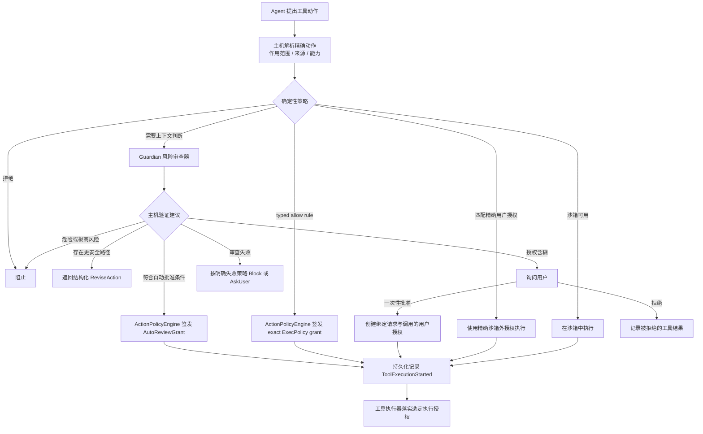

# Guardian：风险审核系统、边界与演进

> 文档所有权：本文件是 Guardian 跨 crate 风险判断语义和演进方向的权威文档。
>
> 文档状态：当前架构 + 明确的未来演进。

## 快速理解

Guardian 是 Ash 的风险审核系统，供权限模式 Auto 使用。系统及其实现组件统一使用 Guardian
命名；权限模式的显示名称为 Auto，ID 为 `auto`。

Guardian 只在确定性规则无法独立判断时提供风险建议；它不能覆盖安全规则，也不能自行签发
执行授权。

后端共享审核数据统一由 [`ash-protocol/guardian.rs`](../ash-rs/protocol/src/guardian.rs) 定义：动作与
能力身份、证据来源和信任类别、风险等级、用户授权程度、审核建议，以及绑定准确动作和策略
版本的审核结果。Core、审核器和策略引擎直接使用这些类型。沙箱执行上下文、分类器接口、
建议校验与最终授权仍归 `action-policy`；审核器的 `model_contract.rs` 负责模型提示和响应格式。

| 用户或开发者会遇到的情况 | 系统行为 | 最终责任方 |
| --- | --- | --- |
| 动作明确安全且沙箱足够 | 直接选择受限执行，不调用风险审查器 | 权限策略 |
| 动作命中确定性禁止规则 | 直接阻止，模型不能覆盖 | 权限策略 |
| 风险依赖用户意图和目标范围 | 请求 Guardian 给出批准、修改、询问或拒绝建议 | 风险审查器给建议，策略引擎作决定 |
| 建议不完整、越权或解析失败 | 失败即关闭，转为阻止或询问用户 | 策略引擎 |
| 沙箱报告结构化能力不足 | 只有确认未产生副作用且可安全重试时才重新审查 | Core 与权限策略 |
| 动作已开始但结果未知 | 不自动重放或提权重试 | Core 恢复逻辑 |

## 1. 决策摘要

### 审核模型选择

`agent.approvalReviewModel` 是独立的用户配置。Sessions 的“权限 → 审核模型”可以修改它。
`automatic` 按主模型的当前连接选用该连接定义的审核默认值；其他提供方保留自身默认值。

| OpenAI 连接 | 默认审核模型 | 默认思考强度 |
| --- | --- | --- |
| ChatGPT 订阅 | `codex-auto-review` | `low` |
| OpenAI API | `gpt-6-luna` | `low` |

`codex-auto-review` 是订阅服务的审核模型标识，不能据此断言底层模型就是 GPT-6 Luna。
用户可以明确绑定其他连接、模型和支持的思考强度：

```toml
[agent.approvalReviewModel]
type = "explicit"
connection = "openai"
reasoningEffort = "medium"

[agent.approvalReviewModel.model]
provider = "openai"
model = "gpt-6-luna"
```

`connection` 和 `reasoningEffort` 可省略。连接省略时使用所选提供方的当前连接；思考强度省略时
优先使用模型支持的 `low`，否则使用该模型的目录默认值。主模型的思考强度不传给审核模型。
显式连接必须已经配置，且必须服务于所选提供方；已知模型不支持的思考强度在保存时拒绝。
未列出的模型由连接服务检查是否可用。不可用时保留人工批准路径，不偷偷换用其他模型。
每轮使用冻结的审核配置；用户后续修改不会影响正在运行的审核。审核请求不包含工具权限。

无人值守运行仍可使用自动审核，但审核要求人工决定时，运行器中断并返回 `RequiresInteraction`。
该行为与权限模式独立：不会把“无人值守”解释成自动批准。

Ash 把 Guardian 定义为“受确定性策略约束的风险审查建议层”，而不是第二套权限系统。

核心决策：

- 主机先解析精确动作、来源、最小能力和沙箱兼容性；
- `ash-execpolicy` 对 Host / Organization / User / Directory typed rules 做纯求值；更严格 effect
  优先，Directory 不能产生 `AllowUnsandboxed`；该结果和 exact `UserAllowlist` 都优先于 LLM；
- `UserAllowlist` 只接受绑定动作摘要、完整能力集合与策略版本的精确沙箱外授权，不接受工具名称
  或命令前缀；
- 风险审查器只给出批准 `Approve`、修改动作 `ReviseAction`、询问用户 `AskUser` 或拒绝 `Deny`
  四种建议；
- 策略引擎 `ActionPolicyEngine` 是唯一把建议转成执行决定并签发授权的责任方；
- 自动授权绑定审查结论、动作摘要、完整能力集合和策略版本；
- 用户意图与证据必须带有明确的信任边界，仓库、工具和 Agent 内容默认不可信；
- 审查失败必须失败即关闭；
- 工具跨过副作用边界前必须持久化记录执行授权；
- 已开始但结果未知的动作不得由风险审查器自动重放；
- 确认且可安全重放的沙箱拒绝可以携带结构化执行证据回到风险审查器；普通命令失败、
  部分副作用可能发生或结果未知时不得自动提权重跑。

这套设计追求的不是“尽量少弹窗”，而是在危险自动批准率接近零的前提下，减少可确定安全场景的
无效打断。

## 2. 产品问题

纯沙箱模式无法覆盖所有真实 Agent 动作：

- 某些工作需要网络访问、外部服务修改、凭证或 UI 能力；
- 某些工具本身不适用本地进程沙箱；
- 用户经常明确请求一个有副作用但合理的动作；
- 动作的安全性依赖用户意图、目标作用范围、来源和上下文，而不只依赖工具名称。

只使用静态授权列表会过度阻塞；把权限直接交给 LLM 又不可接受。Guardian 位于两者之间：
用模型理解上下文和风险，用确定性策略保留最终授权权。

Guardian 不解决：

- 工具是否正确实现操作系统强制执行；
- 凭证是否可用；
- 外部服务是否接受请求；
- 动作执行后的业务成功与否；
- 已开始动作的严格单次执行保证；
- 用户组织的完整策略语言。

## 3. 系统所有权

| 组件 | 拥有 | 不拥有 |
| --- | --- | --- |
| 工具主机 | 精确解析动作、来源、最小能力和审查证据 | 最终策略决定 |
| `ash-execpolicy` | typed rules、layer merge、effect precedence、semantic revision 与纯求值 | 最终 grant、LLM、配置 I/O |
| `ash-action-policy` | rule effect 映射、exact grants、风险审查接口、风险与授权门槛和最终决定 | 规则持久化、LLM 提示词与模型提供方 |
| `ash-guardian-context` | 带来源和信任类别的审核上下文、整体输入预算 | 读取资料、调用模型、授予操作权限 |
| `ash-guardian-reviewer` | 审查协议、结论绑定、并发、期限、取消与重试 | 签发授权、执行工具、批准界面 |
| `ash-guardian-environment` | 项目资料扫描、来源版本、草稿确认与相关背景选择 | 调用模型、创建允许规则、授予操作权限 |
| `ext/guardian-v2` | 隔离模型适配和审核扩展安装 | 最终授权 |
| App Server | 配置安全点、审查模型解析和模型提供方适配器 | 审查建议的授权语义 |
| Core | 工具调度、类型化批准、持久化执行起点与提权、安全重试门槛、恢复和拒绝断路器 | 模型风险判断、操作系统沙箱 |
| 工具执行器与沙箱 | 执行选定授权、返回结构化结果、分类平台拒绝和隔离资源 | 放宽能力或重新解释用户意图 |
| Desktop、CLI 与 TUI | 展示批准和风险信息、收集用户决定 | 自行创建授权 |

关键依赖方向：

```text
工具主机 ──准备完成的动作与证据──► Core
Core ──审查请求──► ash-action-policy ──纯规则求值──► ash-execpolicy
ash-action-policy ──建议调用──► ash-guardian-reviewer
ash-guardian-reviewer ──模型请求──► ext/guardian-v2 审查适配器
ash-action-policy ──最终决定──► Core
Core ──精确执行授权──► 工具执行器与沙箱
```

`ash-action-policy` 不能依赖 `ash-guardian-reviewer`。它依赖自己定义的风险审查接口
`ActionClassifier`，因此未来可以替换模型实现、关闭 Guardian 或增加确定性审查器，而不改变
权限系统的最终授权责任。

`AutoReviewGrant` 和 `RunAutoReviewed` 是 `action-policy` 拥有的自动审核执行契约，描述授权来源与
执行方式；它们通过审查接口使用 Guardian，不把策略类型绑定到某个审核实现。

## 4. 端到端决策模型

### 4.1 当前：执行前决策



顺序本身是安全契约：

1. 精确确定性规则不得被模型覆盖；
2. 内置强制沙箱规则不得被用户授权列表覆盖；
3. 用户授权必须显式表示沙箱外执行权，不能由普通命令授权列表静默生成；
4. 沙箱能够满足动作时，不需要风险审查器扩权；
5. 风险审查建议必须重新经过主机不变量验证；
6. 授权必须绑定当前动作，而不是绑定工具名称或自然语言摘要；
7. 持久化执行起点必须先于副作用。

### 4.2 当前：沙箱拒绝回流

为了减少沙箱权限不足造成的人工中断，执行前决策后有一条严格受限的失败回流：

```text
沙箱内执行
├─ 成功 → 完成
├─ 普通命令失败 → 返回 Agent
├─ 超时或信号终止 → 返回 Agent
└─ 已确认的沙箱拒绝
   ├─ 可安全重放 → 带拒绝证据重新审查
   └─ 可能已有部分副作用或结果未知 → 不自动重放

重新审查
└─ 风险审查建议 → ActionPolicyEngine 校验
   ├─ 符合 Approve 条件 → 使用精确授权重试
   ├─ ReviseAction → Agent 提出更安全的动作
   ├─ AskUser → 请求用户批准
   └─ Deny → Block
```

这条回流只适用于平台后端能够结构化确认的沙箱强制拒绝。Core 和风险审查器不能从任意标准错误
输出、非零退出码或自然语言猜测沙箱拒绝；Seatbelt 与 Bubblewrap 后端只对各自认识的强制执行或
设置特征产生类型化分类。回流请求必须继续绑定原动作摘要、能力集合、策略版本与工具调用，并携带
长度受限且不含密钥的拒绝证据。

是否自动重试是 Core 的持久化执行决定，不是风险审查建议的隐含效果。如果第一次尝试可能已写入
文件、发出请求或产生其他副作用，即使风险审查器返回批准 `Approve`，Core 也不得自动重放原调用；
它只能记录终止或未知结果，并让 Agent 修改动作或请求用户决定。

`ash-protocol::SandboxDenialOutput` 保存原因、退出状态、标准输出、标准错误输出、聚合输出和
重放安全性。Core 从中截取最多 500 字符的原因和 2,000 字符的聚合输出给风险审查器；原结构化
拒绝与第二次执行授权一起持久化写入 `ThreadEvent::ToolExecutionEscalated`。第二次执行只允许
一次，不形成循环。

## 5. 风险与用户授权矩阵

风险审查器对批准 `Approve` 同时输出风险等级和用户授权状态。策略引擎 `ActionPolicyEngine` 使用固定
矩阵：

| 风险 | 明确授权 | 隐含授权 | 缺少或含糊 |
| --- | --- | --- | --- |
| 低 | 自动批准 | 自动批准 | 询问用户 `AskUser` |
| 中 | 自动批准 | 自动批准 | 询问用户 `AskUser` |
| 高 | 自动批准 | 询问用户 `AskUser` | 询问用户 `AskUser` |
| 极高 | 阻止 `Block` | 阻止 `Block` | 阻止 `Block` |

这里的“自动批准”仍然要求：

- 建议的能力集合与已解析动作完全一致；
- 审查结论的动作摘要与策略版本精确匹配；
- 策略没有确定性拒绝或强制沙箱冲突；
- Core 在执行前验证授权与当前工具调用的绑定。

矩阵是当前策略，不是永恒产品规则。调整它需要安全评测、用户交互影响分析和策略回归测试，不能
只修改提示词措辞。

## 6. 四种用户可见结果

### `Approve`

表示风险审查器认为精确动作与用户意图相符。它不会直接执行；只有符合上一节矩阵时，策略引擎
`ActionPolicyEngine` 才签发自动审查授权 `AutoReviewGrant`。

用户体验目标：明确、低到可控风险的动作不产生重复确认。

### `ReviseAction`

表示目标可以继续，但当前动作的能力或作用范围过宽。返回值携带最大能力集合
`maximum_capabilities`，父 Agent 必须选择实质上更安全的动作，而不是换一种命令重试同一危险
动作。

用户体验目标：优先产生安全进展，而不是简单拒绝或把所有判断推给用户。

### `AskUser`

用于授权缺失、目标含糊或高风险动作没有明确用户授权。批准请求绑定动作摘要、能力集合和策略
版本；批准只对当前工具调用生效。

用户体验目标：问题应描述具体副作用与作用范围，而不是只显示“需要权限”。

### `Deny`

用于极高风险、破坏性操作、数据外泄、凭证探测或规避策略。拒绝 `Deny` 作为结构化工具失败返回，
要求 Agent 不得通过间接命令或替代工具绕过。

用户体验目标：停止危险路径，同时在可能时允许选择不同的安全目标。

## 7. 上下文、信任与隐私

风险审查器需要理解用户意图，但“更多上下文”并不天然更安全。Ash 使用证据代理，而不是复制
完整对话记录：

- 用户直接消息和客户端明确提交的 Goal 修改标记为可信用户证据；Goal 工具写入仍属于 Agent 行为；
- 主机解析的动作与来源标记为可信主机元数据；
- Agent 消息、计划、仓库文件和工具结果标记为不可信内容；
- 证据限制条目数和字符数；
- 凭证、密钥和无关工具输出必须在进入风险审查器前移除。

信任标签只说明来源，不能证明内容真实。例如通过可信文件系统适配器读取的 README，内容仍属于
不可信仓库内容。

当前边界：

- Core 按事件顺序提供用户消息和客户端 Goal 修改；只有仍属于当前 Goal 的客户端修改才可作为当前用户意图，已完成、清除或被 Agent 替换的 Goal 修改仅保留为历史证据；
- 工具主机可提供动作专用、只读且不含密钥的证据；
- 风险审查器没有工具、凭证、修改能力或可变 Agent 记忆；
- 动作与上下文中的提示词注入只能作为数据，不能改变风险审查策略。

### 准备项目审核环境

Sessions 的“权限 → 准备审核环境”和 `/guardian setup` 为当前聊天的实际目录准备背景资料；
`/guardian` 打开同一管理入口。TUI 也提供 `/guardian setup`，可扫描项目、查看来源内容、逐项接受
或排除，再保存；当前 TUI 使用直接提取，不调用整理模型，也不扫描终端历史或其他仓库。
`/permission` 选择权限模式，`/init` 创建或更新 `ASH.md`，三个命令各自负责一个步骤。已建立的聊天按 Thread
解析工作目录，包括独立工作树；未发送的新聊天使用它所选的目录。资料按执行环境、物理目录对象
和路径绑定，存入工作区之外的用户 State 数据库，项目文件不承载这份资料。

| 条目 | 来源与确认 | 审核中的含义 |
| --- | --- | --- |
| 项目背景 | 用户接受的描述、项目说明以及所选来源的最新观察 | `environment_fact`，始终是不可信背景，不能授权操作 |
| 目标归属 | 用户明确描述哪个目标属于自己以及用途 | `environment_target`，仅确认归属和用途，不授权部署、上传、删除或使用凭据 |
| 操作权限 | 现有用户或组织 typed rules、访问范围和当前请求 | 仍由确定性策略执行；环境扫描不生成允许规则 |

流程为：选择读取范围 → 生成草稿 → 逐项接受、编辑或排除 → 保存已接受的条目。
关闭界面或取消扫描不会接受草稿。Sessions 可手动添加或修改描述。保存空列表移除用户描述和
构建配置等来源的跟随；`ASH.md`、`AGENTS.md` 仍属于项目的常驻说明。Guardian 不读取 Claude 专属的 `CLAUDE.md`。
准备时接受的项目来源会在读取资料和审核操作前重新检查 SHA-256 版本。变化后，旧描述停止用于
审核，后端自动保存带新来源版本的原始观察，无需常驻模型。新观察始终是未确认事实，不能继承
旧目标的归属或权限。未选入的构建来源不会自动加入审核；排除并保存一个来源后停止跟随。
事实观察与用户确认描述分别存储，实际变化才递增资料 revision；界面编辑仍按 revision 检查冲突。
每次初始审核和沙箱拒绝后的二次审核都重新读取，只选择与动作相关的当前资料；常驻项目说明优先
进入预算。使用自动审核结果执行前还会检查一次；资料发生变化时重新审核，沙箱外重试则停止。
普通业务代码没有被扫描，因此不需要每次编辑都重新整理整个项目。

默认只读取少量已知项目说明、构建清单、MCP 配置和 Git 配置，每个文件最多 32 KiB，
每条资料最多 4 KiB。近期会话命令、终端历史和其他仓库分别选择，默认关闭。开启近期会话后，
按当前授权的项目目录查询近期活动，默认最近 50 个会话、每会话最多 200 条命令，不按天数排除。
Sessions 可输入会话上限（1–200）、每会话命令数（1–2000）和可选天数（1–3650）；留空天数表示所有日期。
TUI 提供 50/100/200 个会话、200/500/2000 条命令及所有日期/30天/90天的选择。这些是本次扫描选项，
重新打开入口使用后端默认值。包含同目录其他聊天，未发送首条消息的 Directory 入口也可使用。
按最近成功命令的记录时间选择会话，不按会话创建时间判断。相邻目录、其他项目根和迁入本机的远程历史
不进入结果；Project 关联不会扩大目录范围。存储直接筛选命令，不恢复完整聊天，不把用户消息、模型推理或
工具输出取作资料。只采用已有非错误工具结果的命令，等待执行或被拒绝的调用不当成使用记录。
单条命令输入最多 32 KiB，合计最多 8 MiB、20000 条；每个选中会话先取一条最新命令，再轮流取后续记录，
一个繁忙会话不能占满其他会话的读取机会。返回覆盖量：时间范围内可用会话数、实际扫描会话数、选中会话的
可用命令数、实际扫描命令数，以及可用/保留的不同事实数。输入过大的调用不进入可用命令数。
界面显示这些数量，达到读取或事实预算时覆盖可能不完整，不能把未发现当成不存在。

读取范围与模型输入预算分别控制。命令先去除普通参数、URL 路径、用户信息、查询参数和正文，
只提取可执行命令名、主机与云存储桶线索；支持 shell-command、shell-session 的 start 和已有
exec_command、shell、run_command 记录。按命令名、目标分别去重，先按涉及会话数，再按出现次数排序，
每类最多保留 20 条事实。每条事实保留频次、会话数和不同会话中最新的最多 3 份来源样本，
样本含 Session、Thread、Turn、事件 sequence 和记录时间；桌面与 TUI 显示会话、聊天、轮次和记录时间。重复扫描更新同一事实的版本，
来源变化会清除该条的旧接受状态；新观察仍需用户接受。重新扫描读取最新记录；删除原会话后，
它不会再次进入扫描。原会话删除不会自动撤销已经保存的描述，用户可在资料界面排除并保存。
历史事实不能作为 target 确认目标归属，也不会转成允许规则。
终端历史只读取最后 32 KiB、最多 200 条命令中的可执行命令名，排除参数；其他仓库只检查主目录
直属目录中的 Git 远端，不读取其他仓库源码。历史观察不能确认目标归属。

开启“用当前任务模型整理资料”时，过滤后的观察会发送给当前任务模型。整理调用没有工具，
只能返回引用已有来源的事实草稿，不能确认归属、写入资料或产生权限规则；关闭该选项时直接审阅
提取出的资料。整理输入最多 48 KiB，完整条目超出模型预算时保留在草稿中供直接审阅。
Guardian 审核继续使用独立的审核模型和被冻结的审核配置，不共享整理模型的工具或记忆。
过滤器排除凭据文件、私钥块和凭据特征行；用户仍需检查草稿，避免在项目说明或手填资料中放入秘密。

这与 memories 共用“限定作用域、保留来源、按版本读取、限制预算、由用户控制”的原则。
memories 保存供任务取用的长期知识，Guardian 保存供独立审批取用的环境资料；Guardian 的近期命令直接查询
已有 Thread 历史，不再复制完整聊天或建立另一套会话存储。普通 Memory 的内容和写入权限不会成为审批授权，
本次扫描也不会自动开启 Memory 读取或写入。

该实现没有常驻扫描代理，也不会扫描整个仓库。范围选择、来源版本和接受状态通过同一后端
协议供其他产品端使用；当前交互入口在 Sessions 和 TUI，Rust 桌面端尚无准备面板。
它没有让审核模型自行改写配置，也没有自动扩大查询范围的补充调查代理。审核资料不足时仍由
现有审批流程询问用户；用户可从同一入口修正描述或重新扫描。真实模型准确率仍需独立评测，离线契约测试
不能证明某个模型或思考强度已达到生产安全门槛。

截至 2026-10-02，Claude 官方说明其 Auto 分类器默认使用 Sonnet 5，服务端配置可覆盖，
并不简单跟随会话 `/model`；官方未说明 `/auto-mode-setup` 的整理模型。
Ash 的整理调用使用当前任务模型，Guardian 使用独立、可配置的审核模型；两种角色不共享权限。
对照来源：[Claude 权限模式](https://code.claude.com/docs/en/permission-modes)、
[Claude 环境准备](https://code.claude.com/docs/en/auto-mode-config)。
官方没有公布近期会话的数量或天数。本机 Claude Code 2.1.285 的环境准备实现读取最近 50 个
项目会话文件，跳过大于 25 MiB 的文件，没有固定天数筛选；这是该版本的实现细节。
Ash 将扫描范围显式放入协议，由后端提供默认值，界面允许调整并显示实际覆盖量。

未来若引入记忆、组织策略或外部信誉证据，必须定义独立来源和优先级，不能把它们拼成无类型
提示词。

## 8. 失败、重试与恢复原则

Guardian 的失败模式必须显式：

- 模型不可用、超时、取消、JSON 格式错误和能力不匹配都不能产生授权；
- 主机使用 `ReviewFailurePolicy::Block` 或 `AskUser`，不存在失败即放行；
- 沙箱内进程返回非零退出码，不代表应该自动进行沙箱外重试；
- 只有执行器结构化确认且标记为可安全重试 `SafeToRetry` 的沙箱强制拒绝才能进入二次审查；
- 沙箱拒绝前可能已经完成部分副作用；不能证明可安全重放时，即使获得新授权也不得自动重放原
  工具调用；
- 动作、能力集合、工作目录、环境、来源或策略版本改变后必须重新审查；
- 工具已持久化记录执行开始但没有终止结果时，结果视为未知，不自动重放。

风险审查拒绝会作为结构化反馈返回 Agent。单个 Turn 连续 3 次，或最近 50 个工具结果中累计
10 次审查拒绝，会触发断路器并中断该 Turn。这是为了防止模型通过不断改写命令试探策略边界，
不是限制用户重新发起一个明确的新请求。

## 9. 审计与可观测性

一次可审计的执行至少关联：

- 动作摘要与工具调用标识；
- 策略版本、审查协议版本和审查结论 ID；
- 审查建议与最终决定；
- 匹配的确定性规则、现有授权或用户批准标识；
- 持久化执行授权；
- 沙箱拒绝的原始结构化输出、重放安全性与持久化提权授权；
- 执行是否已开始，以及终止或未知结果。

审查结论 ID 对规范化建议建立稳定身份，因此模型 JSON 的空格变化不会制造新结论；审查协议或
策略语义变化必须使用新版本。

安全指标按优先级排序：

1. 危险动作错误自动批准率；
2. 提示词注入与规避策略通过率；
3. 不必要的询问用户比例；
4. 建议、风险与授权准确率；
5. `ReviseAction` 后安全完成目标的比例；
6. 不同模型与审查协议版本的一致性和漂移。

## 10. 当前实现状态

已经实现：

- 确定性策略优先的 `ActionPolicyEngine` 决策顺序；
- 四种风险审查建议；
- 建议与能力集合两层严格 JSON 解析，以及策略拥有的精确或子集验证；
- 64 KiB 序列化输入上限，以及适配器和风险审查器两层 16 KiB 响应上限；
- 提示词、响应模式与审查协议版本的原子绑定；
- 风险 × 用户授权自动批准矩阵；
- 绑定审查结论的 `AutoReviewGrant` 与绑定工具调用的执行授权；
- 长度受限的用户意图和带信任标签的证据；
- 类型化持久化批准、执行起点标记和未知结果不重放；
- 协议拥有的结构化进程与沙箱结果；
- Seatbelt 与 Bubblewrap 后端专用的拒绝分类；
- 可安全重试的沙箱拒绝二次审查、精确授权、持久化提权与单次重试；
- 可能已有副作用时禁止重放；
- 结构化的安全动作建议、拒绝反馈与单 Turn 断路器；
- App Server 不可变且不带工具的审查模型适配器；
- 独立的审核连接、模型、思考强度，以及订阅/API 默认分支；
- 按实际工作目录绑定的审核环境草稿、逐项确认、版本校验、相关证据选择和取消；
- 合成种子样本集和 Cargo、Bazel 离线契约测试。

当前仍有限：

- 风险审查器是单次模型调用，没有分层审查或多审查器协作；
- 沙箱拒绝分类器覆盖 Unix 已知拒绝特征与 SDK 错误与普通进程退出状态。Unix 输出文字不证明
  命令未执行，不能据此重放；真实平台拒绝样本集仍不足；
- 沙箱拒绝后的询问用户 `AskUser` 当前终止原工具调用，由 Agent 发起新的批准路径，不在同一个
  已开始调用上建立可恢复的批准等待；
- 提示词策略是编译期常量；
- 没有真实模型基准运行器、影子模式遥测或人工标注流水线；
- 没有组织策略引导；
- 样本集规模小，主要用于证明契约与建立回归入口，不能代表生产分布；
- 没有足够数据支持微调决策。

## 11. 演进方向

### 近期：建立可测量性

- 实现显式模型评测运行器，不进入默认 CI；
- 按模型和审查协议版本输出安全指标；
- 扩充真实缺陷、人工改判和策略回归的匿名合成复现；
- 为错误自动批准设置发布门槛；
- 先运行影子模式，再讨论扩大自动批准覆盖率；
- 用真实平台拒绝样本评估分类器的误报与漏报，并扩展 Windows 后端。

### 中期：提高可控性

- 将私有版本化响应模式导出为评测和工具可消费的产物；
- 增加组织策略引导，并与不可信上下文分层；
- 改善询问原因和 `ReviseAction` 的可执行性评测；
- 增加风险审查器校准与高风险二次检查，但保持确定性授权责任。

### 潜在方向：专用模型

只有在积累足够高质量、经过隐私审查的标签后，才评估：

- 小型专用风险分类器；
- 模型微调；
- 分层模型路由；
- 多风险审查器意见不一致时的升级处理。

训练模型不是评测的前置条件。没有可靠评测集时训练只会把未知错误固化进模型。

## 12. 长期不变量

无论未来使用何种模型或数据，以下边界不变：

- 风险审查器不成为能力授权方；
- 模型输出不能覆盖主机解析的动作标识；
- 不可信内容不能改变风险审查策略；
- 审查失败不产生授权；
- 高风险或极高风险的放宽必须经过确定性策略和可审计版本；
- 未知执行结果不由风险审查器自动重放；
- 凭证和密钥不进入评测样本集或普通审查上下文。

Guardian 的实现细节、错误语义和修改指南见
[`ash-guardian-reviewer` README](../ash-rs/ext/guardian-reviewer/README.md)；确定性决策引擎与授权实现见
[`ash-action-policy` README](../ash-rs/action-policy/README.md)。
