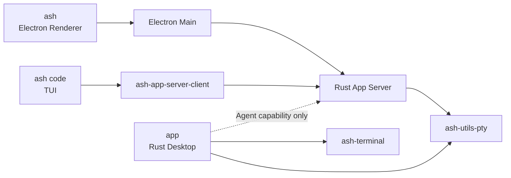

# Ash 产品线与宿主边界

> 状态：Current product model。本文是三条公开产品线的 canonical 说明。
> Electron Desktop 的内置 Workbench 模式与窗口重载入口见 [`workbench-modes.md`](workbench-modes.md)；
> 具体实现分别见 [`cli`](../cli/README.md)、[`code`](../code/README.md)、
> [`ash-desktop-architecture.md`](ash-desktop-architecture.md) 和
> [`app-rs/TERMINAL.md`](../app-rs/TERMINAL.md)。

## 快速理解

Ash 有三个独立 UI 宿主，共享 `ash-rs` 的 Rust 后端契约。仓库根部的 `cli/` 提供用户运行的 `ash` 命令；
无子命令时由它启动 `code/` 的 TUI，管理命令则直接连接共享 App Server。凡是
`Session`、`Thread`、`Turn`、`ThreadItem` Agent 产品能力，都必须经过 App Server；`app-rs`
当前直接组合的路径只属于终端/PTY 宿主，不是 Agent API 的例外。

| 产品线 | 产品形态 | 当前 UI/宿主 | 前后端接线 | 终端实现边界 |
| --- | --- | --- | --- | --- |
| `ash code` | TUI 产品 | `code/tui`，由根部 `cli` 启动 | `ash-app-server-client` 连接 App Server | TUI 管理自己的 `crossterm`/`ratatui` 宿主终端；不直接拥有子 PTY |
| `ash` | Electron Desktop | `app-ts` 的 Renderer、Preload 与 Electron Main | Electron Main 连接 Rust App Server | 当前 Renderer 用 xterm；Rust/App Server 管理 `ash-utils-pty` |
| `app` | Rust Desktop 工作台 | `app-rs` 的 Rust 窗口与 UI | Agent 能力通过 App Server；外部 AI CLI 由 Terminal host 启动 | `ash-terminal` 负责终端语义，`ash-utils-pty` 负责 AI CLI 的 PTY/进程 |

产品线与 Electron 的内部 Workbench 模式不是同一个维度。Desktop 在同一个 `ash` 安装包中提供 `code`、`academic` 两个内置模式；它们不代表 `ash code` TUI，也不构成额外的公开产品线。用户可以在设置中选择模式，当前 Workbench 窗口在 reload 边界重新装配；开发和测试可以用 `ASH_WORKBENCH_MODE` 覆盖初始模式。具体说明见 [`workbench-modes.md`](workbench-modes.md)。

## 当前调用关系

`Electron Main` 只属于 `ash` 产品线。它负责 Electron 生命周期、App Server 连接、
可信 IPC 和 Renderer adapter。三个宿主及根部 CLI 各持有自己的连接；同一 `ASH_HOME`
指向同一个用户 profile，连接由同一个本地 App Server 管理。客户端不能因为安装在同一台设备上就
直接读写另一个客户端的进程内状态。协议主版本或必需能力不兼容时必须明确报错，不能在连接时替换正在
服务其他客户端的进程。

三条产品线通过 App Server 注入同一个 `mxc-sandbox` 适配器。Windows 由 Microsoft MXC SDK 执行系统隔离，
不注册 Ash 机器服务；平台依赖与进程生命周期见 [`sandboxing.md`](sandboxing.md)。

`ash code` 的 TUI 宿主终端和“运行一个子 Shell 的终端能力”必须区分：前者属于 TUI 的
`crossterm`/`ratatui` 事件循环，后者如果产品需要，应通过 App Server 的 typed contract 使用
后端 PTY。TUI 不因为运行在终端里，就自动成为 PTY owner。

## 终端分层

| 层 | 当前 owner | 负责什么 | 不负责什么 |
| --- | --- | --- | --- |
| PTY/进程层 | `ash-utils-pty` | spawn、读写、resize、signal、exit | ANSI/VT 解析、网格、scrollback 语义 |
| 终端语义层 | `app-rs/terminal` 的 `ash-terminal` | App 进程内的 ANSI/VT parser、cell/grid、cursor、mode、scrollback 等 | 创建 Shell 进程、Electron IPC、产品窗口 |
| 产品后端层 | Rust App Server | 连接级 Terminal session、授权、生命周期和 protocol DTO | Renderer DOM 或 TUI 绘制 |
| Electron 桥接层 | `ash` 的 Electron Main | 进程监督、trusted IPC、Renderer adapter | 复制 Rust 终端状态机 |
| TUI 宿主层 | `ash code` 的 `ash-tui` | raw mode、alternate screen、输入事件和 Ratatui frame | 第二套 Agent runtime 或 PTY authority |
| Rust 窗口层 | `app` 的 `app-rs/` | 窗口、GPU/UI、终端输入输出组合 | Electron Main、Renderer bridge |

`ash-terminal` 与 `ash-utils-pty` 在 `app` 中分别承担终端模型与进程执行。Electron Renderer 的 xterm
继续持有本端终端模型；App Server 提供 PTY 字节与进程状态，不统一接管各前端的网格、光标或滚动。

## 代码入口对照

| 公开产品线 | 当前代码入口 | 当前状态 |
| --- | --- | --- |
| `ash code` | `cli` 的 `ash` binary → `code/tui` | TUI 产品路径已存在；TUI 通过 App Server Client 工作 |
| `ash` | `app-ts` Electron client | Electron Desktop 已存在；统一 Renderer 包含 Code 与 Academic，默认模式为最近保存的选择 |
| `app` | `app-rs/` 的 `app` binary | 终端宿主已存在，并直接组合 `ash-terminal` 与 `ash-utils-pty`；Agent 能力通过 App Server 使用 |

## Canonical `just` 命令

| 命令 | 产品线 | 运行方式 |
| --- | --- | --- |
| `just ash` | `ash code` | 从 Rust workspace 启动 TUI，并接收 CLI 参数 |
| `just ash-desktop` | `ash` | 启动 Electron Desktop 开发环境 |
| `just app` | `app` | 启动纯 Rust Desktop |

产品线命令是公开的 `just` 命令面；不要为 TUI 或底层实现再建同义入口。

修改产品归属、前后端接线或终端 owner 时，先以本文的产品线定义为准，再分别更新对应
宿主文档和实现 README；不要用 `code`、`ash-tui` 或旧迁移标识反推公开
产品线名称。
