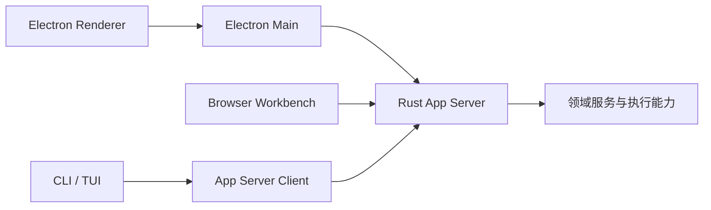

# Ash 产品与宿主边界

桌面产品名为 **Ash**，终端产品名为 **Ash Code**。Electron/Web 界面和 CLI/TUI 共享 Rust App Server 契约。统一 CLI 可执行文件名为 `ash`，不带子命令时打开 TUI；`ash app .` 打开已安装的桌面应用和当前目录。目前没有 `ash code` 子命令。

| 入口                          | 源码                           | 负责什么                                       |
| ----------------------------- | ------------------------------ | ---------------------------------------------- |
| Electron 与 Browser Workbench | `src/`                         | 界面、编辑器状态、窗口与前端服务               |
| `ash` 命令                    | `cli/`                         | 参数解析、管理命令、TUI 启动与桌面启动交接     |
| Ratatui TUI                   | `crates/tui/`                  | 宿主终端、输入、布局、绘制和 raw mode 生命周期 |
| 共享后端                      | `crates/` 中的领域与服务 crate | 协议、业务、持久化和执行                       |

```mermaid
flowchart LR
    Desktop[Electron Renderer] --> Main[Electron Main]
    Main --> Server[Rust App Server]
    Web[Browser Workbench] --> Server
    CLI[CLI / TUI] --> Client[App Server Client]
    Client --> Server
    Server --> Domains[领域服务与执行能力]
```

Session、Thread、Turn 和 ThreadItem 能力经过 App Server。各客户端持有自己的界面状态和连接，通过同一版本化契约访问后端；不能直接读写另一个客户端的进程内状态。

`cli/` 和 `crates/` 位于同一 Cargo workspace。目录位置不会决定安装包内容：Desktop 构建选择后端程序；Code 发布包在共享运行包之外加入 CLI。后端不得依赖终端呈现或 CLI 产品入口。TUI 控件不用于 HTML 界面，双方复用后端领域能力和协议。

`crates/utils/pty` 拥有进程与字节传输；Electron Renderer 的 xterm 拥有界面端的终端模型。`crates/terminal` 保留 ANSI/VT 解析、网格与输入编码，供 CLI 的真实终端测试使用，不拥有窗口、PTY 或 Agent runtime。

在仓库根目录运行 `just ash` 启动 Ash Electron 桌面端，`just ash-code` 启动 Ash Code CLI/TUI，`pnpm dev:web` 或 `pnpm dev:web:full` 启动 Web。Desktop 的 Code Workbench 与 Academic 文档贡献是同一产品内的功能，详见 [Workbench 模式](workbench-modes.md)。

实现入口见 [CLI](../cli/README.md)、[TUI](../crates/tui/README.md)、[前端开发](frontend.md)、[Desktop 架构](ash-desktop-architecture.md)和 [运行包构建](../build/runtime/README.md)。
