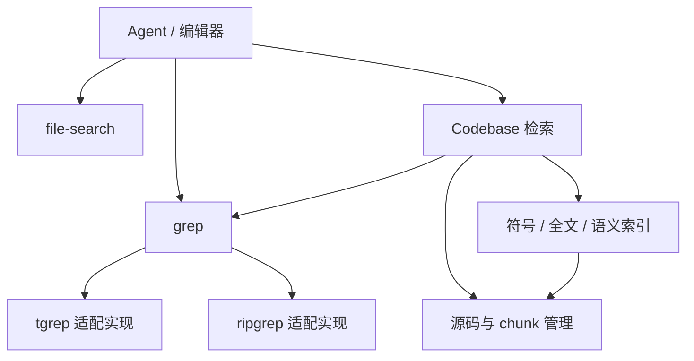

# 搜索架构与内容搜索

> 本文维护搜索能力的目标依赖关系、实现状态和跨文件内容搜索的产品边界。实现分别见
> [`ash-grep`](../ash-rs/grep/README.md) 与
> [`ash-app-server`](../ash-rs/app-server/README.md)。

## 目标依赖关系

Agent 和编辑器消费公共搜索能力；Codebase 的检索模块组合文字、符号、全文和语义候选。
箭头表示调用或依赖：前端通过 RPC，Rust 内部直接调用能力接口。图中的节点表示职责，
不要求每个节点拆成独立 crate。



| 能力 | 职责与依赖边界 |
| --- | --- |
| `grep` | 文件内容查询；依赖目录访问、索引存储和引擎适配，不依赖使用者 |
| `file-search` | 文件枚举、路径匹配和模糊搜索；与 grep 并列，各自封装实现 |
| Codebase 检索 | 调用 grep 获取文字候选，组合其他候选，再通过源码管理复核、去重和限额 |
| 源码与 chunk 管理 | 扫描、分块、版本与未保存内容管理；不依赖 grep |
| 符号、全文和语义索引 | 消费已授权、已复核的源码与 chunk，维护各自查询所需的数据 |
| Agent / 编辑器 | 选择所需能力，负责请求转换、权限衔接、结果预算和呈现 |

文件名、文字、符号和向量索引分别由对应能力管理。grep 返回匹配位置；Codebase 保留
源码与 chunk 身份的所有权，使用当前源码复核候选。

### 宿主组装与资源所有权

```text
宿主
 ├─ 创建 grep 共享服务
 ├─ 创建 file-search 服务
 ├─ 创建 Codebase，并向检索模块注入 grep 接口
 └─ 给 Agent、编辑器接入相应能力
```

- 宿主读取公共配置，创建服务并注入使用者；公共服务不经 Agent 工具组合向其他使用者提供。
- grep 按目录复用索引会话，管理引擎进程与缓存生命周期；调用方只持有能力接口。
- 请求的权限、取消、分页游标与结果预算分别管理；共享索引不扩大任何调用方的授权范围。
- 调用入口核验权限，能力内部约束目录范围；未保存内容由持有源码视图的上层合并。
- 查询契约表达文字/正则、大小写、范围、过滤、上限和新鲜度；引擎命令行参数留在适配实现内部。
- `Indexed` 允许外部修改短暂滞后，`Current` 搜索当前磁盘；索引就绪只表示覆盖完整。

## 实现状态

当前实现按上面的职责关系组装；各入口保留自己的权限、结果预算和展示方式。

| 项目 | 实现 | 边界 |
| --- | --- | --- |
| 公共内容搜索 | Agent、编辑器和 Codebase 检索使用公共 grep 服务 | 共享目录索引，分别管理请求 |
| 配置与组装 | 宿主持有 `EnvRuntimeConfig`、grep 与 file-search；分别注入使用者 | `LocalToolConfig` 只保留工具执行策略，工具组合不向宿主提供公共服务 |
| Codebase 职责 | `CodebaseRetrievalService` 组合 FTS、grep、符号和语义候选 | `Codebase` 的源码、chunk 与版本管理不引用 grep |
| 文件路径搜索 | `file-search::Service` 提供 glob / 枚举与模糊搜索入口；Agent、CLI、TUI 和 Rust 桌面文件面板调用公共能力 | glob 读当前路径并按修改时间排序；模糊搜索复用请求内的路径索引 |
| 查询新鲜度 | Rust API 与 RPC 均支持 `Indexed` / `Current`，RPC 成功结果返回实际模式 | 编辑器默认保持当前磁盘搜索；Agent 和 Codebase 使用索引候选 |

实现入口：[宿主组装](../ash-rs/app-server/src/server/environment_runtime.rs)、
[检索组合](../ash-rs/codebase/src/retrieval/service.rs)、
[文件路径搜索](../ash-rs/file-search/README.md)、
[搜索协议适配](../ash-rs/app-server/src/server/search_operations.rs)。下文描述当前内容搜索行为。

## 结论

内容搜索针对一个明确的 `Dir` 执行。目录由 `DirId` 定位，调用入口必须具备
`SearchFiles`；`cwd`、窗口中打开的项目和 Session 都不会自动扩大搜索范围。

```text
Search UI
  → IContentSearchService
  → ash:content-search:*
  → grep/search/*
  → DirId + Authorization<SearchFiles>
  → ash-grep
```

桌面端可以把多个窗口文件夹聚合成一次用户操作，但它必须逐个目录发起搜索并保留目录身份。
核心搜索服务不创建“主目录”“附加目录”或 Workspace 身份。

## 所有权

| 内容 | 所有者 |
| --- | --- |
| 查询表单、结果分组、高亮和取消时机 | Renderer |
| IPC 参数形状和输入上限 | Electron Main |
| 目录选择、`SearchFiles` 检查和连接级任务路由 | App Server |
| 引擎选择、执行、结构化结果、目录索引、分页和取消 | `ash-grep` |
| 文件名模糊查找 | `ash-file-search` |
| Agent 的 `grep` 工具 | Tool 授权、100 行预算和模型文本格式；调用公共 grep API |
| Codebase 文字候选 | 调用公共 grep API，将命中映射为自己的 chunk，再复核当前内容 |

## 协议

协议提供三个有界 pull RPC：

- `grep/search/start` 冻结目录、查询和上限，返回 `searchId`。
- `grep/search/read` 使用游标读取下一批匹配项；`completed` 仅在查询结束且当前游标已读完结果时为真。
- `grep/search/cancel` 终止并释放任务。

IPC 通道使用 `ash:content-search:*`。公开接口使用完整的 `ContentSearch*`，因为它跨越
Renderer、Electron Main 和 App Server；搜索模块内部的私有函数只使用 `start`、`read`、`cancel`
等无歧义短词。

## 边界

- query 最大 16 KiB；include/exclude 各最多 64 项；单项最大 1 KiB。
- glob 必须相对所选目录，绝对路径、`..`、前导 `!` 和 NUL 会被拒绝。
- 单次任务最多返回 5,000 条结果，读取批次最多 200 条。
- 任务绑定创建它的 App Server connection，其他连接不能读取或取消。
- 引擎由公共 `[grep].backend` 配置选择；命令通过参数数组启动，不经过 shell。
- RPC 的 `freshness` 可选 `indexed` / `current`，省略时为 `current`；成功查询的读取结果返回实际模式。
- 编辑器默认请求 `Current`，直接搜索磁盘；Agent 和 Codebase 文字候选使用 `Indexed`。
- 公共结果保留 UTF-8 byte ranges，App Server 协议适配器转换为 UTF-16；前端不重新解释。

## 公共能力

Agent、Codebase 和编辑器共用 `grep::Search`，并注入同一 `grep::Service`。索引按目录复用，
没有 Agent 专属后端或索引目录。配置切换更新同一个服务，现有使用者不保留旧引擎。

- `grep/index/status` 返回公共索引状态；`ready` 只表示覆盖完整。
- `grep/index/rebuild` 重建活动目录的索引。
- `grep/index/disableAndDelete` 提交公共配置、释放服务，再删除活动目录的缓存。

原 `[agent].grepBackend` 自动迁移到 `[grep].backend`；公共协议使用 `grepBackend`。

## 与其他能力的关系

内容搜索不等于 Codebase 检索。前者要求逐行、正则和 glob 语义；后者返回经过当前源码复核和
byte budget 的代码证据。Agent `grep` 也使用独立的工具授权和结果预算。

Session 目录可以供 Agent 工具使用，但不会悄悄进入产品搜索面板。窗口切换、`cwd` 变化或新增
Session 目录时，调用方必须重新明确选择要搜索的 `DirId`。

## 不变量

- 搜索范围由 `DirId` 与 `Authorization<SearchFiles>` 决定，不由裸路径或 `cwd` 推断。
- 多目录搜索是上层聚合，不改变每个结果所属的目录。
- Renderer 不获得任意进程或磁盘访问能力。
- 产品搜索与 Agent Tool 保持独立权限、任务和结果契约。

## 回归验证

```sh
just check-search
just test-search
just test-search-package --package-dir /absolute/path/to/assembled-package
```

- `check-search` 从 Cargo 依赖关系发现 grep、file-search 的全部直接使用者，包含 Rust
  桌面文件面板；新增使用者会自动进入编译检查。`--deny-warnings` 同时检查所有 target。
- `test-search` 执行能力层与宿主的定向 Rust 测试、前端搜索生命周期测试、Renderer 类型检查
  和消费者 warning 检查。Codebase 集成测试使用真实 SQLite FTS，并先证明 FTS 无法命中，
  再验证 grep 候选映射、当前源码复核和未保存内容。前后端均验证并发搜索的取消隔离。
- `test-search-package` 启动指定包内的 App Server，清空搜索引擎的 `PATH`，验证 tgrep
  摘要、索引构建、150 条结果的分页、当前磁盘新鲜度、Codebase 调用和宿主退出时的进程回收。
  使用宿主 Node 的开发包可传 `--node-bin /absolute/path/to/node`；发布包使用内置 Node。
  可传 `--report /absolute/path/to/report.json` 保存结果。

发布工作流在能直接执行目标二进制的构建项中运行打包验证；交叉编译项不冒充运行验证。
强制终止宿主或遗留 tgrep 都视为失败，清理诊断附加到原始错误。
