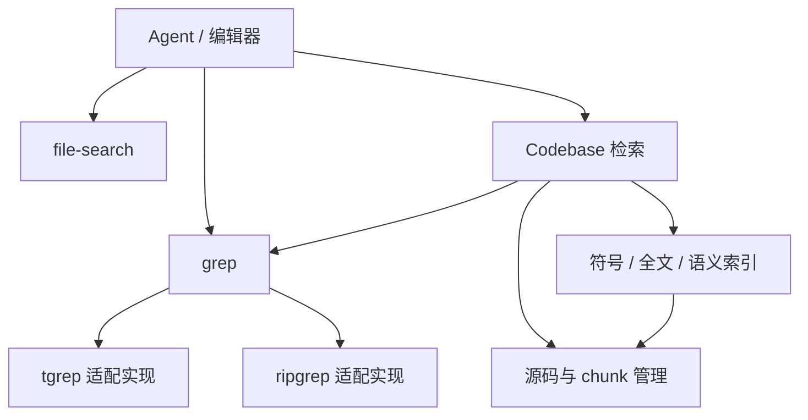

# 搜索架构与内容搜索

> 本文维护搜索能力的目标依赖关系、实现状态和跨文件内容搜索的产品边界。实现分别见
> [`ash-grep`](../crates/grep/README.md) 与
> [`ash-app-server`](../crates/app-server/README.md)。

## 目标依赖关系

Agent 和编辑器消费公共搜索能力；Codebase 的检索模块组合文字、符号、全文和语义候选。
箭头表示调用或依赖：前端通过 RPC，Rust 内部直接调用能力接口。图中的节点表示职责，
不要求每个节点拆成独立 crate。


```mermaid
flowchart TD
    A[Agent / 编辑器] --> G[grep]
    A --> F[file-search]
    A --> C[Codebase 检索]
    C --> G
    C --> S[源码与 chunk 管理]
    C --> I[符号 / 全文 / 语义索引]
    I --> S
    G --> T[tgrep 适配实现]
    G --> R[ripgrep 适配实现]
```

| 能力                 | 职责与依赖边界                                                       |
| -------------------- | -------------------------------------------------------------------- |
| `grep`               | 文件内容查询；依赖目录访问、索引存储和引擎适配，不依赖使用者         |
| `file-search`        | 文件枚举、路径匹配和模糊搜索；与 grep 并列，各自封装实现             |
| Codebase 检索        | 调用 grep 获取文字候选，组合其他候选，再通过源码管理复核、去重和限额 |
| 源码与 chunk 管理    | 扫描、分块、版本与未保存内容管理；不依赖 grep                        |
| 符号、全文和语义索引 | 消费已授权、已复核的源码与 chunk，维护各自查询所需的数据             |
| Agent / 编辑器       | 选择所需能力，负责请求转换、权限衔接、结果预算和呈现                 |

文件名、文字、符号和向量索引分别由对应能力管理。grep 返回匹配位置；Codebase 保留
源码与 chunk 身份的所有权，使用当前源码复核候选。

### 宿主组装与资源所有权

```text
宿主
 ├─ 创建 grep 共享服务
 ├─ 创建 file-search 服务
 ├─ 创建 Codebase，并向检索模块注入 grep 接口
 └─ 给 Agent、编辑器接入相应能力
```

- 宿主读取公共配置，创建服务并注入使用者；公共服务不经 Agent 工具组合向其他使用者提供。
- grep 按目录复用索引会话，管理引擎进程与租约生命周期；调用方只持有能力接口。App Server 删除 worktree 前等待已开始的搜索并确认释放其搜索租约。
- 请求的权限、取消、分页游标与结果预算分别管理；共享索引不扩大任何调用方的授权范围。
- 调用入口核验权限，能力内部约束目录范围；未保存内容由持有源码视图的上层合并。
- 查询契约表达文字/正则、大小写、范围、过滤、上限和新鲜度；引擎命令行参数留在适配实现内部。
- `Indexed` 允许外部修改短暂滞后，`Current` 搜索当前磁盘；索引就绪只表示覆盖完整。

## 实现状态

当前实现按上面的职责关系组装；各入口保留自己的权限、结果预算和展示方式。

| 项目             | 实现                                                                                                                        | 边界                                                               |
| ---------------- | --------------------------------------------------------------------------------------------------------------------------- | ------------------------------------------------------------------ |
| 公共内容搜索     | Agent、编辑器和 Codebase 检索使用公共 grep 服务                                                                             | 共享目录索引，分别管理请求                                         |
| 配置与组装       | 宿主持有 `EnvRuntimeConfig`、grep 与 file-search；分别注入使用者                                                            | `LocalToolConfig` 只保留工具执行策略，工具组合不向宿主提供公共服务 |
| Codebase 职责    | `CodebaseRetrievalService` 组合 FTS、grep、符号和语义候选                                                                   | `Codebase` 的源码、chunk 与版本管理不引用 grep                     |
| 文件路径搜索     | `file-search::Service` 提供 glob / 枚举与模糊搜索入口；Agent、CLI、TUI、Rust 桌面文件面板及 TS 工作区文件选择器调用公共能力 | glob 读当前路径并按修改时间排序；模糊搜索复用请求内的路径索引      |
| 查询新鲜度       | Rust API 与 RPC 均支持 `Indexed` / `Current`，RPC 成功结果返回实际模式                                                      | 编辑器默认保持当前磁盘搜索；Agent 和 Codebase 使用索引候选         |
| 索引 glob 与诊断 | tgrep 的正向 glob 保持索引查询；Rust 结果和 RPC 分页提供查询计划及候选统计                                                  | 统计包含已确认的 Ash 写入，描述内容匹配前的文件筛选                |

实现入口：[宿主组装](../crates/app-server/src/server/environment_runtime.rs)、
[检索组合](../crates/codebase/src/retrieval/service.rs)、
[文件路径搜索](../crates/file-search/README.md)、
[搜索协议适配](../crates/app-server/src/server/search_operations.rs)。下文描述当前内容搜索行为。

## TS 工作区文件查询

聊天“添加上下文 → 工作区文件”通过 `IFileSearchService` 调用 `file/search/glob`，与
Agent glob 复用 App Server 持有的 `file-search::Service`。Workbench 显式传入文件夹 `dirId`；
Sessions 传入绑定原始根目录的 `sessionId` 与路径。App Server 检查对应目录的 `SearchFiles`，
并在扫描期间持有授权租约；裸路径不能独立授予访问权。

- include/exclude 各最多 64 项、每项最多 1 KiB；结果上限为 1–5,000。选择器每次取 100 个结果。
- 空 include 枚举遵守 Git ignore 和隐藏文件规则的文件；正向 glob 保持 rg override 语义。
- 返回以 `/` 分隔的根目录相对路径及匹配总数；路径排序与 Agent 使用同一实现。
- 每次请求携带唯一 `operationId`。输入变化、关闭选择器或销毁 Composer 时发出
  `file/search/glob/cancel`；取消仅作用于当前连接。取消响应确认已收到请求，原请求仍返回终态。
- 前端丢弃过期结果，不用首批 100 项在本地替代整个工作区查询。普通输入匹配路径片段；
  `src/*.ts` 等显式 glob 交给后端解释。文件内容快照和未保存编辑器文本继续由前端持有。

没有 App Server 的独立浏览器运行时由 `BrowserFileSearchService` 遍历浏览器授权资源，
使用已有前端 matcher；它不承诺 Rust 的 Git ignore/rg override 或修改时间排序语义。
这是运行时组装的实现选择，连接失败不会转入浏览器扫描。前端对已有路径的同步匹配仍在本地；
文件搜索过滤不作为沙箱的路径权限规则。

## 结论

内容搜索针对一个明确的 `Dir` 执行。目录由 `DirId` 定位，调用入口必须具备
`SearchFiles`；`cwd`、窗口中打开的项目和 Session 都不会自动扩大搜索范围。

```text
Search UI
  → IContentSearchService
  → Renderer protocol client / host relay
  → grep/search/*
  → DirId + Authorization<SearchFiles>
  → ash-grep
```

桌面端可以把多个窗口文件夹聚合成一次用户操作，但它必须逐个目录发起搜索并保留目录身份。
核心搜索服务不创建“主目录”“附加目录”或 Workspace 身份。

## 所有权

| 内容                                             | 所有者                                                      |
| ------------------------------------------------ | ----------------------------------------------------------- |
| 查询表单、结果分组、高亮和取消时机               | Renderer                                                    |
| 类型协议与参数校验                               | Renderer 协议客户端与 App Server；Main 只转发传输           |
| 目录选择、`SearchFiles` 检查和连接级任务路由     | App Server                                                  |
| 引擎选择、执行、结构化结果、目录索引、分页和取消 | `ash-grep`                                                  |
| 文件名模糊查找                                   | `ash-file-search`                                           |
| Agent 的 `grep` 工具                             | Tool 授权、100 行预算和模型文本格式；调用公共 grep API      |
| Codebase 文字候选                                | 调用公共 grep API，将命中映射为自己的 chunk，再复核当前内容 |

## 协议

Workbench 的搜索结果由 `SearchResultImpl` 保留。Dismiss 通过
`search.action.remove` 移除所选匹配、文件或文件夹；文件夹包含的结果与空分支一起清理，
计数、焦点、搜索编辑器和聊天上下文快照均使用剩余结果。该操作不删除或改写磁盘文件，
不修改查询、后端授权或搜索任务。正在运行的搜索继续接收批次；后续批次可以重新加入
已移除的匹配。刷新重新搜索文件，不保留本次移除状态。
移除当前焦点后优先选择后续同类结果，没有后续结果时选择最后一个同类结果；
匹配或文件可以跨折叠分支继续，树负责展开目标的祖先并恢复焦点和选区。

Copy All 使用 `search.action.copyAll`，仅在 Search 容器处于 active 状态时执行；
容器隐藏后直接调用不会写入剪贴板，也不会打开 Search，重新打开后仍使用保留结果。
执行时从同一结果 owner 读取全部剩余匹配，
按工作区根顺序、文件夹优先的默认路径顺序及行列位置输出，不受折叠或界面计数排序影响。
路径由既有 `ILabelService` 格式化，内容通过当前宿主的 `IClipboardService` 写入；
文件标题之后是缩进两格的 `行,列: 完整匹配行`，多行匹配对齐位置前缀，文件间空一行。
Windows 的结果块分隔为 CRLF，其他系统为 LF；多行匹配内部仍为 LF，末尾不额外换行。
空结果的界面操作禁用，直接执行命令写入空字符串。剪贴板失败向调用方返回错误，
不会修改结果或文件，也不会缓存旧文本或停止当前搜索。

Copy 使用 `search.action.copyMatch`。结果树的 Ctrl/Cmd+C 与 More Actions 中的
Copy 读取 active Search 的 selection 首项，不合并多选；无 active Search 或无选择时
不写剪贴板。右键与 Shift+F10 菜单显式传入对应行，优先于 selection。
匹配输出无缩进的行列前缀和完整匹配行；文件输出路径及缩进匹配；文件夹输出其保留子树，
包括折叠结果。格式、排序与剪贴板错误语义复用 Copy All，不改变结果、文件或搜索任务。
显式命令参数不会重新校验结果成员资格，而是读取传入对象自身的当前内容。
整体移除文件时解除活动结果索引，已有文件参数仍保留匹配；整体移除文件夹会清空其子集合。
单独移除匹配会更新所属文件的匹配集合，但已有匹配参数仍可复制自身文本。
后续批次与刷新使用新的活动文件对象，旧参数不会重新绑定到同路径的新结果。
界面菜单在其结果行移除、Search 隐藏或 SearchView 释放时关闭；行移除时释放监听，
不保留旧菜单入口。

Copy Path 使用 `search.action.copyPath`，文件和文件夹结果的右键或 Shift+F10 菜单
显式传入该行，只复制 `ILabelService.getUriLabel(resource, { noPrefix: true })` 的路径，
不包含匹配内容或末尾换行。树中的 Ctrl/Cmd+Alt+C（Windows 为 Shift+Alt+C）
读取 active Search 的 selection 首项，仅文件行执行；文件夹、匹配行、无选择或 inactive
Search 不写剪贴板。显式文件或文件夹参数即使已从活动结果移除，仍复制自身 URI 的标签。
剪贴板错误向调用方传播，不改变结果、文件或当前搜索任务，菜单复用上述行释放规则。

Expand All 使用 `search.action.expandSearchResults`。有结果且可见分支全部折叠时，
工具栏的折叠操作切换为“全部展开”，F1 命令列表提供“搜索: 全部展开”。直接执行命令
也会展开 active Search 中部分折叠的结果；隐藏视图或空结果不产生操作，不打开 Search。
隐藏视图保留结果条件，因此全部折叠时 F1 仍可列出命令，但执行不会展开隐藏的树。
展开所有文件夹和文件包含隐藏的子分支，沿用结果树自己的折叠状态，不改变焦点、选择、
保留结果或磁盘内容，不打开文件或停止搜索。后续搜索批次仍由同一结果 owner 接收。

搜索生命周期命令由 active SearchView 执行：

- `search.action.cancel` 停止当前搜索并保留已经收到的结果；取消后焦点回到查询框。
  查询、替换词和文件过滤输入中的 Escape 保持当前输入焦点，结果树中的 Escape 执行公开取消命令。
  没有运行任务时取消不修改状态。
- `search.action.refreshSearchResults` 按当前查询、选项和文件过滤条件重新搜索，焦点回到查询框。
  刷新可以替换正在执行的任务；旧任务立即收到取消，新任务从空结果开始，旧批次及终态不写入新结果。
  空查询的直接调用清理结果，不创建后端任务。SearchView 的 `triggerQueryChange` 调度任务并返回，
  替换流程通过同一 owner 的任务等待刷新完成。
- `search.action.clearSearchResults` 清理结果、查询和替换词。若调用前查询和替换词都已为空，
  同时清理 include/exclude 文件过滤条件，因此有过滤条件时可再次清理。搜索选项和持久化输入历史保留。
  即使搜索没有命中，已有查询、替换词或过滤条件也提供该命令。工作区变更仅清理结果并停止旧任务，保留输入。

F1 按输入、结果和运行状态显示上述命令；隐藏 Search 保留这些条件，但命令不会打开或操作隐藏视图。
隐藏中的已运行任务继续更新其保留结果。SearchView 释放时取消任务、清理计时器和窗口级上下文条件，
迟到的批次、失败或计时器不能再写入视图。SearchView 是输入、结果、取消令牌和 UI 状态的唯一 owner。
`searchState` 从 Idle 进入 Searching；任务持续两秒后进入 SlowSearch，此时工具栏的刷新槽切换为取消。
完成、失败、取消或清理均恢复 Idle。计时器绑定当前任务，刷新后旧计时器不能改变新任务状态。

后端适配器在等待 `grep/search/start` 或 `grep/search/read` 时均响应取消。
若取消先于 start 返回，Renderer 立即结束等待，迟到返回的句柄仍由原调用释放一次，不进入 read。
读取、失败和完成均释放已创建句柄；一个任务的取消不影响并行任务，释放失败不会覆盖原始读取错误。

协议提供三个有界 pull RPC：

- `grep/search/start` 冻结目录、查询和上限，返回 `searchId`。
- `grep/search/read` 使用游标读取下一批匹配项；`completed` 仅在查询结束且当前游标已读完结果时为真。
- `grep/search/cancel` 终止并释放任务。

Renderer 通过现有 App Server 连接发送生成的类型协议；Electron Main 只转发传输。
公开内容搜索接口使用 `ContentSearch*`，搜索模块内部的私有函数使用 `start`、`read`、`cancel`。

## 边界

- query 最大 16 KiB；include/exclude 各最多 64 项；单项最大 1 KiB。
- glob 必须相对所选目录，绝对路径、`..`、前导 `!` 和 NUL 会被拒绝。
- 单次任务最多返回 5,000 条结果，读取批次最多 200 条。
- 任务绑定创建它的 App Server connection，其他连接不能读取或取消。
- 引擎由公共 `[grep].backend` 配置选择；命令通过参数数组启动，不经过 shell。
- RPC 的 `freshness` 可选 `indexed` / `current`，省略时为 `current`；成功查询的读取结果返回实际模式。
- tgrep 的 Indexed 目录 glob 只筛选遵守 ignore 规则的非隐藏文件；初始化扫描与即时写入保持同一过滤。Current glob 可主动包含被忽略文件；单文件 scope 直接读取。
- `grep/search/read` 的可选 `indexStats` 包含 `queryPlan`、`rawCandidates`、`candidates`、`totalFiles`，分别表示诊断计划、trigram 候选数、范围与文件过滤后的候选数、索引总文件数。扫描或查询仍在执行时省略；查询结束后的各页保留同一份统计。计划文字不具有稳定语法。
- 编辑器默认请求 `Current`，直接搜索磁盘；Agent 和 Codebase 文字候选使用 `Indexed`。
- Agent 存在未保存文档时合并当前磁盘与编辑器内容；文档列表为空时保留请求的 Indexed 模式。
- 公共结果保留 UTF-8 byte ranges，App Server 协议适配器转换为 UTF-16；前端不重新解释。

## 公共能力

Agent、Codebase 和编辑器共用 `grep::Search`，并注入同一 `grep::Service`。索引按目录复用，
没有 Agent 专属后端或索引目录。配置切换更新同一个服务，现有使用者不保留旧引擎。

- `grep/index/status` 返回公共索引状态；`ready` 只表示覆盖完整。
- `grep/index/rebuild` 重建活动目录的索引。
- `grep/index/disableAndDelete` 提交公共配置、释放服务，再删除活动目录的缓存。

原 `[agent].grepBackend` 自动迁移到 `[grep].backend`；公共协议使用 `grepBackend`。

TS 前端可在“设置 → 通用 → 应用 → 内容搜索 → 搜索引擎”选择默认的 tgrep 或 ripgrep。
控件通过 `config/read` 和带当前配置 revision 的 `config/update` 直接读写 `[grep].backend`，
不在前端 `settings.json` 保存副本。保存后读回配置；断连或保存失败时禁用选择并提示刷新。

## 与其他能力的关系

内容搜索不等于 Codebase 检索。前者要求逐行、正则和 glob 语义；后者返回经过当前源码复核和
byte budget 的代码证据。Agent `grep` 也使用独立的工具授权和结果预算。

Session 目录可以供 Agent 工具使用，但不会悄悄进入产品搜索面板。窗口切换、`cwd` 变化或新增
Session 目录时，调用方必须重新明确选择要搜索的 `DirId`。

## 不变量

- 搜索范围由 `DirId` 与 `Authorization<SearchFiles>` 决定，不由裸路径或 `cwd` 推断。
- 多目录搜索是上层聚合，不改变每个结果所属的目录。
- Renderer 不获得任意进程或磁盘访问能力。
- 产品搜索与 Agent Tool 保持独立权限、任务和结果契约。

## 回归验证

```sh
just check-search
just test-search
just test-search-package --package-dir /absolute/path/to/assembled-package
```

- `check-search` 从 Cargo 依赖关系发现 grep、file-search 的全部直接使用者，包含 Rust
  桌面文件面板；新增使用者会自动进入编译检查。`--deny-warnings` 同时检查所有 target。
- `test-search` 执行能力层与宿主的定向 Rust 测试、前端搜索生命周期测试、Renderer 类型检查
  和消费者 warning 检查。Codebase 集成测试使用真实 SQLite FTS，并先证明 FTS 无法命中，
  再验证 grep 候选映射、当前源码复核和未保存内容。前后端均验证并发搜索的取消隔离。
- `test-search-package` 启动指定包内的 App Server，清空搜索引擎的 `PATH`，验证 tgrep
  摘要、索引构建、150 条结果的分页、当前磁盘新鲜度、Codebase 调用和宿主退出时的进程回收。
  使用宿主 Node 的开发包可传 `--node-bin /absolute/path/to/node`；发布包使用内置 Node。
  可传 `--report /absolute/path/to/report.json` 保存结果。

发布工作流在能直接执行目标二进制的构建项中运行打包验证；交叉编译项不冒充运行验证。
强制终止宿主或遗留 tgrep 都视为失败，清理诊断附加到原始错误。
