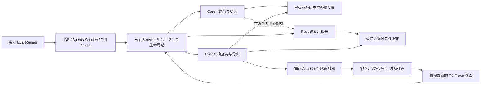

# Trace 架构与改造方案

Trace 是内置、可选的诊断能力：共享运行时继续拥有业务事实，Rust 组件按需采集和读取证据，TypeScript 工作台按需呈现，评测工具独立运行。后续根据实际 SDK 需求和收益决定哪些分析或界面适合发布为扩展。

状态：2026-10-09 已实施核心架构迁移、后台采集、真实调用与账目关联、前端按需加载、声明式实验比较及可运行的评测审阅流程。元数据单独录制、公开扩展 API、自动优化器和真实模型质量基准仍属后续工作。使用方式见[执行 Trace](chat-session-inspector.md#执行-trace)、[配置](config.md#执行轨迹记录)、[rollout-trace](../crates/rollout-trace/README.md) 和[任务评测](../test/agent-eval/README.md)。

本文记录已实现的边界、设计依据与后续验收。具体契约以对应 owner 的源码为准；标明后续的能力不作为已可调用的 API。

## 1. 先明确“可选”的范围

普通用户不必使用 Trace 页面，也不应因为页面被打包就启动详细采集、请求正文复制或持续查询。但运行时已有的历史、终态、授权、取消、续接和必要计量服务于产品本身，不能随 Trace 的停用一起移除。

| 部分           | 当前或目标 owner                                             | 可选性与边界                                                                          |
| -------------- | ------------------------------------------------------------ | ------------------------------------------------------------------------------------- |
| 业务事实       | Core、history、ThreadStore 及各领域 owner                    | 延续现有持久或临时会话契约；恢复、授权、预算和 Changes 不依赖诊断是否启用             |
| 详细诊断采集   | Rust 的 rollout-trace 组件，App Server 组合                  | 默认不启用正文采集；无配置和无兼容环境变量时不录制；开启后仍有预算和覆盖边界          |
| 性能观测       | 既有 OTel／diagnostics                                       | 当前已有有界、去内容化的本地摘要；实时查看与附加导出按需开启，不与请求正文合并        |
| Trace 界面     | TypeScript Workbench contribution，IDE 与 Agents Window 共享 | 显式打开或恢复此前打开的 Trace 时加载和查询；关闭页面释放资源，不停止其他调用方的采集 |
| 评测与改进分析 | 现有 runner、只读分析和报告                                  | 本地或 CI 明确启动，使用真实产品入口；不进入每个普通 Turn，不要求桌面界面存在         |

关闭详细诊断后可以复查仍保留的业务历史，但不能补录当时未保存的请求或输出。Trace 文件是审阅证据；仅导入文件不会执行工具、还原目录、重放副作用或获得授权。

## 2. 扩展定位与 Rust／TypeScript 分工

实现语言、是否按需启用、是否允许用户安装，以及是否允许第三方参与是不同问题。后端由 Rust 实现、前端由 TypeScript 实现，并不要求它们组成一个新的插件类型。

| 名称                     | Ash 当前含义                                                                                                 | 对 Trace 的处理                                                                                   |
| ------------------------ | ------------------------------------------------------------------------------------------------------------ | ------------------------------------------------------------------------------------------------- |
| Agent Extension          | [crates/ext](../crates/docs/extensions.md) 中的 Rust 能力，通过贡献接口参与提示、工具、上下文、生命周期等    | 采集主要观察已有行为，不需要增加模型能力；不为目录统一而迁入 ext，也不默认贡献 Trace 工具或提示词 |
| Editor Extension／Plugin | [TS/JS SDK 与受限宿主](editor-extensions.md#01-ts-sdk-与-rust-v8-扩展宿主)，包管理、启用、授权和运行相互独立 | 后续可以承载分析器、报告查看器或受限诊断客户端；安装扩展不授予完整会话读取和录制权限              |
| 内置诊断组件             | Rust 领域实现，由可信宿主组合                                                                                | 本方案采用这一定位，保持采集、存储、读取和资源生命周期的明确 owner                                |
| Workbench contribution   | 产品提供的 TS 界面和命令                                                                                     | 第一阶段保留此形态并改为按需加载；之后有完整 SDK 契约时再考虑提取成官方扩展                       |

现有 [sdk/typescript/index.d.ts](../sdk/typescript/index.d.ts) 没有公开 Trace API。当前复杂 Trace 编辑器也直接使用 Workbench 服务，不能只移动到扩展目录就成为可运行的 SDK 扩展。迁移需要补足读取范围、取消、注册释放、视图承载、错误与兼容性；不能以开放任意 App Server RPC 作为捷径。

Rust 内部贡献接口也不是可下载 Rust 动态库或稳定插件 ABI。当前 [LifecycleObserver 和 ToolLifecycleContributor](../crates/ext/extension-api/src/lifecycle.rs) 观察已提交的部分事实，不覆盖完整模型请求、准备后的请求和每次失败 attempt。为 Trace 扩大整个 Agent Extension API 会增加无关耦合。

推荐先实现运行时可选和前端按需加载。若以后有包体积要求，再评估构建 feature 或单独发行诊断工具；静态打包、关闭执行和从安装包移除应分别测量，不能由“插件化”推定节省内存或启动时间。现在没有建立第三方 Rust 加载框架的具体需求。

## 3. 改造前核对的基线

这一节记录迁移前的问题；所链接的 owner 源码已经更新，实施结果见第 4、10 节。原同步路径、具体依赖和默认导航不再代表当前实现。

| 现状                                                         | 实际代码或文档                                                                                                                                                   | 改造含义                                                                             |
| ------------------------------------------------------------ | ---------------------------------------------------------------------------------------------------------------------------------------------------------------- | ------------------------------------------------------------------------------------ |
| Core 和 core-api 直接依赖 rollout-trace                      | [Core Cargo](../crates/core/Cargo.toml)、[core-api Cargo](../crates/core-api/Cargo.toml)、[AgentRuntime](../crates/core-api/src/runtime.rs)                      | Core 的公共读取接口暴露 Trace 类型；仅移动 crate 不能解除耦合                        |
| ThreadController 持有具体采集器，并负责 Trace 查询和关系归纳 | [ThreadController](../crates/core/src/thread_controller.rs)                                                                                                      | 执行事实 owner 与可选诊断实现混在同一个入口，应分离具体采集和派生查询职责            |
| 模型边界有真实语义证据                                       | [DiagnosticStream](../crates/core/src/diagnostic_model.rs)、[ModelStreamSink](../crates/core-api/src/model.rs)                                                   | 复用 prepared-request 和真实流事件边界，保留取消前输出；不让界面事后猜测输入         |
| 详细记录关闭时模型正文不会由 start_attempt 序列化            | [Recorder](../crates/rollout-trace/src/recorder.rs)                                                                                                              | 保留快速关闭路径；另外检查 Hook 调用方等是否已在开关前构造 JSON 或复制正文           |
| 启用时同步序列化、写文件和更新 manifest                      | 同一 Recorder 的 payload、append_event 和终态路径                                                                                                                | 存储故障不会直接改写成功结果，但慢盘仍可能增加延迟；需要有界后台处理和实测           |
| 采集配置归 profile runtime，修改需重启 App Server            | [配置契约](config.md#执行轨迹记录)、[组合入口](../crates/app-server/src/local.rs)                                                                                | 第一阶段保留生效时机，两个窗口共享实际状态；热切换不能由某个窗口单独实现             |
| 视图已有正文按需读取和关闭释放，代码注册仍在启动入口         | [Trace contribution](../src/ash/workbench/contrib/trace/browser/trace.contribution.ts)、[编辑器](../src/ash/workbench/contrib/trace/browser/agentTraceEditor.ts) | 运行中按需读取和模块按需加载是两件事；保留现有释放行为，再减少启动加载和默认导航占用 |
| 任务评测已有独立 verifier、重复运行和证据覆盖                | [runner](../scripts/agent_eval.py)、[分析层](../scripts/agent_eval_trace.py)                                                                                     | 在此基础上补实验条件和评分，不替换真实 Ash loop                                      |

改造前 Recorder 限制单正文 8 MiB、单 capture 128 MiB 和 32,000 条诊断事件，闲置 writer 缓存驱逐目标为 16，尚未约束整个 profile 和活跃正文。当前配额见第 10 节。图形界面导入／导出为 64 MiB，不能据此承诺任意完整 capture 都可装入单文件。

已有[存储故障回归](../crates/core/src/turn/diagnostic_trace_tests.rs)检查成功 Turn 不被诊断写入失败改变。这不能证明采集没有延迟、锁竞争或分配开销；性能结论需要另行测量。

## 4. 依赖与观察契约

以下图表示已实现的职责与调用关系，不表示直接 Cargo 依赖：

当前依赖是 Core 使用 `core-api::ExecutionDiagnostics`／`ModelAttemptObserver`，rollout-trace 实现采集和派生读取，App Server 组合各方。Core 和 core-api 的生产依赖不含 rollout-trace；Core 测试使用其 dev-dependency。业务事实与授权仍由原 owner 提供。

观察契约由既有 core-api 承担，限于当前 Core 与采集器的实际需求。Core 提供调用身份、用途、输入快照位置和真实结果；采集器决定按当前策略保存什么。请求准备仍使用已有 ModelStreamSink 边界。诊断回调不得改变模型请求、返回授权、阻止执行或等待文件／网络 I/O。

现有 TurnExecutionObserver 的 will_execute 是 Changes 捕获的 fail-closed 边界，失败可以阻止执行。这是业务正确性契约，不能与可丢失的诊断观察器混用，也不能在关闭 Trace 时停用。保留执行流消费者对取消和错误的原有处理；诊断失败单独进入覆盖状态。

只读查询与关系计算已由 `TraceReader` 拥有，通过 `thread-store::ThreadHistoryReader` 读取同一权威历史；ThreadController 只实现这项窄读取契约。读取诊断和正文前检查所属 Session，正文再核对 capture、已保存引用和 SHA-256。App Server 的 session/trace 方法和外层 V3 格式保持稳定。

依赖迁移有明确先后：先让 core-api 的契约不再引用 rollout-trace 实现和产物类型，再允许 rollout-trace 实现中立观察契约。若在 core-api 仍依赖 rollout-trace 时直接添加反向依赖，会形成 Cargo 环。具体共享类型留在其原 owner；不为拆分而创建多个新 crate。

## 5. 采集策略、关闭路径与生命周期

当前实现关闭与有界正文两种行为，保持既有 enabled 配置；下表中的诊断元数据独立策略尚未实现，不新增配置枚举：

| 策略           | 保存什么                                                               | 适用场景                       |
| -------------- | ---------------------------------------------------------------------- | ------------------------------ |
| 不采集详细诊断 | 仅使用产品本来需要的业务历史和既有本地性能摘要                         | 普通任务默认路径               |
| 诊断元数据     | 调用身份、类型、时间边界、结果、错误类别、关联与覆盖；无请求／响应正文 | 本地健康检查和执行效率分析     |
| 有界正文       | 元数据加指定范围的语义请求、响应和部分输出                             | 明确启用的调试、评测与问题复查 |

现有 enabled=true 表示详细记录，enabled=false 表示关闭；先保持兼容。新策略接入时同步修改配置 owner、协议、前端和分析器，不静默重解释旧数据。按策略未录正文、正文截断、预算淘汰、存储不可用和未知分别报告；元数据模式可以满足某些分析，却不能被称为完整请求证据。

完整度按具体分析问题和指标定义：元数据可以支持完整的已录调用计数，同时缺少提示词输入证据。不能用一个全局 complete 值替代所有维度，也不能把策略性未录正文当成采集故障；新规则接入时保留旧报告字段的原有语义。

关闭状态的验收是：不创建诊断文件／目录，不启动 writer，不复制或序列化请求正文，不构造仅用于采集的 Hook JSON，不进行诊断轮询。保留少量必要的条件判断，不承诺绝对零成本。队列条数、正文保留字节、活跃 capture 和全 profile 预算分别有界。

启用后的同步入口只接收有界不可变快照或经预算计入的共享引用。序列化、摘要和存储交给采集 owner 的后台 worker；不能只将 I/O 移到后台而仍在模型路径复制所有正文。先使用简单的 profile 级处理与 capture 内顺序，吞吐不足时再依据测量选择并发。

队列满、正文超限、worker 失效和磁盘失败只影响诊断。记录可保存的丢失数量与原因；计数本身无法持久化时保留 unavailable 或覆盖未知，不能报告为没有丢失。诊断生命周期尽量保留开始与终态；终态未保存时显示缺口，不从 Turn 结果推造 attempt 结果。

每次 attempt 的观察句柄绑定 capture 身份和生效策略。第一次明确终态之后不再重复发布；本地释放和进程突然退出分别处理，不能把所有未闭合 attempt 都命名为取消。后台持久化尚未追上时，读取返回已保存水位和待处理／不完整状态。

采集器归所属 App Server profile runtime，多个目录与窗口不重复启动。第一阶段继续在启动时冻结配置，设置页保留“已保存／实际生效／待重启”的区别。若后续增加会话范围录制或热切换，由同一 owner 在定义的边界创建新 capture，旧句柄不能写到新捕获；界面停用和配置停用分别表示。

App Server 停止时以明确 deadline 排空已接纳记录；不能无限等待采集完成。评测入口在导出前等待对应持久化水位或标记缺口，并分别记录任务耗时、采集／导出耗时。一次正常 Turn 不因 flush 等待而推迟业务终态。

采集 owner 还要管理保留和回收。建议删除 Session 后停止其采集、释放 writer，并清理归它的诊断记录；独立导出的用户文件仍由文件 owner 管理。清理失败留下可重试记录，不复活 Session，不撤销已完成删除。全局容量与保留期限由配置 owner 定义，不靠前端删除未知目录。

## 6. 证据关联与格式

改造优先补下面的语义关联，具体字段由所属契约定义：

| 需要回答的问题           | 必须有的事实                                                                         | 归属                                                |
| ------------------------ | ------------------------------------------------------------------------------------ | --------------------------------------------------- |
| 到底使用了什么配置？     | 准确模型、正文 revision 与摘要、实际工具定义、模式、权限、预算、产品与初始环境版本   | 原指令、工具、配置、环境 owner；runner 保存实验条件 |
| 哪次调用对应哪笔账目？   | ModelService attempt 与已提交 ModelInvocationId 的明确关联，失败或取消是否有实报用量 | 调用与计量 owner 提供，不按次数或时间猜配对         |
| 工具为何没有成功？       | 调用身份、参数校验或执行阶段、实际错误类别、恢复结果、最终成果验收                   | 工具、执行环境与 provider owner；评分由评测保存     |
| 压缩后丢了什么？         | 压缩前后边界、原目标与约束来源、实际请求与 checkpoint                                | 上下文与历史 owner；Trace 保存可用关联              |
| 等待和委派是否改善任务？ | 操作、进程、子任务及依赖身份、真实起止、返回与根任务集成                             | 对应运行 owner；Trace 派生关系，独立验收整体成果    |

既有 ModelInvocationId 是业务计量身份；当前诊断 attempt 与它还没有权威关联。优先让调用／计量 owner 发布实际提交回执的关联。没有失败账目或供应商未报告用量时仍为未知，不因为建立关联就假设已获完整成本。

Core request、准备后的语义 request 与 provider 实际传输属于不同边界。现有详细诊断覆盖前两者，不能称为 HTTP 字节或物理重试次数。若确需传输级诊断，后续在 provider 现有边界按需提供关联与摘要，不扩大所有会话的内容采集。续接状态必须由 provider 适配正确保留，不将不透明数据解释为隐藏推理。

Thread sequence、诊断 sequence 和 OTel span 身份各自保留语义。关系按明确身份建立，不用时间戳排序制造全局因果。单进程耗时采用单调时间边界；跨进程／机器关联不能凭墙钟推算精确关键路径。并行子任务耗时不能相加为总耗时。

保留原始 V3 Trace、正文摘要和来源位置。导出固定已捕获的 Thread 游标与诊断水位；不宣称跨存储事务快照。超出范围的关系明确缺失。大 capture 先使用分页与正文按需读取；需要分片或单独正文包时另行定义受限格式，保持旧文件可读，不直接取消 64 MiB 界面限制。

格式演进同步 Rust、协议生成、TS 解析、Python 分析和历史 fixture。新事件种类不能被旧解析器误读成旧事件。只有确实需要不兼容语义时升级版本；新增字段能否被旧端安全保留应由兼容测试证明。

## 7. TypeScript 界面与未来扩展 API

第一阶段保留现有 Workbench contribution，重用编辑器、虚拟树、正文和关系页面。默认不占据普通用户的常驻侧栏；命令与开发入口保持可发现，显式打开时加载实现和样式。先让未打开时没有查询、订阅、图计算和大对象解析，再验证启动产物是否真正拆分。

Trace 数据访问逐步从 Chat 的综合接口分离到 Trace 所属前端契约；底层仍使用同一连接和既有订阅 owner。是否创建共享 service 由实际调用需求决定，不能为了文件拆分增加服务查找、连接或状态副本。保持 base → platform → editor → workbench 的依赖方向。

页面绑定明确的来源：当前会话、保存捕获或评测运行。切换 Chat 不替换正在审阅的 Trace。IDE 和 Agents Window 共享后端证据，分别持有视图状态；TUI 和 CI 可只使用导出与报告。取消、隐藏、关闭、断连和迟到结果的处理沿用现有契约。

界面分开展示成果验收、业务终态与诊断覆盖。工具错误不涂成整体失败；缺少正文、输入关联或用量时直接显示未知。对照报告可以定位实际事件、成果和评分依据，但报告不能改写原始 Trace。

未来有实际扩展消费者时，优先开放读取用户选择的保存捕获和派生报告。再考虑当前会话的分页只读 API，范围由可信宿主绑定，正文访问单独校验。扩展不能枚举整个 profile、取得任意后端连接、替别人开启采集，或通过诊断接口触发重试、工具和授权。

提取为官方 TS 扩展的前置条件是：SDK 已能完整承载界面与受限读取；无 UI 的采集和评测正常工作；停用、重启、版本不兼容与撤权都可预测。届时 Rust 服务仍由 Ash 后端提供，扩展作者无需编写 Rust。第三方算法也可以先消费导出文件，无需进入 Core。

## 8. 评测体系怎样使用 Trace

采用三家材料的共同方法，保留 Ash 自己的执行链路：

| 参考                                                                                                                                                                       | 采用的方法                                                   | 在 Ash 中落到哪里                                                            |
| -------------------------------------------------------------------------------------------------------------------------------------------------------------------------- | ------------------------------------------------------------ | ---------------------------------------------------------------------------- |
| [OpenAI Agent Improvement Loop](https://developers.openai.com/cookbook/examples/agents_sdk/agent_improvement_loop)                                                         | Trace 与反馈生成可检验的改进，再用评测和回归确认             | runner、独立评分、改动假设与报告；不强制引入示例中的 Promptfoo 或第三方 HALO |
| [OpenAI Macro Evals](https://developers.openai.com/cookbook/examples/partners/macro_evals_for_agentic_systems/macro_evals_for_agentic_systems)                             | 跨运行区分任务条件、终态、局部发现与重复模式，回查代表性记录 | 在已保存报告上汇总与筛选；相关性形成原因假设                                 |
| [Anthropic Agent Evals](https://www.anthropic.com/engineering/demystifying-evals-for-ai-agents) 和 [Tools](https://www.anthropic.com/engineering/writing-tools-for-agents) | 验收实际成果、校准评分器、重复运行、保留未用于调优的任务     | 真实产品任务、正反例、人工审阅与独立验收                                     |
| [Cursor Harness](https://cursor.com/blog/continually-improving-agent-harness) 与 [CursorBench](https://cursor.com/blog/cursorbench)                                        | 真实任务、模型与工具错误基线、离线和实际使用反馈互相验证     | 版本化任务、条件可比的实验和有分母的过程指标                                 |

OpenAI Cookbook 已在本地，提交为 0eac1447d4e24d06e47c459ca5e98f248b9413cf；已阅读 [Improvement Loop](../../openai-cookbook/examples/agents_sdk/agent_improvement_loop.ipynb) 与 [Macro Evals](../../openai-cookbook/examples/partners/macro_evals_for_agentic_systems/macro_evals_for_agentic_systems.ipynb) 的代码结构。来源中的模拟反馈、生成样本或追加分析 span 不直接变成 Ash 原始事实。

每次实验沿用现有 configuration 与 report，补明确假设、允许变化的因素和不变条件。记录任务／评分器版本、初始文件与上下文、准确模型及推理设置、工具和模式、权限、预算、产品摘要、采集策略及环境。必要条件未知时说明限制，不声称单因素收益。

默认基线比较仍拒绝 profileConfigDigest 不同；显式使用 `--experiment` 时，两侧必须声明相同实验、假设和允许变化的因素，再检查配置语义叶项哈希，拒绝未声明的变化。任务／评分器摘要、权限、期限与重复数始终固定。先比较一个变化，需要研究相互作用时再运行基线、仅改 Prompt、仅改工具、两者都改四组。模型和整个产品同时变化只支持整体比较。

候选运行已在创建输出及启动产品／模型前预检条件和基线试次；`--preflight-only` 可以只做这项校验。
任务选择通过 `--split` 与 `caseSelection` 固定，development 用于调优，holdout 用于冻结候选后的
回归检查；原有默认 all 保留兼容。suite 摘要 V2 冻结语义声明、实际输入、参考成果和评分器资源，
JSON 排版与顶层说明文档不使基线失效；额外规则用 `gradingResources` 声明，旧摘要另建基线。
预检不探测 provider 或在线服务，也不估算成本。

[评测审阅工具](../scripts/agent_eval_review.py) 已提供四个实际入口：`audit-suite` 在独立目录以同一
verifier 检查初始与已知正确成果；`review` 从原始文件重新派生观察并生成反馈模板；`handoff` 核对
报告／产物摘要与事件后保存人工假设、验收和双方实验声明；`compare` 离线对照保存报告，输出明确
goal 的批次 gate。后三者不调用模型、不改写原始 Trace 或评分；audit 的已知正确成果也不会复制到
Agent 工作区。缺少完整原始材料时保留不可用状态，不补造指标或归因。

质量 gate 检查恢复与回归；保留任务使用只检查回归的 gate。资源 gate 要求没有验收回归，且双方都
通过的试次具备完整测量，另列排除分母；不能把更快的失败当作优化。评分或证据不足为 inconclusive。
这些是批次筛选契约，不是统计显著性、根因证明或自动发布决定。具体参数和反馈格式由[任务评测](../test/agent-eval/README.md#审阅反馈与实验交接)维护。

成果由程序、人工或校准后的模型评分器验收，评分来源、规则版本和证据分别保存。评分报错／无法解析属于评分状态；未知不能转为零分。模型评分与运行模型分开，记录评测成本；评分器更换后两侧保存成果重新评分。原始 Trace 只读，反馈与假设保存在派生评测结果。

任务集从真实失败和成功但低效的运行扩充。首批可形成约 20–30 个经人工审阅的案例，覆盖编码、Cowork、Design、Chat／个人助手，并加入双窗口来源、压缩续接、取消和恢复；按任务家族保留调优外案例。数量是起步建议，收益结论仍受样本、重复数与任务分布限制。

被测 Agent 只获得场景中的用户可见材料；评分器、预期答案和未来 Git 提交与运行工作区隔离。网络和外部服务按场景定义可访问范围，记录实际条件；需要当前网络事实的任务与固定素材任务分别报告，不能把非确定来源造成的差异归给单个组件。

编码检查行为和测试，不要求唯一补丁；Cowork 检查内容、来源和可用文件；Design 检查 brief、既有约束和目标媒介，并校准审阅；个人助手使用受控外部服务，检查准备、发送与实际授权。IDE 的未保存状态和 TUI 的交互不能由无界面 exec 用例冒充覆盖。

分别报告任务通过、观察到的重复稳定性、成果质量、误操作或无依据声明、工具错误与恢复、延迟及实报用量。每项都列分母和覆盖。现有“至少一次通过／全部通过”保持观察值，不能当作一般化 pass@k／pass^k 概率。用量未知不算零成本，耗时改进须维持成果质量。

过程对照继续只使用条件可比、双方测量完整的试次，并展示排除数量和对应任务结果。失败运行更容易缺少用量，不能用剩余成功样本的均值掩盖缺口或失败上升；所有试次的成果验收仍单独参与结果报告。

任务耗时、启动耗时、录制／flush 和分析耗时分开测量；比较保持相同采集策略，另外对不采集／元数据／正文做独立开销实验。脚本化模型用于确定性契约和性能开销，真实模型用于质量结论，不相互替代。

真实模型运行前固定任务、模型、重复数、期限与成本范围，使用专用 profile。Cursor SDK 可在相同初始环境与独立验收下作为整体系统对照；内部不可控部分明确记录，公开 SDK 不等于完整 harness 或评测集已开源。线上保留率与追问是代理指标，需要实际反馈解释，未追问不证明满意。

跨运行分析先使用明确错误类别、步骤、覆盖和任务分组。只有数据量与重复模式值得进一步解释时才增加聚类或模型分析，并保留代表性 Trace 和人工抽查。改进建议说明证据、候选原因、预期收益、变更对象与回归条件；验证后再决定保留或回滚，不能由一次总分提高自动发布。

## 9. 按依赖顺序实施

| 阶段                  | 具体改动                                                                                     | 完成条件                                                                                  |
| --------------------- | -------------------------------------------------------------------------------------------- | ----------------------------------------------------------------------------------------- |
| 1. 固定边界和基线     | 保存历史 V3／report fixture，记录当前关闭和启用路径的行为、I/O、内存、启动和执行耗时         | 历史与诊断的职责明确；得到可比较的开销基线；没有把脚本化模型成绩称为质量                  |
| 2. 解除具体实现耦合   | 先迁移 core-api 的 Trace 类型依赖，再引入窄观察契约；App Server 组合 Recorder 和受控只读查询 | Core／core-api 不依赖具体 Recorder 或图实现，无 Cargo 环；原 RPC、CLI、恢复和取消通过回归 |
| 3. 有界采集与生效语义 | 移出同步序列化／存储，完善预算、覆盖、水位、关闭、Session 删除与回收                         | 关闭不产生诊断工作；队列、正文和活跃 capture 有界；慢盘、错误和丢失不改变业务终态         |
| 4. 补足可比较证据     | 补 owner 提供的调用／账目关联与工具／上下文事实；在 runner 中声明实验条件，校准评分器        | 关联来自真实身份；失败用量仍正确表示未知；被允许变化和意外变化能区分                      |
| 5. 界面按需加载       | 延续共享编辑器，减少启动加载与默认导航，接入独立报告和证据定位                               | 未打开无订阅／轮询／大对象解析；Web 与 Electron、双窗口、远端和离线覆盖明确               |
| 6. 建立质量与改进闭环 | 运行受控真实任务，重复比较和保留案例，按需加入跨运行分析与 Cursor SDK 对照                   | 结果、评分状态、证据和条件可复核；收益和回归分别报告；没有自动把推测写为根因              |

阶段 2、3、5 的核心迁移已经完成，阶段 4 的提交回执、实验预检与种子评分器机械校准已实现。阶段 6 的离线审阅、带证据反馈、交接、比较和回归 gate 已通过真实 CLI 的受控模型流程；真实质量实验仍待固定模型、预算和实际任务。阶段 1 目前取得契约基线，尚未取得完整性能测量；扩展上下文／等待事实也仍需后续验证。配置生效时机和外层 V3 保留，新增关联事实属于诊断 V2。官方扩展提取在 SDK 与产品收益有证据后再进行，不作为本轮前置工程。

## 10. 验收与仍待实测的取舍

- 关闭采集：诊断目录和文件没有创建，writer／后台队列未启动，正文与 Hook JSON 未为诊断复制；业务历史、Changes、取消、压缩和必要用量正常。
- 开启采集：参数和实际请求边界明确，Agent／compaction／辅助模型及终止前输出关联正确；无记录和记录为零可区分。
- 故障与负载：队列满、慢盘、目录不可写、超限正文、worker 停止、重启、取消和未闭合调用分别报告覆盖；不无限等待，不重复终态或工具副作用。
- 多窗口与远端：一个 profile owner 管理采集，配置 revision 与生效状态一致，旧 capture 的迟到结果不覆盖新视图；目录和文件在所属后端访问。
- 读取与格式：历史前缀、游标、payload 身份与摘要、截断和捕获范围保持；旧 V3／旧报告回归通过，新字段和事件按版本校验。
- 界面：未打开时没有 Trace 查询；隐藏／关闭释放资源；导入只读，错误内容不会作为可执行指令；键盘、无障碍与至少一种非默认语言覆盖。
- 评测：独立验收能识别已知正确与错误成果，评分设施失败单独呈现；对照拒绝未声明变化，缺失指标不补零，保留任务和重复运行可审阅。

性能检查记录设备、构建、数据规模、采集策略、冷热启动与重复数，报告 p50／p95、内存和采集开销，先确定噪声和目标预算。这里没有尚未测得的“零开销”或固定改善比例，也不能从 Rust／TypeScript 的选择推定结果。

核心迁移已完成。关闭、慢存储、队列丢失、正文与事件预算、恢复、取消、删除后的迟到回调和关闭准入均有回归测试；Web 与 Electron 的生产界面产物已验证按需加载、双窗口导航、真实工具和子 Agent、离线重开。窗口重开的异步退订使用共享连接状态与 generation 核对，关闭连接自动释放订阅，活跃连接的错误继续报告。完整质量集、真实模型成本和 p50／p95 开销还需要单独实验，不能从这些契约测试推导质量提升比例。

### 已实现的资源和证据边界

- 一个 profile 共享一个 Recorder；第一次启用采集的观察才创建 worker。关闭时不创建队列、目录、正文副本或诊断 Hook JSON。
- 接纳队列最多 128 条，待写正文与活跃部分输出使用 32 MiB 的保守保留预算；最多 64 个活跃句柄，字节预算可更早拒绝。超限后保留丢失状态，不等待磁盘。
- 每 profile 最多跟踪 128 个 capture，磁盘预算 512 MiB；每 capture 最多 128 MiB、32,000 条事件及 8 MiB 事件 JSON。缓存最多四个 writer。单正文最多 8 MiB，部分输出文本与结构化消息分别有界；这些是配额，不是实测进程 RSS。
- 事件空间不足时先停止保存正文，防止持续积累无引用正文。旧证据超过当前读取预算会报告不可用并保留原文件，不静默覆盖或截取成完整证据。
- `flush(deadline)`／`shutdown(deadline)` 返回完成或待写数量；读取最多等待 250 ms。业务 Turn 完成不等待此屏障。进程崩溃仍可能留下未闭合 attempt。
- 诊断格式 V2 增加 `pendingRecords` 与 `modelAttemptAccounted`；外层仍为 V3，前端与分析器兼容旧诊断 V1。账目关联只接受实际提交后的 invocation ID、所属 Thread／Turn 和历史 sequence。
- `ITraceService` 借用现有 `IThreadApi`，不另建连接或订阅。Chat 服务继续提供会话和历史更新，Trace 的读取和格式解析归独立服务；编辑器、解析器、导航和样式按需加载。
- Runner 保留独立成果验收。`--experiment` 声明假设、变体和允许变化的条件，语义配置叶项只保存哈希；未声明变化会拒绝对照。评分器错误、超时和未知状态单列，Trace 观察不替代评分。

### 本轮验证结果

以下为 2026-10-09 在 macOS arm64 的实际验证。Rust 使用仓库 `ci-test`，界面使用生产构建与真实 App Server；模型流使用受控本地 HTTP fixture，不代表真实模型质量。

| 范围                      | 已运行检查与结果                                                                                                                                                                                                     |
| ------------------------- | -------------------------------------------------------------------------------------------------------------------------------------------------------------------------------------------------------------------- |
| Core 与存储契约           | `just verify ash-core`：310 通过、2 跳过；rollout-trace：19 通过；`just verify ash-rollout`：5 通过；thread-store：3 通过；core-api／thread-store／Trace／App Server 的 all-targets warnings 检查通过                |
| App Server 接口和生命周期 | Trace RPC 回归通过；managed initialize／lifecycle、stdio、WebSocket 与 protocol schema 共 18 项集成测试通过                                                                                                          |
| TS 与资源释放             | renderer、单元测试和 automation 类型检查通过；Trace 46 项、编辑器 91＋5 项、共享订阅 17 项所选测试通过，包含 shipped zh-CN catalog                                                                                   |
| Web／Electron             | 两端各 4 个生产界面场景通过：默认不载入诊断模块、首次打开、键盘与无障碍、双窗口／主题／尺寸、真实工具与并行子任务、离线重开；没有工作台错误                                                                          |
| Python 与真实 CLI         | 常规 scripts 测试 131 项（1 项显式产品测试默认跳过）；最新评测所选测试 25 项（同一产品测试默认跳过）。另显式运行产品契约：三个修复用例通过独立验收，拒绝、部分输出超时／取消和失败后重试均符合预期，回执指向真实账目 |
| 构建与依赖                | `pnpm build`、`pnpm build:web:full`、`just build-code`、完整运行包与 `just dependencies` 检查通过                                                                                                                    |

App Server 整包最后一次单线程库测试为 669 通过、1 失败、3 跳过；失败是 `model_operations_keep_resource_progress_private_and_broadcast_shared_snapshots` 的语音通知清空断言，单独重跑通过。本轮未修改该语音代码，整包测试不能报告全绿。此前整批运行中的 SSH／停止／搜索时序失败已各自重跑通过。Trace 相关回归与上表的集成场景均通过，完整性能与真实模型收益尚未测量。
